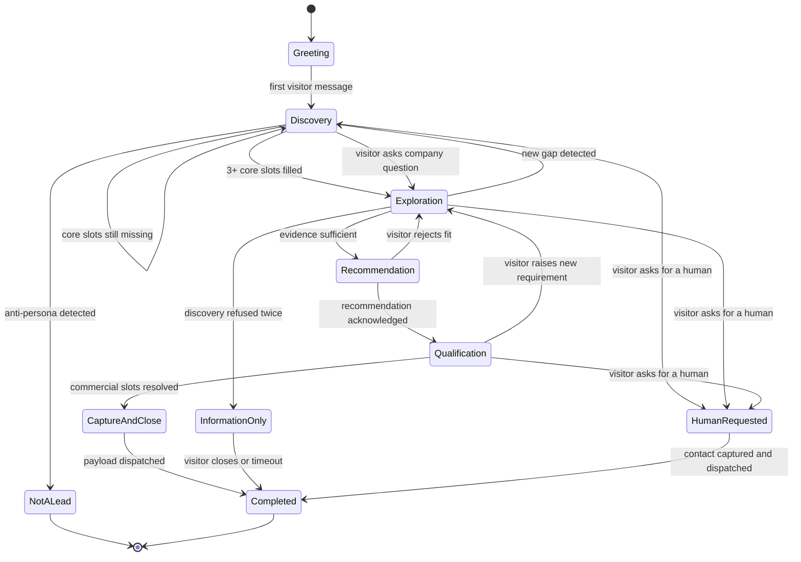
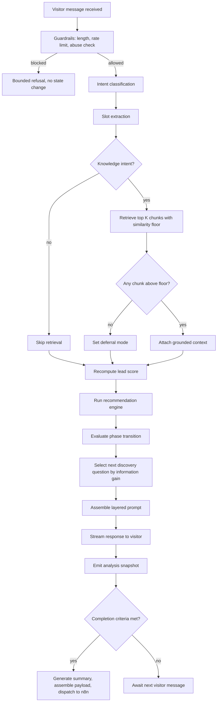
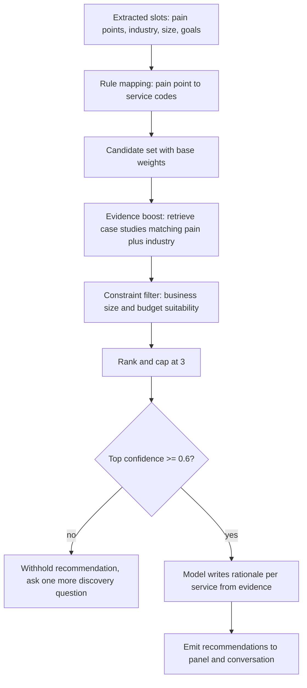
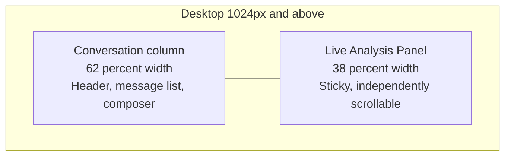
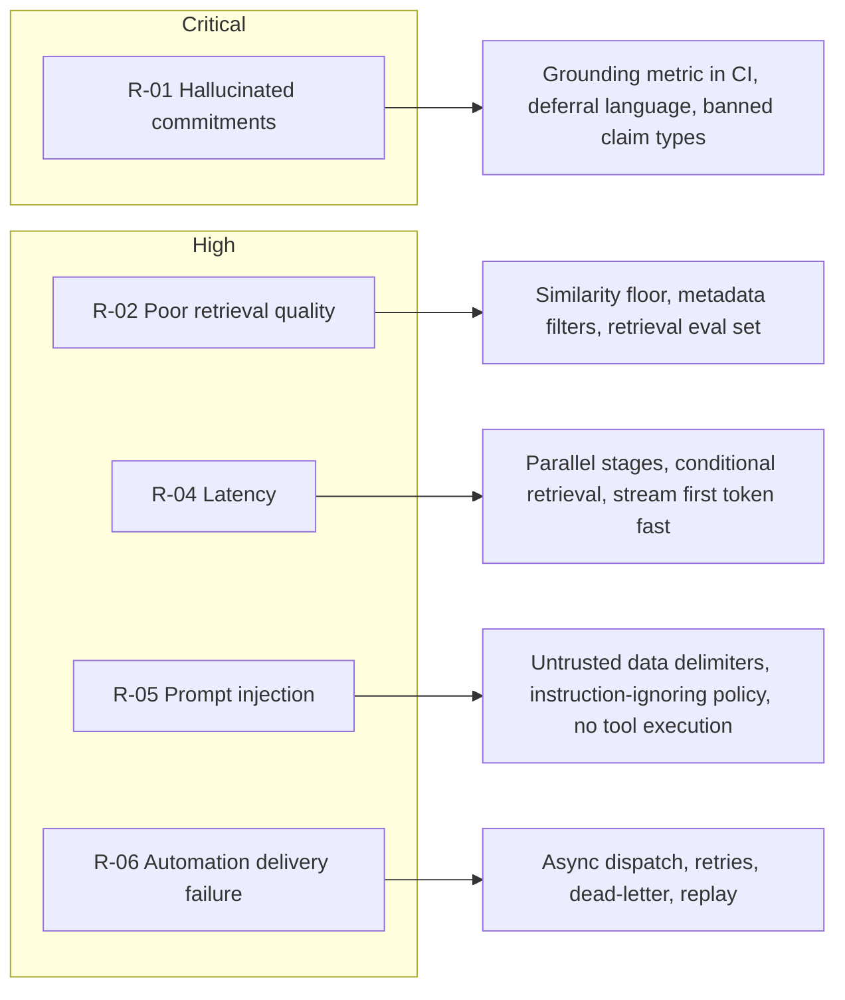
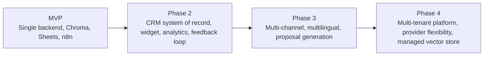
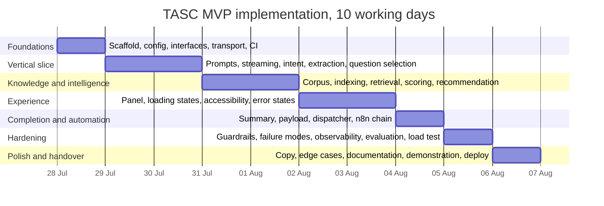
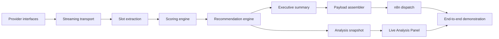

# Trizen AI Solutions Consultant (TASC) — Engineering Specification v1.0

# Trizen AI Solutions Consultant (TASC)
**Implementation-Ready Engineering Specification**

| Field | Value |
| ---| --- |
| Document ID | TASC-ENG-SPEC-001 |
| Version | 1.0 (Draft for Implementation) |
| Status | Approved for build |
| Product Type | AI-powered pre-sales consultant for Trizen Ventures |
| Delivery Context | MVP for AI Automation Engineer technical assessment |
| Target Build Window | 10 working days |
| Authoring Team | AI Solutions Architecture, Product, AI Engineering, Backend, Frontend, Automation, UX, Technical Writing |
| Intended Reader | Engineering team and AI coding agents (Cursor, Claude Code, Copilot) |

* * *
## How to read this document
This specification is deliberately split into six pages so each discipline can work in parallel without merge conflicts. Every page is self-contained and normative: if something is written here, it is a requirement, not a suggestion.

| Page | Contents | Primary owner |
| ---| ---| --- |
| 1\. Product Context | Sections 1 to 8: executive summary, problem, business context, vision, scope, success metrics, personas, user journey | Product Manager |
| 2\. Requirements and Features | Sections 9 to 11: functional requirements, non-functional requirements, product features | Product Manager, Architect |
| 3\. Conversation and AI Design | Sections 12 to 15: conversation flow, consultation workflow, qualification strategy, recommendation strategy | AI Engineer |
| 4\. Experience Design | Sections 16 and 17: Live Analysis Panel specification, frontend user experience | UX Designer, Frontend Engineer |
| 5\. System Architecture | Sections 18 to 23: system architecture, components, sequence diagrams, data flow, state diagram, deployment | Solutions Architect |
| 6\. Risks, Roadmap and Future | Sections 24 to 26: risks, future improvements, implementation roadmap | Product Manager, Architect |

## Requirement language
**MUST** indicates a hard requirement. **SHOULD** indicates a strong recommendation that may be traded off with written justification. **MAY** indicates an optional capability. Requirement identifiers (FR-xx, NFR-xx, UX-xx) are stable and MUST be referenced in pull request descriptions and test names.
## Non-negotiable architecture principles
1. The browser never holds an LLM key and never calls a model provider. The frontend talks to FastAPI and nothing else.
2. FastAPI owns all intelligence: prompt orchestration, retrieval, extraction, scoring, recommendation, and structured JSON generation.
3. n8n is an orchestration layer only. It receives a completed, validated consultation payload and fans it out to Google Sheets, Gmail, and Telegram. It contains no AI logic and no business rules that affect the conversation.
4. Factual claims about Trizen Ventures MUST originate from the curated RAG knowledge base. The model composes language; the knowledge base supplies facts.
5. Every model provider touchpoint sits behind a provider interface so GPT-4.1-mini can be swapped for another model without touching business logic.
6. The consultation is stateless from the browser's perspective. Session state lives server side, keyed by an opaque session identifier.
## Glossary

| Term | Definition |
| ---| --- |
| Nova | The public persona of the assistant. Introduces itself as "Nova, AI Solutions Consultant" |
| Consultation | One continuous visitor session from greeting to summary generation |
| Discovery slot | A single business fact Nova is trying to learn, for example industry or budget band |
| Lead score | An integer 0 to 100 computed deterministically in FastAPI from filled slots and signals |
| Analysis snapshot | The structured state object rendered by the Live Analysis Panel after every turn |
| Consultation payload | The final validated JSON object handed to n8n when a consultation completes |
| Grounding | The requirement that a factual statement be traceable to a retrieved knowledge chunk |

# 1. Product Context (Sections 1 to 8)

# 1\. Executive Summary
Trizen Ventures loses qualified pipeline in the gap between a visitor landing on the website and a human consultant replying to a contact form. Contact forms capture a name and a sentence of intent; they do not capture industry, business size, pain points, budget, or timeline, and they do not answer the visitor's questions while interest is highest.

The Trizen AI Solutions Consultant (TASC) closes that gap. TASC is a web-based conversational consultant, presented as **Nova, AI Solutions Consultant**, that holds a structured discovery conversation with website visitors. Nova asks the questions a senior pre-sales consultant would ask, answers questions about Trizen using a curated retrieval-augmented knowledge base, recommends the specific Trizen services that fit the described problem, scores the lead against a deterministic rubric, and produces an executive summary plus a machine-readable consultation payload.

When the consultation completes, FastAPI hands that payload to an n8n workflow which logs the lead to Google Sheets, emails a briefing to the sales team via Gmail, sends a real-time alert to a Telegram channel for hot leads, and sends the visitor a confirmation email. No human touches the record until it is already enriched, scored, and routed.

The system separates concerns hard. The Next.js frontend renders conversation and analysis and never contacts a model provider. FastAPI owns every intelligent behaviour: prompt orchestration, ChromaDB retrieval, slot extraction, scoring, recommendation, and JSON generation. n8n orchestrates delivery only. This split is what makes the system testable, auditable, and cheap to evolve.

The MVP is scoped to ten working days and is judged on four outcomes: a conversation that feels like a competent consultant rather than a chatbot, factual answers that are traceable to the knowledge base, a Live Analysis Panel that visibly updates as understanding grows, and an automation chain that fires reliably and idempotently.

**Headline commitments**

| Commitment | Target |
| ---| --- |
| First token to visitor after a message | Under 1.2 seconds at p95 |
| Full assistant turn completion | Under 6 seconds at p95 |
| Factual answers grounded in retrieved chunks | 95 percent or higher on the evaluation set |
| Consultations reaching a scored, structured outcome | 70 percent or higher of sessions with 4 or more visitor turns |
| Automation delivery success | 99 percent with retry and dead-letter handling |

* * *
# 2\. Problem Statement
## 2.1 The operational problem
Trizen Ventures sells consultative technology services. Buying one requires a conversation, but the website currently offers only two paths: read static service pages, or submit a contact form and wait. Both fail at the moment of highest intent.

| Failure | What actually happens | Business cost |
| ---| ---| --- |
| Unanswered questions at peak intent | Visitor wonders whether Trizen has done this in their industry, cannot tell from a service page, and leaves | Silent, unmeasured drop-off |
| Thin lead capture | Form yields name, email, and one free-text line | Consultant spends the first call re-discovering basics |
| No qualification | Every submission looks identical in the inbox | Senior time spent on unqualified enquiries; hot leads wait behind cold ones |
| Slow first response | Reply lands hours or days later | Prospect has already spoken to a competitor |
| Inconsistent discovery | Each consultant asks different questions | Non-comparable records, weak forecasting |
| Lost knowledge | Answers live in consultants' heads, not in a reusable asset | Onboarding is slow, answers drift |

## 2.2 Why a naive chatbot does not solve it
A generic LLM chat widget makes the problem worse in three specific ways. It hallucinates capabilities, timelines, and prices that Trizen has not agreed to, creating commercial risk. It behaves reactively, answering whatever is asked and never driving toward the information sales needs, so it produces transcripts instead of qualified leads. And it terminates in a chat log rather than a structured record, leaving a human to read and re-key the outcome.
## 2.3 What must be true for the solution to work
1. Nova must **lead** the conversation toward a fixed set of discovery slots while still answering the visitor's questions.
2. Factual claims about Trizen must come from a curated corpus, and the system must be able to say "I do not have that detail, a consultant will confirm" without penalty.
3. Qualification must be deterministic and explainable so sales trusts the score.
4. The output must be structured JSON that downstream systems consume without human transcription.
5. The visitor must see the system understanding them, which is the purpose of the Live Analysis Panel.

* * *
# 3\. Business Context
## 3.1 Where TASC sits in the funnel

```plain
flowchart LR
    A[Traffic: SEO, ads, referral, outbound] --> B[Trizen website]
    B --> C{Visitor intent}
    C -->|Browsing| D[Service pages]
    C -->|Evaluating| E[Nova consultation]
    D --> E
    E --> F[Structured consultation payload]
    F --> G[n8n orchestration]
    G --> H[Google Sheets lead register]
    G --> I[Gmail sales briefing]
    G --> J[Telegram hot-lead alert]
    G --> K[Gmail visitor confirmation]
    H --> L[Human consultant follow-up]
    I --> L
    J --> L
```

TASC replaces the contact form as the primary conversion surface for evaluating visitors. It does not replace the human consultant; it prepares the ground so the first human conversation starts at discovery-complete rather than at zero.
## 3.2 Trizen service portfolio assumed by this MVP
The recommendation engine and knowledge base are built around the service taxonomy below. If the real portfolio differs, only the knowledge base content and the service catalogue entries change; no code changes are required. This is a deliberate design property.

| Service code | Service | Typical problem it solves | Typical engagement shape |
| ---| ---| ---| --- |
| SVC-AIA | AI Automation and Agents | Repetitive manual workflows, high-volume triage, inbox and ticket handling | 4 to 10 weeks, discovery plus build |
| SVC-WEB | Web and Application Development | Outdated site, no product surface, poor conversion | 6 to 16 weeks |
| SVC-DAT | Data Engineering and Analytics | Data trapped in spreadsheets and silos, no reliable reporting | 6 to 12 weeks |
| SVC-INT | Systems Integration | Tools that do not talk to each other, duplicate data entry | 3 to 8 weeks |
| SVC-CLD | Cloud and DevOps | Fragile deployments, scaling and cost problems | 4 to 10 weeks |
| SVC-CON | Technology Strategy Consulting | No roadmap, unclear build versus buy, needs an assessment | 2 to 6 weeks |

## 3.3 Stakeholders

| Stakeholder | Interest | What they need from TASC |
| ---| ---| --- |
| Sales lead | Pipeline volume and quality | Scored leads with reasons, delivered within minutes |
| Consultants | Efficient first calls | A briefing that removes basic discovery |
| Marketing | Conversion and messaging insight | Recurring pain points and industries in the lead register |
| Engineering | Maintainability | Clear boundaries, swappable model provider, deterministic scoring |
| Leadership | Credible demonstration of Trizen's own AI capability | A system Trizen can point at as proof of competence |
| Website visitor | Fast, honest answers | No hard sell, no invented claims, quick path to a human |

## 3.4 Constraints

| Constraint | Detail | Consequence for design |
| ---| ---| --- |
| Timeline | 10 working days to demonstrable MVP | Vertical slice first, breadth later |
| Cost | Assessment budget, low hundreds of requests | GPT-4.1-mini, aggressive prompt hygiene, caching of embeddings |
| Data protection | Visitor contact details are personal data | Consent before capture, redaction in logs, retention policy |
| No production CRM | Sheets and email are the system of record for the MVP | n8n integrations must be idempotent and human-readable |
| Single language | English only | No localisation layer in v1, but no hardcoded copy either |

* * *
# 4\. Product Vision
## 4.1 Vision statement
Every visitor to Trizen Ventures gets an immediate conversation with a consultant who understands their business, answers honestly from what Trizen actually knows, and hands the sales team a briefing worth reading, at any hour, in any timezone.
## 4.2 Product principles

| Principle | What it means in practice | What it rules out |
| ---| ---| --- |
| Consultant, not chatbot | Nova drives toward discovery goals and asks one focused question per turn | Passive question-answering; multi-question interrogation |
| Grounded or silent | Factual claims trace to a retrieved chunk, otherwise Nova defers to a human | Confident invention of case studies, prices, or timelines |
| Visible understanding | The Live Analysis Panel shows what Nova has learned, updated every turn | A black-box chat that ends in a mystery outcome |
| Deterministic where it matters | Scoring and routing are code, not model output | An LLM deciding a lead is hot |
| Structured by default | Every consultation ends in schema-validated JSON | Free-text summaries as the only artefact |
| Boring infrastructure | One backend owns intelligence; automation is dumb and reliable | AI logic scattered across n8n nodes |
| Respectful of the visitor | Consent before contact capture, easy exit, no dark patterns | Gating answers behind an email address |

## 4.3 Positioning

| Alternative | Why TASC wins |
| ---| --- |
| Static contact form | Captures 5 to 10 structured facts and answers questions instead of collecting a sentence |
| Generic website chatbot | Grounded in curated knowledge, drives discovery, outputs structured records |
| Live chat with humans | Available instantly, 24/7, consistent discovery, zero marginal cost per conversation |
| Calendar booking link | Qualifies before consuming a human calendar slot; still offers booking at the end |

## 4.4 Twelve-month direction (context only, not in MVP scope)
Multi-channel Nova (WhatsApp, Telegram, embedded widget), CRM as system of record, proposal draft generation, multilingual support, and a feedback loop where consultant-confirmed outcomes retune the scoring rubric.

* * *
# 5\. Project Scope
## 5.1 In scope

| ID | Item | Description | Acceptance signal |
| ---| ---| ---| --- |
| IS-01 | Conversational consultation UI | Next.js 15 two-panel application with streaming responses | Visitor completes a full consultation in one session |
| IS-02 | Nova persona and prompt system | System prompt, discovery policy, tone rules, refusal and deferral behaviour | Persona holds across 20 evaluation transcripts |
| IS-03 | RAG knowledge base | Curated Trizen corpus, chunked, embedded, stored in ChromaDB, retrieved per turn when needed | Grounding rate 95 percent or higher on the eval set |
| IS-04 | Slot extraction | Per-turn structured extraction of industry, size, pain points, goals, timeline, budget band, contact | Extraction accuracy 90 percent or higher on the eval set |
| IS-05 | Deterministic lead scoring | 0 to 100 score with component breakdown and band assignment | Same transcript always yields the same score |
| IS-06 | Service recommendation | Ranked recommendations with rationale and confidence, grounded in the service catalogue | Top-1 recommendation matches expert label on 85 percent of eval cases |
| IS-07 | Live Analysis Panel | Real-time panel showing status, score, industry, size, pain points, recommendations, progress, qualification | Panel updates within 300 ms of turn completion |
| IS-08 | Loading experience | Staged progress messaging tied to real backend phases | Messages map to actual pipeline stages, never fabricated |
| IS-09 | Executive summary | Consultant-readable narrative summary generated at completion | Reviewed as usable by a consultant on 9 of 10 samples |
| IS-10 | Consultation payload | Schema-validated JSON handed to n8n | 100 percent schema validity before dispatch |
| IS-11 | n8n orchestration | Sheets logging, sales email, Telegram alert for hot leads, visitor confirmation | End-to-end delivery within 60 seconds of completion |
| IS-12 | Provider abstraction | LLM and embedding access behind an interface with configuration-driven selection | Swap provider via configuration only |
| IS-13 | Session management | Server-side session state, opaque session identifier, expiry | Session survives page refresh within its lifetime |
| IS-14 | Observability | Structured logs, per-turn timings, token accounting, correlation identifiers | Any consultation reconstructable from logs |
| IS-15 | Documentation | This specification, knowledge base authoring guide, runbook | Handover requires no verbal explanation |

## 5.2 Out of scope

| ID | Item | Rationale | Revisit |
| ---| ---| ---| --- |
| OS-01 | Voice input and output | Adds latency and cost with no assessment value | Phase 3 |
| OS-02 | Multilingual conversations | English-only audience for the MVP | Phase 3 |
| OS-03 | CRM integration (HubSpot, Salesforce) | Sheets is the MVP system of record | Phase 2 |
| OS-04 | Authenticated visitor accounts | Anonymous consultations only | Not planned |
| OS-05 | Payment or contracting | Nova qualifies, humans close | Not planned |
| OS-06 | Automated proposal or SOW generation | Requires commercial approval workflow | Phase 3 |
| OS-07 | Model fine-tuning | Prompting plus RAG is sufficient at this scale | Phase 4 |
| OS-08 | Human takeover console | No staffing model for live handover | Phase 2 |
| OS-09 | A/B testing framework | Insufficient traffic for significance | Phase 2 |
| OS-10 | Mobile native applications | Responsive web is sufficient | Not planned |
| OS-11 | Self-serve knowledge base admin UI | Corpus is file-managed and version controlled | Phase 2 |
| OS-12 | Multi-tenant support for other companies | Single-tenant Trizen deployment | Phase 4 |

## 5.3 Explicit assumptions
1. Trizen supplies source material for the knowledge base: service descriptions, case studies, pricing bands, FAQ, and process documentation.
2. Google, Gmail, and Telegram credentials are available to the n8n instance.
3. Expected MVP volume is under 500 consultations per month.
4. A single production environment plus one preview environment is sufficient.
5. Conversation transcripts may be retained for 90 days for quality review.

* * *
# 6\. Success Metrics
## 6.1 Product metrics

| ID | Metric | Definition | Target | Source |
| ---| ---| ---| ---| --- |
| PM-01 | Consultation start rate | Sessions with at least one visitor message divided by page loads | 40 percent or higher | Frontend analytics event |
| PM-02 | Discovery completion rate | Sessions reaching 4 or more filled discovery slots | 70 percent or higher | Session state |
| PM-03 | Qualified lead rate | Consultations ending in score 60 or above with contact captured | 25 percent or higher | Consultation payload |
| PM-04 | Contact capture rate | Consultations with a valid email divided by completed consultations | 60 percent or higher | Consultation payload |
| PM-05 | Median conversation depth | Median visitor turns per consultation | 6 or higher | Session state |
| PM-06 | Abandonment before turn 3 | Sessions ending before the third visitor turn | Under 30 percent | Session state |
| PM-07 | Recommendation acceptance | Visitor responds positively to recommended services | 70 percent or higher | Sentiment tag on post-recommendation turn |

## 6.2 AI quality metrics

| ID | Metric | Definition | Target | Measurement method |
| ---| ---| ---| ---| --- |
| AQ-01 | Grounding rate | Factual claims traceable to a retrieved chunk | 95 percent or higher | Manual review of 50 sampled turns per release |
| AQ-02 | Retrieval precision at 5 | Relevant chunks in top 5 | 0.8 or higher | Labelled query set of 40 questions |
| AQ-03 | Slot extraction accuracy | Correctly extracted slot values | 90 percent or higher | 30 annotated transcripts |
| AQ-04 | Recommendation top-1 accuracy | Top recommendation matches expert label | 85 percent or higher | 30 labelled scenarios |
| AQ-05 | Hallucinated commitment rate | Turns inventing price, timeline, or client names | 0 tolerated | Manual review, blocking defect |
| AQ-06 | Persona adherence | Turns matching tone and one-question-per-turn rule | 95 percent or higher | Rubric review of 50 turns |
| AQ-07 | Deferral correctness | Unknown answers correctly deferred rather than guessed | 95 percent or higher | Adversarial question set of 20 |

## 6.3 Technical metrics

| ID | Metric | Target |
| ---| ---| --- |
| TM-01 | Time to first streamed token, p95 | Under 1.2 s |
| TM-02 | Full turn completion, p95 | Under 6 s |
| TM-03 | Retrieval latency, p95 | Under 300 ms |
| TM-04 | Analysis snapshot delivery after turn end | Under 300 ms |
| TM-05 | Backend availability | 99.5 percent monthly |
| TM-06 | Consultation payload schema validity | 100 percent |
| TM-07 | n8n end-to-end delivery success | 99 percent including retries |
| TM-08 | Cost per completed consultation | Under 0.05 USD |
| TM-09 | Unhandled backend exceptions | Under 0.5 percent of turns |

## 6.4 Assessment scoring alignment

| Assessment criterion | Evidence in this build |
| ---| --- |
| AI capability | RAG grounding, structured extraction, deterministic scoring, provider abstraction |
| Automation capability | n8n workflow with retries, idempotency, dead-letter path, four integrations |
| Engineering quality | Clean layering, typed contracts, tests against FR identifiers, observability |
| Product thinking | Personas, journey, metrics, explicit out-of-scope, roadmap |
| Communication | This specification and the accompanying runbook |

* * *
# 7\. User Personas
## 7.1 Primary persona: Chidi, Operations Director at a mid-market logistics firm

| Attribute | Detail |
| ---| --- |
| Context | 180 employees, drowning in manual order and invoice processing across email and spreadsheets |
| Trigger | Searched for workflow automation partners after a costly manual error |
| Technical depth | Understands business process deeply, technology only at buyer level |
| Goal | Confirm within ten minutes that Trizen has solved this before and understand rough effort |
| Frustrations | Vague agency websites, discovery calls that repeat what he already wrote in a form |
| Success | Leaves with two named services, a rough engagement shape, and a scheduled follow-up |
| Nova must | Speak in business outcomes, cite comparable work from the knowledge base, avoid jargon |

## 7.2 Secondary persona: Amara, Founder of an early-stage fintech

| Attribute | Detail |
| ---| --- |
| Context | 8 people, pre-Series A, needs a production-grade platform quickly |
| Trigger | Referral from an investor |
| Technical depth | High, will probe architecture answers |
| Goal | Judge whether Trizen is technically credible before spending calendar time |
| Frustrations | Being handled by a salesperson who cannot answer technical questions |
| Success | Gets substantive answers on stack, process, and delivery model |
| Nova must | Handle depth without bluffing, defer cleanly on specifics, never invent architecture claims |

## 7.3 Tertiary persona: Daniel, IT Manager at a 900-person enterprise

| Attribute | Detail |
| ---| --- |
| Context | Evaluating three vendors for a systems integration programme |
| Trigger | Formal vendor shortlisting |
| Technical depth | Moderate to high, procurement-driven |
| Goal | Gather comparable information across vendors efficiently |
| Frustrations | Slow vendor response, inconsistent answers |
| Success | Structured summary he can paste into a comparison matrix |
| Nova must | Be precise, offer the executive summary as a takeaway, capture procurement timeline |

## 7.4 Internal persona: Funke, Senior Sales Consultant at Trizen

| Attribute | Detail |
| ---| --- |
| Context | Receives every lead Nova produces |
| Goal | Spend time only on leads worth a call, and start calls already informed |
| Frustrations | Empty form submissions, no context, no prioritisation |
| Success | Opens a Gmail briefing and knows within 30 seconds whether to call today |
| Nova must | Produce a scannable summary, an explainable score, and honest confidence signals |

## 7.5 Internal persona: Tobi, Engineer maintaining TASC

| Attribute | Detail |
| ---| --- |
| Context | Owns the system after handover |
| Goal | Change knowledge, prompts, or scoring without redeploying everything |
| Frustrations | Business logic hidden inside prompts or automation nodes |
| Success | Updates a knowledge file and re-indexes; adjusts a scoring weight in configuration |
| Nova must | Be built with externalised prompts, configuration-driven weights, and traceable logs |

## 7.6 Anti-persona
Job seekers, cold vendors, students doing research, and competitors probing the knowledge base. Nova MUST answer them politely and briefly, MUST NOT push discovery questions at them, MUST NOT capture contact details, and MUST classify the session as `not_a_lead` so it never reaches the sales team.

* * *
# 8\. User Journey
## 8.1 End-to-end journey map

| Stage | Visitor action | Nova behaviour | System behaviour | Panel state | Emotional target |
| ---| ---| ---| ---| ---| --- |
| 1\. Arrival | Opens the consultation page | Introduces itself as Nova, AI Solutions Consultant, states purpose in two sentences, asks one opening question | Creates session, seeds state, no LLM call for the static greeting | Empty state with explanatory copy | Curious, unpressured |
| 2\. Opening | Describes the problem in their own words | Reflects the problem back in one line, asks the highest-value missing discovery question | Extracts slots, classifies intent, scores, decides whether retrieval is needed | Industry and first pain point appear | Heard |
| 3\. Discovery | Answers follow-ups, asks questions back | Alternates between asking and answering, one question per turn | Slot filling, retrieval on demand, progress recalculated | Score climbs, slots fill, progress bar advances | Making progress |
| 4\. Knowledge probing | Asks whether Trizen has done this before, how long, what it costs | Answers from retrieved chunks with concrete detail, defers cleanly when unknown | Retrieval with citations, grounding check | Panel unchanged except progress | Reassured |
| 5\. Recommendation | Receives service recommendations | Names 1 to 3 services, ties each to a stated pain point, explains why | Recommendation engine runs over slots plus catalogue | Recommended Services populate with fit rationale | Understood |
| 6\. Qualification | Shares timeline, budget band, decision role | Asks commercially without pressure, accepts refusal gracefully | Score components update, band assigned | Lead Status and Qualification Status update | Respected |
| 7\. Contact capture | Provides name, email, optionally company and phone | Explains what happens next before asking, obtains consent | Validates email, stores with consent flag | Qualification Status shows contact captured | In control |
| 8\. Summary | Reads the executive summary | Presents a concise recap of situation, needs, recommendations, next step | Summary generation, payload assembly, schema validation | Panel shows completed state | Confident |
| 9\. Handoff | Closes the tab | Confirms follow-up timing | n8n triggered: Sheets, sales email, Telegram if hot, visitor confirmation | Completion confirmation | Done, expecting contact |
| 10\. Follow-up | Receives confirmation email | Not involved | Consultant reviews briefing and calls | Not applicable | Trust maintained |

## 8.2 Journey diagram

```plain
journey
    title Visitor journey with Nova
    section Arrival
      Land on consultation page: 3: Visitor
      Read Nova introduction: 4: Visitor
    section Discovery
      Describe business problem: 4: Visitor
      Answer discovery questions: 4: Visitor
      See panel fill in: 5: Visitor
    section Evaluation
      Ask about Trizen experience: 3: Visitor
      Receive grounded answers: 5: Visitor
    section Decision
      Receive service recommendations: 5: Visitor
      Share timeline and budget: 3: Visitor
      Provide contact details: 4: Visitor
    section Close
      Read executive summary: 5: Visitor
      Receive confirmation email: 5: Visitor
```

## 8.3 Critical moments and design responses

| Moment | Risk | Design response |
| ---| ---| --- |
| First 10 seconds | Visitor assumes it is a scripted bot and leaves | Static, instant greeting with a specific opening question; no loading spinner before the first message |
| First factual question | A hallucinated answer destroys trust permanently | Retrieval-first policy plus explicit deferral language |
| Budget question | Feels transactional and premature | Ask only after a recommendation has been given, frame as scoping, accept "not sure" as a valid answer |
| Contact request | Feels like a paywall | Never gate answers; explain the follow-up value first; allow the visitor to decline and continue |
| Long silence during processing | Visitor thinks it broke | Staged loading messages tied to real pipeline phases |
| Off-topic or hostile input | Persona breaks | Bounded refusal, single redirect attempt, then graceful close |

## 8.4 Alternate paths

| Path | Trigger | Behaviour |
| ---| ---| --- |
| Fast track | Visitor states everything in the first message | Skip redundant questions, confirm understanding, move straight to recommendation |
| Browser | Visitor only wants information, refuses discovery twice | Answer helpfully, offer the contact form as an exit, mark `information_only` |
| Not a lead | Job seeker, vendor, student | Polite short answer, direct to the careers or contact page, mark `not_a_lead`, no automation dispatch |
| Escalation request | Visitor asks for a human immediately | Capture name, email, and one-line need; mark `human_requested`; dispatch with high priority |
| Abandonment | No message for 20 minutes with 3 or more turns and contact present | Dispatch partial consultation flagged `abandoned` with the slots captured so far |

# 2. Requirements and Features (Sections 9 to 11)

# 9\. Functional Requirements
Each requirement is testable. Implementation teams MUST reference the identifier in tests and pull requests. Priority: **P0** ships in MVP, **P1** ships if time allows, **P2** deferred.
## 9.1 Conversation management

| ID | Requirement | Priority | Acceptance criteria |
| ---| ---| ---| --- |
| FR-01 | The system MUST create a server-side session on first page load and return an opaque session identifier to the client | P0 | Identifier is non-sequential, unguessable, and not derived from personal data |
| FR-02 | Nova MUST open with a static, pre-authored greeting introducing itself as "Nova, AI Solutions Consultant" plus one opening question, delivered with no model call | P0 | Greeting renders in under 200 ms after page load |
| FR-03 | The system MUST stream assistant responses token by token to the client | P0 | First token visible within 1.2 s at p95 |
| FR-04 | The system MUST maintain full conversation history server side for the session lifetime | P0 | History survives page refresh within the session TTL |
| FR-05 | The system MUST apply a rolling context strategy: full recent turns plus a compacted summary of earlier turns once the transcript exceeds the configured token budget | P0 | Conversations of 30 turns stay within budget with no loss of captured slots |
| FR-06 | Nova MUST ask at most one discovery question per turn | P0 | 95 percent adherence across the evaluation transcript set |
| FR-07 | The system MUST handle concurrent sessions without cross-contamination of state | P0 | Parallel session test shows complete isolation |
| FR-08 | The system MUST expire sessions after 60 minutes of inactivity | P0 | Expired session returns a clear restart response, not an error |
| FR-09 | The system MUST allow the visitor to restart a consultation, discarding prior state | P1 | New session identifier issued, panel resets |
| FR-10 | The system MUST gracefully degrade if the model provider fails: an apology message, retained state, and a retry affordance | P0 | Simulated provider outage produces no stack trace and no lost session |

## 9.2 Knowledge retrieval (RAG)

| ID | Requirement | Priority | Acceptance criteria |
| ---| ---| ---| --- |
| FR-11 | The system MUST maintain a curated knowledge base covering services, case studies, process, pricing bands, technology stack, company background, and FAQ | P0 | Corpus documented in the knowledge base authoring guide, minimum 25 source documents |
| FR-12 | Documents MUST be chunked semantically, targeting 500 to 800 tokens with 15 percent overlap, preserving heading context in every chunk | P0 | No chunk splits a table or a case study mid-result |
| FR-13 | Every chunk MUST carry metadata: document identifier, title, section, service codes, document type, industry tags, and last-reviewed date | P0 | Metadata present on 100 percent of chunks |
| FR-14 | Chunks MUST be embedded and stored in ChromaDB with a persistent volume | P0 | Index survives service restart |
| FR-15 | The system MUST decide per turn whether retrieval is required, based on intent classification | P0 | Pure discovery turns skip retrieval, measurably reducing latency |
| FR-16 | Retrieval MUST return the top K chunks (default 5, configurable) filtered by a similarity floor | P0 | Chunks below the floor are discarded rather than passed to the model |
| FR-17 | Retrieval MUST support metadata filtering by service code and industry | P1 | Filtered query returns only matching chunks |
| FR-18 | When retrieval returns nothing above the floor, Nova MUST explicitly defer rather than answer from parametric knowledge | P0 | Adversarial question set produces deferral, not invention |
| FR-19 | Each assistant turn MUST record which chunk identifiers informed it | P0 | Chunk identifiers present in logs and in the consultation payload |
| FR-20 | The knowledge base MUST be rebuildable from source files by a single documented command | P0 | Full re-index completes and is verified by a smoke query |
| FR-21 | Re-indexing MUST be content-hash aware so unchanged documents are not re-embedded | P1 | Second run of an unchanged corpus issues zero embedding calls |

## 9.3 Business discovery and extraction

| ID | Requirement | Priority | Acceptance criteria |
| ---| ---| ---| --- |
| FR-22 | The system MUST extract structured slots from every visitor message: industry, business size, pain points, current tools, goals, timeline, budget band, decision role, contact details | P0 | Extraction runs on 100 percent of visitor turns |
| FR-23 | Extraction MUST be additive and never overwrite a confident value with a lower-confidence one | P0 | Regression test: a vague later mention does not erase an explicit earlier value |
| FR-24 | Each extracted slot MUST carry a confidence value and the turn index where it was captured | P0 | Present on every slot in the state object |
| FR-25 | The system MUST normalise free-text values to controlled vocabularies for industry, business size, timeline, and budget band, retaining the raw text | P0 | "about 200 staff" maps to the 51 to 200 or 201 to 500 band with raw text preserved |
| FR-26 | The system MUST select the next discovery question by highest information gain among unfilled slots, weighted by scoring impact | P0 | Question selection is deterministic given identical state |
| FR-27 | The system MUST NOT re-ask a slot already filled with confidence above the threshold | P0 | Zero repeated questions across the evaluation set |
| FR-28 | Extraction MUST tolerate contradictions by keeping the most recent explicit statement and flagging the conflict in state | P1 | Conflict flag visible in logs and in the payload |
| FR-29 | The system MUST detect refusal to answer and mark the slot as declined, never re-asking it | P0 | "I'd rather not say" permanently closes that slot |

## 9.4 Lead qualification

| ID | Requirement | Priority | Acceptance criteria |
| ---| ---| ---| --- |
| FR-30 | The system MUST compute a lead score from 0 to 100 using deterministic code, not model output | P0 | Identical state always produces an identical score |
| FR-31 | The score MUST be decomposed into named components with individual contributions | P0 | Breakdown available in state and in the payload |
| FR-32 | The system MUST assign a qualification band: Cold, Warm, Qualified, or Hot | P0 | Band thresholds are configuration, not hardcoded |
| FR-33 | The system MUST recompute the score after every visitor turn | P0 | Panel reflects the new score within 300 ms of turn completion |
| FR-34 | The system MUST apply disqualification rules that override the score, for example anti-persona detection | P0 | Job seeker session never reaches Qualified regardless of slot fill |
| FR-35 | The system MUST produce a human-readable justification for the band | P0 | Justification appears in the sales email |
| FR-36 | Scoring weights and thresholds MUST be externalised to configuration | P0 | Weight change takes effect without a code change |

## 9.5 Recommendation

| ID | Requirement | Priority | Acceptance criteria |
| ---| ---| ---| --- |
| FR-37 | The system MUST recommend 1 to 3 services from the Trizen catalogue, ranked | P0 | Never more than 3 recommendations |
| FR-38 | Recommendations MUST be produced by a hybrid of rule-based mapping and retrieval evidence, with the model only writing the rationale | P0 | Same slots produce the same ranked set |
| FR-39 | Every recommendation MUST include a rationale referencing at least one stated pain point or goal | P0 | Manual review of 20 samples |
| FR-40 | Every recommendation MUST carry a confidence value and supporting chunk identifiers | P0 | Present in state and payload |
| FR-41 | The system MUST NOT recommend a service absent from the catalogue | P0 | Service codes validated against the catalogue before emission |
| FR-42 | Recommendations MUST be revisable as new information arrives, with the panel reflecting the change | P0 | Panel shows updated ranking after a contradicting turn |
| FR-43 | When evidence is insufficient, the system MUST withhold recommendations rather than guess | P0 | Fewer than 2 filled pain points yields no recommendation |

## 9.6 Summary and structured output

| ID | Requirement | Priority | Acceptance criteria |
| ---| ---| ---| --- |
| FR-44 | The system MUST generate an executive summary at consultation completion covering situation, needs, recommendations, qualification, and next step | P0 | Summary between 120 and 250 words |
| FR-45 | The system MUST assemble a consultation payload validated against a Pydantic v2 model before dispatch | P0 | Invalid payloads are never dispatched |
| FR-46 | The payload MUST include session metadata, extracted slots, score with breakdown, recommendations, summary, transcript reference, and grounding chunk identifiers | P0 | Field-by-field review against the payload contract |
| FR-47 | Completion MUST be triggerable by explicit visitor intent, by satisfaction of completion criteria, or by abandonment timeout | P0 | All three paths tested |
| FR-48 | The payload MUST be persisted server side before dispatch so it can be replayed | P0 | Replay of a stored payload reproduces the dispatch |

## 9.7 Automation orchestration

| ID | Requirement | Priority | Acceptance criteria |
| ---| ---| ---| --- |
| FR-49 | FastAPI MUST dispatch the payload to an n8n webhook only after validation and only once per consultation | P0 | Duplicate dispatch attempt is rejected by idempotency key |
| FR-50 | Dispatch MUST be asynchronous and MUST NOT block the visitor-facing response | P0 | Visitor sees the summary before dispatch completes |
| FR-51 | Dispatch MUST retry with exponential backoff on failure, up to 3 attempts, then write to a dead-letter store | P0 | Simulated n8n outage produces a dead-letter record and an alert |
| FR-52 | The n8n webhook MUST be authenticated with a shared secret header | P0 | Unauthenticated request rejected with 401 |
| FR-53 | n8n MUST append every lead to a Google Sheets register with one row per consultation | P0 | Row includes score, band, industry, recommendations, contact |
| FR-54 | n8n MUST send a formatted sales briefing email via Gmail to the sales distribution address | P0 | Email renders correctly in Gmail web and mobile |
| FR-55 | n8n MUST send a Telegram alert when the band is Hot or when a human was explicitly requested | P0 | Alert arrives within 60 s and includes a Sheets deep link |
| FR-56 | n8n MUST send a confirmation email to the visitor when consent and a valid email are present | P0 | No email sent without consent |
| FR-57 | n8n MUST contain no AI calls and no scoring logic | P0 | Workflow inspection confirms orchestration nodes only |
| FR-58 | n8n MUST return a structured acknowledgement that FastAPI records against the consultation | P0 | Acknowledgement stored with timestamp |

## 9.8 Frontend

| ID | Requirement | Priority | Acceptance criteria |
| ---| ---| ---| --- |
| FR-59 | The application MUST present a two-panel layout: conversation left, Live Analysis Panel right | P0 | Matches the layout specification in Section 17 |
| FR-60 | The Live Analysis Panel MUST update after every completed turn without a page reload | P0 | Verified across 10 consecutive turns |
| FR-61 | The frontend MUST display staged loading messages tied to real backend phases | P0 | Messages advance in step with emitted phase events |
| FR-62 | The frontend MUST NOT contain any model provider credential or call any model provider | P0 | Network inspection shows calls only to the FastAPI origin |
| FR-63 | The frontend MUST be responsive; below 1024 px the panel becomes a collapsible drawer | P0 | Verified at 375, 768, 1024, and 1440 px |
| FR-64 | The frontend MUST show an explicit error state with a retry action when a turn fails | P0 | Forced failure shows a recoverable state |
| FR-65 | The frontend MUST support copying the executive summary to the clipboard | P1 | Copy action confirmed with visible feedback |
| FR-66 | The frontend MUST be keyboard navigable and screen reader accessible for the conversation and panel | P0 | Meets WCAG 2.1 AA for the core flow |

## 9.9 Observability and operations

| ID | Requirement | Priority | Acceptance criteria |
| ---| ---| ---| --- |
| FR-67 | Every request MUST carry a correlation identifier propagated through retrieval, model calls, and dispatch | P0 | A single consultation is reconstructable from logs by identifier |
| FR-68 | The system MUST log per-turn timings for each pipeline phase | P0 | Timings present for 100 percent of turns |
| FR-69 | The system MUST record token usage and estimated cost per turn and per consultation | P0 | Cost visible per consultation |
| FR-70 | Logs MUST redact email addresses, phone numbers, and names at write time | P0 | No personal data in log output |
| FR-71 | The system MUST expose a health endpoint reporting model provider, vector store, and n8n reachability | P0 | Health check reflects real dependency status |

* * *
# 10\. Non-Functional Requirements
## 10.1 Performance

| ID | Requirement | Target | Verification |
| ---| ---| ---| --- |
| NFR-01 | Time to first streamed token | Under 1.2 s p95 | Load test, 20 concurrent sessions |
| NFR-02 | Full assistant turn completion | Under 6 s p95 | Load test |
| NFR-03 | Vector retrieval latency | Under 300 ms p95 | Instrumented benchmark, 1000 queries |
| NFR-04 | Slot extraction latency | Under 1.5 s p95 | Instrumented benchmark |
| NFR-05 | Analysis snapshot render after turn end | Under 300 ms | Frontend performance trace |
| NFR-06 | Initial page load, Largest Contentful Paint | Under 2.0 s on a 4G profile | Lighthouse |
| NFR-07 | Concurrent sessions supported on a single backend instance | 50 | Load test |

**Latency budget for one turn (p95 target: 6 s)**

| Phase | Budget |
| ---| --- |
| Request handling and validation | 50 ms |
| Intent classification and slot extraction (parallel) | 1400 ms |
| Retrieval, when triggered | 300 ms |
| Prompt assembly | 50 ms |
| Response generation and streaming | 3500 ms |
| Scoring, recommendation, snapshot emission | 300 ms |
| Headroom | 400 ms |

## 10.2 Reliability

| ID | Requirement | Detail |
| ---| ---| --- |
| NFR-08 | Backend availability | 99.5 percent monthly |
| NFR-09 | Model provider failure handling | Retry once with jitter, then a graceful degraded reply preserving session state |
| NFR-10 | Vector store failure handling | Continue the conversation in discovery-only mode, suppress factual claims, log degradation |
| NFR-11 | n8n failure handling | 3 retries with exponential backoff, then dead-letter with operator alert |
| NFR-12 | No single point of data loss | Session state and payloads persisted, not memory-only, in production |
| NFR-13 | Idempotency | Consultation dispatch keyed by consultation identifier; replays never duplicate rows or emails |

## 10.3 Security and privacy

| ID | Requirement | Detail |
| ---| ---| --- |
| NFR-14 | Credential isolation | All provider and integration secrets held server side or in n8n credentials; never in client bundles |
| NFR-15 | Transport security | HTTPS enforced end to end, HSTS enabled |
| NFR-16 | Webhook authentication | Shared secret header plus payload signature between FastAPI and n8n |
| NFR-17 | Input hardening | Message length cap, content-type validation, prompt-injection resistant system prompt, retrieved content clearly delimited as untrusted data |
| NFR-18 | Rate limiting | Per session and per IP limits on the message endpoint with a clear 429 response |
| NFR-19 | Consent | Contact details captured only after Nova states how they will be used and the visitor agrees |
| NFR-20 | Data minimisation | Only fields required for qualification are stored |
| NFR-21 | Log redaction | Personal data redacted at write time |
| NFR-22 | Retention | Transcripts retained 90 days, lead records retained per Trizen policy, deletion process documented |
| NFR-23 | CORS | Restricted to the Trizen origin allowlist |
| NFR-24 | Abuse containment | Off-topic and jailbreak attempts bounded to a single redirect, then session close |

## 10.4 Maintainability and extensibility

| ID | Requirement | Detail |
| ---| ---| --- |
| NFR-25 | Provider abstraction | LLM and embedding access behind interfaces; provider chosen by configuration; no provider-specific types leak into business logic |
| NFR-26 | Externalised prompts | Prompts stored as versioned template files, not string literals in application code |
| NFR-27 | Configuration-driven rules | Scoring weights, thresholds, retrieval parameters, and service catalogue all live in configuration or data files |
| NFR-28 | Typed contracts | Pydantic v2 models on the backend, generated or mirrored TypeScript types on the frontend; contract drift fails CI |
| NFR-29 | Layering | Routing, orchestration, domain services, and infrastructure adapters are separate; domain logic imports no SDKs |
| NFR-30 | Test coverage | 80 percent or higher on domain logic; scoring, extraction normalisation, and recommendation covered by table-driven tests |
| NFR-31 | Evaluation harness | A repeatable script scores grounding, extraction, and recommendation accuracy against a fixture set and runs in CI |

## 10.5 Usability and accessibility

| ID | Requirement | Detail |
| ---| ---| --- |
| NFR-32 | WCAG 2.1 AA for the core conversation and panel | Contrast, focus order, visible focus rings, and labels verified |
| NFR-33 | Screen reader support | New assistant messages announced via a polite live region; panel changes announced without flooding |
| NFR-34 | Keyboard operation | Full consultation completable without a mouse |
| NFR-35 | Reduced motion | All animation suppressed when the user prefers reduced motion |
| NFR-36 | Reading level | Nova's copy targets a general business reader; jargon avoided unless the visitor introduces it |
| NFR-37 | Responsive behaviour | Verified at 375, 768, 1024, 1440, and 1920 px |

## 10.6 Cost

| ID | Requirement | Detail |
| ---| ---| --- |
| NFR-38 | Cost per completed consultation under 0.05 USD | Enforced by context compaction, conditional retrieval, and a compact extraction schema |
| NFR-39 | Embedding cost controlled by content-hash-aware indexing | Unchanged documents are never re-embedded |
| NFR-40 | Per-session token ceiling | Hard cap with graceful wrap-up when approached |

* * *
# 11\. Product Features
## 11.1 Feature catalogue

| ID | Feature | Description | Requirements | Phase |
| ---| ---| ---| ---| --- |
| F-01 | Nova conversational consultant | Persona-driven streaming conversation that drives discovery while answering questions | FR-01 to FR-10 | 1 |
| F-02 | Curated knowledge retrieval | ChromaDB-backed RAG with metadata filtering, similarity floor, and citation tracking | FR-11 to FR-21 | 1 |
| F-03 | Structured business discovery | Per-turn slot extraction with confidence, normalisation, and next-question selection | FR-22 to FR-29 | 1 |
| F-04 | Deterministic lead qualification | Transparent 0 to 100 scoring with component breakdown and banding | FR-30 to FR-36 | 1 |
| F-05 | Service recommendation engine | Hybrid rule and evidence ranking over the Trizen catalogue with written rationale | FR-37 to FR-43 | 1 |
| F-06 | Live Analysis Panel | Real-time visualisation of everything Nova has understood | FR-59 to FR-61 | 1 |
| F-07 | Staged loading experience | Progress messaging bound to genuine backend phases | FR-61 | 1 |
| F-08 | Executive summary generation | Consultant-ready narrative produced at completion | FR-44 | 1 |
| F-09 | Consultation payload | Schema-validated structured output, persisted and replayable | FR-45 to FR-48 | 1 |
| F-10 | n8n automation chain | Sheets, sales email, Telegram alert, visitor confirmation with retries | FR-49 to FR-58 | 1 |
| F-11 | Provider abstraction layer | Configuration-driven model and embedding provider selection | NFR-25 | 1 |
| F-12 | Observability suite | Correlation identifiers, phase timings, token and cost accounting, redacted logs | FR-67 to FR-71 | 1 |
| F-13 | Session recovery | Refresh-safe sessions with restart affordance | FR-04, FR-09 | 2 |
| F-14 | Evaluation harness | Repeatable AI quality scoring in CI | NFR-31 | 2 |
| F-15 | Summary export | Copy or email the summary to the visitor | FR-65 | 2 |

## 11.2 Feature detail: Nova conversational consultant (F-01)
Nova's behaviour is governed by a layered prompt: an identity layer (who Nova is and its boundaries), a policy layer (one question per turn, grounding rules, deferral language, refusal handling), a state layer (current slots, score band, recommendations already given), and a context layer (retrieved chunks, clearly labelled as reference material rather than instructions).

Tone rules are explicit: warm but efficient, business language over technical jargon unless the visitor sets a technical register, no exclamation marks, no "Great question!", no filler acknowledgements longer than one clause. Responses target 60 to 120 words except the executive summary. Nova reflects understanding before asking the next question so the visitor feels heard rather than processed.

Boundaries are hard. Nova does not quote firm prices, does not commit to delivery dates, does not name clients unless the knowledge base marks them as publicly referenceable, and does not discuss competitors beyond neutral acknowledgement.
## 11.3 Feature detail: Curated knowledge retrieval (F-02)
**Corpus structure**

| Document type | Purpose | Indicative count | Refresh cadence |
| ---| ---| ---| --- |
| Service overview | What each service is, who it suits, typical outcomes | 6 | Quarterly |
| Case study | Anonymised or approved client outcomes with metrics | 8 to 12 | Quarterly |
| Process and methodology | Discovery, delivery, QA, handover | 3 | Twice yearly |
| Pricing bands | Indicative ranges by engagement shape, clearly marked indicative | 1 | Quarterly |
| Technology stack | Languages, platforms, integration experience | 2 | Twice yearly |
| Company background | History, team shape, locations, differentiators | 2 | Yearly |
| FAQ | Common objections and questions with approved answers | 3 to 5 | Monthly |

Retrieval runs only when the turn's intent classification indicates a knowledge need (company question, capability probe, proof request, pricing or timeline question). Pure discovery turns skip retrieval entirely, which removes roughly 300 ms and a class of irrelevant-context failures.
## 11.4 Feature detail: Live Analysis Panel (F-06)
Full specification in Section 16. In summary, the panel is the product's differentiator: it converts an opaque chat into visible progress. It shows Lead Status, Lead Score, Industry, Business Size, Pain Points, Recommended Services, Conversation Progress, and Qualification Status, each with an explicit empty state and a change animation so the visitor notices new understanding.
## 11.5 Feature detail: n8n automation chain (F-10)
The workflow is intentionally linear and inspectable: authenticated webhook, payload shape check, branch on qualification band, Sheets append, sales email composition and send, conditional Telegram alert, conditional visitor confirmation, acknowledgement response. Error handling routes to a failure branch that alerts Telegram operations and returns a non-2xx response so FastAPI's retry logic engages.
## 11.6 Feature prioritisation (MoSCoW)

| Category | Features |
| ---| --- |
| Must have | F-01, F-02, F-03, F-04, F-05, F-06, F-08, F-09, F-10 |
| Should have | F-07, F-11, F-12 |
| Could have | F-13, F-14, F-15 |
| Will not have in MVP | Voice, multilingual, CRM sync, human takeover, proposal generation |

# 3. Conversation and AI Design (Sections 12 to 15)

# 12\. Detailed Conversation Flow
## 12.1 Conversation phases
Nova moves through six phases. Phase is stored in session state, advances deterministically based on entry conditions, and never regresses except through the explicit `revisit` transition when the visitor contradicts an earlier answer.

| Phase | Entry condition | Nova's objective | Exit condition | Typical turns |
| ---| ---| ---| ---| --- |
| P0 Greeting | Session created | Introduce Nova, set expectations, ask one opening question | First visitor message received | 0 (static) |
| P1 Discovery | First visitor message | Fill industry, business size, pain points, current tools, goals | 3 or more core slots filled at confidence 0.6 or higher | 2 to 5 |
| P2 Exploration | P1 exit satisfied, or visitor asks a company question | Deepen understanding, answer knowledge questions with grounding | Enough evidence for recommendation (2 or more pain points, industry known) | 2 to 4 |
| P3 Recommendation | Recommendation engine reaches confidence 0.6 or higher | Present 1 to 3 services with rationale, check resonance | Visitor responds to the recommendation | 1 to 2 |
| P4 Qualification | Recommendation acknowledged | Establish timeline, budget band, decision role | Commercial slots filled or explicitly declined | 1 to 3 |
| P5 Capture and close | Qualification complete or visitor signals ending | Obtain consent and contact, deliver the executive summary | Payload assembled and dispatched | 1 to 2 |

## 12.2 Phase state machine



## 12.3 Turn-level decision logic
Every visitor message flows through the same decision sequence. This ordering is normative.



## 12.4 Intent taxonomy

| Intent | Description | Triggers retrieval | Effect on phase |
| ---| ---| ---| --- |
| `describe_problem` | Visitor explains a business pain | No | Advances discovery |
| `answer_question` | Response to Nova's discovery question | No | Fills a slot |
| `company_question` | Asks about Trizen, experience, clients, team | Yes | May pull into exploration |
| `capability_question` | Asks whether Trizen can do a specific thing | Yes | Feeds recommendation evidence |
| `pricing_question` | Asks about cost | Yes, pricing bands only | Feeds qualification |
| `timeline_question` | Asks how long something takes | Yes | Feeds qualification |
| `objection` | Doubt, comparison, hesitation | Yes | Handled before advancing |
| `request_human` | Asks to speak to a person | No | Jumps to capture |
| `smalltalk` | Greeting, thanks, filler | No | No phase change |
| `off_topic` | Unrelated to business or Trizen | No | Bounded redirect |
| `anti_persona` | Job seeker, vendor, student, competitor | No | Routes to `not_a_lead` |
| `end_conversation` | Signals they are finished | No | Jumps to close |

## 12.5 Discovery slot definitions

| Slot | Controlled vocabulary | Required for recommendation | Scoring weight | Question style |
| ---| ---| ---| ---| --- |
| `industry` | logistics, fintech, healthcare, retail, manufacturing, professional\_services, education, real\_estate, other | Yes | 10 | "What sector does the business operate in?" |
| `business_size` | 1-10, 11-50, 51-200, 201-500, 501-1000, 1000+ | No | 10 | "Roughly how many people are in the team?" |
| `pain_points` | Free list, each tagged to service codes | Yes | 25 | "Where does that process break down today?" |
| `current_tools` | Free list | No | 5 | "What are you using for that at the moment?" |
| `goals` | Free list | No | 10 | "What would success look like in six months?" |
| `timeline` | immediate, 1-3\_months, 3-6\_months, 6-12\_months, exploring | No | 15 | "When are you hoping to have something running?" |
| `budget_band` | under\_5k, 5k-15k, 15k-50k, 50k-100k, 100k+, undisclosed | No | 15 | "Do you have a budget range in mind for this?" |
| `decision_role` | decision\_maker, influencer, researcher, unknown | No | 10 | "Will you be leading this decision internally?" |
| `contact` | name, email, company, phone (optional) | No | Gate, not weighted | Consent-first request |

## 12.6 Next-question selection
The next discovery question is chosen deterministically: among unfilled, non-declined slots that are valid for the current phase, select the highest value of `scoring_weight × phase_multiplier × recency_penalty`. Phase multipliers keep commercial questions out of early discovery. If all phase-valid slots are filled, Nova asks a deepening question about the highest-confidence pain point instead of inventing a new topic.

| Phase | Eligible slots | Phase multiplier notes |
| ---| ---| --- |
| P1 Discovery | industry, business\_size, pain\_points, current\_tools | Commercial slots multiplier 0 |
| P2 Exploration | pain\_points, goals, current\_tools | Commercial slots multiplier 0.2 |
| P3 Recommendation | goals | No new discovery questions during presentation |
| P4 Qualification | timeline, budget\_band, decision\_role | Commercial slots multiplier 1.0 |
| P5 Capture | contact | Discovery multiplier 0 |

## 12.7 Worked conversation example

| Turn | Speaker | Content (abridged) | Slots filled | Score | Phase |
| ---| ---| ---| ---| ---| --- |
| 1 | Nova | "I'm Nova, AI Solutions Consultant at Trizen. I help visitors work out whether we're the right fit for what they're building. What's the problem you're trying to solve?" | none | 0 | P0 |
| 2 | Visitor | "We run a logistics company and our order processing is all manual, it's killing us." | industry=logistics, pain\_points=\[manual order processing\] | 30 | P1 |
| 3 | Nova | Reflects the pain, asks about team size |  |  | P1 |
| 4 | Visitor | "About 180 staff, maybe 12 on operations doing this daily." | business\_size=51-200 | 40 | P1 |
| 5 | Nova | Asks what tools they use today |  |  | P1 |
| 6 | Visitor | "Email, Excel, and an old ERP that nobody trusts. Have you actually done this for logistics before?" | current\_tools=\[email, excel, legacy ERP\], intent=company\_question | 45 | P2 |
| 7 | Nova | Retrieves logistics case study, answers with a concrete outcome, asks about the biggest bottleneck |  |  | P2 |
| 8 | Visitor | "Invoice matching. Takes two people three days a week." | pain\_points += invoice matching | 55 | P2 |
| 9 | Nova | Recommends SVC-AIA primary, SVC-INT secondary, each tied to a stated pain |  |  | P3 |
| 10 | Visitor | "That sounds right. How fast could you start?" | intent=timeline\_question | 60 | P3 |
| 11 | Nova | Answers from process documentation, asks about their target timeline |  |  | P4 |
| 12 | Visitor | "We'd want this live before Q4. Budget is probably 30 to 40k." | timeline=3-6\_months, budget\_band=15k-50k | 85 | P4 |
| 13 | Nova | Explains what a consultant follow-up gives them, asks consent and contact |  |  | P5 |
| 14 | Visitor | Provides name, email, company | contact captured | 90 Hot | P5 |
| 15 | Nova | Delivers the executive summary and confirms follow-up timing |  |  | Completed |

## 12.8 Edge case handling

| Situation | Detection | Nova's response | State effect |
| ---| ---| ---| --- |
| Visitor dumps everything in one message | 4 or more slots extracted in turn 1 | Confirm understanding in one line, skip to exploration | Phase jumps to P2 |
| Visitor asks price immediately | `pricing_question` before P3 | Give the indicative band from the knowledge base, explain what drives it, redirect to scope | No phase change |
| Visitor refuses a slot | Refusal language detected | Acknowledge once, never re-ask | Slot marked declined |
| Visitor contradicts an earlier answer | Conflict on an existing slot | Ask one clarifying question | Newest explicit value wins, conflict flagged |
| Visitor is hostile or tests the model | `off_topic` or jailbreak pattern | One bounded redirect, then a polite close | Second offence ends the session |
| Prompt injection inside a pasted document | Instruction-like text in visitor input | Treat as data, never as instruction | Logged as an injection attempt |
| Knowledge base cannot answer | No chunk above floor | "I don't have that detail to hand. A consultant can confirm precisely." | Deferral logged |
| Visitor goes quiet | 20 minutes idle with 3 or more turns | No message sent | Abandonment dispatch if contact present |
| Very long message | Over the character cap | Ask for the key point in one or two lines | Message truncated for processing |

* * *
# 13\. AI Consultation Workflow
## 13.1 Pipeline overview
The consultation pipeline is a fixed sequence of stages inside FastAPI. Stages 2 and 3 run in parallel because neither depends on the other. Everything downstream of retrieval is deterministic except response generation and rationale writing.

```mermaid
flowchart LR
    subgraph Ingress
      A1[Guardrail check]
    end
    subgraph Understanding
      B1[Intent classification]
      B2[Slot extraction]
    end
    subgraph Knowledge
      C1[Retrieval decision]
      C2[Vector search]
      C3[Similarity floor and rerank]
    end
    subgraph Reasoning
      D1[Score computation]
      D2[Recommendation engine]
      D3[Phase transition]
      D4[Next question selection]
    end
    subgraph Generation
      E1[Prompt assembly]
      E2[Streamed response]
      E3[Grounding check]
    end
    subgraph Emission
      F1[Analysis snapshot]
      F2[Completion check]
    end
    A1 --> B1
    A1 --> B2
    B1 --> C1
    B2 --> C1
    C1 --> C2 --> C3 --> D1
    C1 -.skip.-> D1
    D1 --> D2 --> D3 --> D4 --> E1 --> E2 --> E3 --> F1 --> F2
```



## 13.2 Stage specifications

| Stage | Deterministic | Model call | Budget | Failure behaviour |
| ---| ---| ---| ---| --- |
| Guardrail check | Yes | No | 20 ms | Reject with a bounded refusal |
| Intent classification | No | Yes, small structured call | 700 ms | Default to `describe_problem`, log |
| Slot extraction | No | Yes, structured output call | 1400 ms | Keep prior slots, log, continue |
| Retrieval decision | Yes | No | 5 ms | Default to retrieving |
| Vector search | Yes | Embedding call only | 300 ms | Degrade to discovery-only mode |
| Similarity floor and rerank | Yes | No | 20 ms | Pass through unranked |
| Score computation | Yes | No | 10 ms | Cannot fail; pure function |
| Recommendation engine | Partly, rationale is generated | Rationale only | 400 ms | Emit recommendations without prose rationale |
| Phase transition | Yes | No | 5 ms | Stay in current phase |
| Next question selection | Yes | No | 5 ms | Fall back to a deepening question |
| Prompt assembly | Yes | No | 50 ms | Cannot fail |
| Response generation | No | Yes, streaming | 3500 ms | Degraded apology, state preserved |
| Grounding check | Yes | No | 30 ms | Log a warning, do not block the stream |
| Analysis snapshot | Yes | No | 20 ms | Retry once on the transport |
| Completion check | Yes | No | 5 ms | Defer to the next turn |

## 13.3 Prompt architecture
Prompts are composed from five ordered layers. Each layer is a separate versioned template file so it can be edited and diffed independently.

| Layer | Content | Volatility |
| ---| ---| --- |
| L1 Identity | Nova's role, employer, scope of authority, hard boundaries | Rarely changes |
| L2 Policy | One question per turn, grounding rule, deferral phrasing, tone, length limits, refusal handling | Occasionally tuned |
| L3 State | Current phase, filled slots with confidence, score band, recommendations already presented, questions already asked | Every turn |
| L4 Context | Retrieved chunks wrapped in explicit data delimiters with source labels, marked as reference material and never as instructions | Every retrieval turn |
| L5 Task | The specific objective for this turn, including the selected next question | Every turn |

**Prompt hygiene rules (normative)**
1. Retrieved content MUST be delimited and labelled as untrusted reference data. Any instruction-like text inside it MUST be ignored.
2. The state layer MUST list questions already asked so the model cannot repeat them.
3. The task layer MUST name exactly one question for Nova to ask, chosen by code, not by the model.
4. Token budget per turn MUST be capped; the state layer is compacted before the context layer is trimmed.
5. Prompt templates MUST carry a version identifier that is logged with each turn so behaviour changes are attributable.
## 13.4 Structured extraction contract
Extraction uses a constrained structured-output call returning slot values with confidence. Rules that the implementation MUST enforce after the call, in code rather than in the prompt:

1. Reject any slot value outside the controlled vocabulary; retain the raw text and mark the normalised value null.
2. Never overwrite an existing value whose confidence exceeds the new value's confidence by more than 0.15.
3. Append to list slots (pain points, tools, goals) with deduplication by normalised string similarity.
4. Mark a slot `declined` on refusal detection and exclude it from future question selection permanently.
5. Record the turn index for every value written.
## 13.5 Retrieval strategy

| Parameter | Default | Rationale |
| ---| ---| --- |
| Chunk size | 500 to 800 tokens | Large enough to hold a complete case study result, small enough to stay precise |
| Overlap | 15 percent | Preserves continuity across chunk boundaries |
| Top K | 5 | Enough evidence without diluting the prompt |
| Similarity floor | 0.35 cosine distance equivalent, tuned during index build | Prevents weak matches from being presented as fact |
| Metadata filters | Service code, industry, document type | Narrows to relevant material for capability and proof questions |
| Query construction | Visitor message plus the current pain point summary, not the raw message alone | Improves recall on short follow-up questions such as "how long?" |
| Reranking | Lexical overlap boost on service codes and industry tags | Cheap, deterministic, no second model call |
| Deduplication | Same document, adjacent chunks merged | Avoids repeating the same passage twice in context |

**Grounding check.** After generation, the system compares factual assertions (numbers, durations, client references, capability claims) against the retrieved chunk text. Mismatches are logged as grounding warnings with the turn identifier and feed the AQ-01 metric. In MVP this is a monitoring signal, not a blocking gate, because blocking mid-stream harms perceived latency.
## 13.6 Model provider abstraction
All model access flows through two interfaces: a chat interface (streaming and non-streaming completion with structured output support) and an embedding interface. Business logic depends only on these interfaces and on domain types. Provider selection, model names, temperature, and token limits come from configuration.

| Concern | Default | Swap requirement |
| ---| ---| --- |
| Chat model | GPT-4.1-mini | Any provider exposing streaming plus structured output |
| Embedding model | OpenAI embeddings | Any provider producing fixed-dimension vectors; index rebuild required on change |
| Structured output | Native schema-constrained mode | Fall back to JSON-mode plus strict validation and one repair retry |
| Temperature | 0.3 for conversation, 0.0 for extraction and classification | Configuration per call site |

Embedding dimension is recorded in the index metadata. A provider change that alters the dimension MUST fail fast at startup with a clear message instructing a re-index.

* * *
# 14\. Lead Qualification Strategy
## 14.1 Design stance
Scoring is deterministic code. The model contributes extracted facts; it never contributes a score. This matters for three reasons: sales trusts a rubric it can inspect, the same transcript always yields the same score so regressions are detectable, and thresholds can be tuned without prompt engineering.
## 14.2 Scoring rubric
Total is 100 points across five components.

| Component | Max | Basis |
| ---| ---| --- |
| Need clarity | 25 | Number and specificity of pain points mapped to service codes |
| Fit | 20 | Alignment between pain points and the Trizen catalogue, plus industry match against case study coverage |
| Urgency | 15 | Timeline slot |
| Budget | 15 | Budget band slot |
| Authority | 10 | Decision role slot |
| Engagement | 15 | Conversation depth, question quality, and responsiveness |

**Need clarity (25)**

| Condition | Points |
| ---| --- |
| No pain point identified | 0 |
| One vague pain point | 8 |
| One specific pain point with an operational detail | 15 |
| Two or more specific pain points | 21 |
| Two or more pain points with quantified impact (time, cost, headcount) | 25 |

**Fit (20)**

| Condition | Points |
| ---| --- |
| No mappable service | 0 |
| Weak mapping, single service, low confidence | 7 |
| Clear mapping to one catalogue service | 14 |
| Clear mapping plus industry covered by an existing case study | 20 |

**Urgency (15)**

| Timeline | Points |
| ---| --- |
| immediate | 15 |
| 1-3\_months | 13 |
| 3-6\_months | 9 |
| 6-12\_months | 5 |
| exploring | 2 |
| unknown | 0 |

**Budget (15)**

| Band | Points |
| ---| --- |
| 100k+ | 15 |
| 50k-100k | 14 |
| 15k-50k | 12 |
| 5k-15k | 7 |
| under\_5k | 2 |
| undisclosed | 5 (neutral, avoids punishing normal reticence) |
| unknown | 0 |

**Authority (10)**

| Role | Points |
| ---| --- |
| decision\_maker | 10 |
| influencer | 7 |
| researcher | 3 |
| unknown | 0 |

**Engagement (15)**

| Signal | Points |
| ---| --- |
| 3 or more visitor turns | 4 |
| 6 or more visitor turns | 3 additional |
| Asked a company or capability question | 3 |
| Responded substantively to a recommendation | 3 |
| Provided contact details voluntarily | 2 |

## 14.3 Bands and routing

| Band | Score | Meaning | Routing |
| ---| ---| ---| --- |
| Cold | 0 to 34 | Early exploration, no clear need | Sheets only, no email, no alert |
| Warm | 35 to 59 | Real need, weak commercial signals | Sheets plus sales email, nurture queue |
| Qualified | 60 to 79 | Clear need and fit, at least one commercial signal | Sheets plus sales email, follow up within 24 hours |
| Hot | 80 to 100 | Clear need, fit, urgency, budget, and authority | Sheets, sales email, Telegram alert, follow up same day |

## 14.4 Override rules
Overrides are applied after scoring and are absolute.

| Rule | Condition | Effect |
| ---| ---| --- |
| OV-01 | Anti-persona detected (job seeker, vendor, student, competitor) | Force band `not_a_lead`, suppress all automation except an internal log row |
| OV-02 | Explicit human request | Minimum band Qualified, Telegram alert fires regardless of score |
| OV-03 | No contact captured | Cap band at Warm; the record cannot be actioned without a contact |
| OV-04 | Budget band `under_5k` with timeline `exploring` | Cap band at Warm |
| OV-05 | Fewer than 2 visitor turns | Force band Cold |
| OV-06 | Enterprise signal: size 1000+ and decision\_maker | Minimum band Qualified |
| OV-07 | Abandonment with 3 or more turns and contact present | Flag `abandoned`, band computed normally, marked partial |

## 14.5 Score explanation
Every consultation carries a machine-readable breakdown and a generated one-paragraph justification. The justification is written by the model from the breakdown only, so it can describe but never alter the score. Example shape: "Qualified at 74. Two specific pain points in order processing and invoice matching (21 of 25), clear mapping to AI Automation with logistics case coverage (20 of 20), 3 to 6 month timeline (9 of 15), 15k to 50k budget (12 of 15), influencer not final decision maker (7 of 10), strong engagement across 8 turns (5 of 15)."
## 14.6 Progressive scoring behaviour

| Turn range | Expected score range | Panel behaviour |
| ---| ---| --- |
| 1 to 2 | 0 to 30 | Score shown as "gathering context" until turn 2 completes |
| 3 to 4 | 25 to 50 | Score visible, band Cold or Warm |
| 5 to 7 | 40 to 70 | Band may shift, change animated |
| 8 or more | 55 to 95 | Band stabilises, qualification status shows what is still missing |

The panel MUST always show what would raise the score next, for example "timeline not yet discussed", because that makes the score legible rather than arbitrary.

* * *
# 15\. Recommendation Strategy
## 15.1 Approach
Recommendation is a three-stage hybrid: deterministic candidate generation from a pain-to-service mapping, evidence-based reranking using retrieval, then model-written rationale. The model never selects services. This guarantees that recommendations are always real catalogue entries and always reproducible.



## 15.2 Pain point to service mapping
This table is data, held in the service catalogue file, not in code.

| Pain point signal | Primary service | Secondary service | Base weight |
| ---| ---| ---| --- |
| Manual repetitive processes, data entry, copy-paste between tools | SVC-AIA | SVC-INT | 1.0 |
| High-volume email, ticket, or enquiry triage | SVC-AIA | SVC-DAT | 1.0 |
| Tools that do not talk to each other, duplicate entry | SVC-INT | SVC-AIA | 1.0 |
| Reporting is manual, data trapped in spreadsheets | SVC-DAT | SVC-INT | 1.0 |
| No reliable single source of truth | SVC-DAT | SVC-INT | 0.9 |
| Outdated website, poor conversion, no digital product | SVC-WEB | SVC-CON | 1.0 |
| Customer-facing portal or app needed | SVC-WEB | SVC-INT | 1.0 |
| Deployments are fragile, environments unreliable, cloud cost pain | SVC-CLD | SVC-CON | 1.0 |
| Scaling problems under load | SVC-CLD | SVC-WEB | 0.9 |
| No roadmap, unclear priorities, build versus buy question | SVC-CON | SVC-AIA | 0.8 |
| Wants AI but has no defined use case | SVC-CON | SVC-AIA | 0.9 |
| Compliance, audit trail, or process documentation gaps | SVC-CON | SVC-DAT | 0.7 |

## 15.3 Scoring a candidate
`candidate_score = base_weight × pain_frequency_factor + evidence_boost + industry_match_boost − constraint_penalty`

| Term | Range | Definition |
| ---| ---| --- |
| `pain_frequency_factor` | 1.0 to 1.5 | Increases when multiple distinct pain points map to the same service |
| `evidence_boost` | 0 to 0.3 | Retrieved case study chunks above the similarity floor that reference this service code |
| `industry_match_boost` | 0 to 0.2 | Case study coverage in the visitor's industry |
| `constraint_penalty` | 0 to 0.5 | Service unsuitable for the stated business size or budget band, for example a large integration programme against an under\_5k budget |

Normalised confidence is `min(candidate_score / 1.8, 0.98)`. Confidence never reports 1.0.
## 15.4 Presentation rules

| Rule | Detail |
| ---| --- |
| RC-01 | Present at most 3 services; if two are close in score, present both rather than forcing a single answer |
| RC-02 | Lead with the visitor's problem restated, then the service, then the outcome. Never lead with the service name |
| RC-03 | Each rationale MUST reference a specific pain point the visitor actually stated |
| RC-04 | Cite proof only when a retrieved case study supports it; otherwise describe the approach without claiming precedent |
| RC-05 | Never state a firm price. Indicative bands only, explicitly labelled indicative |
| RC-06 | Never state a firm delivery date. Typical engagement shapes only |
| RC-07 | End the recommendation turn with a check for resonance, for example "Does that match how you're thinking about it?" |
| RC-08 | If the visitor rejects the fit, return to exploration and ask what is missing rather than proposing an alternative immediately |

## 15.5 Withholding
The engine MUST withhold recommendations when fewer than 2 pain points are captured, when top confidence is below 0.6, or when the phase is earlier than P3. Withholding is a feature: a premature recommendation reads as a sales pitch and measurably reduces conversation depth.
## 15.6 Revision
Recommendations are recomputed every turn. If the ranked set changes after presentation, Nova MUST acknowledge the change in conversation ("Based on what you just said about reporting, I'd add Data Engineering to that") rather than silently swapping panel content. Silent changes read as instability.
## 15.7 Evaluation
A fixture set of 30 labelled scenarios, each with expert-assigned expected primary and acceptable secondary services, runs in CI. Thresholds: top-1 accuracy 85 percent or higher, top-2 recall 95 percent or higher. A drop below threshold fails the build and blocks release.

# 4. Experience Design (Sections 16 and 17)

# 16\. Live Analysis Panel Specification
## 16.1 Purpose
The Live Analysis Panel is the visible proof that Nova is understanding rather than improvising. It converts an opaque chat into a progress artefact the visitor can watch fill in. It also doubles as the demonstration surface for the technical assessment: a reviewer can see extraction, scoring, and recommendation working in real time without reading a log.

The panel is read-only. It never accepts input, never blocks the conversation, and never shows model reasoning, prompts, retrieved chunks, or token counts.
## 16.2 Panel modules
Modules render top to bottom in this fixed order.

| Order | Module | Data source | Empty state copy | Update trigger |
| ---| ---| ---| ---| --- |
| 1 | Lead Status | Qualification band | "Getting to know your business" | Band change |
| 2 | Lead Score | Deterministic score 0 to 100 | "Gathering context" | Every turn from turn 2 |
| 3 | Industry | `industry` slot | "Not identified yet" | Slot fill |
| 4 | Business Size | `business_size` slot | "Not identified yet" | Slot fill |
| 5 | Pain Points | `pain_points` list | "Listening for challenges" | List append |
| 6 | Recommended Services | Recommendation engine output | "Recommendations appear once I understand the problem" | Ranked set change |
| 7 | Conversation Progress | Phase plus slot fill ratio | Progress bar at 0 with phase label | Every turn |
| 8 | Qualification Status | Checklist of qualification criteria | All items unchecked | Any criterion change |

## 16.3 Module specifications
### 16.3.1 Lead Status
A single pill showing the band, with a one-line plain-language explanation beneath.

| Band | Pill treatment | Explanation copy |
| ---| ---| --- |
| Exploring | Neutral grey | "Still learning about your business" |
| Cold | Slate | "Early stage conversation" |
| Warm | Amber | "Clear need identified" |
| Qualified | Blue | "Strong fit with Trizen services" |
| Hot | Green | "Priority lead, a consultant will follow up quickly" |

The visitor-facing copy MUST NOT use internal sales language. "Hot lead" is never displayed as such; it is displayed as priority follow-up. Internal labels appear only in the payload and the sales briefing.
### 16.3.2 Lead Score
A 0 to 100 radial or linear gauge with the numeric value, animated over 600 ms on change, plus a delta indicator (for example "+12") that fades after 3 seconds. Below the gauge, a single line names the largest missing contributor, for example "Timeline not yet discussed". Before turn 2 completes, the module shows "Gathering context" with no number.
### 16.3.3 Industry and Business Size
Each is a labelled value chip. When the normalised value differs from what the visitor said, the chip shows the normalised label and exposes the raw phrase on hover or focus, for example chip reads "51 to 200 employees", tooltip reads "about 180 staff". Confidence below 0.6 renders the chip in a muted style with a "likely" prefix.
### 16.3.4 Pain Points
An ordered list, newest first, capped at 6 visible with a "show all" expander. Each entry shows the pain point phrase (max 60 characters, truncated with a tooltip) and a small tag for the service code it maps to. New entries slide in over 300 ms. Entries never disappear once added unless the visitor explicitly retracts them.
### 16.3.5 Recommended Services
Up to 3 cards, ranked. Each card shows the service name, a confidence indicator (High 0.8+, Medium 0.6 to 0.79, hidden below 0.6), and a one-line rationale referencing a stated pain point. Cards are collapsible; the first is expanded by default. When ranking changes, cards reorder with a 400 ms transition and the changed card briefly highlights.

Before any recommendation exists, the module shows its empty state. It MUST NOT show placeholder or skeleton service names, which would imply a recommendation that does not exist.
### 16.3.6 Conversation Progress
A segmented progress bar with five labelled stages matching phases P1 to P5: Understanding, Exploring, Recommending, Qualifying, Wrapping up. The current stage is highlighted; completed stages are filled. Beneath the bar, a slot-fill counter reads "5 of 9 details captured".

Progress MUST be computed from phase and slot fill, never from turn count, so a fast-track visitor sees genuine progress rather than an artificially slow bar.
### 16.3.7 Qualification Status
A checklist of six criteria with three states each: unmet (empty), met (check), declined (dash with muted styling).

| Criterion | Met when |
| ---| --- |
| Business context understood | `industry` and `business_size` both filled |
| Challenges identified | 1 or more pain points captured |
| Solution matched | 1 or more recommendations at confidence 0.6 or higher |
| Timeline established | `timeline` filled or declined |
| Budget discussed | `budget_band` filled or declined |
| Contact captured | Valid email with consent |

## 16.4 Update mechanics
The backend emits an analysis snapshot at the end of every turn over the same streaming channel as the response, as a distinct event type. The frontend replaces panel state wholesale from each snapshot: the snapshot is the complete current state, not a patch. This removes an entire class of divergence bugs.

| Property | Specification |
| ---| --- |
| Transport | Server-sent events on the existing turn stream, event type `analysis_snapshot` |
| Timing | Emitted after response generation completes, within 300 ms of stream end |
| Payload semantics | Full state replacement, versioned with a monotonically increasing turn index |
| Ordering | Snapshots with a lower turn index than the current state are discarded |
| Animation | All value changes animate; simultaneous changes stagger by 80 ms top to bottom so the eye can follow |
| Reduced motion | All animation replaced by instant state change when the user prefers reduced motion |
| Accessibility | Panel is a labelled region; material changes (band change, new recommendation) announced through a polite live region; incremental changes such as score ticks are not announced |

## 16.5 What the panel must never show
Model names, prompts, retrieved chunk text, chunk identifiers, token counts, latency, internal confidence maths, raw extraction JSON, or the words "hot lead". The panel is a visitor-facing summary of understanding, not a debug console. A separate developer overlay MAY expose these behind a query flag for the assessment demonstration, disabled by default.

* * *
# 17\. Frontend User Experience
## 17.1 Layout



| Breakpoint | Layout |
| ---| --- |
| 1440 px and above | Two columns, max content width 1440 px, centred, 62/38 split |
| 1024 to 1439 px | Two columns, 60/40 split |
| 768 to 1023 px | Single column conversation, panel becomes a bottom sheet with a persistent summary bar showing band and score |
| Below 768 px | Full-screen conversation, floating pill showing score, tap to open the panel as a full-height drawer |

## 17.2 Conversation column

| Element | Specification |
| ---| --- |
| Header | Nova avatar, name, role "AI Solutions Consultant", connection status dot, restart action |
| Message list | Visitor messages right-aligned in a filled bubble; Nova messages left-aligned on the surface background with no bubble, which reads as more considered and less chat-widget |
| Typography | Message body 15 px, line height 1.6, max line length 68 characters for readability |
| Streaming | Tokens appended with a 1 px caret; no per-character animation, which causes jank |
| Timestamps | Shown on hover only, to keep the surface calm |
| Composer | Auto-growing textarea, 1 to 6 rows, Enter to send, Shift plus Enter for a newline, character counter appearing at 80 percent of the cap |
| Suggested replies | Up to 3 chips beneath Nova's message during discovery phases only, generated from the expected answer shape, dismissed on typing |
| Scroll behaviour | Auto-scroll while pinned to the bottom; a "jump to latest" button appears once the user scrolls up |
| Error state | Inline card beneath the failed turn with the reason in plain language and a retry button; the visitor's message is preserved |

## 17.3 Loading experience
Loading messages are bound to genuine backend phases emitted as `phase` events. They MUST NOT be a timed carousel of fake steps. If a phase is skipped, for example retrieval on a pure discovery turn, its message is skipped.

| Backend phase | Displayed message | Typical duration |
| ---| ---| --- |
| `understanding` | "Understanding your business..." | 0.7 to 1.4 s |
| `retrieving` | "Searching company knowledge..." | 0.2 to 0.4 s, skipped when retrieval is not triggered |
| `evaluating` | "Evaluating requirements..." | 0.1 to 0.5 s |
| `preparing` | "Preparing recommendations..." | Shown only when the recommendation set changes this turn |
| `generating` | Caret only, no message, because tokens are already streaming | Remainder |

| Rule | Detail |
| ---| --- |
| LX-01 | A message displays for a minimum of 400 ms so text does not flash unreadably |
| LX-02 | Transitions between messages cross-fade over 200 ms |
| LX-03 | If a phase exceeds 4 s, append a reassurance line: "Still working on this..." |
| LX-04 | If total time exceeds 12 s, offer a cancel action that ends the turn cleanly and preserves state |
| LX-05 | Loading copy never claims a step the backend did not perform |

## 17.4 Visual system

| Token | Value | Usage |
| ---| ---| --- |
| Surface base | Near-white in light mode, near-black in dark mode | Page background |
| Surface raised | One step from base | Panel and cards |
| Primary | Trizen brand colour | Score gauge, primary actions, active progress segments |
| Semantic | Grey, slate, amber, blue, green | Lead status bands only |
| Radius | 12 px cards, 8 px chips, 20 px message bubbles | Consistent across shadcn/ui components |
| Spacing | 4 px base scale | 16 px between messages, 24 px between panel modules |
| Elevation | Single subtle shadow level | Panel cards only; the conversation stays flat |
| Motion | 200 ms for micro-interactions, 300 to 600 ms for value changes, standard ease-out | Suppressed under reduced motion |
| Dark mode | Full support via CSS custom properties | Follows system preference with a manual toggle |

Components come from shadcn/ui: Card, Badge, Progress, Avatar, ScrollArea, Tooltip, Sheet for the mobile drawer, Skeleton for the initial panel load, Alert for error states, Textarea for the composer. Custom components are limited to the message list, the score gauge, and the phase progress bar.
## 17.5 Frontend state model

| State slice | Contents | Owner |
| ---| ---| --- |
| `session` | Session identifier, connection status, restart availability | Session provider |
| `messages` | Ordered message list with role, content, streaming flag, error flag | Conversation store |
| `phase` | Current backend phase for loading display | Stream handler |
| `analysis` | Latest analysis snapshot, replaced wholesale, keyed by turn index | Panel store |
| `ui` | Drawer open, dark mode, reduced motion, scroll pinned | UI store |

Rules: the analysis slice is never derived from message content; it comes only from snapshots. The message list is append-only except for the streaming message currently being built. Any snapshot with a stale turn index is dropped rather than merged.
## 17.6 Accessibility specification

| ID | Requirement |
| ---| --- |
| A11Y-01 | Conversation is a labelled region; the message list uses a polite live region so new Nova messages are announced once complete, not per token |
| A11Y-02 | The composer has a visible label or an accessible name; Enter-to-send behaviour is documented in help text |
| A11Y-03 | Focus moves to the error alert when a turn fails, and returns to the composer on retry |
| A11Y-04 | All colour-coded states carry a text label; colour is never the sole carrier of meaning |
| A11Y-05 | Contrast meets 4.5 to 1 for body text and 3 to 1 for large text and interactive boundaries |
| A11Y-06 | Panel modules are headings in a logical order so screen reader users can navigate by heading |
| A11Y-07 | The mobile drawer traps focus while open and returns focus to the trigger on close |
| A11Y-08 | Animations respect the reduced motion preference; the score gauge sets its value instantly |
| A11Y-09 | The entire consultation is completable with keyboard only |

## 17.7 Copy guidelines

| Context | Rule | Example |
| ---| ---| --- |
| Greeting | Name, role, purpose, one question. Under 45 words | "I'm Nova, AI Solutions Consultant at Trizen. I help visitors figure out whether we're the right fit for what they're building. What's the problem you're trying to solve?" |
| Reflection | One clause, specific, no flattery | "Manual invoice matching across three systems, that's a real cost." |
| Deferral | Honest, forward-moving, no apology spiral | "I don't have that detail to hand. A consultant can confirm it precisely on a call." |
| Contact request | Value first, consent explicit, decline allowed | "If you'd like, I can pass this to a consultant who'll follow up within one working day. That needs your name and email. Happy to skip it if you'd rather not." |
| Error | Plain language, no error codes, recoverable | "Something went wrong on my end. Your message is still here, try again?" |
| Anti-persona | Brief, warm, redirect, no discovery push | "Careers questions are handled by our team directly, the roles page is the fastest route." |

Banned copy patterns: exclamation marks, "Great question!", "I'd be happy to", "As an AI", "Let me know if you have any other questions", em dashes, and any sentence longer than 25 words in conversational turns.
## 17.8 Performance practices

| Practice | Detail |
| ---| --- |
| Server components by default | Only the conversation, composer, and panel are client components |
| Streaming rendering | Message content appended via a buffered writer batching at 50 ms to avoid layout thrash |
| Panel memoisation | Each module memoised on its slice of the snapshot so a score tick does not re-render pain points |
| Bundle discipline | No charting library; the gauge and progress bar are inline SVG |
| Font loading | Self-hosted variable font with `font-display: swap` and preload |
| Optimistic UI | The visitor's message renders immediately on send, before the server acknowledges |
| Reconnection | If the stream drops mid-turn, the client retries once and then surfaces the recoverable error state |

# 5. System Architecture (Sections 18 to 23)

# 18\. System Architecture
## 18.1 Architectural stance
Four tiers, one direction of dependency. The browser depends on FastAPI. FastAPI depends on the model provider, the vector store, and n8n. n8n depends on Google, Gmail, and Telegram. Nothing depends upward. This is what keeps the model provider swappable and the automation layer replaceable.
## 18.2 High-level system diagram

```plain
flowchart TB
    subgraph Client["Client tier"]
        FE["Next.js 15 / React 19<br/>TypeScript, Tailwind, shadcn/ui<br/>Conversation + Live Analysis Panel"]
    end

    subgraph Backend["Application tier: FastAPI, Python 3.12, Pydantic v2"]
        API["API layer<br/>Session, message stream, health"]
        ORCH["Consultation orchestrator<br/>Pipeline sequencing per turn"]
        subgraph Domain["Domain services"]
            INT["Intent classifier"]
            EXT["Slot extractor"]
            RET["Retrieval service"]
            SCO["Scoring engine<br/>deterministic"]
            REC["Recommendation engine<br/>rules + evidence"]
            SUM["Summary generator"]
            PAY["Payload assembler + validator"]
        end
        subgraph Infra["Infrastructure adapters"]
            LLM["LLM provider interface"]
            EMB["Embedding provider interface"]
            VEC["Vector store adapter"]
            SES["Session store adapter"]
            DISP["n8n dispatcher"]
        end
    end

    subgraph External["External services"]
        OAI["OpenAI GPT-4.1-mini<br/>+ embeddings"]
        CHR["ChromaDB<br/>persistent volume"]
        STORE["Session + payload store"]
    end

    subgraph Automation["Orchestration tier: n8n"]
        WH["Authenticated webhook"]
        BR["Band router"]
        GS["Google Sheets append"]
        GM1["Gmail sales briefing"]
        TG["Telegram hot-lead alert"]
        GM2["Gmail visitor confirmation"]
        ERR["Failure branch + ops alert"]
    end

    FE -->|HTTPS, SSE| API
    API --> ORCH
    ORCH --> INT & EXT & RET & SCO & REC & SUM & PAY
    INT --> LLM
    EXT --> LLM
    SUM --> LLM
    REC --> LLM
    RET --> EMB
    RET --> VEC
    ORCH --> SES
    PAY --> DISP
    LLM --> OAI
    EMB --> OAI
    VEC --> CHR
    SES --> STORE
    DISP -->|signed webhook| WH
    WH --> BR
    BR --> GS --> GM1
    BR --> TG
    BR --> GM2
    WH -.on failure.-> ERR
```

## 18.3 Tier responsibilities

| Tier | Owns | Explicitly does not own |
| ---| ---| --- |
| Client | Rendering, input, stream consumption, panel state, accessibility | Any AI logic, any credential, any business rule |
| API layer | Transport, validation, authentication, rate limiting, streaming | Domain decisions |
| Orchestrator | Pipeline sequencing, phase transitions, error containment, event emission | Provider specifics, scoring maths |
| Domain services | Intelligence: classification, extraction, retrieval, scoring, recommendation, summary, payload | SDK details, transport |
| Infrastructure adapters | Provider SDKs, vector store client, persistence, webhook dispatch | Business rules |
| n8n | Delivery fan-out, retries at the node level, formatting for humans | AI calls, scoring, qualification decisions |

## 18.4 Backend module boundaries

```plain
flowchart TD
    subgraph L1["Layer 1: Interface"]
        R1["routes/session"]
        R2["routes/message stream"]
        R3["routes/health"]
    end
    subgraph L2["Layer 2: Orchestration"]
        O1["ConsultationOrchestrator"]
        O2["PhaseController"]
        O3["EventEmitter"]
    end
    subgraph L3["Layer 3: Domain"]
        D1["IntentClassifier"]
        D2["SlotExtractor + Normaliser"]
        D3["RetrievalService"]
        D4["ScoringEngine"]
        D5["RecommendationEngine"]
        D6["SummaryGenerator"]
        D7["PayloadAssembler"]
        D8["QuestionSelector"]
        D9["GuardrailService"]
    end
    subgraph L4["Layer 4: Infrastructure"]
        I1["ChatProvider interface"]
        I2["EmbeddingProvider interface"]
        I3["VectorStore adapter"]
        I4["SessionRepository"]
        I5["PayloadRepository"]
        I6["N8nDispatcher"]
        I7["PromptRegistry"]
        I8["ConfigProvider"]
    end
    L1 --> L2 --> L3 --> L4
    L3 -.never imports SDKs.-> L4
```

**Dependency rule (enforced in CI by an import linter):** Layer 3 modules may import Layer 4 interfaces and domain types only. No provider SDK may be imported outside Layer 4. Violations fail the build.
## 18.5 Key architectural decisions

| ID | Decision | Alternatives considered | Rationale |
| ---| ---| ---| --- |
| AD-01 | FastAPI owns all AI logic; n8n orchestrates only | AI logic inside n8n nodes | Testability, version control, debuggability. AI logic in a visual workflow cannot be unit tested or code reviewed |
| AD-02 | Deterministic scoring in code | LLM-assigned score | Reproducibility, sales trust, regression detection |
| AD-03 | Rule-based recommendation with model-written rationale | Fully model-driven recommendation | Guarantees real catalogue services and stable rankings |
| AD-04 | Server-sent events for streaming | WebSockets | One-directional stream, simpler infrastructure, native browser reconnection |
| AD-05 | Full-state analysis snapshots | Incremental patches | Eliminates client and server divergence |
| AD-06 | Provider interfaces for chat and embeddings | Direct SDK usage | Requirement: provider swappable by configuration |
| AD-07 | Conditional retrieval per turn | Retrieve on every turn | Saves latency and prevents irrelevant context contaminating discovery turns |
| AD-08 | ChromaDB with a persistent volume | Managed vector database | Zero-cost, adequate at this corpus size, embedded deployment |
| AD-09 | Server-side session state | Client-held state | Prevents tampering with score and slots, survives refresh |
| AD-10 | Asynchronous, idempotent dispatch to n8n | Synchronous dispatch in the request path | Visitor never waits on automation; replays never duplicate |
| AD-11 | Prompts as versioned template files | Inline strings | Diffable, attributable behaviour changes |
| AD-12 | Structured output for extraction and classification | Free-text parsing | Reliability, no brittle regex |

* * *
# 19\. Component Architecture
## 19.1 Backend components

| Component | Responsibility | Inputs | Outputs | Failure mode |
| ---| ---| ---| ---| --- |
| `GuardrailService` | Length caps, rate limiting, abuse and injection detection | Raw message | Allow or block with reason | Fail closed on block, fail open on detector error |
| `ConsultationOrchestrator` | Sequences the turn pipeline, emits phase events, contains errors | Session state, visitor message | Streamed response, analysis snapshot | Returns a degraded turn, never loses state |
| `PhaseController` | Evaluates phase entry and exit conditions | Session state | New phase | Stays in the current phase |
| `IntentClassifier` | Assigns one intent from the taxonomy | Message plus last two turns | Intent with confidence | Defaults to `describe_problem` |
| `SlotExtractor` | Structured extraction of discovery slots | Message plus current slots | Slot deltas with confidence | Returns empty delta |
| `Normaliser` | Maps free text to controlled vocabularies | Raw slot values | Normalised values plus raw text | Retains raw, nulls normalised |
| `RetrievalService` | Decides on retrieval, builds the query, searches, filters, reranks, deduplicates | Message, intent, pain summary | Ranked chunks with metadata | Degrades to discovery-only mode |
| `ScoringEngine` | Pure deterministic scoring and banding | Slots, engagement signals | Score, components, band | Cannot fail |
| `RecommendationEngine` | Candidate generation, evidence boost, constraint filter, ranking | Slots, retrieved evidence, catalogue | Ranked recommendations with confidence | Emits without rationale |
| `QuestionSelector` | Chooses the single next discovery question | Slots, phase | Question text and target slot | Falls back to a deepening question |
| `PromptRegistry` | Loads and versions layered prompt templates | Layer identifiers, state | Assembled prompt with version tag | Fails fast at startup if a template is missing |
| `SummaryGenerator` | Produces the executive summary | Full session state | Narrative summary | Falls back to a templated summary from slots |
| `PayloadAssembler` | Builds and validates the consultation payload | Session state | Validated payload | Blocks dispatch, raises an operational alert |
| `N8nDispatcher` | Signed, idempotent, retried async dispatch | Payload | Acknowledgement or dead-letter record | Dead-letter plus alert after 3 attempts |
| `SessionRepository` | Session state persistence and TTL | Session identifier | Session state | Read failure ends the session cleanly |
| `PayloadRepository` | Payload persistence for replay | Payload | Stored record | Dispatch blocked until persisted |

## 19.2 Frontend components

| Component | Type | Responsibility |
| ---| ---| --- |
| `ConsultationPage` | Server component | Layout shell, metadata, session bootstrap |
| `ConversationPanel` | Client component | Message list, scroll management, error surfaces |
| `MessageList` | Client component | Renders messages, handles the streaming message |
| `MessageBubble` | Presentational | Role-specific rendering, markdown-safe formatting |
| `Composer` | Client component | Input, character cap, send, keyboard handling |
| `LoadingIndicator` | Client component | Phase-bound loading messages with the minimum-display rule |
| `SuggestedReplies` | Client component | Up to 3 chips during discovery phases |
| `AnalysisPanel` | Client component | Container, sticky positioning, drawer behaviour |
| `LeadStatusModule` | Presentational | Band pill and explanation |
| `LeadScoreModule` | Presentational | Gauge, delta, next-contributor hint |
| `SlotChipModule` | Presentational | Industry and business size chips with raw-text tooltips |
| `PainPointsModule` | Presentational | Ordered list with service tags |
| `RecommendationsModule` | Presentational | Ranked cards with confidence and rationale |
| `ProgressModule` | Presentational | Segmented phase bar and slot counter |
| `QualificationModule` | Presentational | Six-criterion checklist |
| `useConsultationStream` | Hook | Opens the stream, routes `token`, `phase`, `analysis_snapshot`, `error`, `done` events |
| `useAnalysisState` | Hook | Holds the snapshot, drops stale turn indices |
| `useSession` | Hook | Session lifecycle, restart, reconnection |

## 19.3 n8n workflow components

| Node | Type | Responsibility |
| ---| ---| --- |
| `Webhook (Consultation Complete)` | Trigger | Receives the signed payload, validates the shared secret |
| `Validate Payload Shape` | Function | Confirms required fields exist; routes to failure if not |
| `Check Idempotency` | Sheets lookup | Rejects a consultation identifier already present |
| `Route by Band` | Switch | Cold, Warm, Qualified, Hot, not\_a\_lead |
| `Append Lead Row` | Google Sheets | One row per consultation in the lead register |
| `Compose Sales Briefing` | Function | Builds the HTML email from the payload |
| `Send Sales Email` | Gmail | Sends to the sales distribution address |
| `Send Telegram Alert` | Telegram | Fires for Hot band or explicit human request |
| `Send Visitor Confirmation` | Gmail | Fires only with consent and a valid email |
| `Acknowledge` | Respond to Webhook | Returns a structured acknowledgement to FastAPI |
| `Failure Handler` | Error trigger | Alerts operations on Telegram, returns non-2xx so FastAPI retries |

* * *
# 20\. Sequence Diagrams
## 20.1 Session initialisation

```plain
sequenceDiagram
    autonumber
    participant V as Visitor
    participant FE as Next.js frontend
    participant API as FastAPI
    participant SES as Session store

    V->>FE: Opens the consultation page
    FE->>API: Create session
    API->>SES: Persist empty session state
    SES-->>API: Session identifier
    API-->>FE: Session identifier plus static greeting
    FE-->>V: Renders Nova greeting immediately
    Note over FE,V: No model call, greeting is pre-authored
```

## 20.2 Discovery turn without retrieval

```plain
sequenceDiagram
    autonumber
    participant V as Visitor
    participant FE as Frontend
    participant API as FastAPI
    participant ORCH as Orchestrator
    participant LLM as LLM provider
    participant SES as Session store

    V->>FE: Sends a message
    FE->>FE: Optimistically renders the visitor message
    FE->>API: POST message, opens SSE stream
    API->>ORCH: Start turn
    ORCH-->>FE: phase: understanding
    par Parallel understanding
        ORCH->>LLM: Classify intent
        ORCH->>LLM: Extract slots
    end
    LLM-->>ORCH: Intent = answer_question
    LLM-->>ORCH: Slot deltas
    ORCH->>ORCH: Retrieval not required, skip
    ORCH-->>FE: phase: evaluating
    ORCH->>ORCH: Score, recommend, phase check, select next question
    ORCH->>LLM: Generate response, streaming
    loop Token stream
        LLM-->>ORCH: Token
        ORCH-->>FE: token event
        FE-->>V: Appends token
    end
    ORCH->>SES: Persist updated state
    ORCH-->>FE: analysis_snapshot
    FE-->>V: Panel animates new values
    ORCH-->>FE: done
```

## 20.3 Knowledge question with retrieval

```plain
sequenceDiagram
    autonumber
    participant V as Visitor
    participant FE as Frontend
    participant ORCH as Orchestrator
    participant EMB as Embedding provider
    participant CHR as ChromaDB
    participant LLM as LLM provider

    V->>FE: "Have you done this for logistics before?"
    FE->>ORCH: Message
    ORCH-->>FE: phase: understanding
    ORCH->>LLM: Classify intent
    LLM-->>ORCH: company_question
    ORCH-->>FE: phase: retrieving
    ORCH->>ORCH: Build query from message plus pain summary
    ORCH->>EMB: Embed query
    EMB-->>ORCH: Query vector
    ORCH->>CHR: Similarity search, top 5, industry filter
    CHR-->>ORCH: Ranked chunks with metadata
    alt All chunks below the similarity floor
        ORCH->>ORCH: Enable deferral mode
        ORCH->>LLM: Generate deferral response
    else Chunks above the floor
        ORCH->>ORCH: Rerank, deduplicate, attach as delimited reference data
        ORCH->>LLM: Generate grounded response
    end
    loop Token stream
        LLM-->>ORCH: Token
        ORCH-->>FE: token event
    end
    ORCH->>ORCH: Grounding check, record chunk identifiers
    ORCH-->>FE: analysis_snapshot
    ORCH-->>FE: done
```

## 20.4 Consultation completion and automation

```plain
sequenceDiagram
    autonumber
    participant V as Visitor
    participant FE as Frontend
    participant ORCH as Orchestrator
    participant LLM as LLM provider
    participant PAY as Payload assembler
    participant DB as Payload store
    participant N8N as n8n
    participant GS as Google Sheets
    participant GM as Gmail
    participant TG as Telegram

    V->>FE: Provides contact details
    FE->>ORCH: Message
    ORCH->>ORCH: Validate email, record consent, final score
    ORCH-->>FE: phase: preparing
    ORCH->>LLM: Generate executive summary
    LLM-->>ORCH: Summary text
    ORCH-->>FE: Streams the summary
    FE-->>V: Visitor reads the summary
    ORCH->>PAY: Assemble payload
    PAY->>PAY: Validate against the Pydantic model
    PAY->>DB: Persist payload with idempotency key
    DB-->>PAY: Stored
    Note over ORCH,N8N: Dispatch is asynchronous, the visitor is not blocked
    PAY-)N8N: Signed webhook with the payload
    N8N->>N8N: Verify secret, validate shape, check idempotency
    N8N->>GS: Append lead row
    GS-->>N8N: Row identifier
    N8N->>GM: Send sales briefing
    alt Band is Hot or a human was requested
        N8N->>TG: Send priority alert with a Sheets link
    end
    alt Consent granted and email valid
        N8N->>GM: Send visitor confirmation
    end
    N8N-->>PAY: Acknowledgement
    PAY->>DB: Record dispatch acknowledgement
```

## 20.5 Failure and retry

```plain
sequenceDiagram
    autonumber
    participant PAY as Payload assembler
    participant DISP as n8n dispatcher
    participant N8N as n8n
    participant DLQ as Dead-letter store
    participant TG as Telegram ops

    PAY->>DISP: Dispatch payload
    DISP->>N8N: Attempt 1
    N8N--xDISP: 5xx or timeout
    DISP->>DISP: Backoff 2 s with jitter
    DISP->>N8N: Attempt 2
    N8N--xDISP: 5xx or timeout
    DISP->>DISP: Backoff 8 s with jitter
    DISP->>N8N: Attempt 3
    N8N--xDISP: 5xx or timeout
    DISP->>DLQ: Write dead-letter record with the payload
    DISP->>TG: Alert operations, dispatch failed
    Note over DLQ: Operator replays from the stored payload, idempotency key prevents duplicates
```

* * *
# 21\. Data Flow
## 21.1 Runtime data flow

```plain
flowchart LR
    A["Visitor message<br/>raw text"] --> B["Guardrail<br/>validated text"]
    B --> C["Intent<br/>enum + confidence"]
    B --> D["Slot deltas<br/>values + confidence"]
    D --> E["Session state<br/>merged slots"]
    C --> F{"Retrieval<br/>required?"}
    F -->|yes| G["Query vector"] --> H["Ranked chunks<br/>+ metadata"]
    F -->|no| I["No context"]
    E --> J["Score<br/>0-100 + components"]
    E --> K["Recommendations<br/>ranked + confidence"]
    H --> K
    E --> L["Assembled prompt<br/>L1-L5"]
    H --> L
    J --> L
    K --> L
    L --> M["Streamed response<br/>tokens"]
    J --> N["Analysis snapshot"]
    K --> N
    E --> N
    M --> O["Transcript"]
    O --> P["Executive summary"]
    N --> Q["Consultation payload"]
    P --> Q
    Q --> R["n8n"]
    R --> S["Sheets row"]
    R --> T["Sales email"]
    R --> U["Telegram alert"]
    R --> V["Visitor email"]
```

## 21.2 Knowledge base indexing flow

```plain
flowchart LR
    A["Source documents<br/>markdown, version controlled"] --> B["Content hash check"]
    B -->|unchanged| C["Skip"]
    B -->|changed or new| D["Semantic chunking<br/>500-800 tokens, 15 percent overlap"]
    D --> E["Metadata enrichment<br/>doc id, section, service codes, industry, type, reviewed date"]
    E --> F["Embedding generation"]
    F --> G["ChromaDB upsert<br/>persistent volume"]
    G --> H["Smoke query verification"]
    H --> I["Index manifest<br/>chunk count, model, dimension, build time"]
```

## 21.3 Data classification and handling

| Data | Classification | Storage | Retention | Handling rule |
| ---| ---| ---| ---| --- |
| Conversation transcript | Confidential, may contain personal data | Session store, then payload store | 90 days | Redacted in logs |
| Extracted slots | Confidential business data | Session and payload store | Per lead policy | Never logged in full |
| Contact details | Personal data | Payload store, Sheets | Per Trizen policy | Consent required, redacted in logs |
| Lead score and components | Internal | Payload store, Sheets | Per lead policy | Freely loggable |
| Retrieved chunks | Internal company knowledge | Ephemeral in-request | Not persisted | Chunk identifiers logged, text is not |
| Prompt templates | Internal | Version control | Permanent | Version tag logged per turn |
| Token and cost metrics | Internal | Metrics store | 30 days | Aggregated |

## 21.4 Session state shape (conceptual, not a schema)
The session state object carries: session identifier, created and last-active timestamps, current phase, ordered message history, compacted history summary, slot map with values, confidence, source turn and declined flags, engagement signals, current score with component breakdown, current ranked recommendations, questions already asked, retrieval history as chunk identifiers per turn, consent flag, and completion status. This is described here for shared understanding only. No database schema is defined in this document.

* * *
# 22\. State Diagram
## 22.1 Consultation lifecycle

```plain
stateDiagram-v2
    [*] --> Initialised: session created
    Initialised --> Active: first visitor message

    state Active {
        [*] --> Idle
        Idle --> Processing: message received
        Processing --> Understanding: guardrails passed
        Understanding --> Retrieving: knowledge intent
        Understanding --> Reasoning: no knowledge intent
        Retrieving --> Reasoning: chunks resolved or deferral set
        Reasoning --> Generating: prompt assembled
        Generating --> Emitting: stream complete
        Emitting --> Idle: snapshot delivered
        Processing --> Blocked: guardrail rejection
        Blocked --> Idle: bounded refusal sent
        Generating --> Degraded: provider failure
        Degraded --> Idle: apology sent, state preserved
    }

    Active --> Completing: completion criteria met
    Active --> Abandoned: 20 minutes idle, 3+ turns
    Active --> Expired: 60 minutes idle
    Active --> Terminated: anti-persona or second guardrail breach

    Completing --> Summarising: final score computed
    Summarising --> PayloadReady: summary generated and validated
    PayloadReady --> Dispatching: persisted with idempotency key
    Dispatching --> Dispatched: n8n acknowledged
    Dispatching --> DeadLettered: 3 attempts failed
    DeadLettered --> Dispatching: operator replay

    Abandoned --> PayloadReady: contact present, marked partial
    Abandoned --> Discarded: no contact captured

    Dispatched --> [*]
    Discarded --> [*]
    Expired --> [*]
    Terminated --> [*]
```

## 22.2 State transition rules

| From | To | Trigger | Side effects |
| ---| ---| ---| --- |
| Initialised | Active | First visitor message | Phase set to Discovery |
| Understanding | Retrieving | Intent in the knowledge set | Emits `phase: retrieving` |
| Retrieving | Reasoning | Chunks above the floor, or deferral mode set | Chunk identifiers recorded |
| Generating | Degraded | Provider error after one retry | Degraded reply, state untouched, error logged |
| Active | Completing | Explicit end intent, completion criteria satisfied, or human requested | Final score locked |
| Completing | Summarising | Score computed | Summary generation begins |
| Summarising | PayloadReady | Payload passes validation | Payload persisted |
| PayloadReady | Dispatching | Persistence confirmed | Async dispatch begins, visitor unblocked |
| Dispatching | DeadLettered | 3 failed attempts | Ops alert on Telegram |
| Active | Abandoned | 20 minutes idle with 3 or more turns | Partial flag set |
| Abandoned | Discarded | No contact captured | No automation dispatched |
| Active | Terminated | Anti-persona confirmed or second guardrail breach | No automation dispatched, internal log row only |

**Invariants (MUST hold at all times).** A consultation dispatches at most once. Score never decreases within a session except through an override rule. A declined slot is never re-asked. A payload never dispatches without passing validation. Terminated and Discarded sessions never reach the sales team.

* * *
# 23\. Deployment Architecture
## 23.1 Topology

```plain
flowchart TB
    subgraph Edge["Edge"]
        CDN["CDN + TLS termination"]
    end
    subgraph FEH["Frontend hosting: Vercel"]
        NEXT["Next.js 15 app<br/>server components + route handlers"]
    end
    subgraph BEH["Backend hosting: container platform (Railway, Render, or Fly.io)"]
        FAST["FastAPI container<br/>Python 3.12, Uvicorn"]
        VOL["Persistent volume<br/>ChromaDB index + session store"]
    end
    subgraph AUT["Automation: n8n cloud or self-hosted container"]
        N8N["Workflow: Consultation Complete"]
        CRED["Encrypted credential store"]
    end
    subgraph EXT["Third-party services"]
        OAI["OpenAI API"]
        GW["Google Workspace: Sheets + Gmail"]
        TGA["Telegram Bot API"]
    end
    subgraph OBS["Observability"]
        LOG["Structured log aggregation"]
        ERRT["Error tracking"]
        UPT["Uptime monitoring"]
    end

    CDN --> NEXT
    NEXT -->|HTTPS| FAST
    FAST --> VOL
    FAST -->|HTTPS| OAI
    FAST -->|signed webhook| N8N
    N8N --> CRED
    N8N --> GW
    N8N --> TGA
    FAST --> LOG
    FAST --> ERRT
    NEXT --> ERRT
    UPT --> FAST
    UPT --> NEXT
```

## 23.2 Environments

| Environment | Purpose | Frontend | Backend | Vector store | n8n | Data |
| ---| ---| ---| ---| ---| ---| --- |
| Local | Development | Next dev server | Uvicorn with reload | Local Chroma persistent directory | Local n8n container or webhook mock | Synthetic only |
| Preview | Per pull request review | Vercel preview | Preview container | Ephemeral index built at deploy | Staging workflow with test recipients | Synthetic only |
| Production | Live traffic | Vercel production | Production container, 1 to 2 instances | Persistent volume | Production workflow | Real visitor data |

## 23.3 Configuration
All configuration is environment-variable driven and validated at startup with Pydantic settings. Missing or malformed required values MUST fail startup loudly rather than degrading silently.

| Group | Keys (names indicative) |
| ---| --- |
| Model provider | Provider name, chat model, embedding model, API key, temperature per call site, max tokens |
| Retrieval | Chroma path or endpoint, collection name, top K, similarity floor, chunk size, overlap |
| Scoring | Component weights, band thresholds, override toggles |
| Recommendation | Catalogue file path, confidence floor, maximum recommendations |
| Session | TTL, abandonment timeout, token ceiling, message character cap |
| Automation | n8n webhook URL, shared secret, retry count, backoff base |
| Security | CORS allowlist, rate limits per session and per IP |
| Observability | Log level, sampling rate, error tracking DSN |

## 23.4 CI/CD

```plain
flowchart LR
    A[Pull request] --> B[Lint + type check<br/>ruff, mypy, eslint, tsc]
    B --> C[Unit tests<br/>domain logic, 80 percent floor]
    C --> D[Import linter<br/>layer boundary enforcement]
    D --> E[Contract check<br/>Pydantic models vs TypeScript types]
    E --> F[AI evaluation harness<br/>grounding, extraction, recommendation thresholds]
    F --> G[Preview deploy<br/>frontend + backend]
    G --> H[Smoke test<br/>scripted 8-turn consultation]
    H --> I{All gates green?}
    I -->|no| J[Block merge]
    I -->|yes| K[Merge to main]
    K --> L[Production deploy]
    L --> M[Post-deploy health + smoke check]
    M -->|fail| N[Automatic rollback]
```

## 23.5 Operational runbook summary

| Scenario | Detection | First action | Escalation |
| ---| ---| ---| --- |
| Model provider outage | Health endpoint plus error rate spike | Confirm provider status, verify degraded mode is serving | Switch provider via configuration if the outage exceeds 30 minutes |
| Vector store unavailable | Health endpoint | Restart the container, verify the volume mount | Rebuild the index from source, roughly 10 minutes |
| n8n dispatch failures | Dead-letter records plus Telegram ops alert | Check n8n execution log and credentials | Replay from the payload store once resolved |
| Grounding rate degradation | Weekly evaluation run | Review recent knowledge base edits and prompt version | Roll back the prompt version or knowledge base commit |
| Cost spike | Daily cost metric | Inspect token usage per turn, check for context compaction failure | Lower the token ceiling, review prompt size |
| Duplicate leads in Sheets | Sales report | Verify the idempotency check node | Deduplicate by consultation identifier |

## 23.6 Knowledge base release process
1. Author or edit source markdown in the knowledge repository with front-matter metadata.
2. Open a pull request; a content reviewer confirms factual accuracy and that pricing is labelled indicative.
3. CI runs the indexing job against a temporary collection and executes the retrieval evaluation set.
4. On merge, the production index is rebuilt with content-hash-aware upserts and a new index manifest is written.
5. A smoke query set verifies the new index before traffic uses it.
6. The index manifest version is logged with every subsequent turn for traceability.

# 6. Risks, Roadmap and Future (Sections 24 to 26)

# 24\. Risks
## 24.1 Risk register
Probability and impact are rated Low, Medium, High. Severity is the product of the two, expressed as Critical, High, Medium, or Low.

| ID | Risk | Probability | Impact | Severity | Mitigation | Owner | Trigger to escalate |
| ---| ---| ---| ---| ---| ---| ---| --- |
| R-01 | Nova invents capabilities, client names, prices, or timelines | Medium | High | Critical | Retrieval-first policy, similarity floor, explicit deferral language, grounding check metric, price and date claims banned in the policy prompt layer | AI Engineer | Any hallucinated commitment found in review |
| R-02 | Retrieval returns irrelevant chunks and degrades answers | Medium | High | High | Metadata filtering, query augmentation with pain summary, similarity floor, lexical rerank, labelled retrieval evaluation set in CI | AI Engineer | Precision at 5 drops below 0.8 |
| R-03 | Slot extraction misreads or overwrites values | Medium | Medium | Medium | Confidence thresholds, no-overwrite rule, controlled vocabularies with raw text retained, conflict flagging, 30-transcript accuracy suite | AI Engineer | Accuracy below 90 percent |
| R-04 | Latency makes the conversation feel sluggish | Medium | High | High | Parallel classification and extraction, conditional retrieval, streaming from the first token, explicit per-phase latency budget, phase-bound loading messages | Backend Engineer | p95 turn time exceeds 6 s |
| R-05 | Prompt injection via visitor input or pasted content | Medium | High | High | Retrieved and visitor content delimited as untrusted data, instruction-ignoring policy layer, injection pattern detection, no tool execution from conversation content | Architect | Any successful persona break |
| R-06 | n8n outage or credential expiry drops leads | Medium | High | High | Async dispatch, 3 retries with backoff, dead-letter store, ops alert, replay from the persisted payload | Automation Engineer | Any dead-letter record |
| R-07 | Google or Gmail API quota or auth failure | Low | High | Medium | Credential expiry monitoring, failure branch alerting, Sheets append retried before email | Automation Engineer | Two consecutive auth failures |
| R-08 | Personal data captured without consent or leaked into logs | Low | High | High | Consent-first capture, write-time log redaction, data minimisation, documented retention and deletion | Architect | Any personal data found in logs |
| R-09 | Model provider price or availability change | Medium | Medium | Medium | Provider interface abstraction, configuration-driven selection, no provider types in domain logic | Architect | Provider deprecation notice |
| R-10 | Cost per consultation exceeds budget | Medium | Medium | Medium | Context compaction, conditional retrieval, compact extraction schema, per-session token ceiling, daily cost metric | Backend Engineer | Cost per consultation above 0.05 USD |
| R-11 | Visitors abandon before qualification | High | Medium | High | Instant static greeting, one question per turn, value-first contact request, abandonment dispatch with partial data | Product Manager | Abandonment before turn 3 above 30 percent |
| R-12 | Live Analysis Panel feels gimmicky rather than useful | Medium | Medium | Medium | Explicit empty states, no fake skeletons for non-existent recommendations, next-contributor hint on the score, no internal sales language | UX Designer | Usability feedback flags confusion |
| R-13 | Knowledge base goes stale and answers drift | High | Medium | High | Last-reviewed date on every chunk, quarterly refresh cadence, review checklist in the release process, weekly grounding evaluation | Technical Writer | Any chunk older than its review cadence |
| R-14 | Scoring rubric does not match how sales actually qualifies | Medium | Medium | Medium | Weights externalised to configuration, component breakdown surfaced in the sales email, calibration review after the first 50 leads | Product Manager | Sales disputes more than 20 percent of bands |
| R-15 | Ten-day timeline slips | Medium | High | High | Vertical slice first, strict MoSCoW, P1 items droppable without breaking the demonstration | Product Manager | Any Phase 1 item incomplete by day 6 |
| R-16 | ChromaDB persistence lost on redeploy | Medium | High | High | Persistent volume verified in deployment, index rebuildable by one documented command, startup smoke query | Backend Engineer | Startup smoke query fails |
| R-17 | Frontend and backend contract drift | Medium | Medium | Medium | Generated or mirrored types, contract check gate in CI | Frontend Engineer | Contract check fails |
| R-18 | Anti-persona traffic pollutes the lead register | Medium | Low | Low | Anti-persona intent detection, hard override to `not_a_lead`, no automation dispatch | AI Engineer | More than 10 percent of rows flagged by sales as junk |
| R-19 | Reviewer cannot see the AI working during assessment | Low | High | Medium | Live Analysis Panel as the primary evidence surface, optional developer overlay behind a flag, scripted demonstration transcript | Product Manager | Dry run leaves the pipeline invisible |
| R-20 | Streaming connection drops mid-turn on unstable networks | Medium | Medium | Medium | Single automatic reconnect, recoverable error state, visitor message preserved, server-side state unaffected | Frontend Engineer | Reconnect failure rate above 2 percent |

## 24.2 Top five risks by severity



## 24.3 Accepted risks

| Risk | Why accepted |
| ---| --- |
| No human takeover during the conversation | No staffing model exists for the MVP; visitors can request a human and receive fast follow-up instead |
| Sheets as the system of record | Adequate at MVP volume; CRM integration is a Phase 2 item with a clean migration path from the payload store |
| Single backend instance in production | 50 concurrent sessions exceeds expected load by a wide margin; horizontal scaling requires only a shared session store |
| English only | Matches the audience for the assessment and current Trizen traffic |
| Grounding check is monitoring, not blocking | Blocking mid-stream would harm perceived latency; the metric drives prompt and corpus fixes instead |

* * *
# 25\. Future Improvements
## 25.1 Prioritised backlog beyond MVP

| ID | Improvement | Value | Effort | Dependency | Phase |
| ---| ---| ---| ---| ---| --- |
| FI-01 | CRM integration with HubSpot or Salesforce as the system of record | High | Medium | Payload contract stable | 2 |
| FI-02 | Embeddable widget for the main Trizen site | High | Medium | CORS and theming | 2 |
| FI-03 | Human takeover console with live transcript and takeover control | High | High | Staffing model, presence channel | 2 |
| FI-04 | Consultant feedback loop: sales marks lead accuracy, weights recalibrate | High | Medium | 100 or more scored leads | 2 |
| FI-05 | Hybrid retrieval combining dense vectors with BM25 keyword search | Medium | Medium | Corpus above roughly 200 chunks | 2 |
| FI-06 | Blocking grounding gate with automatic regeneration on failure | Medium | Medium | Reliable claim extraction | 2 |
| FI-07 | Calendar integration for direct booking at the end of a hot consultation | High | Low | Consultant calendar access | 2 |
| FI-08 | Multi-channel Nova on WhatsApp and Telegram | Medium | High | Channel adapter abstraction | 3 |
| FI-09 | Multilingual consultations | Medium | High | Translated knowledge base | 3 |
| FI-10 | Proposal draft generation from the consultation payload | High | High | Commercial approval workflow | 3 |
| FI-11 | Voice consultation | Low | High | Latency work | 3 |
| FI-12 | Analytics dashboard: funnel, pain point frequency, industry mix, drop-off points | Medium | Medium | Payload store queries | 2 |
| FI-13 | A/B testing of greetings, question order, and recommendation timing | Medium | Medium | Traffic volume | 3 |
| FI-14 | Self-serve knowledge base admin with approval workflow | Medium | High | Content governance model | 3 |
| FI-15 | Semantic caching of common company questions | Medium | Low | Query pattern data | 2 |
| FI-16 | Automatic knowledge gap detection from deferral events | High | Low | Deferral logging in place | 2 |
| FI-17 | Multi-tenant support for Trizen clients as a productised offering | High | High | Tenant isolation, per-tenant corpora | 4 |
| FI-18 | Local or open-weight model option for cost and data residency | Medium | Medium | Provider interface already in place | 4 |

## 25.2 High-value quick wins
Three items deliver disproportionate value for their effort and should be scheduled immediately after MVP acceptance.

| Item | Why it wins |
| ---| --- |
| FI-16 Knowledge gap detection | Deferral events are already logged. Aggregating them tells Trizen exactly which documents to write next, turning an operational log into a content roadmap for near-zero effort |
| FI-07 Calendar booking | Converts a hot lead into a booked meeting in the same session instead of waiting for a callback, which is the single largest conversion leak remaining after MVP |
| FI-15 Semantic caching | A handful of company questions will dominate traffic. Caching their retrieval results cuts both latency and cost with no behavioural change |

## 25.3 Architectural evolution



Two structural changes carry into every later phase and MUST be preserved from day one. First, the payload contract is the integration boundary: CRM, analytics, and proposal generation all consume it, so it should be versioned from the first release. Second, the channel adapter seam sits between the API layer and the orchestrator, so adding WhatsApp or Telegram later means writing an adapter, not rewriting the pipeline.

* * *
# 26\. Implementation Roadmap
## 26.1 Phase plan

| Phase | Duration | Objective | Exit criteria |
| ---| ---| ---| --- |
| Phase 0: Foundations | Day 1 | Repository, environments, contracts, provider interface | A stubbed turn round-trips from browser to backend and back |
| Phase 1: Vertical slice | Days 2 to 3 | Real conversation with streaming, session state, extraction | A visitor can hold a 5-turn conversation and slots fill |
| Phase 2: Knowledge and intelligence | Days 4 to 5 | RAG, scoring, recommendation | Grounded answers, deterministic score, ranked recommendations |
| Phase 3: Experience | Days 6 to 7 | Live Analysis Panel, loading states, responsive and accessible UI | Panel updates every turn, meets accessibility criteria |
| Phase 4: Completion and automation | Day 8 | Summary, payload, n8n chain | End-to-end lead lands in Sheets, email, and Telegram |
| Phase 5: Hardening | Day 9 | Guardrails, retries, observability, evaluation harness | Failure modes tested, metrics visible |
| Phase 6: Polish and handover | Day 10 | Copy, edge cases, documentation, demonstration | Scripted demonstration runs clean twice |

## 26.2 Detailed work breakdown
### Phase 0: Foundations (Day 1)

| Task | Owner | Depends on | Done when |
| ---| ---| ---| --- |
| Monorepo scaffold, frontend and backend, shared types directory | Full team | none | Both apps build and run locally |
| Environment configuration with startup validation | Backend | scaffold | Missing required config fails startup with a clear message |
| Chat and embedding provider interfaces with an OpenAI implementation | AI Engineer | scaffold | A stub call returns through the interface |
| Session creation and retrieval with the store adapter | Backend | scaffold | Session survives a process restart locally |
| SSE transport with event types: token, phase, analysis\_snapshot, error, done | Backend, Frontend | session | A stubbed stream renders in the browser |
| Layout shell with two panels and shadcn/ui base tokens | Frontend | scaffold | Responsive shell at all breakpoints |
| CI pipeline: lint, type check, tests, import linter | Full team | scaffold | Pipeline green on an empty repository |

### Phase 1: Vertical slice (Days 2 to 3)

| Task | Owner | Depends on | Done when |
| ---| ---| ---| --- |
| Prompt registry with layered templates L1 to L5 and version tags | AI Engineer | provider interface | Prompt version logged per turn |
| Nova identity and policy prompt layers | AI Engineer, Writer | registry | Persona holds across 10 manual transcripts |
| Static greeting delivered with no model call | Backend, Writer | session | Greeting renders under 200 ms |
| Streaming response generation end to end | Backend, Frontend | transport | First token under 1.2 s locally |
| Intent classifier with the full taxonomy | AI Engineer | registry | Correct intent on a 20-case fixture set |
| Slot extractor with structured output | AI Engineer | registry | Slots extracted on every turn |
| Normaliser and controlled vocabularies | Backend | extractor | Table-driven tests pass |
| Merge rules: no-overwrite, append with dedupe, declined slots | Backend | normaliser | Regression tests pass |
| Question selector by information gain | Backend | slots | Deterministic given identical state |
| Conversation UI: message list, composer, optimistic send | Frontend | transport | 5-turn conversation feels natural |

### Phase 2: Knowledge and intelligence (Days 4 to 5)

| Task | Owner | Depends on | Done when |
| ---| ---| ---| --- |
| Author the knowledge corpus, 25 or more documents with front matter | Writer | service taxonomy | Content review signed off |
| Chunking pipeline with metadata enrichment | AI Engineer | corpus | No chunk splits a table or case study result |
| Content-hash-aware indexing job with a manifest | AI Engineer | chunking | Second run issues zero embedding calls |
| ChromaDB persistence and startup smoke query | Backend | indexing | Index survives restart |
| Retrieval service: decision, query augmentation, floor, rerank, dedupe | AI Engineer | index | Precision at 5 of 0.8 or higher on the labelled set |
| Deferral mode when nothing clears the floor | AI Engineer | retrieval | Adversarial set produces deferral not invention |
| Scoring engine with externalised weights and bands | Backend | slots | Table-driven tests cover every component |
| Override rules | Backend | scoring | Each override has a test |
| Service catalogue file and pain-to-service mapping | Product, AI Engineer | taxonomy | Catalogue loads from configuration |
| Recommendation engine: candidates, evidence boost, constraints, ranking | AI Engineer | catalogue, retrieval | Top-1 accuracy 85 percent or higher on 30 scenarios |
| Model-written rationale constrained to stated pain points | AI Engineer | recommendation | Manual review of 20 samples passes |

### Phase 3: Experience (Days 6 to 7)

| Task | Owner | Depends on | Done when |
| ---| ---| ---| --- |
| Analysis snapshot emission with turn indexing | Backend | scoring, recommendation | Snapshot within 300 ms of stream end |
| Panel container with sticky and drawer behaviour | Frontend | shell | Correct at all five breakpoints |
| All eight panel modules with empty states | Frontend, UX | snapshot | Every module has a designed empty state |
| Score gauge with animation, delta, and next-contributor hint | Frontend | snapshot | Animates within 600 ms, respects reduced motion |
| Phase-bound loading messages with the minimum-display rule | Frontend, Backend | phase events | Messages map to real phases, skipped phases skipped |
| Suggested replies during discovery phases | Frontend | question selector | Dismiss on typing |
| Accessibility pass: live regions, focus, contrast, keyboard | Frontend, UX | panel | WCAG 2.1 AA on the core flow |
| Dark mode and motion preferences | Frontend | tokens | Verified in both modes |
| Error and reconnection states | Frontend | transport | Forced failure is recoverable with the message preserved |

### Phase 4: Completion and automation (Day 8)

| Task | Owner | Depends on | Done when |
| ---| ---| ---| --- |
| Completion criteria detection across all three paths | Backend | phases | Explicit, criteria-based, and abandonment paths tested |
| Executive summary generation with a templated fallback | AI Engineer | state | 120 to 250 words, consultant-usable on 9 of 10 samples |
| Payload assembler with Pydantic v2 validation | Backend | summary | Invalid payloads never dispatch |
| Payload persistence with an idempotency key | Backend | assembler | Replay reproduces dispatch without duplication |
| Async dispatcher with signing, retries, and dead-letter | Backend | persistence | Simulated outage produces a dead-letter record and an alert |
| n8n workflow build: webhook, validation, idempotency, band router | Automation | payload contract | Unauthenticated request rejected |
| Google Sheets lead register with column mapping | Automation | workflow | One row per consultation, no duplicates |
| Sales briefing email template | Automation, Writer | workflow | Renders correctly on Gmail web and mobile |
| Telegram alert for Hot band and human requests | Automation | workflow | Arrives within 60 s with a Sheets link |
| Visitor confirmation email gated on consent | Automation, Writer | workflow | No email without consent |
| Failure branch with operations alerting | Automation | workflow | Non-2xx returned so FastAPI retries |

### Phase 5: Hardening (Day 9)

| Task | Owner | Depends on | Done when |
| ---| ---| ---| --- |
| Guardrails: length cap, rate limits, abuse and injection detection | Backend | routes | Injection fixture set produces no persona break |
| Provider failure handling and degraded mode | Backend | orchestrator | Simulated outage preserves state, no stack trace |
| Vector store failure handling in discovery-only mode | Backend | retrieval | Factual claims suppressed when degraded |
| Structured logging, correlation identifiers, phase timings | Backend | orchestrator | A consultation is reconstructable from logs |
| Token and cost accounting per turn and per consultation | Backend | provider interface | Cost visible per consultation |
| Log redaction of personal data at write time | Backend | logging | No personal data in log output |
| Health endpoint covering all three dependencies | Backend | adapters | Reflects real dependency status |
| Evaluation harness in CI: grounding, extraction, recommendation | AI Engineer | fixtures | Threshold breach fails the build |
| Load test at 20 and 50 concurrent sessions | Backend | deployment | p95 targets met |

### Phase 6: Polish and handover (Day 10)

| Task | Owner | Depends on | Done when |
| ---| ---| ---| --- |
| Copy pass against the copy guidelines | Writer, UX | all surfaces | No banned patterns remain |
| Edge case sweep from the Section 12.8 table | Full team | all | Every row demonstrably handled |
| Anti-persona and information-only paths verified | AI Engineer | overrides | Neither reaches the sales team |
| Documentation: this specification, knowledge authoring guide, runbook, environment setup | Writer | all | Handover requires no verbal explanation |
| Scripted demonstration transcript and dry run | Product | all | Runs clean twice consecutively |
| Production deploy with post-deploy smoke check | Full team | all | Health and smoke checks green |

## 26.3 Timeline



## 26.4 Critical path



The knowledge corpus is the most common cause of slippage because it is content work, not engineering work, and it blocks retrieval, recommendation evidence, and grounding evaluation. Start authoring on Day 1 in parallel with Phase 0 rather than waiting for Phase 2.
## 26.5 Definition of done
A task is done when the code is merged behind a green pipeline, the relevant FR or NFR identifiers are referenced in the tests, domain logic is covered by unit tests, the behaviour is verified in a preview deployment, and any user-facing copy has passed the copy guidelines.

The MVP is done when a visitor can complete a consultation from greeting to executive summary; every factual answer in the demonstration is traceable to a knowledge chunk; the panel updates on every turn; a lead appears in Sheets, in the sales inbox, and on Telegram within 60 seconds; every failure mode in the risk register has a tested behaviour; and all P0 requirements pass acceptance.
## 26.6 Descope order under time pressure
If the timeline compresses, drop in this exact order. Everything below the line can be removed without breaking the demonstration narrative.
1. Suggested reply chips (F-01 enhancement)
2. Summary copy-to-clipboard (FR-65)
3. Session restart affordance (FR-09)
4. Metadata-filtered retrieval (FR-17), keeping unfiltered retrieval
5. Content-hash-aware indexing (FR-21), accepting full re-index cost
6. Conflict flagging on contradictions (FR-28)
7. Dark mode

Never descope: grounding and deferral behaviour, deterministic scoring, the analysis snapshot, payload validation, or n8n idempotency. Those five are what the assessment is actually measuring.