# TASC Backend Engineering Blueprint v1.0

# Trizen AI Solutions Consultant (TASC)
**Backend Engineering Blueprint**

| Field | Value |
| ---| --- |
| Document ID | TASC-BE-BP-001 |
| Version | 1.0 (Implementation-ready) |
| Status | Approved for build |
| Upstream source of truth | [](https://app.clickup.com/90152654557/docs/2kyr8npx-515) |
| Scope | Backend only: FastAPI application, AI services, RAG, qualification, recommendation, n8n integration |
| Audience | Senior backend engineers and AI coding agents (Claude Code, Cursor, GitHub Copilot) |
| Stack | Python 3.12, FastAPI, Pydantic v2, OpenAI API + Embeddings, ChromaDB, HTTPX, Uvicorn, n8n webhooks |

* * *
## Relationship to the PRD
The PRD is the single source of truth for **what** the system does. This blueprint is the single source of truth for **how the backend is built**. Where the two appear to conflict, the PRD wins on behaviour and this blueprint wins on structure.

This document does not redesign the product, restate requirements, or duplicate product documentation. It references PRD identifiers directly.

| PRD artefact | Where it is referenced here |
| ---| --- |
| FR-01 to FR-71 (functional requirements) | Every module table cites the requirements it satisfies |
| NFR-01 to NFR-40 (non-functional requirements) | Latency budgets, security, observability, testing sections |
| AD-01 to AD-12 (architecture decisions) | Backend philosophy and module boundaries |
| Sections 12 to 15 (conversation, AI workflow, scoring rubric, recommendation strategy) | Conversation Manager, AI Service Layer, Qualification Engine, Recommendation Engine |
| Section 19.1 (backend component list) | Project structure and module responsibilities |
| Section 21.4 (session state shape) | Data models |
| Risk register R-01 to R-20 | Error handling, fallback, and testing strategy |

## Blueprint page map

| Page | Sections | Purpose |
| ---| ---| --- |
| 1\. Foundations | 1 to 5 | Philosophy, project structure, configuration, startup, API layer |
| 2\. API Contracts | 6 | Every endpoint, request, response, validation, errors, status codes |
| 3\. Core Engines | 7 to 12 | Conversation manager, AI service, RAG, knowledge repository, qualification, recommendation |
| 4\. Contracts and Models | 13 to 15 | Prompt management, JSON contracts, Pydantic and domain models |
| 5\. Cross-Cutting Concerns | 16 to 21 | Errors, logging, observability, testing, deployment, scalability |
| 6\. Diagrams and Checklist | 22 to 24 | Architecture diagrams, sequence diagrams, implementation checklist |

## Conventions used in this blueprint
**MUST**, **SHOULD**, **MAY** carry RFC 2119 meaning. Module paths are written as dotted Python package paths relative to `app/`. JSON contracts are written as annotated JSON examples plus field tables, never as Python code. Where a value is configurable, the environment variable name is given in `UPPER_SNAKE_CASE`.

No Python source code appears in this document by design. Every specification is expressed as structure, contract, table, or diagram so that an implementing agent has exactly one reasonable way to write the code.

# 1. Foundations (Sections 1 to 5)

# 1\. Backend Philosophy
## 1.1 The one-sentence stance
FastAPI is the AI brain. It owns every decision that requires intelligence or business judgement, exposes a narrow transport surface to the frontend, and treats n8n as a dumb delivery pipe that runs after the thinking is finished.
## 1.2 Principles

| ID | Principle | Practical rule | PRD anchor |
| ---| ---| ---| --- |
| BP-01 | Intelligence lives here, nowhere else | No AI call originates from the browser or from an n8n node | AD-01, FR-62, FR-57 |
| BP-02 | Determinism wherever judgement can be encoded | Scoring, question selection, recommendation ranking, phase transitions are pure functions | AD-02, AD-03, FR-30, FR-38 |
| BP-03 | The model is a replaceable dependency | Domain code depends on `ChatProvider` and `EmbeddingProvider` protocols, never on an SDK type | AD-06, NFR-25 |
| BP-04 | Layered, one-directional dependencies | Interface to Orchestration to Domain to Infrastructure. Never upward, never sideways across domain services | PRD 18.4 |
| BP-05 | Contracts before behaviour | Every boundary crossing is a Pydantic v2 model. Untyped dicts are a defect | NFR-28 |
| BP-06 | Fail visibly at startup, fail gracefully at runtime | Misconfiguration kills the process. A provider outage degrades one turn | NFR-09, FR-10 |
| BP-07 | Every turn is reconstructable | Correlation ID, phase timings, prompt version, chunk IDs, token counts on every turn | FR-67 to FR-69 |
| BP-08 | Behaviour is data, not code | Weights, thresholds, catalogue, prompts, vocabularies live in config or versioned files | NFR-26, NFR-27, FR-36 |
| BP-09 | Async by default, blocking by exception | All I/O is `async`. CPU-bound work (scoring) is synchronous and fast enough to inline | NFR-01 to NFR-07 |
| BP-10 | The payload is the product | Everything upstream exists to produce one validated `AutomationPayload` | FR-45, FR-46 |

## 1.3 What the backend explicitly does not do
It does not render anything, does not hold UI state, does not decide panel layout, does not call Google Sheets, Gmail, or Telegram directly, does not persist anything the PRD did not authorise, and does not let the LLM assign a score or pick a service.
## 1.4 Concurrency model
Uvicorn with a single event loop per worker. Every external call (OpenAI, ChromaDB, n8n) is awaited through an async client. Intent classification and slot extraction run concurrently on each turn via a task group; this is the only intentional parallelism in the request path and it is worth roughly 700 ms at p95.

Scoring, question selection, phase evaluation, and recommendation ranking are synchronous pure functions taking under 20 ms combined. They MUST NOT be made async; wrapping them adds scheduling overhead for no benefit.

The n8n dispatch is fire-and-forget from the request's perspective, scheduled onto a background task so the visitor never waits on automation (FR-50).
## 1.5 Purity boundary

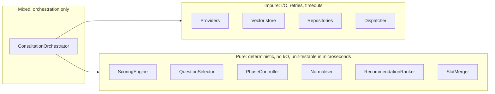

The pure column MUST have zero imports from `infrastructure`, zero `async def`, and 100 percent branch coverage. This is the enforceable core of the system's correctness.

* * *
# 2\. Project Structure
## 2.1 Complete folder tree

```plain
tasc-backend/
├── app/
│   ├── __init__.py
│   ├── main.py
│   ├── lifespan.py
│   ├── container.py
│   │
│   ├── api/
│   │   ├── __init__.py
│   │   ├── router.py
│   │   ├── deps.py
│   │   ├── errors.py
│   │   ├── middleware/
│   │   │   ├── correlation.py
│   │   │   ├── logging.py
│   │   │   ├── rate_limit.py
│   │   │   └── timing.py
│   │   └── v1/
│   │       ├── __init__.py
│   │       ├── sessions.py
│   │       ├── messages.py
│   │       ├── consultations.py
│   │       ├── admin.py
│   │       └── health.py
│   │
│   ├── core/
│   │   ├── config.py
│   │   ├── constants.py
│   │   ├── exceptions.py
│   │   ├── logging.py
│   │   ├── security.py
│   │   └── telemetry.py
│   │
│   ├── schemas/
│   │   ├── requests.py
│   │   ├── responses.py
│   │   ├── events.py
│   │   ├── conversation.py
│   │   ├── analysis.py
│   │   ├── qualification.py
│   │   ├── recommendation.py
│   │   ├── summary.py
│   │   ├── automation.py
│   │   └── enums.py
│   │
│   ├── domain/
│   │   ├── models/
│   │   │   ├── session.py
│   │   │   ├── message.py
│   │   │   ├── slots.py
│   │   │   ├── score.py
│   │   │   ├── recommendation.py
│   │   │   └── knowledge.py
│   │   ├── conversation/
│   │   │   ├── manager.py
│   │   │   ├── phase_controller.py
│   │   │   ├── memory.py
│   │   │   ├── question_selector.py
│   │   │   └── completion.py
│   │   ├── extraction/
│   │   │   ├── intent_classifier.py
│   │   │   ├── slot_extractor.py
│   │   │   ├── normaliser.py
│   │   │   └── merger.py
│   │   ├── qualification/
│   │   │   ├── scoring_engine.py
│   │   │   ├── components.py
│   │   │   ├── overrides.py
│   │   │   └── banding.py
│   │   ├── recommendation/
│   │   │   ├── engine.py
│   │   │   ├── candidate_builder.py
│   │   │   ├── ranker.py
│   │   │   └── rationale.py
│   │   ├── rag/
│   │   │   ├── retrieval_service.py
│   │   │   ├── query_builder.py
│   │   │   ├── reranker.py
│   │   │   └── grounding_check.py
│   │   ├── summary/
│   │   │   └── generator.py
│   │   ├── guardrails/
│   │   │   ├── input_guard.py
│   │   │   ├── injection_detector.py
│   │   │   └── anti_persona.py
│   │   └── payload/
│   │       ├── assembler.py
│   │       └── validator.py
│   │
│   ├── orchestration/
│   │   ├── orchestrator.py
│   │   ├── pipeline.py
│   │   ├── stages.py
│   │   └── event_emitter.py
│   │
│   ├── infrastructure/
│   │   ├── providers/
│   │   │   ├── base.py
│   │   │   ├── openai_chat.py
│   │   │   ├── openai_embeddings.py
│   │   │   └── registry.py
│   │   ├── vectorstore/
│   │   │   ├── base.py
│   │   │   └── chroma_store.py
│   │   ├── repositories/
│   │   │   ├── base.py
│   │   │   ├── session_repository.py
│   │   │   ├── payload_repository.py
│   │   │   └── deadletter_repository.py
│   │   ├── automation/
│   │   │   ├── n8n_dispatcher.py
│   │   │   └── signing.py
│   │   └── prompts/
│   │       ├── registry.py
│   │       └── renderer.py
│   │
│   └── resources/
│       ├── prompts/
│       │   ├── manifest.yaml
│       │   ├── identity/nova.v1.md
│       │   ├── policy/conversation.v1.md
│       │   ├── policy/grounding.v1.md
│       │   ├── task/respond.v1.md
│       │   ├── task/classify_intent.v1.md
│       │   ├── task/extract_slots.v1.md
│       │   ├── task/write_rationale.v1.md
│       │   └── task/executive_summary.v1.md
│       ├── catalogue/
│       │   ├── services.yaml
│       │   └── pain_mapping.yaml
│       ├── scoring/
│       │   ├── weights.yaml
│       │   └── overrides.yaml
│       ├── vocabularies/
│       │   ├── industry.yaml
│       │   ├── business_size.yaml
│       │   ├── timeline.yaml
│       │   └── budget_band.yaml
│       └── copy/
│           ├── greeting.yaml
│           └── system_messages.yaml
│
├── knowledge/
│   ├── manifest.yaml
│   ├── services/
│   ├── case_studies/
│   ├── process/
│   ├── pricing/
│   ├── technology/
│   ├── company/
│   └── faq/
│
├── scripts/
│   ├── index_knowledge.py
│   ├── verify_index.py
│   ├── replay_payload.py
│   ├── run_evaluation.py
│   └── seed_dev_session.py
│
├── tests/
│   ├── conftest.py
│   ├── unit/
│   ├── integration/
│   ├── evaluation/
│   ├── contract/
│   └── fakes/
│
├── data/
│   ├── chroma/
│   ├── sessions/
│   └── payloads/
│
├── docs/
│   ├── runbook.md
│   ├── knowledge_authoring.md
│   └── prompt_changelog.md
│
├── .env.example
├── pyproject.toml
├── importlinter.ini
├── Dockerfile
├── docker-compose.yml
└── README.md
```

## 2.2 Folder responsibilities

| Path | Responsibility | May import | MUST NOT import |
| ---| ---| ---| --- |
| `app/main.py` | ASGI app construction, middleware wiring, router mounting. No logic | api, core, lifespan | domain, infrastructure directly |
| `app/lifespan.py` | Startup and shutdown sequence, dependency construction, warmup | core, infrastructure, container | api |
| `app/container.py` | Composition root. Builds concrete adapters and injects them into domain services | everything | nothing imports it except lifespan and deps |
| `app/api/router.py` | Aggregates versioned routers under a single prefix | api.v1 | domain |
| `app/api/deps.py` | FastAPI dependency callables resolving services from app state | container, core | domain internals |
| `app/api/errors.py` | Exception handlers mapping domain exceptions to HTTP responses | core.exceptions, schemas | domain logic |
| `app/api/middleware/` | Correlation ID injection, structured request logging, rate limiting, timing headers | core | domain |
| `app/api/v1/` | Route handlers only. Parse, delegate, serialise. No branching on business rules | schemas, orchestration, deps | domain internals, infrastructure |
| `app/core/config.py` | Pydantic settings, one settings object, validated at import | pydantic\_settings | everything else |
| `app/core/constants.py` | Non-configurable constants: event names, header names, error codes | nothing | everything |
| `app/core/exceptions.py` | Exception hierarchy with error codes | constants | everything |
| `app/core/logging.py` | Structured logger factory, redaction filters | config, constants | domain |
| `app/core/security.py` | HMAC signing, constant-time comparison, header validation | config | domain |
| `app/core/telemetry.py` | Timing context managers, token accounting, metric emission | config, logging | domain |
| `app/schemas/` | All Pydantic v2 models crossing a boundary: API, events, JSON contracts | pydantic, enums | domain, infrastructure |
| `app/domain/models/` | Internal domain models. Richer than DTOs, never serialised directly to the API | pydantic, enums | infrastructure |
| `app/domain/conversation/` | Session lifecycle, phase transitions, memory compaction, next-question choice, completion detection | domain.models, schemas | infrastructure concretes |
| `app/domain/extraction/` | Intent classification, slot extraction, normalisation, merge rules | providers.base protocols | openai SDK |
| `app/domain/qualification/` | Deterministic scoring, component maths, overrides, banding | domain.models, loaded resources | any I/O |
| `app/domain/recommendation/` | Candidate generation, evidence boost, constraint filter, ranking, rationale call | domain.models, providers.base | openai SDK |
| `app/domain/rag/` | Retrieval decision, query construction, filtering, reranking, dedupe, grounding check | vectorstore.base, providers.base | chromadb SDK |
| `app/domain/summary/` | Executive summary generation with templated fallback | providers.base | openai SDK |
| `app/domain/guardrails/` | Length caps, abuse and injection detection, anti-persona classification | core.config | I/O other than provider protocols |
| `app/domain/payload/` | Assembles and validates the automation payload | schemas.automation | dispatcher |
| `app/orchestration/` | Turn pipeline sequencing, stage execution, error containment, SSE event emission | domain, [schemas.events](http://schemas.events) | infrastructure concretes |
| `app/infrastructure/providers/` | OpenAI chat and embedding adapters implementing the base protocols | openai, httpx | domain |
| `app/infrastructure/vectorstore/` | ChromaDB adapter implementing the store protocol | chromadb | domain |
| `app/infrastructure/repositories/` | Session, payload, dead-letter persistence | filesystem or db client | domain |
| `app/infrastructure/automation/` | Signed, retried, idempotent HTTPX dispatch to n8n | httpx, [core.security](http://core.security) | domain |
| `app/infrastructure/prompts/` | Template loading, versioning, rendering | jinja2, resources | domain |
| `app/resources/` | Behaviour-as-data: prompts, catalogue, weights, vocabularies, static copy | not code | not code |
| `knowledge/` | The RAG corpus. Markdown with YAML front matter. Version controlled | not code | not code |
| `scripts/` | Operational entry points, runnable standalone | app | tests |
| `tests/` | Unit, integration, evaluation, contract tests plus fakes | app | production data |
| `data/` | Runtime persistence: Chroma index, sessions, payloads. Volume-mounted, git-ignored | not code | not code |

## 2.3 Import boundary enforcement
`importlinter.ini` MUST define and CI MUST enforce these contracts:

| Contract | Rule |
| ---| --- |
| Layered architecture | `app.api` above `app.orchestration` above `app.domain` above `app.infrastructure`, top-down only |
| Domain independence | `app.domain.*` MUST NOT import `openai`, `chromadb`, `httpx`, or concrete `app.infrastructure.*` modules |
| Purity of qualification | `app.domain.qualification.*` MUST NOT import anything from `app.infrastructure` or `app.orchestration` |
| Schema isolation | `app.schemas.*` MUST NOT import `app.domain.*` |
| Config singleton | Only `app.core.config` may read `os.environ` |

A violation is a build failure, not a warning. This single rule is what preserves BP-03 and BP-04 over time.

* * *
# 3\. Configuration Layer
## 3.1 Design
One `Settings` class built on `pydantic-settings`, composed of nested sub-settings groups, instantiated exactly once at import in `app/core/config.py`, and injected everywhere else. `os.environ` is read in exactly one file. Validation runs at construction; a missing or malformed required value raises before the ASGI app exists, so the container never reports healthy while misconfigured (BP-06).
## 3.2 Environment variables
### 3.2.1 Application

| Variable | Type | Required | Default | Notes |
| ---| ---| ---| ---| --- |
| `APP_ENV` | enum: local, preview, production | Yes | `local` | Drives log format and doc exposure |
| `APP_NAME` | str | No | `tasc-backend` | Log and telemetry tag |
| `APP_VERSION` | str | No | package version | Surfaced on `/health` |
| `LOG_LEVEL` | enum: DEBUG, INFO, WARNING, ERROR | No | `INFO` |  |
| `LOG_FORMAT` | enum: json, console | No | `json` outside local |  |
| `API_PREFIX` | str | No | `/api` |  |
| `DOCS_ENABLED` | bool | No | `false` in production | OpenAPI UI toggle |
| `SHUTDOWN_GRACE_SECONDS` | int | No | `20` | Drain window |

### 3.2.2 Model provider

| Variable | Type | Required | Default | Notes |
| ---| ---| ---| ---| --- |
| `LLM_PROVIDER` | enum: openai | Yes | `openai` | Registry key, extensible |
| `OPENAI_API_KEY` | secret | Yes | none | Never logged |
| `OPENAI_BASE_URL` | url | No | provider default | Allows proxy or compatible endpoint |
| `LLM_CHAT_MODEL` | str | Yes | `gpt-4.1-mini` |  |
| `LLM_EMBEDDING_MODEL` | str | Yes | `text-embedding-3-small` | Dimension recorded in index manifest |
| `LLM_TEMPERATURE_CONVERSATION` | float | No | `0.3` | PRD 13.6 |
| `LLM_TEMPERATURE_STRUCTURED` | float | No | `0.0` | Extraction and classification |
| `LLM_MAX_OUTPUT_TOKENS` | int | No | `700` | Conversation turns |
| `LLM_TIMEOUT_SECONDS` | float | No | `30.0` | Hard ceiling per call |
| `LLM_CONNECT_TIMEOUT_SECONDS` | float | No | `5.0` |  |
| `LLM_MAX_RETRIES` | int | No | `1` | See section 8.6 |
| `LLM_STRUCTURED_MODE` | enum: schema, json\_object | No | `schema` | Fallback path per PRD 13.6 |

### 3.2.3 Retrieval

| Variable | Type | Required | Default | PRD anchor |
| ---| ---| ---| ---| --- |
| `CHROMA_PERSIST_DIR` | path | Yes | `./data/chroma` | FR-14 |
| `CHROMA_COLLECTION` | str | No | `trizen_knowledge` |  |
| `CHROMA_MODE` | enum: embedded, http | No | `embedded` | `http` reserved for scale-out |
| `CHROMA_HTTP_URL` | url | Conditional | none | Required when mode is `http` |
| `RAG_TOP_K` | int | No | `5` | FR-16 |
| `RAG_SIMILARITY_FLOOR` | float | No | `0.35` | PRD 13.5 |
| `RAG_CHUNK_TARGET_TOKENS` | int | No | `650` | FR-12 |
| `RAG_CHUNK_OVERLAP_RATIO` | float | No | `0.15` | FR-12 |
| `RAG_MAX_CONTEXT_CHUNKS` | int | No | `5` | Post-dedupe cap |
| `RAG_ENABLE_METADATA_FILTER` | bool | No | `true` | FR-17 |

### 3.2.4 Conversation and session

| Variable | Type | Required | Default | PRD anchor |
| ---| ---| ---| ---| --- |
| `SESSION_TTL_MINUTES` | int | No | `60` | FR-08 |
| `SESSION_ABANDON_MINUTES` | int | No | `20` | PRD 8.4 |
| `SESSION_STORE` | enum: memory, file, redis | No | `file` | `memory` local only |
| `SESSION_STORE_PATH` | path | Conditional | `./data/sessions` |  |
| `REDIS_URL` | url | Conditional | none | Required when store is redis |
| `MESSAGE_MAX_CHARS` | int | No | `2000` | NFR-17 |
| `HISTORY_FULL_TURNS` | int | No | `8` | Verbatim recent turns |
| `HISTORY_TOKEN_BUDGET` | int | No | `3000` | FR-05 compaction trigger |
| `SESSION_TOKEN_CEILING` | int | No | `60000` | NFR-40 |

### 3.2.5 Scoring and recommendation

| Variable | Type | Required | Default | PRD anchor |
| ---| ---| ---| ---| --- |
| `SCORING_WEIGHTS_PATH` | path | No | `app/resources/scoring/weights.yaml` | FR-36 |
| `SCORING_OVERRIDES_PATH` | path | No | `app/resources/scoring/overrides.yaml` | PRD 14.4 |
| `BAND_THRESHOLD_WARM` | int | No | `35` | PRD 14.3 |
| `BAND_THRESHOLD_QUALIFIED` | int | No | `60` |  |
| `BAND_THRESHOLD_HOT` | int | No | `80` |  |
| `CATALOGUE_PATH` | path | No | `app/resources/catalogue/services.yaml` | FR-41 |
| `PAIN_MAPPING_PATH` | path | No | `app/resources/catalogue/pain_mapping.yaml` | PRD 15.2 |
| `RECOMMENDATION_CONFIDENCE_FLOOR` | float | No | `0.6` | FR-43 |
| `RECOMMENDATION_MAX` | int | No | `3` | FR-37 |

### 3.2.6 Automation

| Variable | Type | Required | Default | PRD anchor |
| ---| ---| ---| ---| --- |
| `N8N_WEBHOOK_URL` | url | Yes | none | FR-49 |
| `N8N_SHARED_SECRET` | secret | Yes | none | FR-52, NFR-16 |
| `N8N_SIGNING_SECRET` | secret | Yes | none | HMAC payload signature |
| `N8N_TIMEOUT_SECONDS` | float | No | `15.0` |  |
| `N8N_MAX_ATTEMPTS` | int | No | `3` | FR-51 |
| `N8N_BACKOFF_BASE_SECONDS` | float | No | `2.0` | Exponential with jitter |
| `N8N_ENABLED` | bool | No | `true` | `false` in tests |
| `DEADLETTER_PATH` | path | No | `./data/payloads/deadletter` |  |

### 3.2.7 Security

| Variable | Type | Required | Default | PRD anchor |
| ---| ---| ---| ---| --- |
| `CORS_ALLOWED_ORIGINS` | csv | Yes | none | NFR-23 |
| `RATE_LIMIT_SESSION_PER_MINUTE` | int | No | `20` | NFR-18 |
| `RATE_LIMIT_IP_PER_MINUTE` | int | No | `60` | NFR-18 |
| `RATE_LIMIT_SESSION_CREATE_PER_HOUR` | int | No | `10` | Anti-abuse |
| `ADMIN_API_KEY` | secret | Conditional | none | Required when admin routes enabled |
| `ADMIN_ROUTES_ENABLED` | bool | No | `false` |  |
| `TRUSTED_HOSTS` | csv | No | `*` in local |  |

### 3.2.8 Observability

| Variable | Type | Required | Default |
| ---| ---| ---| --- |
| `SENTRY_DSN` | secret | No | none |
| `TELEMETRY_ENABLED` | bool | No | `true` |
| `COST_PER_1K_INPUT_TOKENS` | float | No | provider rate |
| `COST_PER_1K_OUTPUT_TOKENS` | float | No | provider rate |
| `LOG_SAMPLE_RATE` | float | No | `1.0` |

## 3.3 Secrets handling

| Rule | Detail |
| ---| --- |
| SEC-01 | All secrets typed as `SecretStr`. Repr and log serialisation render a mask |
| SEC-02 | No secret appears in `/health`, error responses, OpenAPI, or exception messages |
| SEC-03 | `.env` is git-ignored. `.env.example` lists every variable with placeholders and MUST stay in sync, enforced by a CI check against the settings model |
| SEC-04 | Production secrets come from the platform secret store, never baked into the image |
| SEC-05 | Secret comparison uses constant-time comparison, never equality |
| SEC-06 | Rotation is documented in the runbook. Secrets are read only at startup, so rotation requires a restart |

## 3.4 Settings composition

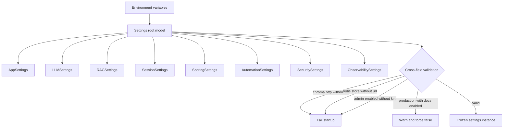

Settings instances MUST be immutable. Anything that changes at runtime is not configuration, it is state.
## 3.5 Resource file loading
YAML resources (weights, catalogue, vocabularies, pain mapping) load once at startup into frozen Pydantic models, never per request. Each carries a `source_version` derived from its content hash. The combined hash becomes `ruleset_version`, logged at startup and attached to every consultation payload so behaviour is attributable to an exact ruleset (BP-07, BP-08). A malformed resource file MUST fail startup with the file path and the validation error.
## 3.6 Dependency injection
FastAPI `Depends` is the only injection mechanism. Construction happens once in `app/container.py` during lifespan startup; `app/api/deps.py` exposes thin resolvers reading from application state.

| Dependency | Scope | Resolver | Notes |
| ---| ---| ---| --- |
| `Settings` | Singleton | `get_settings` | Module-level instance |
| `ChatProvider` | Singleton | `get_chat_provider` | Holds a pooled async HTTP client |
| `EmbeddingProvider` | Singleton | `get_embedding_provider` |  |
| `VectorStore` | Singleton | `get_vector_store` | Chroma client is not cheap per request |
| `PromptRegistry` | Singleton | `get_prompt_registry` | Templates compiled at startup |
| `SessionRepository` | Singleton | `get_session_repository` |  |
| `PayloadRepository` | Singleton | `get_payload_repository` |  |
| `N8nDispatcher` | Singleton | `get_dispatcher` | Shared HTTPX client |
| `ScoringEngine` | Singleton | `get_scoring_engine` | Stateless, holds frozen weights |
| `RecommendationEngine` | Singleton | `get_recommendation_engine` | Holds frozen catalogue |
| `RetrievalService` | Singleton | `get_retrieval_service` |  |
| `ConversationManager` | Singleton | `get_conversation_manager` | State lives in the repository |
| `ConsultationOrchestrator` | Singleton | `get_orchestrator` | Composed of the above |
| `CorrelationId` | Per-request | `get_correlation_id` | From a context var set by middleware |
| `SessionContext` | Per-request | `get_session_context` | Loads and locks the session, 404 if unknown |

**DI-01:** No domain service constructs its own dependency. Everything arrives through the constructor, which is what makes the fakes in `tests/fakes/` sufficient for the entire unit suite.

**DI-02:** A route handler depends on at most three things. More than that means it is doing business logic it should not be doing.

* * *
# 4\. Application Startup
## 4.1 Lifespan sequence
Startup is ordered, fail-fast, and logged step by step. The app MUST NOT accept traffic until every step succeeds.

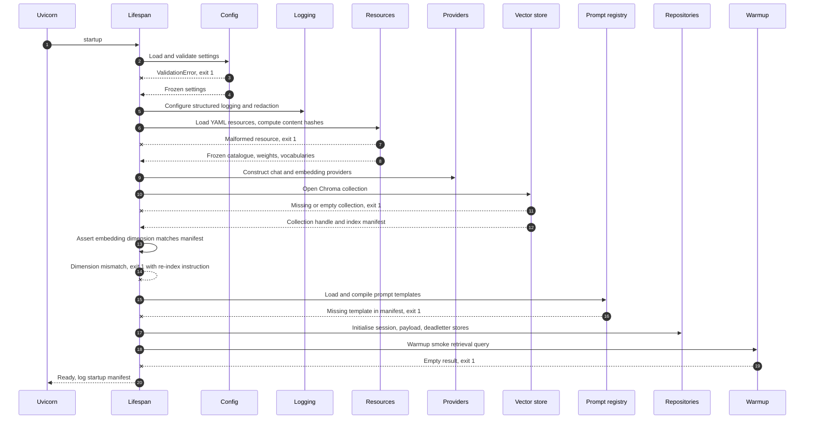

## 4.2 Startup steps in detail

| Step | Action | Failure behaviour | PRD anchor |
| ---| ---| ---| --- |
| S1 | Load and validate `Settings` | Exit 1, print offending field names, never values | NFR-27 |
| S2 | Configure logging with redaction filters before anything else logs | Exit 1 | FR-70 |
| S3 | Load YAML resources, compute `ruleset_version` | Exit 1 with file path and error | BP-08 |
| S4 | Construct providers from `LLM_PROVIDER` via the registry | Exit 1 on unknown provider key | AD-06 |
| S5 | Open the Chroma collection | Exit 1 if absent or zero documents | R-16 |
| S6 | Read index manifest, assert embedding model and dimension match config | Exit 1 with the exact re-index command | PRD 13.6 |
| S7 | Load and compile prompt templates, resolve version pins | Exit 1 on missing or unparseable template | NFR-26 |
| S8 | Initialise repositories, create directories, verify write permission | Exit 1 | NFR-12 |
| S9 | Construct the n8n dispatcher. Do not call n8n at startup | n/a, checked lazily by `/health` |  |
| S10 | Warmup smoke retrieval query, assert at least one result | Exit 1 | FR-20 |
| S11 | Emit the startup manifest log line | n/a | BP-07 |

**Startup manifest fields:** app version, git SHA, environment, chat model, embedding model and dimension, Chroma collection name and document count, index manifest version, prompt manifest version, ruleset version, session store type, n8n enabled flag. This single log line is the first thing an engineer reads when debugging behaviour differences between environments.
## 4.3 Warmup policy
Warmup MUST NOT make a chat completion call. It costs money, adds startup latency, and proves nothing the health probe cannot prove lazily. Retrieval warmup is different: free, fast, and it catches the single most common deployment failure, an unmounted or empty Chroma volume (R-16).
## 4.4 Shutdown sequence

| Order | Action |
| ---| --- |
| 1 | Stop accepting new connections |
| 2 | Wait up to `SHUTDOWN_GRACE_SECONDS` for in-flight turns to finish streaming |
| 3 | Await outstanding dispatch tasks; anything still pending is written to dead-letter, never dropped |
| 4 | Flush session state writes |
| 5 | Close HTTPX clients and the Chroma client |
| 6 | Flush logs and telemetry |

**ST-01:** A dispatch task MUST NOT be lost on shutdown. If it cannot complete it becomes a dead-letter record with reason `shutdown_interrupted` (FR-48, FR-51).
## 4.5 Health checks
Three endpoints, three distinct jobs. Conflating them is the classic mistake that causes restart loops.

| Endpoint | Purpose | Checks | Success criterion | Consumer |
| ---| ---| ---| ---| --- |
| `GET /health/live` | Process is alive | None, returns immediately | 200 unless the process is dead | Liveness probe |
| `GET /health/ready` | Safe to route traffic | Settings loaded, resources loaded, Chroma collection non-empty, prompts loaded, session store writable | All pass else 503 | Readiness probe |
| `GET /health` | Operator diagnostics | Everything in ready plus shallow reachability of the model provider and n8n webhook | 200 with per-dependency status; degraded dependencies reported but do not fail the response | Humans, uptime monitor |

**HC-01:** `/health/ready` MUST NOT call any third party. A transient OpenAI blip must never pull the service out of rotation, because degraded mode (FR-10) is a valid serving state.

**HC-02:** `/health` dependency checks are cached 15 seconds so an uptime monitor cannot generate provider load.

**HC-03:** `/health` reports version and manifest identifiers so a deployed build is identifiable without shell access.

* * *
# 5\. API Layer
## 5.1 Responsibilities
Parse, validate, authenticate, rate limit, delegate, serialise. That is the complete list.

| Does | Does not |
| ---| --- |
| Validate request bodies against Pydantic models | Decide anything about phases, scores, or recommendations |
| Resolve dependencies | Construct services |
| Convert domain exceptions to HTTP responses | Catch broad exceptions and improvise |
| Manage the SSE connection lifecycle | Decide which events to emit |
| Enforce rate limits and CORS | Enforce business rules |
| Attach correlation IDs and timing headers | Log business events |

**API-01:** A route handler is at most 20 lines. If it needs a conditional on business state, that logic belongs in the orchestrator.
## 5.2 Routing strategy

```plain
/api/v1
  POST   /sessions                       create session
  GET    /sessions/{session_id}          fetch session snapshot
  DELETE /sessions/{session_id}          end session explicitly
  POST   /sessions/{session_id}/messages send message, returns SSE stream
  GET    /sessions/{session_id}/analysis latest analysis snapshot (polling fallback)
  POST   /sessions/{session_id}/complete force completion
  GET    /consultations/{consultation_id}            fetch payload (admin)
  POST   /consultations/{consultation_id}/redispatch replay dispatch (admin)
  POST   /admin/reindex                  trigger knowledge re-index (admin)
  GET    /admin/deadletters              list dead-letter records (admin)
/health
/health/live
/health/ready
```

| Rule | Detail |
| ---| --- |
| RT-01 | Resources are nouns, actions are verbs. The two exceptions (`complete`, `redispatch`) are explicit state transitions and documented as such |
| RT-02 | One router module per resource under `app/api/v1/` |
| RT-03 | Every route declares `response_model`, status code, and error responses explicitly for accurate OpenAPI |
| RT-04 | Every route carries a snake\_case `operation_id` so generated clients read well |
| RT-05 | Admin routes sit behind a separate router with an API-key dependency, mounted only when `ADMIN_ROUTES_ENABLED` |
| RT-06 | The message endpoint is the only streaming endpoint. Everything else is request-response JSON |

## 5.3 Versioning

| Aspect | Policy |
| ---| --- |
| Scheme | URL path versioning, `/api/v1`. Chosen over headers because it is cacheable, visible in logs, and readable in a browser |
| Version bump triggers | Removing a field, renaming a field, changing a type, changing an enum's meaning, changing error code semantics |
| Non-bump changes | Adding an optional response field, adding an endpoint, adding an enum value clients are told to treat as unknown, relaxing validation |
| Coexistence | `v1` and `v2` routers may be mounted together; the orchestrator is version-agnostic and only `schemas` and route modules fork |
| Event schema versioning | SSE events carry a `v` field. The client ignores unknown event types rather than erroring |
| Payload contract versioning | The automation payload carries `schema_version` and n8n branches on it. Longest blast radius, so it changes last and loudest |
| Deprecation | A deprecated version returns `Deprecation` and `Sunset` headers for at least 30 days before removal |

## 5.4 Middleware stack
Order matters. Outermost first.

| Order | Middleware | Responsibility |
| ---| ---| --- |
| 1 | TrustedHost | Reject unexpected Host headers |
| 2 | CORS | Origin allowlist, credentials disabled, only the methods actually used |
| 3 | Correlation | Read or generate `X-Correlation-Id`, bind to a context var, echo in the response |
| 4 | Timing | Wall-clock duration, sets `X-Response-Time-Ms` |
| 5 | RateLimit | Per-IP and per-session token buckets, emits `Retry-After` on 429 |
| 6 | RequestLogging | One structured log line per request with redacted fields |
| 7 | GZip | JSON only, explicitly disabled for `text/event-stream` |

**MW-01:** Compression MUST be disabled for SSE. Buffering a compressed stream defeats streaming and silently breaks the sub-1.2 s first-token target (NFR-01).

**MW-02:** Rate limiting runs before request logging so flood traffic does not consume the log budget.
## 5.5 Streaming transport contract

| Property | Value |
| ---| --- |
| Protocol | Server-sent events over HTTP/1.1 (AD-04) |
| Content type | `text/event-stream; charset=utf-8` |
| Required headers | `Cache-Control: no-cache, no-transform`, `X-Accel-Buffering: no`, `Connection: keep-alive` |
| Event framing | `event: <type>` line, `data: <json>` line, blank line |
| Event types | `phase`, `token`, `analysis_snapshot`, `error`, `done` |
| Heartbeat | Comment line every 15 s of silence to defeat proxy idle timeouts |
| Client disconnect | Detected via the request disconnect signal. State is persisted, generation cancelled. A disconnect is never an error |
| Ordering guarantee | `phase` events precede tokens; exactly one `analysis_snapshot` precedes exactly one `done` |
| Max stream duration | 90 s, after which `error` with code `TURN_TIMEOUT` then `done` |

## 5.6 Request lifecycle

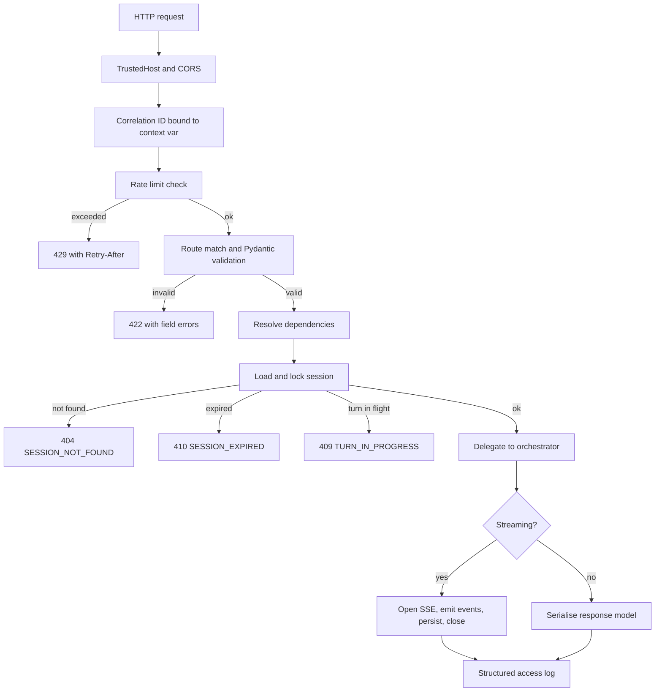

## 5.7 Session concurrency control
A session processes one turn at a time. A second message while a turn is in flight returns `409 TURN_IN_PROGRESS`. Enforced with a per-session async lock held by the session context dependency, with a 90 s acquisition timeout matching the stream cap.

Without this rule, concurrent turns interleave slot merges and produce non-reproducible state, breaking the determinism guarantee in BP-02 and the score invariant in PRD 22.2.

# 2. API Contracts (Section 6)

# 6\. API Contracts
## 6.0 Conventions

| Aspect | Rule |
| ---| --- |
| Base path | `/api/v1` |
| Content type | `application/json` except the message endpoint which returns `text/event-stream` |
| Casing | `snake_case` for all JSON field names, request and response |
| Timestamps | ISO 8601 with explicit UTC offset, for example `2026-07-28T02:14:09Z` |
| Identifiers | `session_id` and `consultation_id` are 26-character ULIDs, opaque to the client (FR-01) |
| Nullability | Optional fields are present with `null`, never omitted, so clients need no key-existence checks |
| Enums | Lowercase snake\_case strings. Clients MUST tolerate unknown values |
| Error envelope | Every non-2xx response uses the single envelope in 6.9 |
| Correlation | Every response echoes `X-Correlation-Id` |
| Idempotency | The completion endpoint accepts an `Idempotency-Key` header |

* * *
## 6.1 POST /api/v1/sessions
Creates a consultation session and returns the static greeting. No model call occurs (FR-02).

**Auth:** none. Rate limited by IP via `RATE_LIMIT_SESSION_CREATE_PER_HOUR`.
### Request

```json
{
  "locale": "en-US",
  "referrer": "https://trizen.example/services/ai-automation",
  "utm": {
    "source": "google",
    "medium": "cpc",
    "campaign": "ai-automation-q3"
  },
  "client_metadata": {
    "viewport": "1440x900",
    "timezone": "Africa/Lagos"
  }
}
```

| Field | Type | Required | Validation |
| ---| ---| ---| --- |
| `locale` | string | No | BCP 47 tag, defaults to `en-US`. Only `en-*` supported in MVP |
| `referrer` | string | No | Valid URL, max 2048 chars, stored for attribution |
| `utm` | object | No | All members strings, max 128 chars each |
| `client_metadata` | object | No | Max 10 keys, string values max 128 chars. Attribution only, never used for logic |

### Response 201

```json
{
  "session_id": "01J9XK7T2ZQ8V3N5B4C6D7E8F9",
  "created_at": "2026-07-28T02:14:09Z",
  "expires_at": "2026-07-28T03:14:09Z",
  "phase": "greeting",
  "greeting": {
    "message_id": "01J9XK7T3A0000000000000001",
    "role": "assistant",
    "content": "I'm Nova, AI Solutions Consultant at Trizen. I help visitors figure out whether we're the right fit for what they're building. What's the problem you're trying to solve?",
    "created_at": "2026-07-28T02:14:09Z"
  },
  "analysis": {
    "turn_index": 0,
    "lead_status": "exploring",
    "lead_score": null,
    "industry": null,
    "business_size": null,
    "pain_points": [],
    "recommended_services": [],
    "conversation_progress": {
      "phase": "greeting",
      "stage_index": 0,
      "stage_total": 5,
      "slots_filled": 0,
      "slots_total": 9,
      "percent": 0
    },
    "qualification_status": {
      "business_context_understood": "unmet",
      "challenges_identified": "unmet",
      "solution_matched": "unmet",
      "timeline_established": "unmet",
      "budget_discussed": "unmet",
      "contact_captured": "unmet"
    }
  },
  "limits": {
    "message_max_chars": 2000,
    "session_ttl_minutes": 60
  }
}
```

| Status | Condition | Error code |
| ---| ---| --- |
| 201 | Created | n/a |
| 422 | Malformed body | `VALIDATION_ERROR` |
| 429 | IP session-creation limit hit | `RATE_LIMITED` |
| 503 | Startup incomplete | `SERVICE_UNAVAILABLE` |

**Notes.** The greeting is read from `app/resources/copy/greeting.yaml`, not generated. The empty analysis snapshot is returned so the panel can render its empty state without a second request.

* * *
## 6.2 POST /api/v1/sessions/{session\_id}/messages
The core endpoint. Accepts a visitor message and returns an SSE stream. Only streaming route (RT-06).

**Auth:** none. Rate limited per session and per IP.
### Request

```json
{
  "content": "We run a logistics company and our order processing is all manual.",
  "client_turn_id": "c_8f21"
}
```

| Field | Type | Required | Validation |
| ---| ---| ---| --- |
| `content` | string | Yes | 1 to `MESSAGE_MAX_CHARS` chars after trimming. Rejected if empty after whitespace strip |
| `client_turn_id` | string | No | Max 64 chars. Echoed in `done` so the client can reconcile optimistic UI |

### Response 200, `text/event-stream`
**Event** **`phase`** — zero or more, always before tokens (PRD 17.3).

```json
{
  "v": 1,
  "phase": "retrieving",
  "turn_index": 3,
  "at": "2026-07-28T02:15:02.118Z"
}
```

Permitted values: `understanding`, `retrieving`, `evaluating`, `preparing`, `generating`. The backend MUST NOT emit a phase it did not execute (PRD LX-05). A pure discovery turn emits `understanding`, `evaluating`, `generating` and skips `retrieving`.

**Event** **`token`** — response text, incrementally.

```json
{ "v": 1, "delta": "Manual invoice matching ", "turn_index": 3 }
```

**Event** **`analysis_snapshot`** — exactly one per turn, full state replacement (AD-05, FR-60).

```json
{
  "v": 1,
  "turn_index": 3,
  "lead_status": "warm",
  "lead_score": 45,
  "lead_score_delta": 5,
  "next_score_contributor": "Timeline not yet discussed",
  "industry": {
    "value": "logistics",
    "label": "Logistics",
    "raw": "we run a logistics company",
    "confidence": 0.94
  },
  "business_size": {
    "value": "51-200",
    "label": "51 to 200 employees",
    "raw": "about 180 staff",
    "confidence": 0.88
  },
  "pain_points": [
    {
      "id": "pp_02",
      "label": "Invoice matching consumes two people three days a week",
      "service_codes": ["SVC-AIA"],
      "quantified": true,
      "turn_index": 3
    },
    {
      "id": "pp_01",
      "label": "Manual order processing across email and spreadsheets",
      "service_codes": ["SVC-AIA", "SVC-INT"],
      "quantified": false,
      "turn_index": 1
    }
  ],
  "recommended_services": [],
  "conversation_progress": {
    "phase": "exploration",
    "stage_index": 2,
    "stage_total": 5,
    "slots_filled": 4,
    "slots_total": 9,
    "percent": 44
  },
  "qualification_status": {
    "business_context_understood": "met",
    "challenges_identified": "met",
    "solution_matched": "unmet",
    "timeline_established": "unmet",
    "budget_discussed": "unmet",
    "contact_captured": "unmet"
  }
}
```

**Event** **`error`** — recoverable turn failure. The stream still closes with `done`.

```json
{
  "v": 1,
  "code": "PROVIDER_UNAVAILABLE",
  "message": "Something went wrong on my end. Your message is still here, try again?",
  "retryable": true,
  "turn_index": 3
}
```

**Event** **`done`** — always the final event.

```json
{
  "v": 1,
  "turn_index": 3,
  "client_turn_id": "c_8f21",
  "message_id": "01J9XK8B4C0000000000000007",
  "finish_reason": "complete",
  "consultation_complete": false,
  "consultation_id": null
}
```

| `finish_reason` | Meaning |
| ---| --- |
| `complete` | Normal completion |
| `error` | An `error` event preceded this |
| `timeout` | 90 s stream cap reached |
| `cancelled` | Client disconnected or cancelled |
| `blocked` | Guardrail rejection, a bounded refusal was streamed |

When the consultation completes on this turn, `consultation_complete` is `true` and `consultation_id` is populated. Dispatch runs in the background after the stream closes (FR-50).
### Pre-stream errors
These return JSON, not SSE, because they occur before the stream opens.

| Status | Condition | Error code |
| ---| ---| --- |
| 400 | Content empty after trimming | `EMPTY_MESSAGE` |
| 404 | Unknown session | `SESSION_NOT_FOUND` |
| 409 | A turn is already in flight (5.7) | `TURN_IN_PROGRESS` |
| 410 | Session expired or terminated | `SESSION_EXPIRED` |
| 413 | Content exceeds the character cap | `MESSAGE_TOO_LONG` |
| 422 | Malformed body | `VALIDATION_ERROR` |
| 429 | Rate limit exceeded | `RATE_LIMITED` |
| 503 | Not ready | `SERVICE_UNAVAILABLE` |

**MSG-01:** Once the stream is open the status is already 200. All later failures MUST be delivered as `error` events, never as an HTTP status. A handler that raises after the first byte is a defect.

**MSG-02:** Session state is persisted before `analysis_snapshot` is emitted, so a client crash right after the snapshot cannot desynchronise state.

* * *
## 6.3 GET /api/v1/sessions/{session\_id}
Full session snapshot. Used for refresh recovery (FR-04) and debugging.
### Response 200

```json
{
  "session_id": "01J9XK7T2ZQ8V3N5B4C6D7E8F9",
  "created_at": "2026-07-28T02:14:09Z",
  "last_active_at": "2026-07-28T02:19:41Z",
  "expires_at": "2026-07-28T03:19:41Z",
  "phase": "exploration",
  "status": "active",
  "turn_count": 3,
  "messages": [
    {
      "message_id": "01J9XK7T3A0000000000000001",
      "role": "assistant",
      "content": "I'm Nova, AI Solutions Consultant at Trizen...",
      "created_at": "2026-07-28T02:14:09Z"
    }
  ],
  "analysis": { "note": "latest analysis_snapshot object" },
  "consultation_id": null
}
```

| `status` | Meaning |
| ---| --- |
| `active` | Accepting messages |
| `completing` | Summary being generated |
| `completed` | Payload assembled, possibly dispatched |
| `abandoned` | Idle past the abandonment threshold |
| `expired` | Past TTL |
| `terminated` | Guardrail or anti-persona closure |

| Status | Condition | Error code |
| ---| ---| --- |
| 200 | Found | n/a |
| 404 | Unknown | `SESSION_NOT_FOUND` |
| 410 | Expired and purged | `SESSION_EXPIRED` |

**SES-01:** This endpoint MUST NOT return internal fields: raw confidence maps beyond the snapshot, retrieved chunk text, prompt versions, or token counts. Those live in logs and the admin payload endpoint (PRD 16.5).

* * *
## 6.4 GET /api/v1/sessions/{session\_id}/analysis
Latest analysis snapshot only. Polling fallback when SSE drops (FR-64, R-20). Body is identical to the `analysis_snapshot` event payload.

| Status | Condition | Error code |
| ---| ---| --- |
| 200 | Found | n/a |
| 404 | Unknown session | `SESSION_NOT_FOUND` |
| 410 | Expired | `SESSION_EXPIRED` |

Response sets `Cache-Control: no-store`. Snapshots change per turn and must never be cached by an intermediary.

* * *
## 6.5 POST /api/v1/sessions/{session\_id}/complete
Forces consultation completion (FR-47).
### Request

```json
{
  "reason": "visitor_requested",
  "contact": {
    "name": "Chidi Okafor",
    "email": "chidi@example.com",
    "company": "Northline Logistics",
    "phone": null,
    "consent": true
  }
}
```

| Field | Type | Required | Validation |
| ---| ---| ---| --- |
| `reason` | enum | Yes | `visitor_requested`, `criteria_met`, `abandoned`, `operator` |
| `contact` | object | No | Only if not already captured in conversation |
| `contact.name` | string | Conditional | 2 to 120 chars |
| `contact.email` | string | Conditional | RFC 5322 shape plus a disposable-domain heuristic |
| `contact.company` | string | No | Max 160 chars |
| `contact.phone` | string | No | E.164 when present |
| `contact.consent` | bool | Yes when contact present | MUST be true or the contact is discarded (NFR-19) |

### Response 202

```json
{
  "consultation_id": "01J9XKB2M7QF0R1S2T3U4V5W6X",
  "session_id": "01J9XK7T2ZQ8V3N5B4C6D7E8F9",
  "status": "completing",
  "summary": {
    "executive_summary": "Northline Logistics, a 180-person logistics operator, is processing orders manually across email and spreadsheets...",
    "word_count": 187
  },
  "qualification": {
    "score": 74,
    "band": "qualified",
    "justification": "Two specific pain points in order processing and invoice matching..."
  },
  "dispatch": {
    "status": "queued",
    "idempotency_key": "01J9XKB2M7QF0R1S2T3U4V5W6X"
  }
}
```

| Status | Condition | Error code |
| ---| ---| --- |
| 202 | Accepted, dispatch queued | n/a |
| 404 | Unknown session | `SESSION_NOT_FOUND` |
| 409 | Already completed | `ALREADY_COMPLETED` |
| 410 | Expired or terminated | `SESSION_EXPIRED` |
| 422 | Invalid contact, or consent false with contact present | `VALIDATION_ERROR` |
| 500 | Payload failed schema validation | `PAYLOAD_INVALID` |

**CMP-01:** 202, not 200. Dispatch is asynchronous (FR-50). The response confirms the payload is validated and persisted, not that n8n succeeded.

**CMP-02:** Repeated calls with the same `Idempotency-Key` return the original body, never a second dispatch (FR-49, NFR-13).

**CMP-03:** If the session is `terminated` or the band is `not_a_lead`, the payload is persisted but dispatch is suppressed and `dispatch.status` is `suppressed` (OV-01).

* * *
## 6.6 DELETE /api/v1/sessions/{session\_id}
Ends a session without completing a consultation. Backs the restart affordance (FR-09). Returns 204 with an empty body.

| Status | Condition | Error code |
| ---| ---| --- |
| 204 | Ended | n/a |
| 404 | Unknown | `SESSION_NOT_FOUND` |
| 409 | Already completed and dispatched | `ALREADY_COMPLETED` |

**DEL-01:** Deletion marks the session `terminated` and schedules purge at TTL. It does not hard-delete immediately, because the transcript may be needed for a dead-letter replay.

* * *
## 6.7 Admin endpoints
Mounted only when `ADMIN_ROUTES_ENABLED`. All require `X-Admin-Key` matching `ADMIN_API_KEY` via constant-time comparison. All set `Cache-Control: no-store`.
### 6.7.1 GET /api/v1/consultations/{consultation\_id}
Returns the stored automation payload verbatim (FR-48).

| Status | Condition | Error code |
| ---| ---| --- |
| 200 | Found | n/a |
| 401 | Missing or bad admin key | `UNAUTHORIZED` |
| 404 | Unknown consultation | `CONSULTATION_NOT_FOUND` |

### 6.7.2 POST /api/v1/consultations/{consultation\_id}/redispatch
Replays dispatch from the persisted payload (FR-51 recovery path).

```json
{ "force": false }
```

`force` defaults to false. When true it bypasses the already-dispatched guard; use only after confirming the original never landed.

```json
{
  "consultation_id": "01J9XKB2M7QF0R1S2T3U4V5W6X",
  "dispatch": { "status": "queued", "attempt": 4 }
}
```

| Status | Condition | Error code |
| ---| ---| --- |
| 202 | Queued | n/a |
| 401 | Bad key | `UNAUTHORIZED` |
| 404 | Unknown | `CONSULTATION_NOT_FOUND` |
| 409 | Already dispatched and `force` false | `ALREADY_DISPATCHED` |

### 6.7.3 GET /api/v1/admin/deadletters
Cursor-paginated dead-letter listing. Query params: `limit` (default 50, max 200), `cursor` (opaque), `since` (ISO 8601).

```json
{
  "items": [
    {
      "consultation_id": "01J9XKB2M7QF0R1S2T3U4V5W6X",
      "failed_at": "2026-07-28T02:31:44Z",
      "attempts": 3,
      "last_error": "n8n returned 502",
      "reason": "max_attempts_exhausted"
    }
  ],
  "next_cursor": null
}
```

### 6.7.4 POST /api/v1/admin/reindex
Triggers a knowledge re-index as a background job (FR-20, FR-21).

```json
{ "full_rebuild": false }
{
  "job_id": "01J9XKC9P0AAAAAAAAAAAAAAAA",
  "status": "running",
  "mode": "incremental"
}
```

**ADM-01:** Re-index MUST write to a temporary collection and swap on success, so a failed index never leaves the live collection empty (R-16).

* * *
## 6.8 Health endpoints
### GET /health/live

```json
{ "status": "alive" }
```

Always 200. No dependencies touched.
### GET /health/ready

```json
{
  "status": "ready",
  "checks": {
    "settings": "ok",
    "resources": "ok",
    "vector_store": "ok",
    "prompt_registry": "ok",
    "session_store": "ok"
  }
}
```

200 when all checks pass, 503 with the failing check marked otherwise. No third-party calls (HC-01).
### GET /health

```json
{
  "status": "healthy",
  "version": "1.0.0",
  "git_sha": "a1b2c3d",
  "environment": "production",
  "uptime_seconds": 84213,
  "dependencies": {
    "llm_provider": { "status": "ok", "model": "gpt-4.1-mini", "checked_at": "2026-07-28T02:31:30Z" },
    "embedding_provider": { "status": "ok", "model": "text-embedding-3-small", "dimension": 1536 },
    "vector_store": { "status": "ok", "collection": "trizen_knowledge", "document_count": 312 },
    "session_store": { "status": "ok", "type": "file" },
    "n8n": { "status": "degraded", "detail": "last dispatch failed", "checked_at": "2026-07-28T02:29:00Z" }
  },
  "manifests": {
    "index_manifest": "idx_2026-07-27_4f2a",
    "prompt_manifest": "pm_1.3.0",
    "ruleset_version": "rs_9c31e0"
  }
}
```

| Overall status | Rule |
| ---| --- |
| `healthy` | All dependencies ok |
| `degraded` | Non-critical dependency failing, still serving. Returns 200 |
| `unhealthy` | Vector store or session store down. Returns 503 |

* * *
## 6.9 Error envelope
Every non-2xx JSON response uses exactly this shape. No endpoint invents its own.

```json
{
  "error": {
    "code": "SESSION_NOT_FOUND",
    "message": "This consultation session no longer exists. Start a new one to continue.",
    "correlation_id": "01J9XKD5R3ZZZZZZZZZZZZZZZZ",
    "retryable": false,
    "details": null
  }
}
```

| Field | Type | Notes |
| ---| ---| --- |
| `code` | string | Stable machine-readable identifier. Clients branch on this, never on `message` |
| `message` | string | Human-readable, visitor-safe. Never contains stack traces, model names, file paths, or secrets |
| `correlation_id` | string | Matches `X-Correlation-Id` |
| `retryable` | bool | Whether a retry could succeed |
| `details` | object or null | Field-level errors on 422 only |

### 422 details shape

```json
{
  "error": {
    "code": "VALIDATION_ERROR",
    "message": "The request body was invalid.",
    "correlation_id": "01J9XKD5R3ZZZZZZZZZZZZZZZZ",
    "retryable": false,
    "details": {
      "fields": [
        { "field": "content", "issue": "string_too_long", "constraint": "max_length=2000" }
      ]
    }
  }
}
```

### Error code registry

| Code | HTTP | Retryable | Raised by |
| ---| ---| ---| --- |
| `VALIDATION_ERROR` | 422 | No | Request validation |
| `EMPTY_MESSAGE` | 400 | No | Message endpoint |
| `MESSAGE_TOO_LONG` | 413 | No | Guardrails |
| `SESSION_NOT_FOUND` | 404 | No | Session context |
| `SESSION_EXPIRED` | 410 | No | Session context |
| `TURN_IN_PROGRESS` | 409 | Yes | Session lock |
| `ALREADY_COMPLETED` | 409 | No | Completion |
| `ALREADY_DISPATCHED` | 409 | No | Redispatch |
| `CONSULTATION_NOT_FOUND` | 404 | No | Payload repository |
| `PAYLOAD_INVALID` | 500 | No | Payload validator |
| `RATE_LIMITED` | 429 | Yes | Rate limit middleware |
| `UNAUTHORIZED` | 401 | No | Admin dependency |
| `PROVIDER_UNAVAILABLE` | SSE event | Yes | Chat provider |
| `RETRIEVAL_UNAVAILABLE` | SSE event | Yes | Vector store |
| `TURN_TIMEOUT` | SSE event | Yes | Stream cap |
| `CONTENT_BLOCKED` | SSE event | No | Guardrails |
| `SERVICE_UNAVAILABLE` | 503 | Yes | Readiness gate |
| `INTERNAL_ERROR` | 500 | Yes | Catch-all handler |

**ERR-01:** `INTERNAL_ERROR` MUST never leak an exception message. It returns a generic sentence plus the correlation ID. The detail lives in the log line keyed by that ID.

* * *
## 6.10 Rate limiting contract

| Scope | Limit | Window | Header on 429 |
| ---| ---| ---| --- |
| Messages per session | `RATE_LIMIT_SESSION_PER_MINUTE` | 60 s sliding | `Retry-After` seconds |
| Requests per IP | `RATE_LIMIT_IP_PER_MINUTE` | 60 s sliding | `Retry-After` |
| Session creations per IP | `RATE_LIMIT_SESSION_CREATE_PER_HOUR` | 3600 s | `Retry-After` |

Every response carries `X-RateLimit-Limit`, `X-RateLimit-Remaining`, and `X-RateLimit-Reset` for the tightest applicable bucket.

* * *
## 6.11 Outbound contract: FastAPI to n8n
An outbound call, not an endpoint, but a contract this service owns.

| Property | Value |
| ---| --- |
| Method | POST |
| URL | `N8N_WEBHOOK_URL` |
| Content type | `application/json` |
| `X-TASC-Secret` | `N8N_SHARED_SECRET`, compared constant-time by the workflow (FR-52) |
| `X-TASC-Signature` | `sha256=` plus hex HMAC of the raw body using `N8N_SIGNING_SECRET` |
| `X-TASC-Timestamp` | Unix seconds. n8n rejects skew above 300 s to prevent replay |
| `X-Idempotency-Key` | `consultation_id` (FR-49, NFR-13) |
| `X-Correlation-Id` | Propagated from the originating turn (FR-67) |
| Body | The `AutomationPayload` contract in Section 14.7 |
| Timeout | `N8N_TIMEOUT_SECONDS` |
| Retries | `N8N_MAX_ATTEMPTS` with exponential backoff and jitter |

### Expected acknowledgement

```json
{
  "received": true,
  "consultation_id": "01J9XKB2M7QF0R1S2T3U4V5W6X",
  "workflow_execution_id": "exec_88213",
  "actions": {
    "sheets_row": 412,
    "sales_email": "sent",
    "telegram_alert": "skipped",
    "visitor_email": "sent"
  }
}
```

| n8n response | Dispatcher behaviour |
| ---| --- |
| 200 with `received: true` | Record acknowledgement, mark dispatched (FR-58) |
| 200 with `received: false` | Treat as failure, retry |
| 401 or 403 | Do not retry. Dead-letter immediately, reason `auth_rejected`, alert |
| 409 duplicate idempotency key | Treat as success, mark dispatched |
| Other 4xx | Do not retry. Dead-letter, reason `client_error` |
| 5xx, timeout, connection error | Retry with backoff, then dead-letter |

**N8N-01:** A 4xx other than 409 is never retried. Retrying a malformed payload three times produces three failures and delays the alert.

* * *
## 6.12 OpenAPI discipline

| Rule | Detail |
| ---| --- |
| OA-01 | The OpenAPI document is generated, never hand-written |
| OA-02 | Every route declares all its error responses so the schema is complete |
| OA-03 | A CI contract test snapshots the OpenAPI document. Any diff must be intentional and reviewed (NFR-28) |
| OA-04 | Frontend TypeScript types are generated from this document. Drift fails the build |
| OA-05 | SSE event schemas cannot be expressed in OpenAPI, so they are declared as Pydantic models in `app/schemas/events.py`, exported to JSON Schema by a script, and snapshot-tested the same way |

# 3. Core Engines (Sections 7 to 12)

# 7\. Conversation Manager
**Module:** `app.domain.conversation`
## 7.1 Responsibilities

| Component | Owns | Does not own |
| ---| ---| --- |
| `manager.py` | Session lifecycle, message append, state mutation entry point | Pipeline sequencing (that is the orchestrator) |
| `phase_controller.py` | Phase entry and exit evaluation per PRD 12.1 and 12.2 | Deciding what to say |
| `memory.py` | History windowing, compaction, token budget enforcement | Prompt assembly |
| `question_selector.py` | Choosing the single next discovery question per PRD 12.6 | Wording the question in the response |
| `completion.py` | Detecting the three completion triggers per FR-47 | Assembling the payload |

**CM-01:** The manager is stateless. All state lives in `SessionRepository`. It receives a state object and returns a new state object, which makes the entire conversation layer testable without I/O.
## 7.2 Conversation state
The canonical state object, per PRD 21.4. Held in memory during a turn, persisted after.

| Group | Fields |
| ---| --- |
| Identity | `session_id`, `created_at`, `last_active_at`, `expires_at`, `status` |
| Attribution | `locale`, `referrer`, `utm`, `client_metadata` |
| Conversation | `phase`, `turn_index`, `messages[]`, `compacted_summary`, `questions_asked[]` |
| Understanding | `slots` (slot name to `SlotValue`), `conflicts[]` |
| Engagement | `visitor_turn_count`, `asked_company_question`, `responded_to_recommendation`, `volunteered_contact` |
| Assessment | `score`, `score_components`, `band`, `applied_overrides[]` |
| Recommendation | `recommendations[]`, `recommendations_presented_at_turn` |
| Grounding | `retrieval_log[]` (turn index to chunk IDs), `deferral_count` |
| Consent | `consent_granted`, `consent_granted_at` |
| Completion | `consultation_id`, `completion_reason`, `completed_at` |
| Accounting | `total_input_tokens`, `total_output_tokens`, `estimated_cost_usd` |
| Provenance | `prompt_manifest_version`, `ruleset_version`, `index_manifest_version` |

**CM-02:** `slots` is never mutated in place. Merges produce a new map, which is what makes the no-overwrite rule (FR-23) auditable and testable.
## 7.3 Memory strategy
Three tiers, applied in order (FR-05).

| Tier | Contents | Trigger |
| ---| ---| --- |
| Verbatim window | Last `HISTORY_FULL_TURNS` exchanges, unmodified | Always |
| Compacted summary | One narrative paragraph covering everything older than the window | Estimated history tokens exceed `HISTORY_TOKEN_BUDGET` |
| Structured state | Slot map, score, recommendations, injected as the L3 prompt layer | Always |

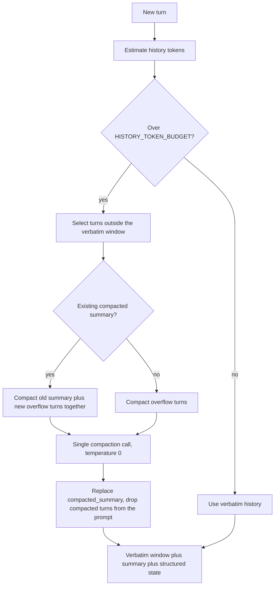

**MEM-01:** Compaction MUST NOT drop information already captured in `slots`. Slots are the durable memory; the summary carries narrative colour and rapport signals only. That is why a 30-turn conversation loses nothing structural.

**MEM-02:** Compaction runs at most once per turn and is skipped entirely for the first eight turns, which covers most consultations at zero extra cost.

**MEM-03:** At 90 percent of `SESSION_TOKEN_CEILING` the manager sets a `wrap_up` flag. The task prompt layer then steers Nova toward summary and contact capture instead of further discovery (NFR-40).
## 7.4 Session lifecycle

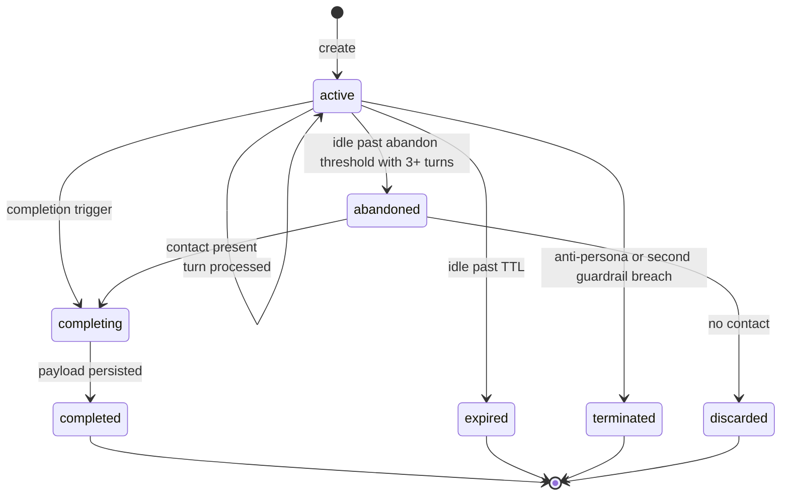

| Transition | Mechanism |
| ---| --- |
| Expiry | Lazy, checked on read in `SessionContext`. A sweeper exists only for storage reclamation and runs hourly |
| Abandonment | Periodic task every 5 minutes. Only sessions with 3 or more turns and captured contact proceed to completion (PRD 8.4) |
| Termination | Immediate, set by the guardrail stage |
| Purge | Sessions older than 90 days deleted by a scheduled job (NFR-22) |

## 7.5 Question selection
Implements PRD 12.6 exactly. Pure function, no I/O. Inputs: slot map, current phase, `questions_asked`.

| Step | Action |
| ---| --- |
| 1 | Build the eligible set: unfilled, not declined, non-zero phase multiplier for the current phase |
| 2 | Score each as `scoring_weight * phase_multiplier * recency_penalty`, where `recency_penalty` is 0.5 if the slot's topic was raised in the previous turn and 1.0 otherwise |
| 3 | Return the highest scorer. Ties break by the slot order declared in the vocabulary file, so ties are deterministic rather than dict-order dependent |
| 4 | If the eligible set is empty, return a deepening question targeting the highest-confidence pain point |

**QS-01:** The question text comes from the slot's template in the vocabulary file and goes into the L5 task layer. The model rephrases for flow but MUST NOT substitute a different question (PRD 13.3 rule 3).

**QS-02:** The selected slot is appended to `questions_asked` before generation, so a failed turn cannot cause the same question to be selected twice.
## 7.6 Completion detection
Three independent triggers (FR-47), evaluated after every turn.

| Trigger | Condition | Reason code |
| ---| ---| --- |
| Explicit | Intent is `end_conversation`, or the client calls the completion endpoint | `visitor_requested` |
| Criteria | Phase is capture-and-close AND contact captured with consent AND timeline filled or declined AND budget filled or declined | `criteria_met` |
| Abandonment | Idle past threshold with 3 or more turns and contact present | `abandoned` |

**COMP-01:** Completion is evaluated only after the analysis snapshot is emitted, so the panel always shows final state before the summary streams.

**COMP-02:** A session completes exactly once. The completion path acquires the session lock and checks that `consultation_id` is null before proceeding (PRD 22.2 invariant).

* * *
# 8\. AI Service Layer
**Module:** `app.infrastructure.providers` plus the domain services that consume it.
## 8.1 Responsibilities
Provide a narrow, provider-agnostic surface for four call shapes and nothing else. Prompt content, retry policy, and business meaning live above this layer.

| Call shape | Used by | Streaming | Structured |
| ---| ---| ---| --- |
| `complete_stream` | Response generation | Yes | No |
| `complete` | Summary, rationale, compaction | No | No |
| `complete_structured` | Intent classification, slot extraction | No | Yes |
| `embed` | Retrieval query, indexing | No | n/a |

## 8.2 Provider abstraction

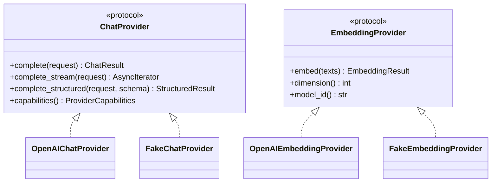

Domain-owned types crossing this boundary: `ChatRequest`, `ChatResult`, `ChatDelta`, `StructuredResult`, `EmbeddingResult`, `TokenUsage`, `ProviderCapabilities`. None are SDK types. An OpenAI response object MUST NOT escape `app/infrastructure/providers/` (BP-03, NFR-25).

`ProviderCapabilities` carries `supports_streaming`, `supports_native_schema`, `supports_json_mode`, `max_context_tokens`, `embedding_dimension`. The AI service branches on capabilities, never on provider name.
## 8.3 Model configuration per call site

| Call site | Model | Temperature | Max output | Timeout | Notes |
| ---| ---| ---| ---| ---| --- |
| Response generation | `LLM_CHAT_MODEL` | 0.3 | 700 | 30 s | Streaming |
| Intent classification | `LLM_CHAT_MODEL` | 0.0 | 60 | 8 s | Structured, tiny schema |
| Slot extraction | `LLM_CHAT_MODEL` | 0.0 | 500 | 12 s | Structured |
| Rationale writing | `LLM_CHAT_MODEL` | 0.2 | 250 | 10 s | One call for all recommendations |
| Executive summary | `LLM_CHAT_MODEL` | 0.3 | 400 | 20 s | Buffered, then streamed to the client |
| History compaction | `LLM_CHAT_MODEL` | 0.0 | 300 | 12 s | At most once per turn |
| Embedding | `LLM_EMBEDDING_MODEL` | n/a | n/a | 10 s | Batched during indexing |

**AI-01:** Rationale writing is a single call producing all rationales in one structured response. One call per recommendation would triple latency for no quality gain.
## 8.4 Prompt execution flow

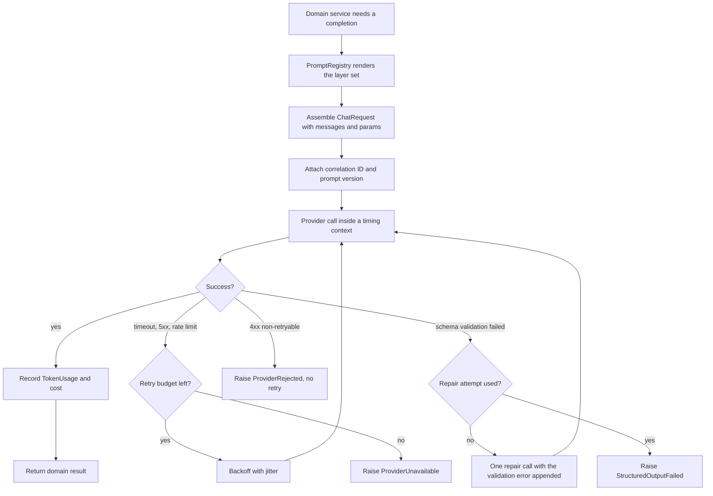

## 8.5 Structured output strategy

| Mode | When used | Behaviour |
| ---| ---| --- |
| Native schema | `supports_native_schema` true and `LLM_STRUCTURED_MODE` is `schema` | Schema passed to the provider, response parsed into the Pydantic model |
| JSON mode plus validation | Native unsupported or configured off | JSON object mode, parsed, validated, one repair retry on failure (PRD 13.6) |

**SO-01:** Every structured call validates into a Pydantic v2 model. A raw dict never reaches domain logic (BP-05).

**SO-02:** Post-validation business rules run in code, not in the prompt: vocabulary rejection, confidence thresholds, list dedupe, decline handling (PRD 13.4). The model proposes, the code disposes.

**SO-03:** Extraction schemas keep every field optional. A model forced to fill a field it has no evidence for will invent one, which is the most common cause of extraction defects (R-03).
## 8.6 Retry strategy

| Failure | Retries | Backoff | Then |
| ---| ---| ---| --- |
| Connection error | 1 | 500 ms plus jitter | `ProviderUnavailable` |
| Timeout | 1 | Immediate, same timeout | `ProviderUnavailable` |
| 429 rate limited | 1 | Honour `Retry-After`, cap 3 s | `ProviderUnavailable` |
| 500, 502, 503, 504 | 1 | 1 s plus jitter | `ProviderUnavailable` |
| 400, 401, 403, 404 | 0 | n/a | `ProviderRejected`, log loudly, alert |
| Schema validation failure | 1 repair call | none | `StructuredOutputFailed` |

**RT-01:** Total retry budget per turn is capped at 2 extra calls across all stages. Beyond that the turn degrades. Retrying everything twice turns a 6 s target into an 18 s failure.

**RT-02:** Streaming calls are never retried after the first token is emitted. The partial response is preserved and the turn ends with an `error` event.
## 8.7 Fallback strategy
Every stage has a defined degradation, and no stage failure ends the session (FR-10, NFR-09).

| Stage | Fallback | Visitor impact | Logged as |
| ---| ---| ---| --- |
| Intent classification | Default to `describe_problem` | Retrieval may be skipped when needed | `stage_degraded` warning |
| Slot extraction | Empty delta, prior slots kept | Score does not advance this turn | `stage_degraded` warning |
| Embedding | Skip retrieval, enable deferral mode | Nova defers on factual questions | `retrieval_degraded` warning |
| Vector search | Same as above (NFR-10) | Same | `retrieval_degraded` warning |
| Rationale writing | Templated rationale from the pain mapping | Slightly flatter wording | `rationale_fallback` info |
| Response generation | Pre-authored apology from `system_messages.yaml`, state preserved, retryable `error` event | Recoverable error state | `turn_failed` error |
| Summary generation | Templated summary from slots, score, recommendations | Less polished, all facts intact | `summary_fallback` warning |
| History compaction | Truncate oldest turns instead of summarising | Minor context loss, slots unaffected | `compaction_fallback` warning |

**FB-01:** A fallback MUST never fabricate a factual claim. The summary fallback is templated from captured data only.

**FB-02:** Degradations are counted per session. Three or more in one session raises the log line to error severity, because that usually signals a provider incident rather than a blip.

* * *
# 9\. RAG Layer
**Module:** `app.domain.rag` plus `app.infrastructure.vectorstore`.
## 9.1 Ingestion pipeline
Run by `scripts/index_knowledge.py`, offline or via the admin endpoint. Never during a request.

```mermaid
flowchart LR
    A[Walk the knowledge tree] --> B[Parse YAML front matter and markdown body]
    B --> C[Validate front matter against KnowledgeDoc]
    C -->|invalid| Z[Fail the job, name the file]
    C --> D[Compute content hash per document]
    D --> E{Hash changed?}
    E -->|no| F[Skip, reuse existing chunks]
    E -->|yes| G[Semantic chunking on heading boundaries]
    G --> H[Enforce 500 to 800 token target, 15 percent overlap]
    H --> I[Prepend heading breadcrumb to every chunk]
    I --> J[Attach metadata from front matter plus derived fields]
    J --> K[Batch embed, 64 chunks per request]
    K --> L[Upsert into a temporary collection]
    F --> L
    L --> M[Smoke query verification]
    M -->|pass| N[Atomic swap to the live collection]
    M -->|fail| O[Abort, live collection untouched]
    N --> P[Write index manifest]
```

**ING-01:** Chunking splits on heading boundaries first, then paragraph boundaries. A markdown table or a case study result block is never split (FR-12).

**ING-02:** Every chunk is prefixed with its heading breadcrumb, for example `Case Studies > Northline Logistics > Outcome`. Costs about 15 tokens and measurably improves both retrieval and attribution.

**ING-03:** Indexing is content-hash aware (FR-21). A second run over an unchanged corpus MUST issue zero embedding calls, and the job asserts this in its output.
## 9.2 Chunk metadata
Every chunk carries all of these (FR-13). Missing metadata fails the job.

| Field | Source | Used for |
| ---| ---| --- |
| `chunk_id` | Generated as doc id plus index | Citation, grounding log |
| `doc_id` | Front matter | Provenance |
| `doc_title` | Front matter | Display and reranking |
| `section` | Heading breadcrumb | Context |
| `doc_type` | Front matter enum | Metadata filtering |
| `service_codes` | Front matter list | Filtering, evidence boost |
| `industry_tags` | Front matter list | Filtering, industry boost |
| `is_public_reference` | Front matter bool | Whether a client may be named (PRD 11.2) |
| `is_indicative_pricing` | Front matter bool | Forces the indicative caveat (RC-05) |
| `last_reviewed` | Front matter date | Staleness monitoring (R-13) |
| `content_hash` | Computed | Incremental indexing |
| `token_count` | Computed | Context budget maths |

## 9.3 Retrieval decision
Retrieval is conditional, not automatic (AD-07, FR-15).

| Intent | Retrieve | Metadata filter |
| ---| ---| --- |
| `company_question` | Yes | doc\_type in company, case\_study, process |
| `capability_question` | Yes | service\_codes matching current candidates |
| `pricing_question` | Yes | doc\_type is pricing |
| `timeline_question` | Yes | doc\_type in process, case\_study |
| `objection` | Yes | doc\_type in faq, case\_study |
| `describe_problem` | No | n/a |
| `answer_question` | No | n/a |
| `smalltalk`, `off_topic`, `anti_persona`, `request_human`, `end_conversation` | No | n/a |

Retrieval also runs once on entry to the recommendation phase to gather evidence for the boost term (PRD 15.3), regardless of intent.
## 9.4 Query construction
The raw message is a poor query for short follow-ups like "how long?" (PRD 13.5). Query text is the visitor message plus the top two pain point labels plus the industry label, joined with separators and truncated at 400 characters.

| Rule | Detail |
| ---| --- |
| QB-01 | Pain context is appended only when the message is under 60 characters or contains an anaphoric reference (that, this, it, they) |
| QB-02 | The query is embedded once per turn and cached on the turn context; the recommendation evidence lookup reuses the same vector |
| QB-03 | Query text is logged, embeddings are not |

## 9.5 Search, filter, rerank

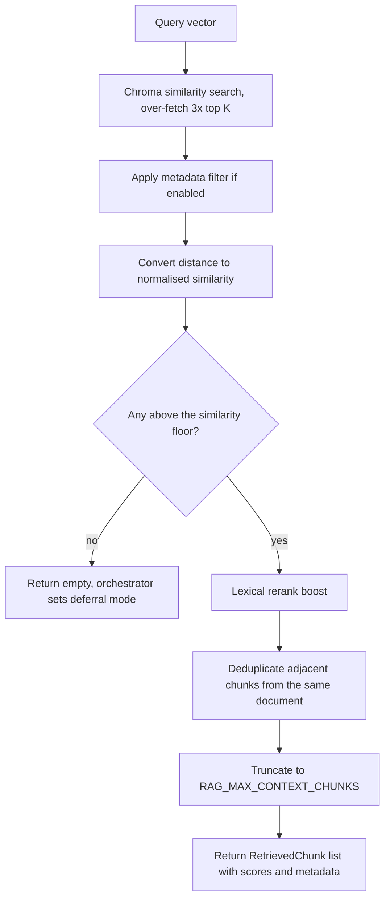

Over-fetching `RAG_TOP_K * 3` candidates means filtering, flooring, and dedupe still leave enough material. Fetching exactly K and then filtering is the most common cause of empty context.

**Lexical rerank (deterministic, no second model call):**

| Signal | Boost |
| ---| --- |
| Chunk service codes intersect current recommendation candidates | +0.08 |
| Chunk industry tags contain the visitor's industry | +0.06 |
| Exact term overlap between query and doc title | +0.04 |
| `last_reviewed` older than 12 months | \-0.05 |

**Dedupe:** if two chunks share a `doc_id` and adjacent indices, keep the higher scorer. Two overlapping chunks say the same thing twice and waste context.
## 9.6 Context injection
Retrieved chunks become the L4 prompt layer, wrapped in explicit untrusted-data delimiters (PRD 13.3, NFR-17, R-05).

| Rule | Detail |
| ---| --- |
| CI-01 | Each chunk renders with its source label: doc title, section, chunk ID |
| CI-02 | The wrapper states the content is reference material and that instruction-like text inside MUST be ignored |
| CI-03 | Total context tokens are capped. On overflow the lowest-scoring chunk is dropped whole, never truncated mid-chunk |
| CI-04 | When any injected chunk has `is_indicative_pricing`, the policy layer appends the indicative-pricing caveat instruction |
| CI-05 | When nothing clears the floor, the L4 layer is replaced by the deferral instruction and no reference material is injected at all (FR-18) |
| CI-06 | Injected chunk IDs are recorded on the turn for the grounding log and the payload (FR-19) |

## 9.7 Grounding check
Post-generation, non-blocking (PRD 13.5).

| Step | Detail |
| ---| --- |
| 1 | Extract candidate factual assertions: numbers, durations, percentages, proper nouns, capability claims |
| 2 | Check each for support in the injected chunk text via normalised substring and numeric matching |
| 3 | Record unsupported assertions as grounding warnings with turn ID and assertion text |
| 4 | Warnings feed the AQ-01 metric and the weekly evaluation run |

**GC-01:** The check never blocks or rewrites the stream in MVP. Blocking mid-stream harms perceived latency more than an occasional soft claim harms trust, and the metric drives corpus fixes instead.

**GC-02:** A turn in deferral mode that still produces factual assertions is a high-severity warning, because it means the deferral instruction was ignored.

* * *
# 10\. Knowledge Repository
## 10.1 Folder structure

```plain
knowledge/
├── manifest.yaml
├── services/
│   ├── ai-automation.md
│   ├── web-development.md
│   ├── data-engineering.md
│   ├── systems-integration.md
│   ├── cloud-devops.md
│   └── technology-strategy.md
├── case_studies/
│   ├── logistics-order-automation.md
│   ├── fintech-platform-build.md
│   └── retail-reporting-pipeline.md
├── process/
│   ├── discovery-methodology.md
│   ├── delivery-model.md
│   └── quality-and-handover.md
├── pricing/
│   └── indicative-bands.md
├── technology/
│   ├── stack-and-platforms.md
│   └── integration-experience.md
├── company/
│   ├── about-trizen.md
│   └── team-and-locations.md
└── faq/
    ├── general.md
    ├── engagement.md
    └── objections.md
```

Folders map one-to-one to `doc_type`, which makes metadata filtering trivial and reviewable.
## 10.2 Markdown strategy
Every document is markdown with YAML front matter, validated at ingestion against a Pydantic model. An invalid file fails the job with its path.

```yaml
---
doc_id: cs-logistics-order-automation
doc_title: Northline Logistics order automation
doc_type: case_study
service_codes: [SVC-AIA, SVC-INT]
industry_tags: [logistics]
is_public_reference: false
is_indicative_pricing: false
last_reviewed: 2026-06-14
owner: sales-enablement
summary: Automated order intake and invoice matching for a 180-person logistics operator.
---
```

### Authoring rules

| ID | Rule | Why |
| ---| ---| --- |
| KB-01 | One topic per document. If it needs two doc types, split it | Keeps filtering meaningful |
| KB-02 | Use second and third level headings every 300 to 500 words | Chunking splits on headings, so headings control chunk quality directly |
| KB-03 | Lead each section with the answer, then the detail | The first sentence of a chunk carries the most retrieval weight |
| KB-04 | State outcomes with numbers where they exist | Quantified claims are what convince the buyer personas |
| KB-05 | Never name a client unless `is_public_reference` is true | Commercial and legal risk (R-01) |
| KB-06 | All pricing is a band, always labelled indicative | RC-05 |
| KB-07 | No forward-looking delivery commitments | RC-06 |
| KB-08 | Write answers, not marketing. If a sentence carries no information, delete it | Marketing prose retrieves badly and reads worse |
| KB-09 | Put the objection and the honest answer in FAQ docs | Deferral is cheaper than invention |
| KB-10 | Keep documents under 2000 words. Split rather than sprawl | Bounds chunk count per document |

## 10.3 Metadata governance

| Field | Governance |
| ---| --- |
| `doc_type` | Fixed enum. Adding a value requires a code change to the filter map, so it is a deliberate act |
| `service_codes` | MUST exist in `services.yaml`, validated at ingestion |
| `industry_tags` | MUST exist in `industry.yaml`, validated at ingestion |
| `last_reviewed` | Drives the staleness report. A document past its cadence appears in the weekly report (R-13) |
| `owner` | Named team accountable for accuracy |

Review cadences follow PRD 11.3: services quarterly, case studies quarterly, process twice yearly, pricing quarterly, technology twice yearly, company yearly, FAQ monthly.
## 10.4 Versioning

| Aspect | Approach |
| ---| --- |
| Source of truth | Git. Every change is a reviewed pull request (PRD 23.6) |
| Document version | Content hash computed at ingestion |
| Index version | `index_manifest` recording build timestamp, embedding model, dimension, chunk count, per-document hashes, and the corpus commit SHA |
| Runtime attribution | `index_manifest_version` logged on every turn and stored on every payload, so any answer traces to an exact corpus state |
| Rollback | Revert the knowledge commit and re-index. Hash-aware indexing means a revert only re-embeds what changed |
| Compatibility | Changing `LLM_EMBEDDING_MODEL` invalidates the index. Startup asserts the dimension and refuses to run against a mismatched index (step S6) |

* * *
# 11\. Lead Qualification Engine
**Module:** `app.domain.qualification`. Pure, synchronous, zero I/O, 100 percent branch coverage required.
## 11.1 Scoring strategy
Implements PRD Section 14 exactly. A pure function of state plus loaded weights: sum the components, clamp to 0 to 100, apply overrides, assign a band.

| Component | Max | Module | Input |
| ---| ---| ---| --- |
| Need clarity | 25 | `components.need_clarity` | Pain point count, specificity flag, quantified flag |
| Fit | 20 | `components.fit` | Recommendation confidence, industry case coverage |
| Urgency | 15 | `components.urgency` | `timeline` slot |
| Budget | 15 | `components.budget` | `budget_band` slot |
| Authority | 10 | `components.authority` | `decision_role` slot |
| Engagement | 15 | `components.engagement` | Turn count, question flags, contact volunteered |

**LQ-01:** Every component function takes explicit primitives, not the whole state object. This keeps them table-testable and prevents coupling to unrelated state.

**LQ-02:** Weights and thresholds come from `weights.yaml`, loaded frozen at startup (FR-36). No number in the scoring path is a literal in code.

**LQ-03:** The engine is idempotent and order-independent. Running it twice on the same state yields the same result, and it never reads or writes anything outside its inputs (BP-02).
## 11.2 Specificity and quantification detection
Need clarity depends on judging whether a pain point is vague, specific, or quantified. This is deterministic, not model-driven.

| Classification | Rule |
| ---| --- |
| Vague | Under 5 tokens, or matches a generic phrase list such as "need automation" or "improve efficiency" |
| Specific | Names a process, system, or team, or contains a domain noun from the pain mapping vocabulary |
| Quantified | Contains a number paired with a unit of time, money, headcount, or volume |

The extractor supplies a `quantified` hint; the engine recomputes deterministically and the code result wins. The hint only breaks ties on ambiguous phrasing.
## 11.3 Business rules and overrides
Implements PRD 14.4. Applied after summation, in declared order, absolute.

| ID | Condition | Effect |
| ---| ---| --- |
| OV-01 | Anti-persona detected | Band forced to `not_a_lead`, dispatch suppressed |
| OV-02 | Explicit human request | Band floor `qualified`, Telegram flag forced true |
| OV-03 | No contact captured | Band ceiling `warm` |
| OV-04 | Budget under 5k and timeline exploring | Band ceiling `warm` |
| OV-05 | Fewer than 2 visitor turns | Band forced `cold` |
| OV-06 | Size 1000+ and role decision maker | Band floor `qualified` |
| OV-07 | Abandoned with 3 or more turns and contact | Flag `abandoned`, band computed normally, marked partial |

**OV-A:** Every applied override is appended to `applied_overrides` with its ID and reason, and surfaced in the payload and the sales briefing. An unexplained band change destroys sales trust faster than a wrong band.

**OV-B:** Floors and ceilings compose. When both apply, the ceiling wins, because suppressing a false positive costs less than the alternative.
## 11.4 Confidence score
Distinct from the lead score. It expresses how much evidence the score rests on, and it stops the panel showing a confident 45 built from two guesses.

`qualification_confidence = weighted_mean(slot confidences of filled scoring slots) * slot_coverage_factor`, where `slot_coverage_factor` is filled scoring slots divided by total scoring slots, floored at 0.4.

| Confidence | Interpretation | Effect |
| ---| ---| --- |
| Below 0.5 | Thin evidence | Score shown, sales briefing flags low confidence |
| 0.5 to 0.75 | Reasonable | Normal handling |
| Above 0.75 | Strong | Band trusted for same-day routing |

**LQ-04:** Confidence never modifies the score. Two numbers that each move the other are impossible to debug.
## 11.5 Qualification output

```mermaid
flowchart LR
    A[Session state] --> B[Six component functions]
    B --> C[Sum and clamp 0 to 100]
    C --> D[Apply overrides in order]
    D --> E[Assign band by thresholds]
    E --> F[Compute qualification confidence]
    F --> G[Identify the largest missing contributor]
    G --> H[Generate justification from the breakdown only]
    H --> I[QualificationResult]
```

**LQ-05:** The justification is written by the model from the numeric breakdown only. The model receives components and values, never the transcript, so it can describe the score but never alter or contradict it (PRD 14.5).

**LQ-06:** `next_score_contributor` is the unfilled component with the highest remaining headroom, rendered as visitor-safe copy from a lookup table, never generated. This is what the panel displays under the gauge (PRD 16.3.2).

* * *
# 12\. Recommendation Engine
**Module:** `app.domain.recommendation`. Candidate building and ranking are pure; only rationale writing touches a provider.
## 12.1 Pipeline
Implements PRD Section 15.

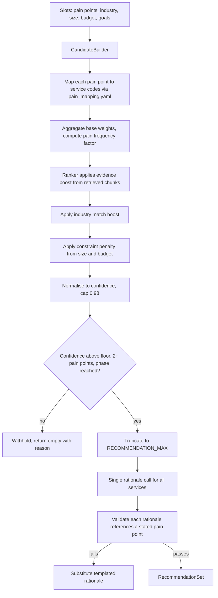

## 12.2 Business mapping
`pain_mapping.yaml` is the data behind PRD 15.2. Each entry declares match signals, a primary service, a secondary service, and a base weight.

| Field | Purpose |
| ---| --- |
| `signal_id` | Stable identifier for the pain pattern |
| `match_terms` | Normalised terms and phrases indicating this pain |
| `primary_service` | Service code |
| `secondary_service` | Service code or null |
| `base_weight` | 0.7 to 1.0 |
| `size_constraints` | Business sizes for which this mapping is penalised |
| `budget_constraints` | Budget bands for which this mapping is penalised |

**RE-01:** Matching runs on the normalised pain point label using term matching plus the extractor's service code hint. When they disagree, the mapping file wins. Data beats model output for anything commercially binding (FR-41).

**RE-02:** A service code absent from `services.yaml` is dropped with a warning. The engine can never emit a service Trizen does not sell.
## 12.3 Ranking formula
`candidate_score = base_weight * pain_frequency_factor + evidence_boost + industry_match_boost - constraint_penalty`

| Term | Range | Computation |
| ---| ---| --- |
| `pain_frequency_factor` | 1.0 to 1.5 | 1.0 plus 0.25 per additional distinct matching pain point, capped |
| `evidence_boost` | 0 to 0.3 | 0.1 per retrieved chunk above floor whose service codes include this service, capped |
| `industry_match_boost` | 0 to 0.2 | 0.2 when a case study chunk matches both service and industry, 0.1 when industry matches any chunk |
| `constraint_penalty` | 0 to 0.5 | 0.25 per violated size or budget constraint |

`confidence = min(candidate_score / 1.8, 0.98)`

**RE-03:** Confidence never reports 1.0. A recommendation engine that claims certainty is lying, and the panel would display it as such.
## 12.4 Withholding and revision

| Rule | Detail |
| ---| --- |
| RE-04 | Withhold when fewer than 2 pain points, top confidence below the floor, or phase earlier than recommendation (FR-43) |
| RE-05 | Recomputed every turn, then compared to the previously presented set |
| RE-06 | If the set changed after presentation, a `recommendations_changed` flag is set and the task prompt layer instructs Nova to acknowledge the change explicitly (PRD 15.6) |
| RE-07 | Silent panel swaps are forbidden. The panel and the conversation must agree |

## 12.5 Rationale generation
One structured call producing an array of rationales, one per recommended service.

Model input: service name and description from the catalogue, the visitor's stated pain point labels, the industry, and supporting chunk titles. Not the full transcript, which invites editorialising beyond the evidence.

| Post-validation check | Failure action |
| ---| --- |
| References at least one stated pain point label (FR-39) | Substitute templated rationale |
| Contains no price figure | Strip the sentence, log a grounding warning |
| Contains no delivery date commitment | Strip the sentence, log a grounding warning |
| 1 to 2 sentences, under 45 words | Truncate at the sentence boundary |
| Names no client unless a supporting chunk is a public reference | Substitute templated rationale, log high severity |

**RE-08:** The templated fallback is always available and always safe: it states the pain point, the service, and the category of outcome, with no proof claim.
## 12.6 Output contract
The engine returns a `RecommendationSet` carrying ranked items, the withholding reason when empty, the evidence chunk IDs used, and the `recommendations_changed` flag. Full JSON shape in Section 14.4.

# 4. Contracts and Models (Sections 13 to 15)

# 13\. Prompt Management
## 13.1 Folder structure

```plain
app/resources/prompts/
├── manifest.yaml
├── identity/
│   └── nova.v1.md
├── policy/
│   ├── conversation.v1.md
│   ├── grounding.v1.md
│   ├── deferral.v1.md
│   └── safety.v1.md
├── state/
│   └── session_state.v1.md.j2
├── context/
│   └── retrieved_chunks.v1.md.j2
└── task/
    ├── respond.v1.md.j2
    ├── classify_intent.v1.md
    ├── extract_slots.v1.md
    ├── write_rationale.v1.md.j2
    ├── executive_summary.v1.md.j2
    ├── score_justification.v1.md.j2
    └── compact_history.v1.md
```

Folders map to the five prompt layers in PRD 13.3. Static layers are plain markdown; layers with runtime substitution are Jinja templates.
## 13.2 The manifest
`manifest.yaml` pins which version of each layer is active. Nothing loads a template by guessing a filename.

```yaml
manifest_version: pm_1.3.0
layers:
  identity: identity/nova.v1.md
  policy:
    - policy/conversation.v1.md
    - policy/grounding.v1.md
    - policy/deferral.v1.md
    - policy/safety.v1.md
  state: state/session_state.v1.md.j2
  context: context/retrieved_chunks.v1.md.j2
tasks:
  respond: task/respond.v1.md.j2
  classify_intent: task/classify_intent.v1.md
  extract_slots: task/extract_slots.v1.md
  write_rationale: task/write_rationale.v1.md.j2
  executive_summary: task/executive_summary.v1.md.j2
  score_justification: task/score_justification.v1.md.j2
  compact_history: task/compact_history.v1.md
```

## 13.3 Layer composition

| Layer | File type | Volatility | Included in |
| ---| ---| ---| --- |
| L1 Identity | Static markdown | Rarely changes | Response, summary |
| L2 Policy | Static markdown, concatenated | Occasionally tuned | Response, summary |
| L3 State | Jinja | Every turn | Response, rationale, summary |
| L4 Context | Jinja | Retrieval turns only | Response |
| L5 Task | Jinja or static | Every call | All calls |

Structured calls (intent, extraction, compaction) deliberately omit L1, L2, and L4. Loading the full persona into an extraction call wastes about 800 tokens per turn and measurably degrades extraction precision by giving the model conversational goals it should not have.

| Call | Layers included |
| ---| --- |
| Response generation | L1, L2, L3, L4, L5 |
| Intent classification | L5 only |
| Slot extraction | L5 only, with the vocabulary appended |
| Rationale writing | L3 (trimmed to slots), L5 |
| Executive summary | L1, L2, L3, L5 |
| Score justification | L5 only, with the numeric breakdown |
| History compaction | L5 only |

## 13.4 Rendering rules

| ID | Rule |
| ---| --- |
| PM-01 | Templates are compiled once at startup and cached. No disk read per request |
| PM-02 | Jinja autoescape is off (this is text, not HTML) but every substituted value is passed through a sanitiser that strips control characters and collapses delimiter sequences |
| PM-03 | Retrieved chunk text is inserted only inside the L4 delimiter block, never anywhere else in the prompt (R-05) |
| PM-04 | The L3 state layer MUST list `questions_asked` so the model cannot repeat a question (PRD 13.3 rule 2) |
| PM-05 | The L5 task layer MUST name exactly one question, chosen by `QuestionSelector` (PRD 13.3 rule 3) |
| PM-06 | Rendering is deterministic: identical inputs produce a byte-identical prompt. This is asserted by a golden-file test |
| PM-07 | Assembled prompt token count is measured and logged. Exceeding the budget trims L4 first, then compacts L3, never L1 or L2 |

## 13.5 Prompt lifecycle

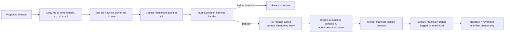

**PM-08:** Prompt files are append-only. `nova.v1.md` is never edited once merged; a change creates `nova.v2.md`. This makes rollback a one-line manifest revert instead of a git archaeology exercise, and it makes A/B comparison possible later.

**PM-09:** Every prompt change requires an entry in `docs/prompt_changelog.md` stating what changed, why, and the evaluation delta. A prompt change with no measured effect is a change with no justification.
## 13.6 Versioning and attribution

| Field | Where it appears |
| ---| --- |
| `manifest_version` | Startup log, every turn log, every consultation payload |
| Per-layer file version | Resolved at startup, logged in the startup manifest |
| Prompt token count per call | Turn telemetry |

When a behaviour regression is reported, the first question is always "which prompt manifest was live?" and this makes it answerable in one log query (BP-07).

* * *
# 14\. JSON Contracts
Seven contracts. Each is a Pydantic v2 model in `app/schemas/`, exported to JSON Schema by `scripts/export_schemas.py`, and snapshot-tested in CI.
## 14.1 Conversation Response
**Model:** `ConversationTurnResult` in `schemas/conversation.py`. Produced by the orchestrator per turn. Serialised to the SSE stream as separate events; this is the assembled object stored server side.

```json
{
  "schema_version": "1.0",
  "session_id": "01J9XK7T2ZQ8V3N5B4C6D7E8F9",
  "turn_index": 3,
  "message": {
    "message_id": "01J9XK8B4C0000000000000007",
    "role": "assistant",
    "content": "Manual invoice matching across three systems is a real cost. Which part of that process eats the most time?",
    "created_at": "2026-07-28T02:15:06.442Z"
  },
  "phase": "exploration",
  "phases_executed": ["understanding", "retrieving", "evaluating", "generating"],
  "intent": {
    "value": "company_question",
    "confidence": 0.91
  },
  "question_asked": {
    "slot": "pain_points",
    "template_id": "pain_points.deepen"
  },
  "grounding": {
    "retrieval_performed": true,
    "deferral_mode": false,
    "chunk_ids": ["cs-logistics-order-automation#2", "svc-ai-automation#1"],
    "warnings": []
  },
  "degradations": [],
  "telemetry": {
    "total_ms": 4180,
    "stage_ms": {
      "guardrails": 12,
      "intent": 640,
      "extraction": 1290,
      "retrieval": 244,
      "scoring": 3,
      "recommendation": 8,
      "generation": 1930,
      "snapshot": 14
    },
    "input_tokens": 2140,
    "output_tokens": 88,
    "estimated_cost_usd": 0.00062
  },
  "provenance": {
    "prompt_manifest_version": "pm_1.3.0",
    "ruleset_version": "rs_9c31e0",
    "index_manifest_version": "idx_2026-07-27_4f2a",
    "chat_model": "gpt-4.1-mini"
  }
}
```

| Field | Type | Required | Notes |
| ---| ---| ---| --- |
| `schema_version` | string | Yes | Semantic version of this contract |
| `phases_executed` | array of enum | Yes | Exactly the phases emitted to the client (LX-05) |
| `intent.confidence` | float 0 to 1 | Yes | Below 0.5 forces the default intent |
| `question_asked` | object or null | Yes | Null when no discovery question was asked |
| `grounding.warnings` | array | Yes | Empty array, never null |
| `degradations` | array of enum | Yes | Fallbacks triggered this turn (8.7) |
| `telemetry` | object | Yes | Never exposed on the public API (SES-01) |
| `provenance` | object | Yes | Never exposed on the public API |

## 14.2 Lead Analysis
**Model:** `AnalysisSnapshot` in `schemas/analysis.py`. This is the panel contract (PRD Section 16). Full state replacement, never a patch (AD-05).

```json
{
  "schema_version": "1.0",
  "v": 1,
  "turn_index": 7,
  "lead_status": "qualified",
  "lead_score": 74,
  "lead_score_delta": 14,
  "next_score_contributor": "Budget not yet discussed",
  "industry": {
    "value": "logistics",
    "label": "Logistics",
    "raw": "we run a logistics company",
    "confidence": 0.94
  },
  "business_size": {
    "value": "51-200",
    "label": "51 to 200 employees",
    "raw": "about 180 staff",
    "confidence": 0.88
  },
  "pain_points": [
    {
      "id": "pp_02",
      "label": "Invoice matching consumes two people three days a week",
      "service_codes": ["SVC-AIA"],
      "specificity": "quantified",
      "turn_index": 5
    },
    {
      "id": "pp_01",
      "label": "Manual order processing across email and spreadsheets",
      "service_codes": ["SVC-AIA", "SVC-INT"],
      "specificity": "specific",
      "turn_index": 1
    }
  ],
  "recommended_services": [
    {
      "service_code": "SVC-AIA",
      "name": "AI Automation and Agents",
      "rank": 1,
      "confidence": 0.87,
      "confidence_label": "high",
      "rationale": "Your invoice matching and order intake are both rule-driven, repetitive processes, which is exactly what our automation work removes."
    },
    {
      "service_code": "SVC-INT",
      "name": "Systems Integration",
      "rank": 2,
      "confidence": 0.68,
      "confidence_label": "medium",
      "rationale": "Your ERP, email, and spreadsheets do not talk to each other, which is what forces the manual re-entry you described."
    }
  ],
  "conversation_progress": {
    "phase": "qualification",
    "stage_index": 3,
    "stage_total": 5,
    "slots_filled": 6,
    "slots_total": 9,
    "percent": 67
  },
  "qualification_status": {
    "business_context_understood": "met",
    "challenges_identified": "met",
    "solution_matched": "met",
    "timeline_established": "met",
    "budget_discussed": "unmet",
    "contact_captured": "unmet"
  }
}
```

| Field | Type | Notes |
| ---| ---| --- |
| `lead_status` | enum | `exploring`, `cold`, `warm`, `qualified`, `hot`. Visitor-safe labels only, never "hot lead" as display text (PRD 16.3.1) |
| `lead_score` | int or null | Null before turn 2 completes, rendered as "Gathering context" |
| `lead_score_delta` | int or null | Change since the previous snapshot |
| `next_score_contributor` | string or null | From a lookup table, never generated (LQ-06) |
| `industry`, `business_size` | object or null | Null when unfilled, so the panel renders its empty state |
| `pain_points[].specificity` | enum | `vague`, `specific`, `quantified` |
| `recommended_services` | array, max 3 | Empty until confidence clears the floor (FR-43) |
| `confidence_label` | enum | `high` at 0.8+, `medium` at 0.6 to 0.79. Below 0.6 the item is not emitted |
| `qualification_status.*` | enum | `unmet`, `met`, `declined` |

**Rule AS-01:** This contract MUST NOT contain chunk IDs, prompt versions, token counts, model names, or raw extraction output (PRD 16.5).
## 14.3 Lead Qualification
**Model:** `QualificationResult` in `schemas/qualification.py`. Internal and payload-facing, not panel-facing.

```json
{
  "schema_version": "1.0",
  "score": 74,
  "band": "qualified",
  "confidence": 0.79,
  "components": [
    { "name": "need_clarity", "awarded": 21, "max": 25, "basis": "two specific pain points, one quantified" },
    { "name": "fit", "awarded": 20, "max": 20, "basis": "clear mapping to SVC-AIA with logistics case coverage" },
    { "name": "urgency", "awarded": 9, "max": 15, "basis": "timeline 3-6_months" },
    { "name": "budget", "awarded": 12, "max": 15, "basis": "budget band 15k-50k" },
    { "name": "authority", "awarded": 7, "max": 10, "basis": "influencer, not final decision maker" },
    { "name": "engagement", "awarded": 5, "max": 15, "basis": "8 visitor turns, asked a company question" }
  ],
  "raw_score": 74,
  "applied_overrides": [],
  "next_contributor": {
    "component": "engagement",
    "headroom": 10,
    "display": "Conversation still developing"
  },
  "justification": "Qualified at 74. Two specific pain points in order processing and invoice matching, clear mapping to AI Automation with logistics case coverage, a 3 to 6 month timeline, and a 15k to 50k budget. Contact is an influencer rather than the final decision maker.",
  "disqualified": false,
  "partial": false,
  "ruleset_version": "rs_9c31e0"
}
```

| Field | Notes |
| ---| --- |
| `raw_score` | Score before overrides. When overrides fire, `score` and `raw_score` differ and both are kept for auditability |
| `applied_overrides` | Array of objects with `id`, `effect`, `reason`. Empty array, never null (OV-A) |
| `disqualified` | True only for `not_a_lead` (OV-01) |
| `partial` | True for abandoned consultations (OV-07) |
| `ruleset_version` | Which weight file produced this score |

**Rule QR-01:** Component `basis` strings are generated in code from the inputs, not by the model. The model only writes `justification`, which is prose over these facts (LQ-05).
## 14.4 Recommendations
**Model:** `RecommendationSet` in `schemas/recommendation.py`.

```json
{
  "schema_version": "1.0",
  "generated_at_turn": 7,
  "withheld": false,
  "withheld_reason": null,
  "changed_since_presented": false,
  "items": [
    {
      "service_code": "SVC-AIA",
      "name": "AI Automation and Agents",
      "rank": 1,
      "confidence": 0.87,
      "score_breakdown": {
        "base_weight": 1.0,
        "pain_frequency_factor": 1.25,
        "evidence_boost": 0.2,
        "industry_match_boost": 0.2,
        "constraint_penalty": 0.0,
        "candidate_score": 1.65
      },
      "matched_pain_point_ids": ["pp_01", "pp_02"],
      "evidence_chunk_ids": ["cs-logistics-order-automation#2"],
      "rationale": "Your invoice matching and order intake are both rule-driven, repetitive processes, which is exactly what our automation work removes.",
      "rationale_source": "model",
      "typical_engagement": "4 to 10 weeks, discovery plus build"
    }
  ]
}
```

| Field | Notes |
| ---| --- |
| `withheld_reason` | Enum: `insufficient_pain_points`, `below_confidence_floor`, `phase_too_early`. Null when not withheld |
| `changed_since_presented` | Drives the acknowledgement instruction (RE-06) |
| `score_breakdown` | Full ranking maths, retained for debugging and calibration |
| `rationale_source` | `model` or `template`, so fallback frequency is measurable |
| `typical_engagement` | From the catalogue, never generated. Shape only, never a date (RC-06) |

## 14.5 Conversation State
**Model:** `SessionState` in `domain/models/session.py`. The persisted server-side object. Never returned in full by the public API.

```json
{
  "schema_version": "1.0",
  "session_id": "01J9XK7T2ZQ8V3N5B4C6D7E8F9",
  "status": "active",
  "phase": "qualification",
  "created_at": "2026-07-28T02:14:09Z",
  "last_active_at": "2026-07-28T02:22:31Z",
  "expires_at": "2026-07-28T03:22:31Z",
  "turn_index": 7,
  "visitor_turn_count": 7,
  "attribution": {
    "locale": "en-US",
    "referrer": "https://trizen.example/services/ai-automation",
    "utm": { "source": "google", "medium": "cpc", "campaign": "ai-automation-q3" }
  },
  "messages": [
    {
      "message_id": "01J9XK7T3A0000000000000001",
      "role": "assistant",
      "content": "I'm Nova, AI Solutions Consultant at Trizen...",
      "turn_index": 0,
      "created_at": "2026-07-28T02:14:09Z"
    }
  ],
  "compacted_summary": null,
  "questions_asked": ["industry", "business_size", "current_tools", "pain_points", "timeline"],
  "slots": {
    "industry": {
      "normalised": "logistics",
      "raw": "we run a logistics company",
      "confidence": 0.94,
      "source_turn": 1,
      "declined": false
    },
    "budget_band": {
      "normalised": null,
      "raw": null,
      "confidence": 0.0,
      "source_turn": null,
      "declined": false
    },
    "pain_points": {
      "items": [
        { "id": "pp_01", "label": "Manual order processing across email and spreadsheets", "raw": "our order processing is all manual", "service_codes": ["SVC-AIA", "SVC-INT"], "specificity": "specific", "confidence": 0.9, "source_turn": 1 }
      ],
      "declined": false
    }
  },
  "conflicts": [],
  "engagement": {
    "asked_company_question": true,
    "responded_to_recommendation": true,
    "volunteered_contact": false
  },
  "qualification": { "note": "QualificationResult object" },
  "recommendations": { "note": "RecommendationSet object" },
  "recommendations_presented_at_turn": 6,
  "retrieval_log": [
    { "turn_index": 4, "chunk_ids": ["cs-logistics-order-automation#2"], "deferral": false }
  ],
  "deferral_count": 0,
  "consent": { "granted": false, "granted_at": null },
  "contact": null,
  "completion": { "consultation_id": null, "reason": null, "completed_at": null },
  "accounting": { "input_tokens": 14820, "output_tokens": 612, "estimated_cost_usd": 0.0041 },
  "provenance": {
    "prompt_manifest_version": "pm_1.3.0",
    "ruleset_version": "rs_9c31e0",
    "index_manifest_version": "idx_2026-07-27_4f2a"
  }
}
```

| Rule | Detail |
| ---| --- |
| CS-01 | Scalar slots and list slots have different shapes. Scalar slots carry `normalised`, `raw`, `confidence`, `source_turn`, `declined`. List slots carry `items[]` plus `declined` |
| CS-02 | An unfilled slot is present with nulls, never absent. Absence would make "never asked" indistinguishable from "asked and empty" |
| CS-03 | `declined` is terminal. Once true, the slot is excluded from question selection permanently (FR-29) |
| CS-04 | `conflicts[]` records contradictions with both values and the turn indices (FR-28) |
| CS-05 | This object is versioned. A schema change requires a migration function in the repository, because live sessions exist across deploys |

## 14.6 Consultation Summary
**Model:** `ConsultationSummary` in `schemas/summary.py`.

```json
{
  "schema_version": "1.0",
  "executive_summary": "Northline Logistics is a 180-person logistics operator processing orders manually across email, spreadsheets, and a legacy ERP that the team does not trust. Two processes are causing measurable cost: order intake, which is entirely manual, and invoice matching, which consumes two people for three days a week. They want a solution live before Q4 with a budget in the 15k to 50k range. Recommended: AI Automation and Agents as the primary engagement to remove the repetitive processing, with Systems Integration as a supporting workstream to connect the ERP to the order and invoicing flow. The contact is an operations lead who influences but does not own the final decision, so a technical and commercial stakeholder should both be on the follow-up call.",
  "word_count": 187,
  "structure": {
    "situation": "180-person logistics operator, manual order and invoice processing across disconnected systems",
    "needs": ["Remove manual order intake", "Automate invoice matching", "Connect ERP to order flow"],
    "recommended_services": ["SVC-AIA", "SVC-INT"],
    "qualification": "Qualified, 74, 3 to 6 month timeline, 15k to 50k budget",
    "next_step": "Consultant follow-up within one working day, include a technical stakeholder"
  },
  "source": "model",
  "generated_at": "2026-07-28T02:24:11Z"
}
```

| Field | Notes |
| ---| --- |
| `word_count` | Validated 120 to 250 (FR-44). Outside the range triggers one regeneration, then the templated fallback |
| `structure` | Machine-readable decomposition used by the email template so n8n does not parse prose |
| `source` | `model` or `template`, so fallback frequency is measurable |

**Rule SM-01:** The summary is generated from state, not from the raw transcript. Feeding the transcript invites the model to reintroduce claims that were never captured as slots.
## 14.7 Automation Payload
**Model:** `AutomationPayload` in `schemas/automation.py`. The contract with n8n, and the highest-blast-radius schema in the system (FR-46, BP-10).

```json
{
  "schema_version": "1.0",
  "consultation_id": "01J9XKB2M7QF0R1S2T3U4V5W6X",
  "session_id": "01J9XK7T2ZQ8V3N5B4C6D7E8F9",
  "generated_at": "2026-07-28T02:24:12Z",
  "completion_reason": "criteria_met",
  "partial": false,
  "contact": {
    "name": "Chidi Okafor",
    "email": "chidi@example.com",
    "company": "Northline Logistics",
    "phone": null,
    "consent": true,
    "consent_granted_at": "2026-07-28T02:23:40Z"
  },
  "business": {
    "industry": "logistics",
    "industry_label": "Logistics",
    "business_size": "51-200",
    "current_tools": ["email", "excel", "legacy ERP"],
    "goals": ["Reduce manual processing cost before Q4"],
    "pain_points": [
      { "id": "pp_01", "label": "Manual order processing across email and spreadsheets", "specificity": "specific", "service_codes": ["SVC-AIA", "SVC-INT"] },
      { "id": "pp_02", "label": "Invoice matching consumes two people three days a week", "specificity": "quantified", "service_codes": ["SVC-AIA"] }
    ],
    "timeline": "3-6_months",
    "budget_band": "15k-50k",
    "decision_role": "influencer"
  },
  "qualification": {
    "score": 74,
    "band": "qualified",
    "confidence": 0.79,
    "components": [{ "name": "need_clarity", "awarded": 21, "max": 25 }],
    "applied_overrides": [],
    "justification": "Qualified at 74. Two specific pain points...",
    "disqualified": false
  },
  "recommendations": [
    {
      "service_code": "SVC-AIA",
      "name": "AI Automation and Agents",
      "rank": 1,
      "confidence": 0.87,
      "rationale": "Your invoice matching and order intake are both rule-driven, repetitive processes...",
      "typical_engagement": "4 to 10 weeks, discovery plus build"
    }
  ],
  "summary": {
    "executive_summary": "Northline Logistics is a 180-person logistics operator...",
    "structure": { "note": "ConsultationSummary.structure object" }
  },
  "routing": {
    "send_sales_email": true,
    "send_telegram_alert": false,
    "send_visitor_confirmation": true,
    "append_to_sheet": true,
    "priority": "follow_up_24h"
  },
  "conversation": {
    "turn_count": 9,
    "duration_seconds": 603,
    "transcript_ref": "sessions/01J9XK7T2ZQ8V3N5B4C6D7E8F9.json",
    "deferral_count": 1,
    "grounding_chunk_ids": ["cs-logistics-order-automation#2", "svc-ai-automation#1", "pricing-indicative-bands#0"]
  },
  "attribution": {
    "referrer": "https://trizen.example/services/ai-automation",
    "utm": { "source": "google", "medium": "cpc", "campaign": "ai-automation-q3" },
    "locale": "en-US"
  },
  "provenance": {
    "prompt_manifest_version": "pm_1.3.0",
    "ruleset_version": "rs_9c31e0",
    "index_manifest_version": "idx_2026-07-27_4f2a",
    "chat_model": "gpt-4.1-mini",
    "backend_version": "1.0.0"
  },
  "cost": {
    "input_tokens": 18420,
    "output_tokens": 1240,
    "estimated_cost_usd": 0.0058
  }
}
```

### Validation rules

| ID | Rule | On failure |
| ---| ---| --- |
| AP-01 | `consultation_id` MUST be present and unique. It is the idempotency key | Reject, `PAYLOAD_INVALID` |
| AP-02 | When `contact` is non-null, `consent` MUST be true | Strip contact, downgrade band per OV-03 |
| AP-03 | Every `service_code` MUST exist in the catalogue | Drop the item, log, continue |
| AP-04 | `routing` flags are computed in FastAPI, never decided by n8n (FR-57) | n/a |
| AP-05 | `band` of `not_a_lead` MUST set every routing flag except `append_to_sheet` to false | Enforced in the assembler |
| AP-06 | `transcript_ref` is a reference, not the transcript. The payload carries no message bodies | Enforced by schema |
| AP-07 | Payload MUST validate before persistence, and persist before dispatch (FR-45, FR-48) | Block dispatch, alert |

**Rule AP-08:** `routing.priority` values are `same_day`, `follow_up_24h`, `nurture`, `none`. n8n reads this field rather than re-deriving priority from the band, so routing policy stays in one place.

* * *
# 15\. Data Models
## 15.1 Three model families

| Family | Location | Purpose | Mutability | Serialised to |
| ---| ---| ---| ---| --- |
| DTOs | `app/schemas/` | Boundary contracts: API requests and responses, SSE events, the automation payload | Frozen | JSON, over the wire |
| Domain models | `app/domain/models/` | Internal representation with behaviour and invariants | Frozen, copy-on-write | Persistence only |
| Provider types | `app/infrastructure/providers/base.py` | The provider boundary vocabulary | Frozen | Never |

**Rule DM-01:** A DTO is never used as a domain model and a domain model is never returned from a route. The mapping is explicit and lives in the orchestration layer. This costs a few mapping functions and buys the ability to change either side without breaking the other (BP-05).
## 15.2 Pydantic v2 conventions

| ID | Convention |
| ---| --- |
| PY-01 | All models set `model_config` with `frozen=True`, `extra="forbid"`, `str_strip_whitespace=True` |
| PY-02 | `extra="forbid"` on request models. An unexpected field is a client bug and should surface as a 422, not be silently dropped |
| PY-03 | Enums are `StrEnum` so they serialise as readable strings and compare as strings |
| PY-04 | Datetimes are timezone-aware. A naive datetime fails validation |
| PY-05 | Money is never a float in the payload. Cost estimates are floats because they are estimates; anything commercial is a band enum |
| PY-06 | Use `Annotated` with constraints rather than validators when a constraint suffices |
| PY-07 | Field validators for normalisation, model validators for cross-field rules |
| PY-08 | Every model has a docstring naming its contract and version. This is what an AI coding agent reads first |
| PY-09 | Discriminated unions for SSE events, keyed on `event` |
| PY-10 | No `Any`. If a type is genuinely open, it is `dict[str, str]` with documented key limits |

## 15.3 Core domain models

| Model | Key fields | Invariants |
| ---| ---| --- |
| `SessionState` | Section 14.5 | Score never decreases except by override; completes once; declined slots stay declined |
| `Message` | `message_id`, `role`, `content`, `turn_index`, `created_at` | Role is `visitor` or `assistant`; content non-empty |
| `SlotValue` | `normalised`, `raw`, `confidence`, `source_turn`, `declined` | Confidence 0 to 1; declined implies normalised is null |
| `ListSlot` | `items[]`, `declined` | Items deduped by normalised similarity |
| `PainPoint` | `id`, `label`, `raw`, `service_codes`, `specificity`, `confidence`, `source_turn` | Label 3 to 120 chars; service codes exist in catalogue |
| `ScoreComponent` | `name`, `awarded`, `max`, `basis` | Awarded between 0 and max |
| `QualificationResult` | Section 14.3 | Score 0 to 100; band consistent with thresholds and overrides |
| `RecommendationItem` | Section 14.4 | Rank 1 to 3 unique; confidence at or above 0.6 when emitted |
| `RetrievedChunk` | `chunk_id`, `text`, `score`, `metadata` | Score above the floor; metadata complete |
| `KnowledgeDoc` | Front matter fields plus body | Service codes and industry tags exist in vocabularies |
| `TurnContext` | Per-turn scratch: intent, chunks, query vector, timings, degradations | Discarded after the turn; never persisted |

**Rule DM-02:** `TurnContext` is the only mutable object in the domain layer. It exists so stages can accumulate results without threading fifteen parameters, and it is explicitly excluded from persistence.
## 15.4 DTO inventory

| DTO | Module | Direction |
| ---| ---| --- |
| `CreateSessionRequest` / `CreateSessionResponse` | `schemas/requests.py`, `responses.py` | In / out |
| `SendMessageRequest` | `schemas/requests.py` | In |
| `SessionSnapshotResponse` | `schemas/responses.py` | Out |
| `CompleteConsultationRequest` / `Response` | `schemas/requests.py`, `responses.py` | In / out |
| `ErrorResponse` | `schemas/responses.py` | Out |
| `PhaseEvent`, `TokenEvent`, `AnalysisSnapshotEvent`, `ErrorEvent`, `DoneEvent` | `schemas/events.py` | Out, SSE |
| `AnalysisSnapshot` | `schemas/analysis.py` | Out |
| `QualificationResult` | `schemas/qualification.py` | Out, payload |
| `RecommendationSet` | `schemas/recommendation.py` | Out, payload |
| `ConsultationSummary` | `schemas/summary.py` | Out, payload |
| `AutomationPayload` | `schemas/automation.py` | Out, to n8n |
| `N8nAcknowledgement` | `schemas/automation.py` | In, from n8n |

## 15.5 Structured output models
These are the schemas handed to the model for constrained generation. They are deliberately smaller than the domain models they feed.

| Model | Fields | Notes |
| ---| ---| --- |
| `IntentClassification` | `intent`, `confidence` | Two fields. A larger schema measurably reduces classification accuracy |
| `SlotExtraction` | All slots optional, each with `value` and `confidence`, plus `refusal_detected` and `contact` | Every field optional (SO-03) |
| `RationaleSet` | `items[]` of `service_code` and `rationale` | One call for all services (AI-01) |
| `CompactedHistory` | `summary` | Single string |
| `ScoreJustification` | `justification` | Single string, generated from numbers only |

**Rule DM-03:** Structured output models live beside their prompt template and are versioned with it. Changing an extraction schema without changing its prompt is how extraction quality silently degrades.
## 15.6 Mapping boundaries

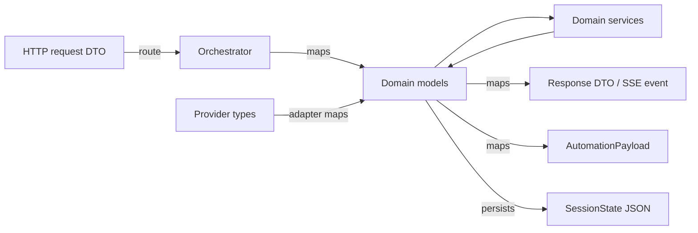

Mapping functions live in `app/orchestration/`, are pure, and are unit tested with round-trip assertions. A field added to a domain model without a mapping update fails the contract snapshot test in CI (OA-03).

# 5. Cross-Cutting Concerns (Sections 16 to 21)

# 16\. Error Handling
## 16.1 Exception hierarchy
Defined in `app/core/exceptions.py`. Every exception carries a stable `code`, a visitor-safe `message`, and a `retryable` flag, so the API layer maps them mechanically with no per-endpoint logic.

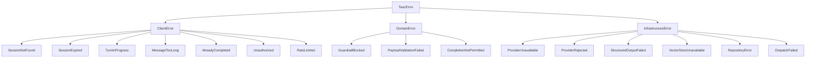

| Family | Meaning | Default HTTP | Alert |
| ---| ---| ---| --- |
| `ClientError` | The caller did something wrong | 4xx | No |
| `DomainError` | A business rule refused the operation | 4xx or 500 | Only `PayloadValidationFailed` |
| `InfrastructureError` | A dependency failed | 5xx or SSE event | Yes, above threshold |

## 16.2 Handling strategy by layer

| Layer | Strategy |
| ---| --- |
| Infrastructure adapters | Translate SDK and transport exceptions into `InfrastructureError` subclasses. No SDK exception type escapes this layer |
| Domain services | Raise `DomainError` for rule violations. Never catch `InfrastructureError`; let it bubble to the stage runner |
| Orchestration | The only place that catches `InfrastructureError`. Applies the fallback matrix in 8.7, records the degradation, continues the turn |
| API layer | Registered exception handlers map `TascError` to the error envelope. One generic handler catches everything else as `INTERNAL_ERROR` |

**Rule EH-01:** No bare `except Exception` outside the orchestration stage runner and the API catch-all handler. Two places, both audited, both logging with full context.

**Rule EH-02:** An exception never carries user content in its message. The message is a static template; the specifics go into structured log fields where redaction applies (FR-70).
## 16.3 Turn-level error containment

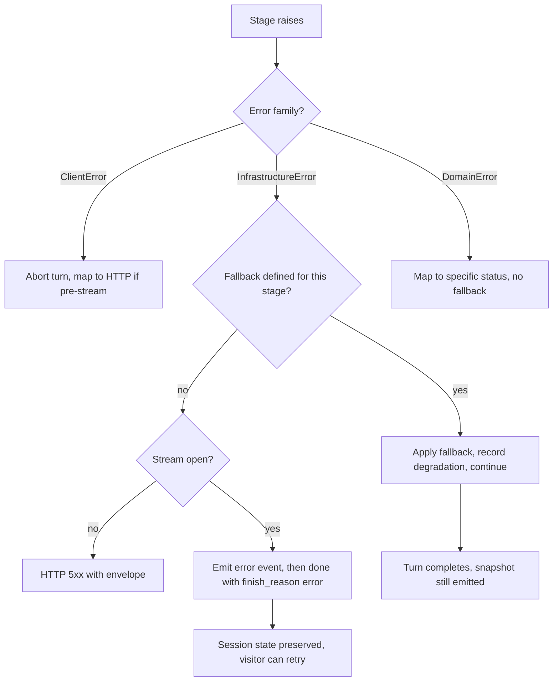

**Rule EH-03:** A failed turn MUST leave session state exactly as it was before the turn, except for the appended visitor message and the recorded degradation. Partial slot merges from a half-completed pipeline are forbidden, because they produce state that no transcript explains.

**Rule EH-04:** State is written once, at the end of a successful pipeline. Failures roll back by simply not writing.
## 16.4 Error copy
All visitor-facing error text lives in `app/resources/copy/system_messages.yaml`, never in code (PRD 17.7).

| Code | Copy |
| ---| --- |
| `PROVIDER_UNAVAILABLE` | "Something went wrong on my end. Your message is still here, try again?" |
| `RETRIEVAL_UNAVAILABLE` | "I can keep going, but I can't look anything up in our knowledge base right now." |
| `TURN_TIMEOUT` | "That took longer than it should have. Try sending it again?" |
| `SESSION_EXPIRED` | "This conversation timed out. Start a new one and I'll pick things back up." |
| `RATE_LIMITED` | "You're going a bit fast for me. Give it a few seconds." |
| `CONTENT_BLOCKED` | Bounded refusal from the guardrail copy set |
| `INTERNAL_ERROR` | "Something broke on our side. Try again in a moment." |

**Rule EH-05:** No error message contains an error code, a stack trace, a model name, or the word "error" more than once. The correlation ID is returned in the envelope for support, not shown in the chat.
## 16.5 Dispatch failure handling

| Stage | Behaviour |
| ---| --- |
| Attempt 1 to `N8N_MAX_ATTEMPTS` | Exponential backoff with jitter, only for retryable statuses (6.11) |
| Exhausted | Write a dead-letter record with the full payload, attempts, last error, and reason |
| Alert | Telegram operations alert, one per record, deduplicated by consultation ID |
| Recovery | Operator uses the redispatch endpoint. Idempotency key prevents duplicate rows and emails (NFR-13) |

**Rule EH-06:** Dispatch failure is invisible to the visitor. They have already seen their summary. This is precisely why dispatch is asynchronous (FR-50).

* * *
# 17\. Logging
## 17.1 Format
Structured JSON in every environment except local, where a human-readable console format is used. One event per line. No multi-line log entries, ever, because they break every aggregator.
## 17.2 Standard fields
Every log line carries these, injected by the logger factory from context vars.

| Field | Source |
| ---| --- |
| `timestamp` | UTC ISO 8601 with milliseconds |
| `level` | Standard levels |
| `event` | Stable snake\_case event name, not a free-text sentence |
| `correlation_id` | Middleware context var |
| `session_id` | Session context, when present |
| `turn_index` | Turn context, when present |
| `service` | `tasc-backend` |
| `version` | App version and git SHA |
| `environment` | `APP_ENV` |

**Rule LG-01:** `event` is a stable identifier, never an interpolated sentence. `event: turn_completed` with fields, not `"Turn 3 completed in 4180ms"`. Interpolated messages cannot be aggregated or alerted on.
## 17.3 Event catalogue

| Event | Level | Key fields |
| ---| ---| --- |
| `app_started` | INFO | The full startup manifest (4.2) |
| `app_stopping` | INFO | `in_flight_turns`, `pending_dispatches` |
| `session_created` | INFO | `referrer_host`, `utm_source` |
| `turn_started` | INFO | `message_length`, `phase` |
| `intent_classified` | DEBUG | `intent`, `confidence`, `duration_ms` |
| `slots_extracted` | INFO | `slots_changed[]`, `duration_ms`. Never the values |
| `retrieval_performed` | INFO | `query_length`, `candidates`, `above_floor`, `chunk_ids`, `duration_ms` |
| `retrieval_empty` | WARNING | `query_length`, `top_score`, `floor` |
| `deferral_triggered` | INFO | `reason` |
| `score_computed` | INFO | `score`, `band`, `components`, `overrides[]` |
| `recommendations_generated` | INFO | `service_codes[]`, `top_confidence`, `withheld_reason` |
| `recommendations_changed` | INFO | `previous[]`, `current[]` |
| `generation_completed` | INFO | `output_tokens`, `duration_ms`, `finish_reason` |
| `grounding_warning` | WARNING | `assertion_type`, `chunk_ids`, `deferral_mode` |
| `stage_degraded` | WARNING | `stage`, `fallback`, `cause` |
| `turn_completed` | INFO | Full timing breakdown, token usage, cost |
| `turn_failed` | ERROR | `stage`, `error_code`, `exception_type` |
| `guardrail_blocked` | WARNING | `rule`, `action` |
| `injection_detected` | WARNING | `pattern_class`, `action` |
| `anti_persona_detected` | INFO | `signal` |
| `consultation_completed` | INFO | `consultation_id`, `reason`, `score`, `band`, `turn_count` |
| `payload_validated` | INFO | `consultation_id`, `schema_version` |
| `payload_invalid` | ERROR | `consultation_id`, `validation_errors` |
| `dispatch_attempted` | INFO | `attempt`, `status_code`, `duration_ms` |
| `dispatch_succeeded` | INFO | `workflow_execution_id`, `actions` |
| `dispatch_deadlettered` | ERROR | `attempts`, `last_error`, `reason` |
| `index_rebuilt` | INFO | `documents`, `chunks`, `embedding_calls`, `duration_s` |
| `session_abandoned` | INFO | `turn_count`, `contact_present` |
| `rate_limited` | WARNING | `scope`, `identifier_hash` |

## 17.4 Redaction
Implemented as a logging filter installed before any logger is used (startup step S2), so redaction cannot be bypassed by a log call added later (FR-70, NFR-21).

| Data | Treatment |
| ---| --- |
| Email addresses | Replaced with a salted hash prefix, for example `email:9f3a...` |
| Phone numbers | Fully redacted |
| Person names | Never logged as a field. Contact capture logs a boolean and a hash |
| Company names | Logged, they are business data not personal data |
| Message content | Never logged. Length and language only |
| Assistant output | Never logged in full. Length, token count, and finish reason only |
| Retrieved chunk text | Never logged. Chunk IDs only |
| API keys and secrets | Pattern-matched and replaced at the filter level as a second line of defence |
| IP addresses | Hashed with a rotating daily salt for rate-limit diagnostics |

**Rule LG-02:** The redaction filter is regression tested with a fixture containing every sensitive pattern. A test asserts none of them survive to output.

**Rule LG-03:** Debug-level logging of message content is permitted in local only, gated on `APP_ENV == "local"` at the filter level, not at the call site.
## 17.5 Log volume

| Concern | Control |
| ---| --- |
| Token streaming | Never logged per token. One `generation_completed` line per turn |
| Health probes | Logged at DEBUG, excluded from INFO output |
| Rate-limited floods | One `rate_limited` line per identifier per minute, counted not repeated |
| Sampling | `LOG_SAMPLE_RATE` applies to DEBUG only. INFO and above are never sampled |

* * *
# 18\. Observability
## 18.1 The three questions
Observability exists to answer three questions fast: is it up, is it fast, is it correct. Everything below maps to one of them.
## 18.2 Metrics

| Metric | Type | Labels | Answers | PRD target |
| ---| ---| ---| ---| --- |
| `turn_duration_ms` | Histogram | `phase`, `retrieval_performed` | Fast | NFR-02, under 6 s p95 |
| `stage_duration_ms` | Histogram | `stage` | Fast | Latency budget in PRD 10.1 |
| `time_to_first_token_ms` | Histogram | none | Fast | NFR-01, under 1.2 s p95 |
| `retrieval_duration_ms` | Histogram | `filtered` | Fast | NFR-03, under 300 ms p95 |
| `provider_call_duration_ms` | Histogram | `call_site`, `outcome` | Fast, up |  |
| `turns_total` | Counter | `outcome` | Up | TM-09, failures under 0.5 percent |
| `degradations_total` | Counter | `stage`, `fallback` | Correct |  |
| `grounding_warnings_total` | Counter | `assertion_type` | Correct | AQ-01 |
| `retrieval_empty_total` | Counter | none | Correct | Feeds knowledge gap detection |
| `deferrals_total` | Counter | none | Correct | AQ-07 |
| `consultations_completed_total` | Counter | `band`, `reason` | Correct | PM-03 |
| `dispatch_attempts_total` | Counter | `outcome`, `attempt` | Up | TM-07, 99 percent |
| `deadletters_total` | Counter | `reason` | Up | Any increment alerts |
| `tokens_total` | Counter | `direction`, `call_site` | Cost | NFR-38 |
| `cost_usd_total` | Counter | `call_site` | Cost | Under 0.05 per consultation |
| `active_sessions` | Gauge | none | Up | NFR-07, 50 concurrent |
| `session_lock_wait_ms` | Histogram | none | Fast | Detects client double-send |

## 18.3 Tracing
Correlation IDs are the minimum bar and are mandatory (FR-67). Distributed tracing is optional in MVP but the span structure is defined now so adding an exporter later is configuration, not refactoring.

```plain
turn (root span)
├── guardrails
├── understanding
│   ├── intent_classification (provider call)
│   └── slot_extraction (provider call)
├── retrieval
│   ├── embed_query (provider call)
│   └── vector_search
├── reasoning
│   ├── scoring
│   ├── recommendation
│   └── rationale (provider call)
├── generation (provider call, streaming)
├── grounding_check
└── snapshot_emission

dispatch (separate root span, linked by consultation_id)
├── payload_assembly
├── persistence
└── n8n_call (retried)
```

**Rule OB-01:** The dispatch trace is a separate root, not a child of the turn, because it outlives the request. Linking is by `consultation_id`.
## 18.4 Alerting

| Alert | Condition | Severity | Action |
| ---| ---| ---| --- |
| Dispatch dead-letter | Any increment | High | Runbook: check n8n execution log, redispatch |
| Turn failure rate | Above 2 percent over 15 minutes | High | Check provider status |
| p95 turn duration | Above 8 s over 15 minutes | Medium | Check provider latency and prompt size |
| Retrieval empty rate | Above 20 percent over 1 hour | Medium | Knowledge gap, review deferral log |
| Grounding warnings | Above 5 percent of turns over 1 hour | High | Review recent prompt or corpus changes |
| Cost per consultation | Above 0.08 USD daily average | Medium | Check compaction and prompt size |
| Readiness failing | Any 503 from `/health/ready` | Critical | Check volume mount and index |
| Provider rejected (4xx) | Any occurrence | Critical | Key expiry or quota, immediate |

**Rule OB-02:** Every alert names its runbook section. An alert without a documented response is noise that trains people to ignore alerts.
## 18.5 Evaluation as observability
The AI quality metrics in PRD 6.2 are not observable from production logs alone, so `scripts/run_evaluation.py` runs the labelled fixture suites and emits the same metric names. This runs in CI on every prompt or corpus change, and weekly on a schedule.

| Suite | Metric | Threshold | Blocks release |
| ---| ---| ---| --- |
| Grounding | AQ-01 grounding rate | 95 percent | Yes |
| Retrieval | AQ-02 precision at 5 | 0.8 | Yes |
| Extraction | AQ-03 slot accuracy | 90 percent | Yes |
| Recommendation | AQ-04 top-1 accuracy | 85 percent | Yes |
| Deferral | AQ-07 deferral correctness | 95 percent | Yes |
| Injection | Zero persona breaks | 100 percent | Yes |

* * *
# 19\. Testing Strategy
## 19.1 Test pyramid

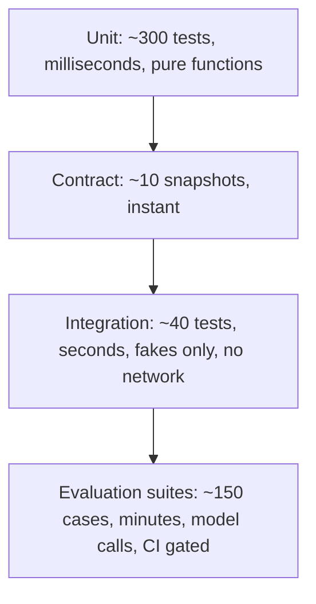

| Layer | Count | Runtime | Network | Gate |
| ---| ---| ---| ---| --- |
| Unit | ~300 | Under 5 s total | Never | Every commit |
| Contract | ~10 | Instant | Never | Every commit |
| Integration | ~40 | Under 30 s | Never, fakes only | Every commit |
| Evaluation | ~150 cases | 2 to 5 minutes | Real provider | Prompt or corpus changes, and nightly |

**Rule TS-01:** No test outside the evaluation suite makes a network call. The fakes in `tests/fakes/` implement the same protocols and are the only providers the unit and integration suites ever see. This is the direct payoff of BP-03.
## 19.2 Unit tests
The pure core (1.5) is where coverage matters and where it is cheap.

| Module | Test approach | Coverage floor |
| ---| ---| --- |
| `qualification/*` | Table-driven, one row per rubric line in PRD 14.2 plus every override | 100 percent branch |
| `question_selector` | Table-driven over slot and phase combinations, plus determinism assertions | 100 percent |
| `phase_controller` | State machine transition table from PRD 12.2, including illegal transitions | 100 percent |
| `normaliser` | Every vocabulary mapping plus adversarial free text | 100 percent |
| `merger` | No-overwrite, append-dedupe, decline-terminal, conflict-flag cases | 100 percent |
| `recommendation/ranker` | Ranking formula with hand-computed expected scores | 100 percent |
| `rag/reranker` and `query_builder` | Boost maths, dedupe, anaphora detection | 95 percent |
| `guardrails/*` | Injection corpus, length caps, anti-persona phrases | 95 percent |
| `memory` | Compaction triggering, slot preservation, token budget | 90 percent |
| Everything else | Meaningful paths | 80 percent (NFR-30) |

**Key determinism test:** run the full scoring and recommendation path over 20 fixture states twice and assert byte-identical results. This single test protects BP-02 better than any amount of review.
## 19.3 Integration tests
Run against the real FastAPI app with fake providers and an in-memory session store.

| Test | Asserts |
| ---| --- |
| Session creation | 201, greeting present, empty snapshot, no provider call made |
| Full happy path, 8 turns | Slots fill, score rises monotonically, recommendation appears at the right phase, completion fires |
| SSE event ordering | Phases precede tokens, exactly one snapshot, exactly one done |
| Skipped phase | A discovery turn never emits `retrieving` |
| Concurrent turns | Second request returns 409 |
| Provider outage mid-turn | Error event emitted, done follows, state unchanged, retry succeeds |
| Vector store outage | Turn completes in deferral mode, no factual assertions |
| Session expiry | 410 with the right code |
| Rate limiting | 429 with `Retry-After` |
| Payload validation failure | Dispatch blocked, 500 with `PAYLOAD_INVALID` |
| Dispatch retry | Fake n8n fails twice then succeeds, one Sheets row equivalent |
| Dispatch dead-letter | Three failures produce one dead-letter record and one alert |
| Idempotent completion | Two completion calls, one dispatch |
| Anti-persona | Band is `not_a_lead`, dispatch suppressed |
| Refresh recovery | Session fetch returns full state after a simulated reload |

## 19.4 Contract tests

| Test | Asserts |
| ---| --- |
| OpenAPI snapshot | Generated document matches the committed snapshot (OA-03) |
| SSE event schema snapshot | Exported JSON Schema matches the snapshot (OA-05) |
| Automation payload snapshot | Payload schema matches the snapshot, since n8n depends on it |
| Env parity | Every settings field appears in `.env.example` (SEC-03) |
| Resource validity | Every YAML resource loads and validates |
| Catalogue referential integrity | Every service code in `pain_mapping.yaml` exists in `services.yaml` |
| Knowledge front matter | Every corpus document validates against `KnowledgeDoc` |

## 19.5 Evaluation suites
Fixtures live in `tests/evaluation/fixtures/` as versioned JSON, reviewed like code.

| Suite | Fixture | Method |
| ---| ---| --- |
| Extraction | 30 annotated transcripts | Run the extractor, compare against annotated slots, report per-slot accuracy |
| Retrieval | 40 labelled queries with expected chunk IDs | Compute precision at 5 |
| Grounding | 50 sampled turns with retrieved context | Check every factual assertion against context |
| Recommendation | 30 labelled scenarios with expert primary and acceptable secondary | Top-1 and top-2 accuracy |
| Deferral | 20 adversarial questions with no corpus coverage | Assert deferral language, assert no invention |
| Injection | 25 injection and jailbreak attempts | Assert persona holds and no instruction is followed |
| Persona | 50 turns scored against the tone rubric | One question per turn, length, banned phrases |

**Rule TS-02:** Evaluation results are written as a JSON report and committed to the run artefacts, so quality is trackable across releases rather than being a pass or fail moment.

**Rule TS-03:** A prompt or corpus change without an evaluation run is not reviewable. CI enforces this by running the suites when `app/resources/prompts/**` or `knowledge/**` changes.
## 19.6 Load testing

| Scenario | Target | Asserts |
| ---| ---| --- |
| 20 concurrent sessions, 8 turns each | Baseline | p95 turn under 6 s, zero errors |
| 50 concurrent sessions | NFR-07 | p95 under 8 s, zero errors, memory stable |
| Sustained 30 minutes at 20 concurrent | Stability | No memory growth, no file handle leak, no lock starvation |
| Provider latency injection at 3 s | Degradation | Turns still complete, no timeouts cascade |

## 19.7 Test data policy
All fixtures are synthetic. No real visitor data, no real client names, no real contact details in any test file. The evaluation corpus uses a fixture knowledge base under `tests/evaluation/fixtures/knowledge/`, not the production corpus, so evaluation results are stable when the real corpus changes.

* * *
# 20\. Deployment Considerations
## 20.1 Container

| Aspect | Decision |
| ---| --- |
| Base image | `python:3.12-slim` |
| Build | Multi-stage: a builder installing dependencies into a virtualenv, a runtime copying only the venv and the app |
| Dependency manager | `uv` or `pip` with a fully pinned lock file. No unpinned versions |
| User | Non-root, explicit UID |
| Server | Uvicorn, single worker per container, no Gunicorn wrapper. Scale by replica, not by worker, because in-process state (locks, singletons) does not survive forking cleanly |
| Image contents | No `.env`, no `data/`, no `tests/`, no knowledge source unless the index is baked in |
| Health | Container health check hits `/health/ready` |
| Signals | SIGTERM triggers the graceful shutdown sequence (4.4) |

## 20.2 Knowledge index deployment
This is the deployment decision that most often goes wrong (R-16). Two viable strategies.

| Strategy | How | Pros | Cons | MVP choice |
| ---| ---| ---| ---| --- |
| Baked into the image | Index built at Docker build time, shipped inside the image | Immutable, no volume, atomic with code, trivially rollback-able | Larger image, requires a rebuild for a corpus change | Chosen |
| Persistent volume | Index built once, mounted at runtime | Corpus updates without a rebuild | Volume mount failures produce an empty index, drift between environments | Phase 2 with managed vector store |

**Rule DP-01:** With the baked strategy, a knowledge change triggers a normal deploy. This is a feature: the corpus is reviewed, versioned, and released exactly like code, which is what PRD 23.6 already requires.

**Rule DP-02:** Startup asserts the index is present and non-empty regardless of strategy (step S5). No configuration makes this check optional.
## 20.3 Persistence

| Data | MVP | Production concern |
| ---| ---| --- |
| Sessions | File store on a volume, or Redis when replicas exceed 1 | A file store does not work across replicas. Moving to Redis is a config change plus one adapter |
| Payloads | File store on a volume | Must survive redeploy. This is the replay source of truth (FR-48) |
| Dead-letters | File store on a volume | Same |
| Chroma index | Baked into the image | n/a |

**Rule DP-03:** Payload and dead-letter storage MUST be on durable storage before the service is considered production ready. Losing a payload means losing a lead with no recovery path.
## 20.4 Environment parity

| Environment | Replicas | Session store | n8n | Index |
| ---| ---| ---| ---| --- |
| Local | 1 | memory | disabled or local container | Built locally |
| Preview | 1 | file | staging workflow, test recipients | Baked at build |
| Production | 1 to 2 | file at 1 replica, Redis at 2+ | production workflow | Baked at build |

**Rule DP-04:** Preview environments MUST NOT dispatch to the production n8n workflow. `N8N_WEBHOOK_URL` differs per environment, and the shared secret differs too, so a misconfiguration fails closed with a 401 rather than emailing a real prospect.
## 20.5 Deployment pipeline

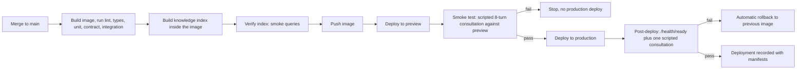

**Rule DP-05:** The post-deploy smoke test runs a real consultation against production with a synthetic marker in the payload, and n8n routes marked payloads to a test sheet. Deploying without proving the full chain is how a broken dispatch survives for a week.
## 20.6 Rollback

| Failure | Rollback |
| ---| --- |
| Bad code | Redeploy the previous image tag |
| Bad prompt | Revert the manifest pointer, redeploy (PM-08) |
| Bad knowledge | Revert the corpus commit, rebuild, redeploy |
| Bad scoring weights | Revert the YAML, redeploy. Prior payloads keep their original `ruleset_version` |
| Bad n8n workflow | Restore the previous workflow version in n8n. Dead-lettered payloads are replayed after |

**Rule DP-06:** Rollback MUST NOT require an index rebuild in the normal case, which is another argument for baking the index: the previous image already contains a known-good index.
## 20.7 Operational runbook triggers
Every item maps to a section in `docs/runbook.md` per PRD 23.5: provider outage, vector store unavailable, dispatch failures, grounding degradation, cost spike, duplicate leads, secret rotation, index rebuild, dead-letter replay.

* * *
# 21\. Scalability Roadmap
## 21.1 Current ceiling

| Dimension | MVP capacity | First bottleneck |
| ---| ---| --- |
| Concurrent sessions | 50 per instance | Event loop saturation during streaming |
| Sessions per month | Well beyond 500 | None at expected volume |
| Corpus size | Roughly 500 chunks | Embedded Chroma query latency |
| Replicas | 1 | File-based session store and in-process locks |
| Dispatch throughput | Sequential background tasks | Fine at this volume |

The MVP is deliberately over-specified for the expected load. The roadmap below is about removing single points of failure, not chasing throughput the business does not have.
## 21.2 Scaling stages

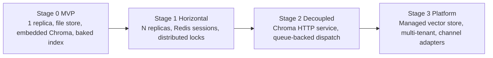

### Stage 1: Horizontal replicas

| Change | Reason | Effort |
| ---| ---| --- |
| Session store to Redis | File store cannot be shared across replicas | Low, adapter already abstracted |
| Session locks to Redis locks | In-process locks do not span replicas (5.7) | Low |
| Rate limiter to Redis token buckets | Per-instance limits are meaningless behind a load balancer | Low |
| Sticky sessions not required | State is external, any replica can serve any turn | Zero |

**Trigger:** sustained concurrency above 40, or the need for zero-downtime deploys.
### Stage 2: Decoupled services

| Change | Reason | Effort |
| ---| ---| --- |
| Chroma in HTTP mode as its own service | Removes index duplication across replicas and allows independent scaling | Medium, `CHROMA_MODE` already exists |
| Dispatch to a durable queue | Background tasks die with the process. A queue survives restarts and gives real retry semantics | Medium |
| Payload store to Postgres | File storage is fine for hundreds, not thousands, and queries become useful | Medium |
| Read replicas for analytics | Lead analysis queries should not touch the serving path | Low |

**Trigger:** more than 2 replicas, or the first dead-letter caused by a restart rather than an n8n failure.
### Stage 3: Platform

| Change | Reason |
| ---| --- |
| Managed vector store (pgvector, Qdrant, or similar) | Corpus beyond a few thousand chunks, hybrid search, per-tenant isolation |
| Hybrid retrieval, dense plus BM25 | PRD FI-05, precision gains as the corpus grows |
| Channel adapters above the orchestrator | PRD FI-08, WhatsApp and Telegram without touching the pipeline |
| Multi-tenant configuration | PRD FI-17, per-tenant corpora, catalogues, prompts, and weights |
| Semantic cache in front of retrieval | PRD FI-15, cuts latency and cost on the dominant question set |

## 21.3 Design choices that make scaling cheap

| Choice | Payoff at scale |
| ---| --- |
| Server-side state behind a repository protocol | Redis swap is one adapter |
| Stateless orchestrator and domain services | Any replica serves any turn |
| Provider protocols | Model or provider change is configuration |
| Vector store protocol | Chroma to a managed store is one adapter |
| Idempotency on dispatch | Safe retries, safe replays, safe duplicate deliveries |
| Deterministic scoring | Recomputation and backfill are safe operations |
| Config-driven behaviour | Per-tenant variation becomes data, not branching |
| Correlation IDs everywhere | Debugging survives the move to multiple replicas |

## 21.4 What deliberately does not scale, and why that is fine

| Limitation | Why accepted |
| ---| --- |
| One turn per session at a time | A conversation is inherently sequential. Removing this would break determinism for no user benefit |
| Synchronous scoring in the request path | Under 20 ms. Making it async would add complexity and latency |
| Full-state snapshots rather than patches | Bandwidth cost is trivial at this payload size, and it removes an entire bug class (AD-05) |
| Index rebuilt per deploy | Corpus changes are infrequent and reviewed. Immutability is worth more than agility here |

# 6. Diagrams and Checklist (Sections 22 to 24)

# 22\. Mermaid Architecture Diagrams
## 22.1 Backend in context

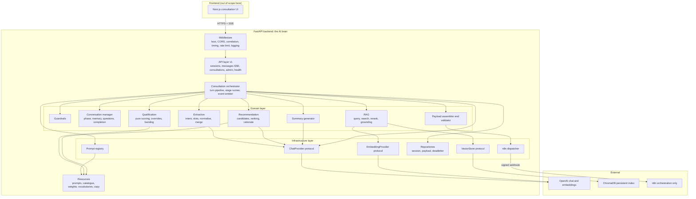

## 22.2 Layer dependency rule

```mermaid
flowchart TD
    A["app.api<br/>parse, validate, delegate, serialise"]
    B["app.orchestration<br/>sequence, contain errors, emit events"]
    C["app.domain<br/>all intelligence and business rules"]
    D["app.infrastructure<br/>SDKs, HTTP, disk"]
    E["app.schemas<br/>boundary contracts"]
    F["app.core<br/>config, logging, errors, telemetry"]

    A --> B --> C
    C -.->|protocols only| D
    A --> E
    B --> E
    C --> F
    B --> F
    A --> F
    D --> F

    G["Forbidden: domain to concrete infrastructure"]
    H["Forbidden: schemas to domain"]
    I["Forbidden: any upward import"]
```

Enforced by `importlinter.ini` in CI (2.3). A violation fails the build.
## 22.3 Turn pipeline

```mermaid
flowchart TD
    A[Visitor message] --> B[Guardrails: length, rate, injection, anti-persona]
    B -->|blocked| Z[Bounded refusal, no state change, done]
    B -->|allowed| C[Emit phase: understanding]
    C --> D1[Intent classification]
    C --> D2[Slot extraction]
    D1 --> E[Merge and normalise slots]
    D2 --> E
    E --> F{Knowledge intent?}
    F -->|yes| G[Emit phase: retrieving]
    G --> H[Build query, embed, search, floor, rerank, dedupe]
    H --> I{Chunks above floor?}
    I -->|no| J[Deferral mode, no context injected]
    I -->|yes| K[Attach L4 context with untrusted-data delimiters]
    F -->|no| L[Skip retrieval]
    J --> M[Emit phase: evaluating]
    K --> M
    L --> M
    M --> N[Score, deterministic]
    N --> O[Recommendation engine]
    O --> P{Set changed and already presented?}
    P -->|yes| Q[Emit phase: preparing, set changed flag]
    P -->|no| R[Continue]
    Q --> S[Phase transition check]
    R --> S
    S --> T[Select next question]
    T --> U[Assemble prompt L1 to L5]
    U --> V[Emit phase: generating, stream tokens]
    V --> W[Grounding check, non-blocking]
    W --> X[Persist state]
    X --> Y[Emit analysis_snapshot]
    Y --> AA{Completion criteria met?}
    AA -->|yes| AB[Summary, payload, persist, queue dispatch]
    AA -->|no| AC[Emit done]
    AB --> AC
```

## 22.4 Provider abstraction

```mermaid
flowchart LR
    subgraph Domain["Domain: knows only protocols"]
        A[IntentClassifier]
        B[SlotExtractor]
        C[RetrievalService]
        D[RecommendationEngine]
        E[SummaryGenerator]
        F[Orchestrator]
    end
    subgraph Protocols
        G[ChatProvider]
        H[EmbeddingProvider]
    end
    subgraph Impl["Infrastructure: selected by LLM_PROVIDER"]
        I[OpenAIChatProvider]
        J[OpenAIEmbeddingProvider]
        K[Future provider]
        L[FakeChatProvider, tests]
    end
    A & B & D & E & F --> G
    C --> H
    C --> G
    G --> I
    G --> K
    G --> L
    H --> J
```

## 22.5 RAG pipeline

```mermaid
flowchart LR
    subgraph Offline["Offline indexing"]
        A[Markdown corpus with front matter]
        B[Validate and hash]
        C[Chunk on headings, 500-800 tokens, 15 percent overlap]
        D[Enrich metadata]
        E[Batch embed]
        F[Upsert to temp collection]
        G[Smoke verify and swap]
        H[Write index manifest]
        A --> B --> C --> D --> E --> F --> G --> H
    end
    subgraph Online["Per-turn retrieval"]
        I[Intent decides retrieval]
        J[Build augmented query]
        K[Embed query]
        L[Search, over-fetch 3x]
        M[Metadata filter]
        N[Similarity floor]
        O[Lexical rerank]
        P[Dedupe adjacent]
        Q[Inject as L4 context]
        I --> J --> K --> L --> M --> N --> O --> P --> Q
    end
    H -.serves.-> L
```

## 22.6 Qualification and recommendation

```mermaid
flowchart TD
    subgraph Inputs
        A[Slots]
        B[Engagement signals]
        C[Retrieved evidence]
    end
    subgraph Pure["Pure deterministic core"]
        D[Six score components]
        E[Sum and clamp]
        F[Apply overrides in order]
        G[Band assignment]
        H[Candidate builder from pain mapping]
        I[Ranker: evidence, industry, constraints]
        J[Confidence normalisation]
    end
    subgraph Generated["Model-written, constrained"]
        K[Score justification from numbers only]
        L[Rationale from pain points and evidence]
    end
    A --> D
    B --> D
    A --> H
    C --> I
    D --> E --> F --> G --> K
    H --> I --> J --> L
    G --> M[QualificationResult]
    J --> N[RecommendationSet]
    K --> M
    L --> N
```

## 22.7 Deployment topology

```mermaid
flowchart TB
    subgraph Client
        A[Browser]
    end
    subgraph Vercel
        B[Next.js app]
    end
    subgraph Container["Container platform"]
        C["FastAPI + Uvicorn<br/>image includes baked Chroma index"]
        D["Volume: sessions, payloads, deadletters"]
    end
    subgraph Managed
        E[OpenAI API]
        F[n8n cloud or container]
    end
    subgraph Observability
        G[Log aggregation]
        H[Error tracking]
        I[Uptime monitor]
    end
    A --> B --> C
    C --> D
    C --> E
    C -->|signed webhook| F
    C --> G
    C --> H
    I --> C
```

* * *
# 23\. Mermaid Sequence Diagrams
## 23.1 Session creation

```mermaid
sequenceDiagram
    autonumber
    participant FE as Frontend
    participant API as API layer
    participant CM as ConversationManager
    participant REPO as SessionRepository
    participant COPY as Copy resources

    FE->>API: POST /api/v1/sessions
    API->>API: Validate body, rate limit by IP
    API->>CM: create_session(attribution)
    CM->>CM: Generate ULID, set TTL, phase greeting
    CM->>COPY: Read static greeting
    COPY-->>CM: Greeting text
    CM->>CM: Append greeting as turn 0
    CM->>REPO: persist(state)
    REPO-->>CM: ok
    CM-->>API: SessionState
    API->>API: Map to CreateSessionResponse plus empty snapshot
    API-->>FE: 201 with session_id, greeting, empty analysis
    Note over API,FE: Zero model calls. Greeting renders instantly (FR-02)
```

## 23.2 Discovery turn, no retrieval

```mermaid
sequenceDiagram
    autonumber
    participant FE as Frontend
    participant API as API layer
    participant ORCH as Orchestrator
    participant G as Guardrails
    participant IC as IntentClassifier
    participant SE as SlotExtractor
    participant SC as ScoringEngine
    participant RE as RecommendationEngine
    participant QS as QuestionSelector
    participant PR as PromptRegistry
    participant CP as ChatProvider
    participant REPO as SessionRepository

    FE->>API: POST /sessions/{id}/messages
    API->>API: Acquire session lock, else 409
    API->>ORCH: run_turn(state, message)
    ORCH-->>FE: event phase understanding
    ORCH->>G: check(message)
    G-->>ORCH: allowed
    par Parallel understanding
        ORCH->>IC: classify
        IC->>CP: complete_structured
        CP-->>IC: intent answer_question, 0.93
    and
        ORCH->>SE: extract
        SE->>CP: complete_structured
        CP-->>SE: slot deltas
    end
    ORCH->>ORCH: Normalise and merge, no-overwrite rules
    ORCH->>ORCH: Retrieval not required, skip
    ORCH-->>FE: event phase evaluating
    ORCH->>SC: compute(state)
    SC-->>ORCH: score 40, band warm, components
    ORCH->>RE: recommend(state, no evidence)
    RE-->>ORCH: withheld, insufficient_pain_points
    ORCH->>QS: next_question(state)
    QS-->>ORCH: slot current_tools
    ORCH->>PR: render L1 to L5
    PR-->>ORCH: prompt, version pm_1.3.0
    ORCH-->>FE: event phase generating
    ORCH->>CP: complete_stream
    loop tokens
        CP-->>ORCH: delta
        ORCH-->>FE: event token
    end
    ORCH->>REPO: persist(new state)
    ORCH-->>FE: event analysis_snapshot
    ORCH-->>FE: event done
    API->>API: Release lock
```

## 23.3 Knowledge question with retrieval

```mermaid
sequenceDiagram
    autonumber
    participant FE as Frontend
    participant ORCH as Orchestrator
    participant IC as IntentClassifier
    participant QB as QueryBuilder
    participant EP as EmbeddingProvider
    participant VS as VectorStore
    participant RR as Reranker
    participant PR as PromptRegistry
    participant CP as ChatProvider
    participant GC as GroundingCheck

    FE->>ORCH: "Have you done this for logistics before?"
    ORCH-->>FE: event phase understanding
    ORCH->>IC: classify
    IC-->>ORCH: company_question, 0.95
    ORCH-->>FE: event phase retrieving
    ORCH->>QB: build(message, pain points, industry)
    QB-->>ORCH: augmented query
    ORCH->>EP: embed(query)
    EP-->>ORCH: vector, cached on turn context
    ORCH->>VS: search(vector, n=15, filter doc_type in company/case_study/process)
    VS-->>ORCH: 15 candidates with distances
    ORCH->>ORCH: Normalise, apply similarity floor
    alt Nothing above floor
        ORCH->>ORCH: Set deferral mode, no L4 context
        ORCH->>PR: render with deferral instruction
    else Chunks above floor
        ORCH->>RR: rerank and dedupe
        RR-->>ORCH: 4 chunks
        ORCH->>PR: render with L4 untrusted-data block
    end
    PR-->>ORCH: prompt
    ORCH-->>FE: event phase generating
    ORCH->>CP: complete_stream
    loop tokens
        CP-->>ORCH: delta
        ORCH-->>FE: event token
    end
    ORCH->>GC: check assertions against injected chunks
    GC-->>ORCH: 0 warnings
    ORCH->>ORCH: Record chunk_ids on retrieval_log
    ORCH-->>FE: event analysis_snapshot
    ORCH-->>FE: event done
```

## 23.4 Recommendation turn

```mermaid
sequenceDiagram
    autonumber
    participant ORCH as Orchestrator
    participant CB as CandidateBuilder
    participant CAT as Catalogue resources
    participant VS as VectorStore
    participant RK as Ranker
    participant CP as ChatProvider
    participant PC as PhaseController

    ORCH->>CB: build(pain points, industry, size, budget)
    CB->>CAT: Load pain mapping and services
    CAT-->>CB: Mappings
    CB-->>ORCH: Candidates with base weights
    ORCH->>VS: Evidence search reusing the cached query vector
    VS-->>ORCH: Case study chunks with service codes
    ORCH->>RK: rank(candidates, evidence, constraints)
    RK-->>ORCH: SVC-AIA 0.87, SVC-INT 0.68
    ORCH->>ORCH: Confidence clears floor, 2 pain points, phase ok
    ORCH-->>ORCH: Emit phase preparing
    ORCH->>CP: write_rationale, one call for both services
    CP-->>ORCH: RationaleSet
    ORCH->>ORCH: Validate each rationale references a stated pain point
    alt Validation fails
        ORCH->>ORCH: Substitute templated rationale, log fallback
    end
    ORCH->>PC: evaluate transition
    PC-->>ORCH: phase = recommendation
    ORCH->>ORCH: Generate response presenting both services
```

## 23.5 Completion and dispatch

```mermaid
sequenceDiagram
    autonumber
    participant FE as Frontend
    participant API as API layer
    participant ORCH as Orchestrator
    participant SC as ScoringEngine
    participant SG as SummaryGenerator
    participant PA as PayloadAssembler
    participant PREPO as PayloadRepository
    participant BG as Background task
    participant DISP as N8nDispatcher
    participant N8N as n8n

    FE->>API: POST /sessions/{id}/complete
    API->>ORCH: complete(state, reason, contact)
    ORCH->>ORCH: Validate email, record consent
    ORCH->>SC: Final score with overrides
    SC-->>ORCH: 74, qualified, components, overrides
    ORCH->>SG: generate(state)
    SG-->>ORCH: ConsultationSummary, 187 words
    ORCH->>PA: assemble(state, qualification, recommendations, summary)
    PA->>PA: Validate against AutomationPayload
    alt Invalid
        PA-->>API: PayloadValidationFailed
        API-->>FE: 500 PAYLOAD_INVALID
    else Valid
        PA->>PREPO: persist(payload, idempotency key)
        PREPO-->>PA: stored
        PA-->>ORCH: payload
        ORCH->>BG: schedule dispatch
        ORCH-->>API: completion result
        API-->>FE: 202 with summary, score, dispatch queued
    end
    Note over BG,N8N: Visitor is already unblocked (FR-50)
    BG->>DISP: dispatch(payload)
    DISP->>DISP: Sign body, set secret, timestamp, idempotency headers
    DISP->>N8N: POST webhook
    N8N-->>DISP: 200 received true, execution id, actions
    DISP->>PREPO: Record acknowledgement and dispatched_at
```

## 23.6 Dispatch failure and replay

```mermaid
sequenceDiagram
    autonumber
    participant BG as Background task
    participant DISP as N8nDispatcher
    participant N8N as n8n
    participant DLQ as DeadletterRepository
    participant OPS as Telegram ops
    participant ADM as Operator
    participant API as Admin API

    BG->>DISP: dispatch(payload)
    DISP->>N8N: attempt 1
    N8N--xDISP: 502
    DISP->>DISP: backoff 2s plus jitter
    DISP->>N8N: attempt 2
    N8N--xDISP: timeout
    DISP->>DISP: backoff 4s plus jitter
    DISP->>N8N: attempt 3
    N8N--xDISP: 502
    DISP->>DLQ: write record with payload, attempts, last error
    DISP->>OPS: alert dispatch_deadlettered
    ADM->>API: GET /admin/deadletters
    API-->>ADM: record list
    ADM->>API: POST /consultations/{id}/redispatch
    API->>DISP: dispatch(stored payload)
    DISP->>N8N: attempt 4 with the same idempotency key
    N8N->>N8N: Idempotency check passes, workflow runs once
    N8N-->>DISP: 200 received true
    DISP->>DLQ: mark resolved
```

## 23.7 Provider outage mid-turn

```mermaid
sequenceDiagram
    autonumber
    participant FE as Frontend
    participant ORCH as Orchestrator
    participant CP as ChatProvider
    participant REPO as SessionRepository
    participant COPY as Copy resources

    FE->>ORCH: message
    ORCH-->>FE: event phase understanding
    ORCH->>CP: complete_structured for intent
    CP--xORCH: timeout
    ORCH->>CP: retry once
    CP--xORCH: timeout
    ORCH->>ORCH: Fallback, intent = describe_problem, record degradation
    ORCH->>CP: complete_structured for slots
    CP--xORCH: 503
    ORCH->>ORCH: Fallback, empty delta, record degradation
    ORCH-->>FE: event phase generating
    ORCH->>CP: complete_stream
    CP--xORCH: 503 before first token
    ORCH->>COPY: Read apology copy
    COPY-->>ORCH: system message
    ORCH-->>FE: event token with apology text
    ORCH->>ORCH: Do not write merged state, roll back by not persisting
    ORCH->>REPO: persist visitor message and degradation only
    ORCH-->>FE: event error PROVIDER_UNAVAILABLE retryable true
    ORCH-->>FE: event done finish_reason error
    Note over FE: Visitor retries, prior state intact (EH-03)
```

* * *
# 24\. Implementation Checklist
Ordered for a vertical slice first, mirroring PRD Section 26. Each item is a mergeable unit of work. Tick order matters: later items assume earlier ones.
## Phase 0: Skeleton (Day 1)
- [ ] Repository scaffold with the exact folder tree in 2.1, every package with an `__init__.py`
- [ ] `pyproject.toml` with pinned dependencies, ruff, mypy strict, pytest configuration
- [ ] `importlinter.ini` with all five contracts from 2.3, wired into CI
- [ ] `Settings` model with every group in 3.2, cross-field validation, frozen, `SecretStr` for secrets
- [ ] `.env.example` complete, plus the CI parity test (SEC-03)
- [ ] Exception hierarchy from 16.1 with codes, messages, retryable flags
- [ ] Structured logging with the redaction filter and its regression test (LG-02)
- [ ] `container.py` composition root and `deps.py` resolvers for every dependency in 3.6
- [ ] Lifespan with all 11 startup steps, fail-fast, startup manifest log line
- [ ] Three health endpoints with the exact semantics in 4.5
- [ ] Middleware stack in the order given in 5.4, GZip disabled for SSE (MW-01)
- [ ] Error handlers mapping `TascError` to the envelope in 6.9
- [ ] Dockerfile, multi-stage, non-root, health check
- [ ] CI: lint, mypy, import linter, unit, contract, OpenAPI snapshot
## Phase 1: Conversation vertical slice (Days 2 to 3)
- [ ] `ChatProvider` and `EmbeddingProvider` protocols with domain-owned types (8.2)
- [ ] OpenAI adapters implementing both, no SDK type escaping the module
- [ ] Fake providers in `tests/fakes/` implementing the same protocols
- [ ] `PromptRegistry` with manifest loading, Jinja compilation at startup, version resolution
- [ ] Prompt files: identity, four policy layers, state, context, and the seven task templates
- [ ] Golden-file test asserting deterministic prompt rendering (PM-06)
- [ ] `SessionState` model and `SessionRepository` with file and memory backends
- [ ] `POST /sessions` with the static greeting from copy resources, zero model calls
- [ ] Per-session async lock with 409 on contention (5.7)
- [ ] SSE plumbing: five event types, heartbeat, disconnect handling, 90 s cap
- [ ] `ConsultationOrchestrator` skeleton with the stage runner and error containment
- [ ] `IntentClassifier` with the full taxonomy from PRD 12.4
- [ ] `SlotExtractor` with the all-optional structured schema (SO-03)
- [ ] `Normaliser` with all four controlled vocabularies loaded from YAML
- [ ] `SlotMerger` with no-overwrite, append-dedupe, decline-terminal, conflict-flag rules
- [ ] `PhaseController` implementing the PRD 12.2 state machine
- [ ] `QuestionSelector` with the four-step algorithm in 7.5, deterministic tie-breaking
- [ ] `Memory` with verbatim window, compaction trigger, slot preservation (MEM-01)
- [ ] `POST /sessions/{id}/messages` end to end with streaming
- [ ] `GET /sessions/{id}` and `GET /sessions/{id}/analysis`
## Phase 2: Knowledge and intelligence (Days 4 to 5)
- [ ] `KnowledgeDoc` front matter model and validation
- [ ] Corpus authored: 25 or more documents across all seven doc types, front matter complete
- [ ] `scripts/index_knowledge.py` with heading-aware chunking, breadcrumbs, metadata enrichment
- [ ] Content-hash-aware indexing, with the zero-embedding-calls assertion (ING-03)
- [ ] Temporary collection plus atomic swap plus smoke verification (ADM-01)
- [ ] Index manifest written and asserted at startup (step S6)
- [ ] `VectorStore` protocol and Chroma adapter
- [ ] `QueryBuilder` with anaphora detection and pain point augmentation
- [ ] Retrieval with over-fetch, metadata filter, similarity floor, lexical rerank, dedupe
- [ ] Deferral mode when nothing clears the floor (FR-18)
- [ ] L4 context injection with untrusted-data delimiters (CI-01 to CI-06)
- [ ] `GroundingCheck` with assertion extraction and warning emission
- [ ] `weights.yaml` and `overrides.yaml` with every value from PRD 14.2 and 14.4
- [ ] Six scoring component functions, table-tested to 100 percent branch coverage
- [ ] Override application in declared order with `applied_overrides` recording
- [ ] Banding with configurable thresholds
- [ ] Qualification confidence and `next_score_contributor` lookup table
- [ ] Determinism test: 20 fixture states scored twice, byte-identical
- [ ] `services.yaml` and `pain_mapping.yaml` with the full PRD 15.2 mapping
- [ ] `CandidateBuilder`, `Ranker` with the exact formula in 12.3, withholding rules
- [ ] Single-call rationale generation with all five post-validation checks
- [ ] Templated rationale fallback
## Phase 3: Contracts and snapshots (Day 6)
- [ ] All seven JSON contracts implemented as Pydantic v2 models per Section 14
- [ ] `AnalysisSnapshot` assembly with empty states and the AS-01 exclusion rule
- [ ] Snapshot emission after persistence, exactly once per turn (MSG-02)
- [ ] `phase` event emission bound to actually executed stages (LX-05)
- [ ] `scripts/export_schemas.py` plus snapshot tests for OpenAPI, SSE events, payload
- [ ] DTO to domain mapping functions with round-trip tests
- [ ] `SessionState` schema version and migration hook (CS-05)
## Phase 4: Completion and automation (Day 7)
- [ ] Completion detection for all three triggers (7.6)
- [ ] `SummaryGenerator` with word-count validation, one regeneration, templated fallback
- [ ] Structured summary decomposition so n8n never parses prose
- [ ] `PayloadAssembler` with all seven validation rules (AP-01 to AP-07)
- [ ] Routing flags computed server side, including the `not_a_lead` suppression (AP-05)
- [ ] `PayloadRepository` with persistence before dispatch
- [ ] HMAC signing, shared secret, timestamp headers (6.11)
- [ ] `N8nDispatcher` with the exact retry matrix, no retry on non-409 4xx (N8N-01)
- [ ] Background scheduling so the visitor is never blocked (FR-50)
- [ ] `DeadletterRepository` plus ops alerting
- [ ] `POST /sessions/{id}/complete` with idempotency key handling
- [ ] Admin endpoints: payload fetch, redispatch, dead-letter list, reindex
- [ ] Shutdown handling that never loses a pending dispatch (ST-01)
## Phase 5: Hardening (Day 8)
- [ ] `InputGuard`: length cap, empty check, content-type validation
- [ ] `InjectionDetector` with the pattern corpus and logging
- [ ] `AntiPersonaDetector` with OV-01 wiring and dispatch suppression
- [ ] Bounded refusal: one redirect, then session termination
- [ ] Rate limiting: three scopes, headers on every response
- [ ] Every fallback in 8.7 implemented and tested by forced failure
- [ ] `EH-03` rollback semantics: failed turns leave state untouched
- [ ] All 27 log events in 17.3 emitted with the right fields and levels
- [ ] All 17 metrics in 18.2 emitted
- [ ] Correlation ID propagated through every stage and into dispatch
- [ ] Token and cost accounting per call site, aggregated per consultation
- [ ] Abandonment sweeper with the 3-turn and contact conditions
- [ ] Session purge job at 90 days (NFR-22)
## Phase 6: Evaluation, deployment, handover (Days 9 to 10)
- [ ] Seven evaluation fixture suites with committed labelled data (19.5)
- [ ] `scripts/run_evaluation.py` emitting a JSON report with the six gate thresholds
- [ ] CI triggers evaluation on prompt or knowledge changes (TS-03)
- [ ] Full integration suite, all 16 scenarios in 19.3
- [ ] Load test at 20 and 50 concurrent, p95 targets met
- [ ] Index baked into the image, verified at build (DP-01, DP-02)
- [ ] Preview and production environment variables set, separate n8n targets (DP-04)
- [ ] Post-deploy smoke consultation with a synthetic marker (DP-05)
- [ ] `docs/runbook.md` covering all nine PRD 23.5 scenarios plus the ones in 20.7
- [ ] `docs/knowledge_authoring.md` with the KB-01 to KB-10 rules
- [ ] `docs/prompt_changelog.md` seeded with the v1 baseline
- [ ] `README.md`: setup in under 10 minutes from clone to first consultation
## Definition of done for the backend
A reviewer can clone the repository, set six environment variables, run one indexing command and one start command, and hold a complete consultation that ends with a validated payload landing in n8n. Every factual answer in that consultation traces to a chunk ID in the logs. The scoring is reproducible. The import linter, type checker, unit suite, contract snapshots, and evaluation gates all pass in CI. No secret, no personal data, and no stack trace appears in any log line.