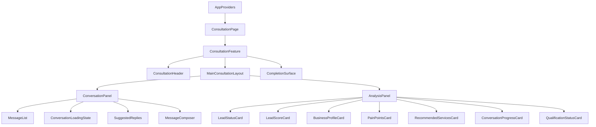
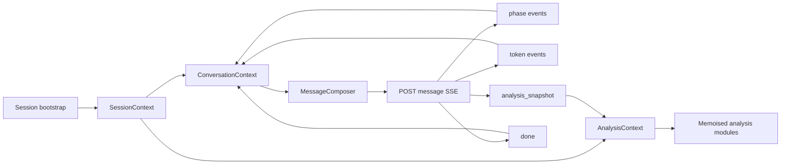
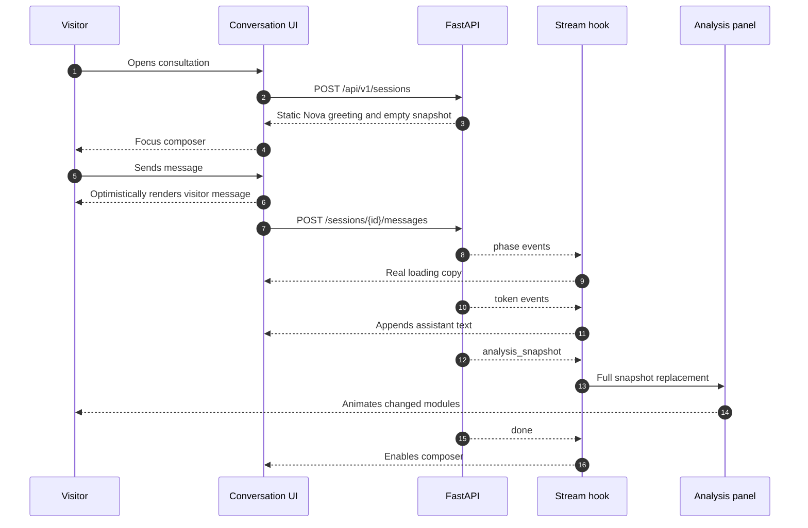
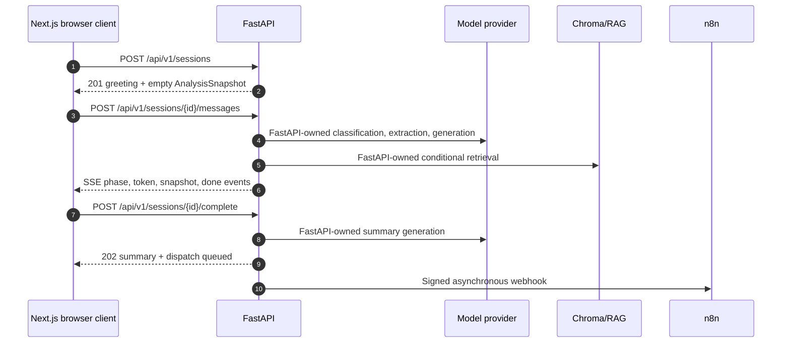

# TASC Frontend Engineering Blueprint v1.0

# Trizen AI Solutions Consultant (TASC)
**Frontend Engineering Blueprint**

| Field | Value |
| ---| --- |
| Document ID | TASC-FE-BP-001 |
| Version | 1.0 |
| Status | Implementation-ready |
| Product | Trizen AI Solutions Consultant (TASC) |
| Upstream source of truth | [](https://app.clickup.com/90152654557/docs/2kyr8npx-515) |
| Backend contract | [](https://app.clickup.com/90152654557/docs/2kyr8npx-575) |
| Stack | Next.js 15 App Router, React 19, TypeScript, Tailwind CSS, shadcn/ui, Framer Motion, Lucide React, React Context, TanStack Query, React Hook Form, Zod |
| Audience | Senior frontend engineers and AI coding agents |
| Scope | Frontend architecture, UI composition, state, API integration, accessibility, performance, testing, deployment |

* * *
## Source reconciliation before implementation
The approved PRD remains the product authority. The backend blueprint remains the transport and JSON-contract authority. The frontend follows both without changing either.

| Finding | Source conflict | Frontend decision |
| ---| ---| --- |
| Transport wording | The PRD says the frontend communicates only with FastAPI. The backend specifies REST JSON endpoints plus an SSE response for the message endpoint. | Use HTTP REST routes only. The message route is a REST `POST` whose response is `text/event-stream`; no WebSocket, direct model call, or third-party browser call. |
| Analysis panel scope | The requested brief names Detected Opportunities, Confidence Score, Estimated Business Fit, Recommended Next Action, and Consultation Stage. The PRD explicitly defines eight MVP modules and says the panel must not show internal confidence maths or internal sales language. | MVP renders the PRD modules only: Lead Status, Lead Score, Industry, Business Size, Pain Points, Recommended Services, Conversation Progress, and Qualification Status. Consultation Stage is represented by Conversation Progress. Requested extra cards are not added as new product features. |
| Confidence | The backend has internal qualification confidence, but the PRD's visitor panel excludes internal confidence maths and the public `AnalysisSnapshot` does not expose it. | Do not render a separate confidence card. Recommendation confidence may render only through the PRD-approved High/Medium labels on recommendation cards. |
| Estimated Business Fit | Not a PRD panel module and overlaps with Lead Status, Lead Score, and Qualification Status. | Do not render a separate fit card in MVP. The existing lead status and score communicate fit without inventing a new metric. |
| Recommended Next Action | Present in the consultation payload and sales workflow, not the visitor panel. | Do not render it in the visitor panel. The frontend may display the completion summary and follow-up confirmation only. |
| File upload and voice | The brief calls them placeholders; the PRD lists voice out of scope and does not define file upload behaviour. | Show no interactive controls in MVP. A future placeholder MAY exist only as non-actionable visual copy, never a fake enabled feature. |
| Restart | PRD marks restart P1. | Implement only if it fits after all P0 flow requirements. It must call the backend session lifecycle, never clear state locally and pretend the session ended. |

## Non-negotiable frontend boundaries
1. The browser calls only the FastAPI origin through the documented `/api/v1` REST routes and the SSE message response.
2. The frontend performs no AI reasoning, RAG, scoring, recommendation ranking, slot extraction, qualification, or business-rule evaluation.
3. The frontend treats backend snapshots as authoritative and replaces analysis state wholesale by `turn_index`.
4. The frontend never renders prompts, retrieved chunks, chunk identifiers, token counts, model names, raw extraction JSON, or internal confidence maths.
5. The frontend preserves the distinction between a visitor-facing state and an internal sales payload.
6. All user-facing copy is English in v1, but copy lives in a central catalogue rather than being scattered through components.
7. Accessibility is part of the component contract, not a final polish pass.
## Blueprint page map

| Page | Contents |
| ---| --- |
| 1\. Foundations | Product boundary, application structure, routes, rendering model |
| 2\. UI system and components | Design system, component hierarchy, responsibilities |
| 3\. State and API | State ownership, persistence, SSE, retries, errors |
| 4\. Interaction and responsive UX | User interactions, feedback, responsive layouts, accessibility |
| 5\. Performance and testing | Rendering, bundle strategy, test plan, deployment considerations |
| 6\. Diagrams and checklist | Mermaid diagrams, implementation sequence, acceptance checklist |

## Requirement traceability rule
Every implementation task and test MUST reference the upstream PRD requirement it satisfies, such as `FR-03`, `FR-59`, `FR-60`, `FR-63`, `FR-66`, `NFR-01`, or `NFR-32`. Frontend-specific rules in this blueprint use `FE-` identifiers.

# 1. Foundations and Application Structure

# 1\. Frontend Foundations
## 1.1 Frontend responsibility
The frontend is a presentation and interaction client for FastAPI. It renders Nova's messages, accepts visitor input, consumes backend events, and visualises the latest `AnalysisSnapshot`. It does not infer missing values, calculate scores, or decide when a recommendation is valid.

| Concern | Frontend owns | Backend owns |
| ---| ---| --- |
| Conversation | Input, message rendering, stream consumption, scroll and focus | Intent, extraction, prompt execution, response generation |
| Analysis | Rendering the latest snapshot | Slot values, score, band, recommendations, progress calculation |
| Loading | Visual phase messages from emitted `phase` events | Whether a phase actually ran |
| Completion | Rendering summary and dispatch status returned by FastAPI | Completion detection, payload validation, n8n dispatch |
| Errors | Visitor-safe display, retry affordance, recovery | Error classification, retryability, state preservation |

## 1.2 Complete folder tree

```text
src/
├── app/
│   ├── layout.tsx
│   ├── page.tsx
│   ├── globals.css
│   ├── consultation/page.tsx
│   ├── session/[sessionId]/page.tsx
│   ├── about/page.tsx
│   ├── error.tsx
│   ├── not-found.tsx
│   └── loading.tsx
├── components/
│   ├── ui/                         # shadcn/ui primitives only
│   ├── layout/                     # page shell, header, responsive regions
│   ├── conversation/               # messages, composer, stream feedback
│   ├── analysis/                   # eight PRD-approved panel modules
│   ├── completion/                 # summary and confirmation surfaces
│   ├── feedback/                  # errors, toasts, announcements
│   └── accessibility/             # live regions and focus helpers
├── features/
│   └── consultation/
│       ├── components/             # feature composition components
│       ├── hooks/                  # consultation-specific hooks
│       ├── mappers/                # DTO-to-view-model mapping only
│       ├── copy/                   # visitor-facing copy keys
│       └── validation/             # form validation schemas
├── contexts/
│   ├── session-context.tsx
│   ├── conversation-context.tsx
│   ├── analysis-context.tsx
│   └── ui-context.tsx
├── providers/
│   ├── app-providers.tsx
│   ├── query-provider.tsx
│   ├── theme-provider.tsx
│   └── error-boundary-provider.tsx
├── services/
│   ├── api-client.ts               # fetch wrapper and error normalisation
│   ├── session-service.ts
│   ├── consultation-service.ts
│   └── stream-parser.ts             # SSE event decoding
├── hooks/
│   ├── use-consultation-stream.ts
│   ├── use-session-bootstrap.ts
│   ├── use-analysis-snapshot.ts
│   ├── use-auto-scroll.ts
│   ├── use-focus-management.ts
│   └── use-reduced-motion.ts
├── types/
│   ├── api.ts                       # generated or mirrored backend DTOs
│   ├── events.ts                    # SSE event unions
│   ├── view-models.ts
│   └── ui.ts
├── lib/
│   ├── api-config.ts
│   ├── query-keys.ts
│   ├── constants.ts
│   ├── formatting.ts
│   └── environment.ts
├── utils/
│   ├── assert-never.ts
│   ├── cn.ts
│   └── redact.ts
├── styles/
│   ├── tokens.css
│   └── motion.css
└── assets/
    ├── icons/
    └── illustrations/
```

## 1.3 Directory rules

| Directory | Rule |
| ---| --- |
| `app/` | Route composition and metadata. No consultation business logic. |
| `components/` | Reusable UI. Components receive data and callbacks; they do not fetch. |
| `features/consultation/` | The only feature-level composition layer for TASC. |
| `contexts/` | Client state providers, never server fetching implementations. |
| `services/` | HTTP and SSE transport only. No score or recommendation logic. |
| `types/` | Contracts generated from the backend OpenAPI and SSE JSON Schema. Hand edits are prohibited unless the backend contract is unavailable, then reconciled immediately. |
| `lib/` | Stateless configuration and formatting helpers. |
| `utils/` | Generic helpers with no product knowledge. |
| `styles/` | Tokens and global styles, not component-specific scattered CSS. |

## 1.4 Routes

| Route | Rendering | Purpose |
| ---| ---| --- |
| `/` | Server component | Branded entry point with a clear route into consultation. No session created here unless the visitor starts. |
| `/consultation` | Server shell plus client consultation feature | Creates a session on first client mount, renders Nova greeting and the two-panel experience. |
| `/session/[sessionId]` | Server shell plus client consultation feature | Refresh-safe deep link. Loads the existing session through FastAPI and resumes if valid. |
| `/about` | Static server page | Explains Trizen and the consultant experience without duplicating the knowledge base. |
| `/error` | Route error boundary | Recoverable application-level failure with restart action. |
| `/not-found` | Static error page | Invalid route or unavailable session link. |

No route calls OpenAI, n8n, Google, Gmail, Telegram, or ChromaDB. The route handlers do not proxy backend calls; the browser uses the configured FastAPI origin directly through the client service.
## 1.5 Rendering model
Use Server Components by default. The consultation shell, conversation list, composer, stream hook, analysis panel, mobile drawer, and theme controls are Client Components because they hold interaction state. The initial static route shell, metadata, fonts, and non-interactive copy remain server-rendered.

The session is created after the consultation surface mounts. The static page shell may render immediately, then the client bootstrap calls `POST /api/v1/sessions`. This preserves the PRD's static greeting requirement while keeping the server component free of browser-specific session ownership.
## 1.6 Composition root

```text
RootLayout
└── AppProviders
    ├── QueryProvider
    ├── ThemeProvider
    ├── ErrorBoundaryProvider
    └── route content
        └── ConsultationPage
            └── ConsultationFeature
                ├── ConsultationHeader
                ├── ConversationPanel
                └── AnalysisPanel
```

`AppProviders` is the only place that composes global providers. Feature components must not create nested query or theme providers.

# 2. Design System and Component Architecture

# 2\. Design System
## 2.1 Visual direction
TASC should feel like a calm consulting workspace, not a generic chat widget. The conversation is the primary surface; the analysis panel is a quiet, structured companion. Avoid dense dashboards, neon AI motifs, excessive gradients, message-by-message animation, and ChatGPT-like full-width chat composition.
## 2.2 Design tokens

| Token | Decision |
| ---| --- |
| Font | One self-hosted variable sans-serif for UI and message text. Use a monospace face only for developer-only diagnostics, never visitor UI. |
| Body size | 15px desktop, 15px mobile, line-height 1.6. |
| Heading scale | 12px eyebrow, 14px labels, 18px section heading, 24px page heading. Avoid oversized hero typography inside consultation. |
| Base spacing | 4px scale: 4, 8, 12, 16, 20, 24, 32, 40. |
| Surface | Near-white light base, near-black dark base, raised cards one elevation above base. |
| Primary | Trizen brand colour for focus, active progress, primary actions. Exact brand values belong in token configuration. |
| Semantic status | Grey Exploring, slate Cold, amber Warm, blue Qualified, green priority follow-up. Text labels always accompany colour. |
| Radius | 8px controls and chips, 12px cards, 20px conversation bubbles. |
| Elevation | One subtle shadow for panel cards. Conversation remains mostly flat. |
| Borders | Low-contrast borders used to define cards and input focus, not decorative lines everywhere. |
| Motion | 200ms micro-interaction, 300ms list insertion, 400 to 600ms value changes. Disabled under reduced motion. |

## 2.3 Component hierarchy

```text
ConsultationFeature
├── ConsultationHeader
│   ├── NovaIdentity
│   ├── ConnectionStatus
│   └── ConsultationActions
├── MainConsultationLayout
│   ├── ConversationPanel
│   │   ├── ConversationHeader
│   │   ├── MessageList
│   │   │   ├── MessageGroup
│   │   │   ├── MessageBubble
│   │   │   └── StreamingCaret
│   │   ├── ConversationLoadingState
│   │   │   ├── PhaseIndicator
│   │   │   └── TypingIndicator
│   │   ├── StreamErrorCard
│   │   ├── SuggestedReplies
│   │   └── MessageComposer
│   └── AnalysisPanel
│       ├── AnalysisPanelHeader
│       ├── LeadStatusCard
│       ├── LeadScoreCard
│       ├── BusinessProfileCard
│       │   ├── IndustryValue
│       │   └── BusinessSizeValue
│       ├── PainPointsCard
│       ├── RecommendedServicesCard
│       │   └── RecommendationCard
│       ├── ConversationProgressCard
│       └── QualificationStatusCard
└── CompletionSurface
    ├── ConsultationSummaryCard
    ├── CopySummaryAction
    └── FollowUpConfirmation
```

## 2.4 Component responsibilities

| Component | Responsibility | Must not do |
| ---| ---| --- |
| `ConversationPanel` | Layout, message list, composer placement, scroll ownership | Fetch data or infer loading phases |
| `MessageList` | Render ordered visitor and assistant messages, preserve streaming message identity | Parse backend business data |
| `MessageBubble` | Safe markdown-lite text rendering, role styling, timestamp on hover/focus | Render raw HTML or model metadata |
| `TypingIndicator` | Show that response generation is active when no token has arrived | Pretend a specific backend phase happened |
| `PhaseIndicator` | Render the current backend `phase` event using mapped copy | Rotate fake timed messages |
| `SuggestedReplies` | Render up to three backend-provided or statically configured reply chips during discovery | Generate questions or choose a business action |
| `MessageComposer` | Controlled text input, submit, character cap, keyboard behaviour, disabled state | Validate slots or call the backend directly |
| `AnalysisPanel` | Sticky desktop panel and mobile drawer container | Calculate panel values |
| `LeadStatusCard` | Render visitor-safe status and explanation | Display internal `hot` wording |
| `LeadScoreCard` | Render score, delta, and backend-provided next contributor | Calculate score or confidence |
| `BusinessProfileCard` | Render industry and business size with raw phrase tooltip | Normalise values |
| `PainPointsCard` | Render backend pain-point list, cap visible items, expand all | Map pain points to services |
| `RecommendedServicesCard` | Render up to three ranked cards | Re-rank, filter, or invent services |
| `RecommendationCard` | Render service name, approved confidence label, rationale | Show chunk IDs or internal maths |
| `ConversationProgressCard` | Render backend phase, stage, slot count and percent | Derive progress from turn count |
| `QualificationStatusCard` | Render six backend checklist criteria | Mark criteria locally |
| `ConsultationSummaryCard` | Render final summary and structured next step when returned | Generate or edit the summary |
| `LoadingOverlay` | Used only for route/bootstrap failure or full-page blocking transitions | Cover the conversation during normal turn streaming |
| `ToastProvider` | Non-blocking operational feedback | Replace inline error states |
| `ErrorBoundary` | Catch render failures and provide restart/reload recovery | Catch fetch errors that belong to the stream hook |

## 2.5 shadcn/ui usage
Use `Card`, `Badge`, `Button`, `Textarea`, `Avatar`, `Progress`, `ScrollArea`, `Tooltip`, `Sheet`, `Alert`, `Skeleton`, `Separator`, and `Dialog` only where they match the visual system. Custom UI is limited to the score gauge, segmented phase bar, message presentation, and panel modules. Do not add a charting library for the score gauge; inline SVG or CSS is sufficient.
## 2.6 Design system states
Every component must define default, loading, empty, populated, changed, error, disabled, focused, hover, keyboard-focus, dark-mode, and reduced-motion states where applicable. Empty states are meaningful copy, not blank space. Recommendation cards must not show fake service names while waiting.
## 2.7 Dark mode and theme readiness
Implement CSS custom properties for surfaces, text, borders, focus, semantic statuses, and primary actions. Theme follows system preference with a manual toggle. The backend data and interaction model do not change with theme. All semantic statuses remain distinguishable in both themes and pass contrast checks.

# 3. State Management and API Integration

# 3\. State Management
## 3.1 State ownership model

| State | Owner | Lifetime | Source of truth |
| ---| ---| ---| --- |
| Session identifier and lifecycle | `SessionContext` | Route/session lifetime | FastAPI session response |
| Ordered messages | `ConversationContext` | Session lifetime | Backend session plus locally streamed events |
| Latest analysis snapshot | `AnalysisContext` | Session lifetime | Latest backend `analysis_snapshot` event |
| Connection and stream status | `ConversationContext` | Current turn | Browser transport state |
| Drawer, theme, scroll pin | `UIContext` and local component state | Browser session | Frontend only |
| Cached session fetch | TanStack Query | Query cache lifetime | FastAPI `GET /sessions/{id}` |
| Composer draft | Local `MessageComposer` state | Until send or unmount | User input |
| Form validation state | React Hook Form + Zod | Contact/completion interaction | User input, validated locally for UX only |

The frontend does not maintain a second business state model. A view model may format a DTO for display, but it must retain backend values and must not derive qualification or recommendation decisions.
## 3.2 Context boundaries

| Context | Owns | Does not own |
| ---| ---| --- |
| `SessionContext` | `sessionId`, status, expiry, bootstrap, restart | Messages or analysis values |
| `ConversationContext` | Messages, active turn, stream status, error, retry metadata | Score, phase-derived business values |
| `AnalysisContext` | Latest full `AnalysisSnapshot`, stale snapshot rejection | Message content or local score calculations |
| `UIContext` | Mobile panel open, theme, scroll pin, reduced-motion preference | Server state |

Use React Context for the active consultation because it is a single session surface with a small subscriber set. Use TanStack Query for session bootstrap, refresh recovery, analysis polling fallback, and completion response caching.
## 3.3 Snapshot replacement rule
On every `analysis_snapshot` event, compare its `turn_index` with the current snapshot. If lower, discard it. If equal or higher, replace the entire analysis object. Never merge fields. This follows PRD Section 16.4 and backend AD-05.
## 3.4 Session persistence and refresh
The browser stores only the opaque `session_id` and a minimal route reference. Do not persist the transcript, score, contact details, or analysis snapshot in localStorage. On refresh:

1. Read the session ID from `/session/[sessionId]` or session storage.
2. Call `GET /api/v1/sessions/{session_id}` through TanStack Query.
3. Hydrate messages and the latest analysis snapshot.
4. On `SESSION_EXPIRED`, clear the local reference and show the restart surface.
5. If a stream was interrupted, use the analysis fallback only when the current turn is not known to be complete.

Session storage is convenience only, never a source of truth.
## 3.5 API service boundary
`services/api-client.ts` owns base URL resolution, JSON headers, correlation ID propagation, timeout signals, and error-envelope parsing. Resource services own endpoint paths. Components and contexts call hooks, not `fetch`.

| Service | Endpoint | Used by |
| ---| ---| --- |
| `sessionService.create` | `POST /api/v1/sessions` | Bootstrap hook |
| `sessionService.get` | `GET /api/v1/sessions/{id}` | Route recovery |
| `sessionService.end` | `DELETE /api/v1/sessions/{id}` | Restart/close |
| `consultationService.streamMessage` | `POST /api/v1/sessions/{id}/messages` | Stream hook |
| `consultationService.getAnalysis` | `GET /api/v1/sessions/{id}/analysis` | SSE recovery |
| `consultationService.complete` | `POST /api/v1/sessions/{id}/complete` | Completion surface |

The API base URL is public configuration, not a secret. The browser must never receive OpenAI, n8n, Chroma, Gmail, Telegram, or admin credentials.
## 3.6 Message request lifecycle

```text
idle → validating → optimistic_message → opening_stream → receiving_phases → receiving_tokens → snapshot_pending → complete
```

Error branch: `any active state → recoverable_error → retrying or idle`.

The visitor message renders optimistically after local length validation. It is `pending` until `done`, then `sent`. If the stream fails, preserve the message text and render an inline retry action. Do not duplicate the message on retry; reuse the same `client_turn_id` where supported.
## 3.7 SSE integration
The backend message endpoint is a REST `POST` returning Server-Sent Events. Use a streaming-capable fetch implementation because native `EventSource` cannot send a POST body or custom request headers reliably.

| Event | Frontend action |
| ---| --- |
| `phase` | Set active loading phase. Render only copy mapped to this actual phase. |
| `token` | Append `delta` to the active assistant message using a 50ms buffer to avoid layout thrash. |
| `analysis_snapshot` | Validate the event, replace analysis state by `turn_index`. |
| `error` | Stop token accumulation, show visitor-safe inline error, retain visitor message, set retryability. |
| `done` | Finalise assistant message, clear loading state, record completion status and consultation ID. |

Expected order is `phase* → token* → analysis_snapshot → done`. Unknown event types are ignored for forward compatibility.
## 3.8 Retry and timeout strategy

| Situation | Frontend action |
| ---| --- |
| Pre-stream 409 | Do not retry automatically. Refresh session state and show that the current turn is still processing. |
| Pre-stream 429 | Show inline rate-limit copy and honour `Retry-After`. |
| Pre-stream 404/410 | Stop the flow and offer a new consultation. |
| Stream disconnect before `done` | Attempt one reconnect or analysis refresh, then show a retryable error. Never submit blindly twice. |
| SSE `error.retryable=true` | Show retry action; automatic retry is limited to one attempt. |
| `PROVIDER_UNAVAILABLE` | Preserve text and state; retry once from the UI. |
| `TURN_TIMEOUT` | Show timeout copy and retry action; do not reload the page. |
| Completion 202 | Render summary immediately and display dispatch as queued, not delivered. |
| Completion 5xx | Keep the conversation visible and allow retry with the same idempotency key. |

Client timeout is 90 seconds for the stream, matching the backend cap, with a small transport grace period. Loading copy must never be a fake timed carousel.
## 3.9 Caching

| Data | Cache policy |
| ---| --- |
| Session snapshot | Query key `['session', sessionId]`, stale while active, invalidated after a completed turn. |
| Analysis snapshot | Query key `['analysis', sessionId]`, used only as recovery because the backend marks it no-store. |
| Completion response | Cache by consultation ID for the current route; never persist to localStorage. |
| Static route data | Next.js static/server cache where safe. |
| Knowledge content | Never fetched by the frontend. |

Disable automatic refetch while a turn is streaming. On window focus, refetch only when the stream is idle and the session is active.

# 4. Interaction, Feedback, Responsive UX and Accessibility

# 4\. User Interaction Model
## 4.1 First visit and consultation start
The landing surface explains Nova's role in no more than two short sentences and offers one primary action to start the consultation. On entering `/consultation`, the client creates a session, renders the pre-authored greeting, and focuses the composer after the greeting is announced. No spinner appears before the static greeting.
## 4.2 Sending a message
1. User types into the auto-growing composer.
2. Local Zod validation trims whitespace and enforces the backend character limit.
3. Submit is disabled while the same turn is streaming.
4. The visitor message renders immediately with a pending state.
5. The composer clears and focus remains available for the next message.
6. The stream hook consumes phase, token, snapshot, error, and done events.
7. The assistant message becomes final only after `done`.

Enter submits. Shift+Enter inserts a newline. The rule is visible through accessible help text, not only a placeholder.
## 4.3 Receiving and rendering Nova
Assistant content is appended in a buffered stream. The caret appears only while content is actively arriving. When complete, the assistant message enters the polite live region once, not once per token. Messages use safe text/limited markdown rendering; raw HTML is never accepted.
## 4.4 Suggested replies
Render up to three suggestion chips only in discovery phases, and only when supplied by the backend or approved static configuration. Selecting a chip submits it as the visitor message. Typing dismisses the chips. Chips never bypass the normal validation and stream lifecycle.
## 4.5 Updating the analysis panel
The panel updates only from the latest full `AnalysisSnapshot`. Each changed value may animate once: score delta, new pain point, changed recommendation order, phase progress, or qualification checklist. Do not animate empty-to-empty or stale snapshots. The panel remains read-only and never blocks the conversation.
## 4.6 Recommendations
Recommendation cards appear only when present in the snapshot. Show service name, rank, backend-approved confidence label, and rationale. The first card is expanded by default. If ranking changes, reorder with a short transition and show a subtle changed indicator. Never show service placeholders while waiting.
## 4.7 Completion
When `done.consultation_complete` is true, render the completion surface with the executive summary, copy action, and follow-up confirmation. The frontend displays dispatch as queued or confirmed only according to the backend response. It never claims that an email, Sheets row, or Telegram alert succeeded merely because the consultation completed.

If the backend requires explicit contact capture, render the consent-first form only after Nova has established the value of follow-up. React Hook Form and Zod provide immediate input feedback, but FastAPI remains authoritative for validation and consent.
## 4.8 Failure and recovery states

| State | Visual response | Action |
| ---| ---| --- |
| Session bootstrap failure | Full-page recoverable error | Retry bootstrap or start again |
| Stream provider failure | Inline error below the turn | Retry the same visitor message |
| Rate limit | Calm inline notice with countdown based on `Retry-After` | Wait, then retry |
| Expired session | Session-ended surface | Start a new consultation |
| Render failure | Error boundary card | Reload or restart |
| Completion failure | Summary remains visible, completion action remains available | Retry with the original idempotency key |
| Empty analysis | Designed empty states per module | Continue conversation |

## 4.9 Visual feedback system

| Feedback | Specification |
| ---| --- |
| Typing indicator | Three restrained dots or a consultant-status pulse, shown only before first token. It is not labelled as model reasoning. |
| Thinking/loading | Phase copy from backend: Understanding your business, Searching company knowledge, Evaluating requirements, Preparing recommendations. Skipped phases stay skipped. |
| Skeleton | Initial panel cards may use neutral structure skeletons. Do not skeleton fake service names or scores. |
| Progress | Segment transitions reflect backend phase and slot count, not elapsed time. |
| Status badges | Use text plus colour, with visitor-safe copy. |
| Toasts | Reserve for non-blocking events such as summary copied or theme changed. Errors stay inline. |
| Success | Completion surface uses a calm confirmation, not confetti. |
| Motion | 200ms to 600ms transitions, all suppressed under reduced motion. |

## 4.10 Responsive behavior

| Viewport | Behavior |
| ---| --- |
| 1440px+ | Centered max-width layout, conversation 62%, panel 38%, panel sticky and independently scrollable. |
| 1024 to 1439px | Two columns at roughly 60/40, reduce card padding before reducing message readability. |
| 768 to 1023px | Single-column conversation with a persistent summary bar for status and score; panel opens as a bottom sheet. |
| Below 768px | Full-screen conversation, floating status pill opens a full-height analysis drawer. Composer remains visible above the safe-area inset. |
| 375px and below | Reduce horizontal padding to 12px, keep 44px minimum controls, wrap status content, never shrink text below 15px. |

## 4.11 Accessibility requirements

| ID | Requirement |
| ---| --- |
| FE-A11Y-01 | Use landmarks: `header`, labelled conversation region, labelled analysis region, and completion region. |
| FE-A11Y-02 | New completed Nova messages are announced through a polite live region. Streaming tokens are not announced individually. |
| FE-A11Y-03 | Composer has an accessible name and visible or programmatically associated help text. |
| FE-A11Y-04 | Error focus moves to the inline alert after a failed turn, then returns to the composer on retry. |
| FE-A11Y-05 | Panel modules use logical headings. A screen reader can navigate the analysis panel by heading. |
| FE-A11Y-06 | Colour never carries meaning alone. Every status uses text and, where useful, an icon with a label. |
| FE-A11Y-07 | Interactive controls have a 44px minimum target and visible keyboard focus. |
| FE-A11Y-08 | Mobile drawer traps focus while open and returns it to the trigger on close. |
| FE-A11Y-09 | Contrast is at least 4.5:1 for normal text and 3:1 for large text and interactive boundaries. |
| FE-A11Y-10 | All motion respects `prefers-reduced-motion`; value changes become instant. |
| FE-A11Y-11 | The consultation is completable with keyboard only. |

## 4.12 Copy constraints
Use concise business language. Avoid exclamation marks, fake enthusiasm, "As an AI", "Great question!", and internal sales language such as "hot lead". Keep conversational turns short. The frontend must not invent copy that implies a backend action occurred.

# 5. Performance, Testing and Deployment

# 5\. Performance
## 5.1 Rendering strategy

| Area | Decision |
| ---| --- |
| Route shell | Server-rendered, minimal client JavaScript before consultation starts. |
| Consultation surface | Client-rendered only where interaction or stream state requires it. |
| Analysis modules | Memoised independently by the relevant snapshot slice. A score change must not rerender pain points or messages. |
| Messages | Append-only list with one active streaming message. Buffer token updates at about 50ms. |
| Panel | Full snapshot replacement at the container, memoised child modules below it. |
| Completion | Lazy-load the summary action surface only when completion occurs if bundle analysis justifies it. |

## 5.2 Bundle strategy
Use Next.js route-level code splitting. Keep the default bundle free of charting libraries, upload libraries, voice SDKs, and unused icon packs. Import Lucide icons individually. Recharts is not required for the MVP and should not be installed unless a later approved feature needs it.

The consultation route may load Framer Motion because the panel and feedback transitions depend on it, but animation components must remain small and tree-shakeable. Avoid clientifying the entire route because one child needs state.
## 5.3 Network and cache performance
*   Use a single configured FastAPI origin and reuse the HTTP connection where supported.
*   Do not proxy SSE through unnecessary Next.js route handlers; proxy layers add buffering and complicate disconnect detection.
*   Disable compression for the SSE response according to the backend contract.
*   Preload the primary font and use `font-display: swap`.
*   Optimise any Nova avatar or brand asset with `next/image` only when it is an actual image asset; do not add decorative image weight to the consultation surface.
*   Avoid refetching session state while a turn is active.
*   Use the backend's first-token target as the UX performance gate, not just page-load metrics.
## 5.4 Performance budgets

| Metric | Target |
| ---| --- |
| Initial consultation shell LCP | Under 2.0s on 4G profile, matching NFR-06 |
| JavaScript loaded before interaction | Under 180KB compressed where practical |
| First token visible | Under 1.2s p95, measured from message request |
| Snapshot render | Under 300ms after event, matching FR-60 |
| Panel module rerenders | Only modules whose snapshot slice changed |
| Interaction to composer readiness | Under 100ms after bootstrap response |

## 5.5 Testing strategy

| Layer | Scope | Required assertions |
| ---| ---| --- |
| Unit | Formatters, snapshot guards, event reducer, phase copy mapping, retry classification, view-model mappers | No business calculations, stale snapshots discarded, unknown event tolerated |
| Component | Message bubble, composer, loading phases, score card, recommendation card, drawer, error states | Empty/loading/populated/error/focus/reduced-motion states |
| Integration | Consultation feature with mocked FastAPI SSE stream | Correct event ordering, optimistic message, token accumulation, snapshot replacement, done handling |
| Contract | Generated backend DTO and SSE schema snapshots | Frontend types match backend OpenAPI and event JSON Schema |
| User journey | Browser tests with a deterministic mock backend | Start, discovery, recommendation, failure retry, completion, refresh recovery, mobile drawer |
| Accessibility | Automated axe plus keyboard and screen reader smoke tests | WCAG 2.1 AA core flow, no focus traps except intentional drawer |
| Performance | Lighthouse and scripted stream timing | LCP, bundle, first-token display, panel render budget |

## 5.6 Test fixtures
Fixtures must be synthetic and include:
*   Empty session snapshot.
*   Discovery snapshot with no recommendations.
*   Recommendation snapshot with two services.
*   Changed recommendation ranking.
*   Warm, Qualified, Hot, and not-a-lead backend statuses, rendered using visitor-safe copy.
*   Provider error, retrieval degradation, timeout, expired session, rate limit.
*   Out-of-order snapshots.
*   Unknown future SSE event.
*   Completion with queued dispatch and completion retry.

The frontend tests must assert that `not_a_lead` and internal routing fields never render as visitor-facing sales language.
## 5.7 Deployment considerations

| Concern | Decision |
| ---| --- |
| Hosting | Next.js production deployment on the approved frontend host, with the FastAPI origin configured per environment. |
| Environment variables | Only public API origin and public feature/config values may be exposed to the browser. Any `NEXT_PUBLIC_` value is reviewed as non-secret. |
| CORS | Backend allowlist includes preview and production origins. Frontend does not attempt to bypass CORS. |
| SSE infrastructure | CDN/proxy must preserve streaming, disable response buffering, and allow at least the backend's 90s stream duration. |
| Preview | Preview points to preview FastAPI and staging n8n only. Never production webhooks. |
| Error tracking | Capture route and transport errors with correlation ID, but redact message content and contact details. |
| Rollback | Frontend and backend deployments are independently rollbackable, but contract changes require coordinated release. |

## 5.8 Contract compatibility
The frontend release must be compatible with the backend's additive changes. It must tolerate unknown enum values and unknown SSE event types, but it must fail visibly when required fields are missing or invalid. Removing or renaming a required field is a coordinated versioned API change, not a frontend patch.
## 5.9 Security and privacy
Never log message content, assistant output, email, phone, or raw analysis payloads in the browser console or error tracker. Do not place contact details in URLs, query strings, localStorage, analytics events, or DOM data attributes. Use `Cache-Control: no-store` for session and analysis responses. Ensure content rendering cannot execute HTML or scripts from visitor text or backend text.

# 6. Mermaid Diagrams and Implementation Checklist

# 6\. Mermaid Diagrams
## 6.1 Component hierarchy



## 6.2 State flow



## 6.3 Navigation flow

```mermaid
flowchart TD
    A[/] -->|Start consultation| B[/consultation]
    B --> C{Session created?}
    C -->|yes| D[/session/:id]
    C -->|no| E[/error]
    D -->|refresh| F[GET session snapshot]
    F -->|active| D
    F -->|expired| G[Restart surface]
    D -->|complete| H[Completion surface]
    A --> I[/about]
    X[Unknown route] --> J[/not-found]
```

## 6.4 UI interaction flow



## 6.5 API communication sequence



# 7\. Implementation Checklist
## Phase 0: Foundation
- [ ] Create the Next.js 15 App Router project with TypeScript and strict checks.
- [ ] Add Tailwind CSS, shadcn/ui, Framer Motion, Lucide React, TanStack Query, React Hook Form, and Zod.
- [ ] Establish the exact directory structure in Section 1.
- [ ] Configure public FastAPI origin per environment; expose no secrets.
- [ ] Add global tokens, font loading, dark-mode variables, focus styles, and reduced-motion rules.
- [ ] Add root providers and route-level error/not-found/loading boundaries.
- [ ] Generate or mirror backend DTO and SSE event types from the backend contracts.
## Phase 1: Session and conversation vertical slice
- [ ] Implement `POST /api/v1/sessions` bootstrap with the static greeting.
- [ ] Render the two-column desktop shell and responsive mobile drawer.
- [ ] Implement message list, composer, Enter/Shift+Enter behavior, character validation, and optimistic visitor message.
- [ ] Implement streaming fetch for the message `POST` route.
- [ ] Parse `phase`, `token`, `analysis_snapshot`, `error`, and `done` events.
- [ ] Buffer streamed tokens at about 50ms and finalise on `done`.
- [ ] Preserve client turn identity across retry.
- [ ] Implement session refresh recovery through `GET /sessions/{id}`.
## Phase 2: Live Analysis Panel
- [ ] Implement the eight PRD-approved modules and their empty states.
- [ ] Replace the entire analysis snapshot by monotonic `turn_index`.
- [ ] Render score and delta from backend values only.
- [ ] Render visitor-safe status labels, never internal sales wording.
- [ ] Render recommendations only when returned, maximum three.
- [ ] Implement phase-bound loading copy and skip phases not emitted.
- [ ] Add changed-value animations and reduced-motion alternatives.
- [ ] Add mobile summary bar, bottom sheet, and full-height drawer behavior.
## Phase 3: Errors, completion and polish
- [ ] Implement pre-stream error envelope mapping.
- [ ] Implement inline retry for provider, timeout, and stream disconnect failures.
- [ ] Implement expired-session and restart surfaces.
- [ ] Implement completion response rendering with summary copy action.
- [ ] Display dispatch as queued or confirmed only from backend data.
- [ ] Add completion retry with the same idempotency key.
- [ ] Add connection status and non-blocking toasts.
- [ ] Complete dark mode, responsive, keyboard, focus, and screen-reader behavior.
## Phase 4: Quality gates
- [ ] Unit-test event parser, snapshot ordering, retry classification, and view mappers.
- [ ] Component-test every panel module in empty, loading, populated, changed, error, dark, and reduced-motion states.
- [ ] Integration-test exact SSE event ordering and optimistic message behavior.
- [ ] Contract-test OpenAPI and SSE JSON Schema snapshots.
- [ ] Browser-test first visit, full discovery, recommendations, provider outage, refresh, expiry, completion, and mobile drawer.
- [ ] Run axe and keyboard-only checks against the core flow.
- [ ] Run Lighthouse and verify LCP and bundle budgets.
- [ ] Verify browser logs and error tracking contain no visitor text or personal data.
## Definition of done
A visitor can start a consultation, see Nova's static greeting immediately, send messages, receive streamed responses, watch the eight PRD-approved analysis modules update from backend snapshots, recover from a failed turn, refresh without losing the session, and view the final summary. The browser never calls a model provider, never calculates a business outcome, and never claims an automation succeeded without a backend response.