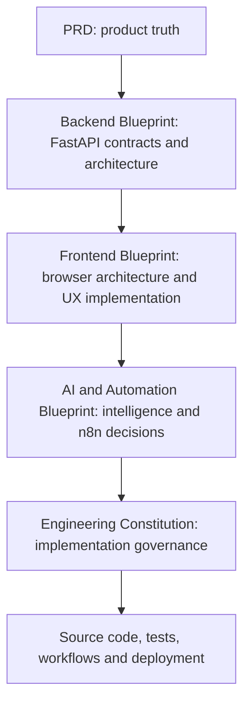

# TASC Engineering Constitution v1.0

# Trizen AI Solutions Consultant (TASC)
**Engineering Constitution**

| Field | Value |
| ---| --- |
| Document ID | TASC-CONSTITUTION-001 |
| Version | 1.0 |
| Status | Governing implementation standard |
| Product authority | [](https://app.clickup.com/90152654557/docs/2kyr8npx-515) |
| Backend standard | [](https://app.clickup.com/90152654557/docs/2kyr8npx-575) |
| Frontend standard | [](https://app.clickup.com/90152654557/docs/2kyr8npx-595) |
| AI standard | [](https://app.clickup.com/90152654557/docs/2kyr8npx-615) |
| Audience | Human engineers, reviewers, and AI coding agents |

## Constitutional status
This document governs implementation decisions. It does not redesign the product and does not replace the PRD or engineering blueprints. **The PRD defines what TASC must do. The blueprints define how each layer does it. This constitution defines how engineers must implement, review, test, and change that work.**
## Binding conflict rule
When documents disagree, apply this order: PRD, Backend Blueprint, Frontend Blueprint, AI & Automation Blueprint, this Constitution, then implementation detail. A lower-level document or code change must be adapted to the higher-level document, never the reverse. Any unresolved conflict blocks implementation and requires an architecture decision record.
## Current reconciliation decisions
*   The PRD's six runtime phases remain authoritative. The AI Blueprint's ten-stage consultant framework is an analytical mapping, not a second state machine.
*   The PRD's eight visitor-facing analysis modules remain authoritative. Do not add separate Fit, Confidence, Opportunities, or Next Action cards to the MVP.
*   FastAPI owns AI, business logic, scoring, RAG, recommendation, state, payload generation, and n8n dispatch. The browser only renders and interacts. n8n only orchestrates delivery.
*   The browser uses REST endpoints, with the message POST returning SSE. It does not use WebSockets or call providers directly.
*   AI readiness, digital maturity, business model, and expected ROI are optional enrichment fields. They are not new mandatory questions or competing scores.
## Normative terms
**MUST** is mandatory. **MUST NOT** is prohibited. **SHOULD** is the default unless documented justification exists. **MAY** is optional. Every pull request and AI-agent task MUST reference the applicable requirement or constitutional rule.
## Document map

| Page | Sections |
| ---| --- |
| 1\. Authority and Guardrails | 1 to 5 |
| 2\. Repository, API and AI Governance | 6 to 10 |
| 3\. Standards and Quality | 11 to 15 |
| 4\. Delivery Governance | 16 to 22 |

# 1. Authority and Guardrails (Sections 1 to 5)

# 1\. Purpose of the Constitution
This constitution prevents architectural drift while TASC is implemented by multiple engineers and coding agents. It makes ownership explicit, turns the approved blueprints into enforceable rules, defines quality gates, and gives reviewers a single standard for rejecting shortcuts that would create duplicate logic, unsafe AI behaviour, contract drift, or feature creep.

It governs implementation, not product discovery. Engineers MUST not use it to add features, reinterpret requirements, or replace the PRD with personal preference.
# 2\. Document Hierarchy



| Rank | Document | Authority |
| ---| ---| --- |
| 1 | PRD | Product scope, behaviour, requirements, success metrics, MVP boundary |
| 2 | Backend Blueprint | Backend structure, API contracts, persistence, operational contracts |
| 3 | Frontend Blueprint | Frontend structure, state ownership, rendering, accessibility, responsive behaviour |
| 4 | AI & Automation Blueprint | Prompt contracts, RAG, qualification, recommendation, automation intelligence |
| 5 | Constitution | Rules for implementing and changing the above |
| 6 | Code | Must conform to all higher levels |

**Conflict process:** identify the conflict in the PR or ADR, cite both locations, preserve the higher authority, update the lower-level implementation plan, and add a regression test. No engineer may resolve a conflict by silently choosing a convenient interpretation.
# 3\. Engineering Principles

| Principle | Required behaviour |
| ---| --- |
| Single responsibility | Each module has one reason to change. Routes do transport; domain services do decisions; adapters do I/O. |
| Separation of concerns | Presentation, intelligence, persistence, and automation have explicit boundaries. |
| Clean architecture | Dependencies point inward through interfaces. Domain code does not import provider SDKs. |
| Modularity | New providers, stores, or integrations use adapters and protocols, not cross-layer shortcuts. |
| Composition over inheritance | Assemble services through dependency injection. Use inheritance only for small, stable abstractions such as typed exceptions. |
| Explicit interfaces | Boundary contracts are typed, named, versioned, and tested. |
| Type safety | TypeScript strict mode and Pydantic v2 validation are mandatory. No untyped boundary dictionaries. |
| Determinism | Scores, question selection, phase transitions, routing, and service ranking are reproducible. |
| Maintainability | Prefer boring, readable code over clever abstractions. Externalise prompts and business configuration. |
| Observability | Every turn and dispatch is traceable by correlation ID, with metrics and redacted logs. |
| Scalability | Keep state behind repositories, intelligence behind interfaces, and dispatch idempotent. |
| Accessibility | The core consultation is keyboard and screen-reader usable; accessibility is a release gate. |

# 4\. Architectural Guardrails
The following are non-negotiable:

1. Never redesign the approved architecture during implementation.
2. Never move AI reasoning, scoring, RAG, or recommendation logic into n8n.
3. Never call an LLM, embedding provider, ChromaDB, or n8n directly from the browser.
4. Never duplicate business logic across frontend, backend, prompts, and workflows.
5. Never hardcode prompts, scoring weights, thresholds, service mappings, or routing policy in application code when the blueprint places them in resources or configuration.
6. Never bypass API contracts or use unvalidated JSON at a boundary.
7. Keep prompts external, versioned, reviewable, and attributable.
8. Validate every model output before it reaches domain logic.
9. Keep AI responses structured internally even when the visitor sees prose.
10. Keep the visitor panel free of prompts, raw retrieval text, chunk IDs, token counts, hidden reasoning, and internal score maths.
11. Persist payloads before dispatch and dispatch at most once per consultation unless an operator explicitly replays.
12. Do not add authentication, payments, CRM, voice, multilingual support, analytics dashboards, multi-tenancy, or other out-of-scope work to the MVP.
13. Do not catch broad exceptions outside the orchestrator stage runner and API catch-all handler.
14. Do not commit half-processed session state after a failed turn.
15. Do not change a JSON contract without updating every consumer, schema snapshot, and compatibility note.
# 5\. Ownership Boundaries

| Layer | Owns | MUST NOT own |
| ---| ---| --- |
| Frontend | Presentation, interaction, local UI state, session reference, SSE consumption, accessibility, responsive layout | AI calls, scoring, RAG, extraction, recommendations, qualification, routing, secrets, transcript authority |
| FastAPI API | Transport, validation, rate limits, error envelopes, stream lifecycle | Rendering, CSS, provider-specific business decisions |
| FastAPI domain | Conversation state, memory, prompts, RAG, extraction, qualification, recommendation, summary, payload generation | UI layout, n8n node logic, direct third-party integration details |
| FastAPI infrastructure | Provider SDKs, Chroma client, repositories, HTTPX dispatcher, prompt loading | Product decisions, scoring rules, response wording policy |
| n8n | Webhook validation, idempotency check, Google Sheets, Gmail, Telegram, action logging, acknowledgement | LLM calls, embeddings, RAG, scoring, recommendations, qualification, business-policy reinterpretation |
| Knowledge repository | Approved source content and metadata | Hidden prompts, executable instructions, unreviewed claims |
| Tests and evaluation | Verification and regression evidence | Production business logic |

When ownership is unclear, place the rule in the layer that already owns the decision, not in the caller that happens to need the result.

# 2. Repository, API and AI Governance (Sections 6 to 10)

# 6\. Folder Governance
## 6.1 Backend ownership
*   `app/api`: routes, dependencies, middleware, error mapping. No business rules.
*   `app/schemas`: Pydantic boundary contracts and event schemas. No domain imports.
*   `app/domain`: conversation, extraction, qualification, recommendation, RAG, summary, guardrails, payload assembly.
*   `app/orchestration`: pipeline sequencing, stage error containment, event emission.
*   `app/infrastructure`: OpenAI, ChromaDB, HTTPX, repositories, prompt loading, n8n dispatcher.
*   `app/resources`: prompts, catalogue, weights, vocabularies, copy. Behaviour as data.
*   `knowledge`: reviewed Markdown corpus only.
*   `tests`: unit, contract, integration, evaluation, and fakes.
## 6.2 Frontend ownership
*   `app`: routes and server-rendered shells.
*   `components`: reusable presentation components.
*   `features/consultation`: feature composition and view mapping.
*   `contexts/providers`: client state and provider composition.
*   `services`: REST and SSE transport only.
*   `types`: generated or reconciled API and event types.
*   `styles`: tokens and global styles.
## 6.3 Placement rules
New code belongs in the narrowest existing folder that owns its responsibility. Do not create parallel `helpers`, `utils`, `services`, or `logic` folders to avoid an existing boundary. A new top-level folder requires an ADR and constitution review. No folder may contain both transport code and domain decisions.
# 7\. API Governance
1. Use `/api/v1`; version in the URL, not a custom header.
2. Every endpoint declares request, response, status codes, error responses, and operation ID.
3. Every request and response crossing FastAPI is a Pydantic v2 model. Frontend types come from the OpenAPI and SSE JSON schemas.
4. Use `snake_case`, timezone-aware ISO timestamps, opaque ULIDs, explicit nulls, and lowercase enums.
5. Use one error envelope with stable machine-readable codes, visitor-safe messages, correlation ID, retryability, and optional field details.
6. The message endpoint is a POST returning SSE. Event order is `phase* → token* → analysis_snapshot → done`.
7. The frontend must ignore unknown additive event types and enum values, but reject missing required fields visibly.
8. Adding optional response fields is backward compatible. Removing, renaming, or changing required fields requires a versioned contract change.
9. Completion is idempotent. The payload's `consultation_id` is the n8n idempotency key.
10. OpenAPI, SSE JSON Schema, and AutomationPayload snapshots are CI gates.
11. Never infer a response field in the frontend when FastAPI owns it.
# 8\. AI Governance
## Prompt lifecycle
Prompts are external Markdown/Jinja resources, pinned by a manifest, append-only after merge, and versioned with a changelog and evaluation report. Prompt text is never embedded in route handlers or workflow nodes.
## Structured output
Every structured model call uses a constrained schema, Pydantic validation, optional evidence fields, one repair attempt, then a typed fallback. Model outputs are proposals, not authority. Code validates vocabulary, confidence, duplication, refusal, public-reference, pricing, and service-code rules.
## Hallucination prevention
Factual Trizen claims require retrieval evidence above the similarity floor. No evidence means deferral. Firm prices, delivery promises, and unauthorised client references are prohibited. Grounding warnings are measured. Visitor-facing UI never exposes chain-of-thought or raw model output.
## State and context
Server-side state is authoritative. Use recent verbatim turns, compacted earlier history, and structured slots. Slot values are additive, confidence-tagged, source-turn-tagged, and declined values are terminal. A failed turn does not commit partial merged state.
## Reasoning boundaries
The model may classify intent, extract candidate facts, write rationales, and write summaries. Deterministic code selects questions, computes scores, applies overrides, ranks services, assigns bands, builds routing flags, and validates payloads.
## Retrieval
Retrieval is conditional by intent and phase. Chunks are 500 to 800 tokens with 15 percent overlap, metadata-complete, filtered, floored, reranked, deduplicated, and delimited as untrusted reference data. Chunk IDs are recorded internally for every informed response.
# 9\. Knowledge Base Governance
1. The corpus is reviewed Markdown with YAML front matter, stored in Git.
2. Every document has stable `doc_id`, title, type, service codes, industry tags, public-reference flag, indicative-pricing flag, review date, owner, and summary.
3. Unknown service codes, industries, malformed metadata, stale required fields, prohibited claims, and invalid dates fail ingestion.
4. Chunk on headings and paragraphs, preserving tables and case-study result blocks. Target 500 to 800 tokens and 15 percent overlap.
5. Embed changed content only. Content hashes and the index manifest are mandatory.
6. Build a temporary Chroma collection, run smoke queries, then atomically swap. Never replace a healthy index with an unverified one.
7. Record corpus commit SHA, embedding model, dimension, chunk count, and manifest version.
8. Refresh services and case studies quarterly, FAQ monthly, pricing quarterly, process and technology twice yearly, company yearly.
9. Do not put prompt instructions, secrets, or executable content in knowledge files.
10. Roll back by reverting the corpus commit and rebuilding the index.
# 10\. n8n Governance
n8n receives only a validated, signed `AutomationPayload` from FastAPI. It verifies secret, HMAC, timestamp, schema version, and idempotency key before processing.

| Rule | Requirement |
| ---| --- |
| Webhook | Authenticated, timestamp-bound, schema-validated, correlation-aware |
| Retry | FastAPI retries timeouts and 5xx up to three attempts with backoff and jitter |
| Idempotency | Consultation ID prevents duplicate rows and actions; 409 duplicate is treated as success |
| Failure recovery | Non-retryable failures dead-letter immediately; exhausted retries create a dead-letter record and ops alert |
| Modularity | Separate nodes for validation, idempotency, Sheets, email, Telegram, action logging, acknowledgement, failure |
| Secrets | Credentials live in n8n secret storage or environment, never workflow text or source control |
| Logging | Record action-level success or failure and workflow execution ID; never log PII unnecessarily |
| Policy | Consume FastAPI routing flags. Do not recalculate score, band, recommendation, or priority |
| Acknowledgement | Return received status, execution ID, and action outcomes. Never claim skipped or failed actions succeeded |

Any workflow node that calls an LLM or implements a business rule is a constitutional violation.

# 3. Standards and Quality (Sections 11 to 15)

# 11\. Coding Standards
## Python and FastAPI
*   Python 3.12, typed public functions, strict mypy, Ruff formatting and linting.
*   Pydantic v2 for boundary contracts and settings; `extra=forbid`, frozen models where appropriate, timezone-aware datetimes.
*   Async I/O for OpenAI, ChromaDB, repositories, and n8n. Pure scoring and ranking stay synchronous.
*   Routes parse, delegate, and serialise. A route with business branching is too smart.
*   Provider SDK types do not escape infrastructure adapters.
*   Names use `snake_case` for modules, functions, and variables; `PascalCase` for classes; constants use `UPPER_SNAKE_CASE`.
## TypeScript and React
*   TypeScript strict mode. No `any` at API or event boundaries.
*   Use generated or reconciled backend types. Unknown event types are handled safely.
*   Components use `PascalCase`; hooks use `useCamelCase`; utilities use `camelCase`.
*   Server Components are default. Client Components are limited to interactive consultation surfaces.
*   Components do not fetch directly. Use services and hooks.
*   No frontend business rules, score maths, RAG logic, or recommendation filtering.
*   Tailwind and shadcn/ui follow the approved token system. No arbitrary one-off visual system.
## Shared standards
*   Imports are ordered and unused imports fail CI.
*   Comments explain why, not what. Do not restate code.
*   Public modules and contracts have concise documentation.
*   No dead code, commented-out alternatives, placeholder branches, or TODOs without an issue reference.
*   A change to behaviour requires a test or a written reason why testing is impossible.
# 12\. Security Standards
1. Keep OpenAI, embedding, Chroma, n8n, Google, Gmail, Telegram, and admin secrets server-side.
2. Read environment variables only through the settings layer. Use secret types and never log secret values.
3. Validate input length, content type, origin, rate limits, and session ownership.
4. Treat visitor input and retrieved text as untrusted data. Delimit context and block instruction injection from changing policy or invoking tools.
5. Validate all AI outputs against schemas, vocabularies, service catalogue, consent rules, and commercial claim rules.
6. Capture contact details only after consent. Do not place PII in URLs, local storage, browser logs, analytics events, or error trackers.
7. Redact email, phone, names, raw messages, full assistant output, and retrieved text from logs.
8. Authenticate n8n with shared secret, HMAC signature, timestamp freshness, correlation ID, and idempotency key.
9. Enforce HTTPS, CORS allowlists, trusted hosts, and rate limits.
10. Never accept an unverified webhook, stale signature, unsupported schema, or duplicate non-replay delivery.
# 13\. Performance Standards

| Target | Standard |
| ---| --- |
| First streamed token | Under 1.2s p95 |
| Full assistant turn | Under 6s p95 |
| Retrieval | Under 300ms p95 |
| Analysis snapshot render | Under 300ms after event |
| Initial consultation LCP | Under 2.0s on a 4G profile |
| Concurrent sessions | 50 per backend instance for MVP |
| Automation delivery | 99% with retry and dead-letter handling |
| Cost | Under $0.05 per completed consultation |

Required practices: conditional retrieval, content-hash embedding cache, per-turn query-vector reuse, parallel intent and extraction, compact schemas, history compaction, whole-chunk context trimming, one rationale call for all recommendations, token streaming, memoised frontend modules, route-level code splitting, and no unnecessary charting or voice libraries.

Performance optimisations must not weaken grounding, schema validation, accessibility, or ownership boundaries.
# 14\. Logging and Observability
Every request and turn has a correlation ID. Standard events include session creation, turn start and completion, intent, slot changes without values, retrieval result and chunk IDs, deferral, score, recommendations, grounding warnings, degradations, payload validation, dispatch attempts, acknowledgements, dead letters, and replays.

Metrics MUST cover:
*   conversation latency, first token, completion, abandonment, turn depth;
*   lead bands, scores, qualification confidence, contact capture, human requests;
*   prompt versions, token size, repair rate, fallback rate, banned-claim incidents;
*   retrieval latency, empty rate, similarity distribution, stale-document usage;
*   automation attempts, acknowledgement, action-level success, dead letters, replays;
*   token usage and estimated cost.

Tracing follows one turn across guardrails, parallel understanding, retrieval, reasoning, generation, grounding, and snapshot emission. Dispatch is a separate trace linked by consultation ID. Errors go to the approved tracker with correlation ID and redacted context.
# 15\. Testing Constitution
Testing is mandatory at every boundary:

| Test layer | Mandatory coverage |
| ---| --- |
| Unit | Pure scoring, banding, overrides, question selection, normalisation, slot merging, ranking, query building, reranking, snapshot ordering |
| API | Request validation, status codes, error envelope, SSE event order, rate limits, session expiry, idempotency |
| Integration | Full FastAPI flow with fake providers, repositories, Chroma, and n8n; no accidental external calls |
| Conversation | Fast-track, knowledge interruption, pricing, rejection, contradiction, refusal, human request, anti-persona, timeout, abandonment, completion |
| RAG | Front matter, chunk boundaries, hash skip, retrieval precision, similarity floor, deferral, citations, metadata filters |
| Prompt | Golden rendering, structured output, one-question adherence, banned claims, deferral, injection, summary limits |
| Automation | Signature, timestamp, retries, 409 handling, dead-letter, replay, partial integration outcomes, acknowledgement |
| Regression | Every production defect gets a deterministic fixture and a test before closure |
| Manual acceptance | Full 8-turn scripted consultation, mobile flow, keyboard-only flow, provider outage, n8n failure, refresh recovery |

Release gates include grounding ≥95%, retrieval precision at 5 ≥0.80, extraction ≥90%, recommendation top-1 ≥85%, deferral ≥95%, persona adherence ≥95%, zero hallucinated commitments, and automation delivery ≥99%.

# 4. Delivery Governance (Sections 16 to 22)

# 16\. Git Workflow
## Branches
*   `main` is always releasable.
*   Short-lived branches use `feat/`, `fix/`, `refactor/`, `docs/`, `test/`, or `chore/` plus a concise name.
*   One branch has one coherent change. No drive-by refactors.
*   Prompt, knowledge, schema, workflow, and code changes are linked to the same issue or ADR when they change runtime behaviour.
## Commits
Use Conventional Commits: `feat(scope):`, `fix(scope):`, `refactor(scope):`, `test(scope):`, `docs(scope):`, `chore(scope):`. Keep commits small and buildable. Mention requirement IDs in the body when relevant.
## Pull requests
Every PR MUST include:

1. Problem and intended behaviour.
2. Requirement and blueprint references.
3. Files and ownership boundaries affected.
4. Tests run and results.
5. Contract, prompt, knowledge, or workflow compatibility impact.
6. Security and PII impact.
7. Performance impact.
8. Rollback plan for runtime behaviour changes.
9. Screenshots or a recording for frontend-visible changes.
10. Evaluation report for prompt or knowledge changes.

Required reviewers: owning-layer engineer plus one reviewer for any cross-layer, contract, security, prompt, scoring, RAG, or automation change. No self-approval. No merge with failing gates, unresolved review comments, undocumented contract drift, or unreviewed generated code.
# 17\. Definition of Done
A feature is complete only when:
*   it traces to an approved requirement;
*   it lives in the correct folder and obeys import boundaries;
*   all boundary data is typed and validated;
*   tests cover happy path, failure path, and relevant edge cases;
*   logs, metrics, correlation IDs, and redaction are present;
*   accessibility and responsive behaviour are verified for frontend work;
*   prompts, knowledge, scoring, and routing changes are versioned and evaluated;
*   no secret or PII leaks;
*   API and JSON schema snapshots pass;
*   performance targets are not regressed;
*   deployment and rollback are documented;
*   the implementation is reviewed by the owning team;
*   the acceptance gate for the current phase is green.
# 18\. MVP Scope Guardrails
The assessment MVP includes the consultation, grounded RAG, deterministic scoring, recommendations, summary, Live Analysis Panel, validated payload, and n8n delivery to Google Sheets, Gmail, and Telegram.

Explicitly out of scope:
*   visitor authentication or accounts;
*   payments, contracts, checkout, or proposal approval;
*   CRM integrations;
*   analytics dashboard;
*   voice input or output;
*   multilingual support;
*   admin panel or self-serve knowledge UI;
*   multi-tenancy;
*   native mobile applications;
*   human live takeover console;
*   automated proposal or SOW generation;
*   model fine-tuning;
*   A/B testing framework;
*   file upload implementation;
*   calendar booking;
*   new visitor-facing analysis cards beyond the PRD eight.

A request in this list is not a small enhancement. It is a roadmap item requiring product approval and a scope decision.
# 19\. AI Coding Agent Constitution
Claude Code, Cursor, Copilot, and similar agents MUST:

1. Read the PRD, Backend Blueprint, Frontend Blueprint, AI & Automation Blueprint, and this constitution before writing code.
2. Treat the PRD as the product source of truth.
3. Never invent an endpoint, field, enum, folder, integration, or workflow node.
4. Never redesign architecture or rename governed folders without an approved ADR.
5. Never move AI reasoning into the frontend or n8n.
6. Never modify a JSON contract without updating every producer, consumer, schema snapshot, and test.
7. Always generate typed code and use existing protocols, repositories, services, and components before creating new abstractions.
8. Complete one milestone and its acceptance gate before starting the next.
9. Avoid placeholder implementations, fake success responses, silent fallbacks, and TODO branches unless explicitly instructed.
10. Do not make broad refactors while implementing a feature.
11. Ask for clarification only when the documents conflict or a missing parameter would create destructive ambiguity; otherwise follow the documented default.
12. Report changed files, requirement references, tests, risks, and any unresolved issue at task completion.
13. Never expose secrets, PII, prompts, chain-of-thought, retrieval text, or internal telemetry.
14. Never claim a feature is complete without running the relevant tests and acceptance gate.
## Agent workflow

```text
Read documents → identify owning layer → inspect existing contracts → plan smallest change → implement typed change → add tests → run gates → review boundary impact → report
```

# 20\. Build Order

```mermaid
flowchart LR
    A[Repository and governance] --> B[Frontend shell and tokens]
    B --> C[Backend skeleton and contracts]
    C --> D[Knowledge corpus and index]
    D --> E[RAG retrieval and grounding]
    E --> F[Conversation state and memory]
    F --> G[AI extraction and response streaming]
    G --> H[Recommendation engine]
    H --> I[Lead qualification]
    I --> J[Summary and AutomationPayload]
    J --> K[n8n integration]
    K --> L[Cross-layer testing]
    L --> M[Deployment and handover]
```



The vertical slice may stub only interfaces, not behaviour: repository and contracts first, static greeting and stream transport, then real extraction, RAG, deterministic recommendation and score, completion, n8n, hardening, evaluation, and deployment.
# 21\. Acceptance Gates

| Gate | Must pass before proceeding |
| ---| --- |
| G0 Governance | Documents pinned, folder tree approved, CI and import boundaries active, environment parity checked |
| G1 Contracts | OpenAPI, SSE events, Pydantic models, TypeScript types, error envelope and idempotency rules pass snapshots |
| G2 Shell | Frontend route loads, static greeting is fast, responsive shell and accessibility baseline pass |
| G3 Backend turn | Session creation, one turn, SSE order, persistence, failure recovery, and session isolation pass |
| G4 Knowledge | Minimum corpus validates, index builds, smoke queries pass, unchanged files skip embeddings |
| G5 Intelligence | Extraction, memory, question selection, grounding, scoring, recommendation, and fallback tests pass |
| G6 Handoff | Payload validates, persists, dispatches once, retries, dead-letters, replays, and acknowledges correctly |
| G7 Hardening | Security, PII redaction, rate limits, observability, performance, accessibility, and evaluation gates pass |
| G8 Release | Full scripted consultation, preview smoke test, production health, rollback, runbook, and handover pass |

No phase may be marked complete because a later phase is expected to fix an earlier gate.
# 22\. Final Engineering Checklist
## Governance and repository
- [ ] All four approved documents and this constitution are pinned by version.
- [ ] Conflicts are resolved in favour of the PRD and recorded.
- [ ] Folder ownership and import boundaries are enforced in CI.
- [ ] No unapproved top-level directories or duplicate logic paths exist.
## Contracts and integration
- [ ] OpenAPI, SSE, payload, and error schemas are typed and snapshot-tested.
- [ ] Frontend types match backend contracts.
- [ ] Session lifecycle, expiry, completion, and idempotency are tested.
- [ ] Unknown additive fields and events fail safely.
## AI and knowledge
- [ ] Prompts are external, versioned, append-only, and evaluated.
- [ ] Structured model outputs validate before domain use.
- [ ] RAG corpus metadata, hashes, chunking, index manifest, and atomic swap are implemented.
- [ ] Deferral works when retrieval is weak or unavailable.
- [ ] Scores, bands, question selection, ranking, and routing are deterministic.
- [ ] Recommendations never leave the service catalogue.
- [ ] Citation IDs are recorded internally and in the payload.
## Frontend
- [ ] Browser calls only FastAPI.
- [ ] Eight PRD-approved panel modules render from full backend snapshots.
- [ ] No internal reasoning, raw retrieval, token counts, or sales-only language appears.
- [ ] SSE phases, tokens, snapshot, error, and done events render correctly.
- [ ] Refresh, retry, expiry, mobile drawer, keyboard, screen reader, dark mode, and reduced motion pass.
## Automation and operations
- [ ] n8n has no AI calls or competing business logic.
- [ ] Webhook authentication, timestamp, HMAC, idempotency, retries, dead-letter, replay, and acknowledgement work.
- [ ] Sheets, sales email, Telegram, visitor confirmation, and action-level logging are tested.
- [ ] Correlation IDs, redacted logs, metrics, traces, alerts, and error tracking are live.
## Release
- [ ] Unit, API, integration, conversation, RAG, prompt, automation, regression, manual, accessibility, and load tests pass.
- [ ] Grounding, retrieval, extraction, recommendation, persona, deferral, and automation thresholds pass.
- [ ] No secrets or PII appear in source, bundles, logs, URLs, fixtures, or telemetry.
- [ ] Preview and production use separate backend and n8n targets.
- [ ] Runbook, knowledge authoring guide, prompt changelog, rollback plan, and handover docs are complete.
- [ ] Full scripted consultation completes twice without manual intervention.

**Constitutional conclusion:** If a proposed implementation cannot satisfy these rules, it is not ready to merge. The answer is to change the implementation, not to weaken the constitution.