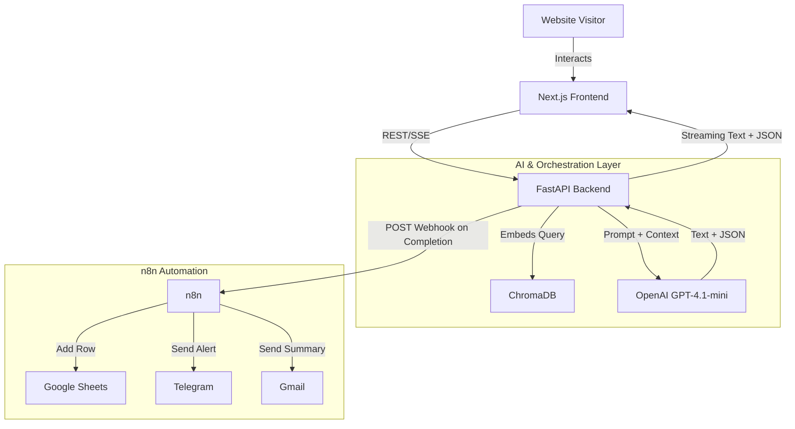
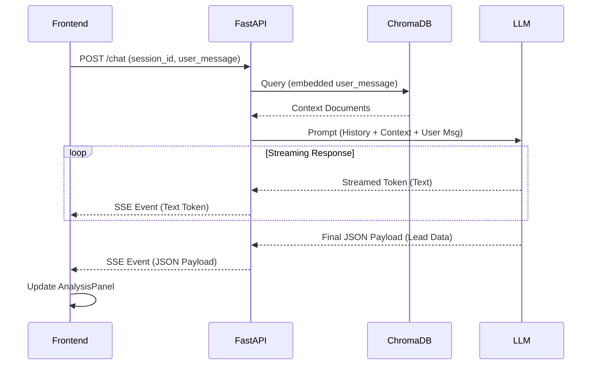
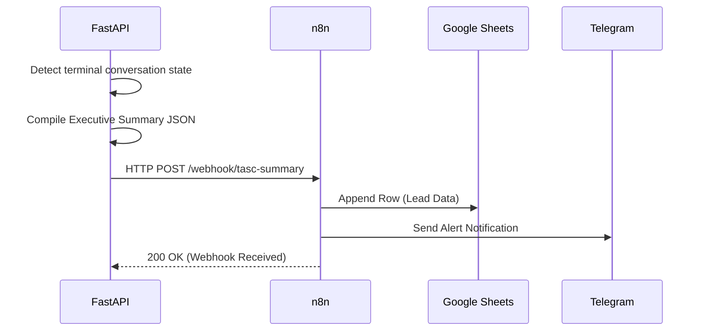
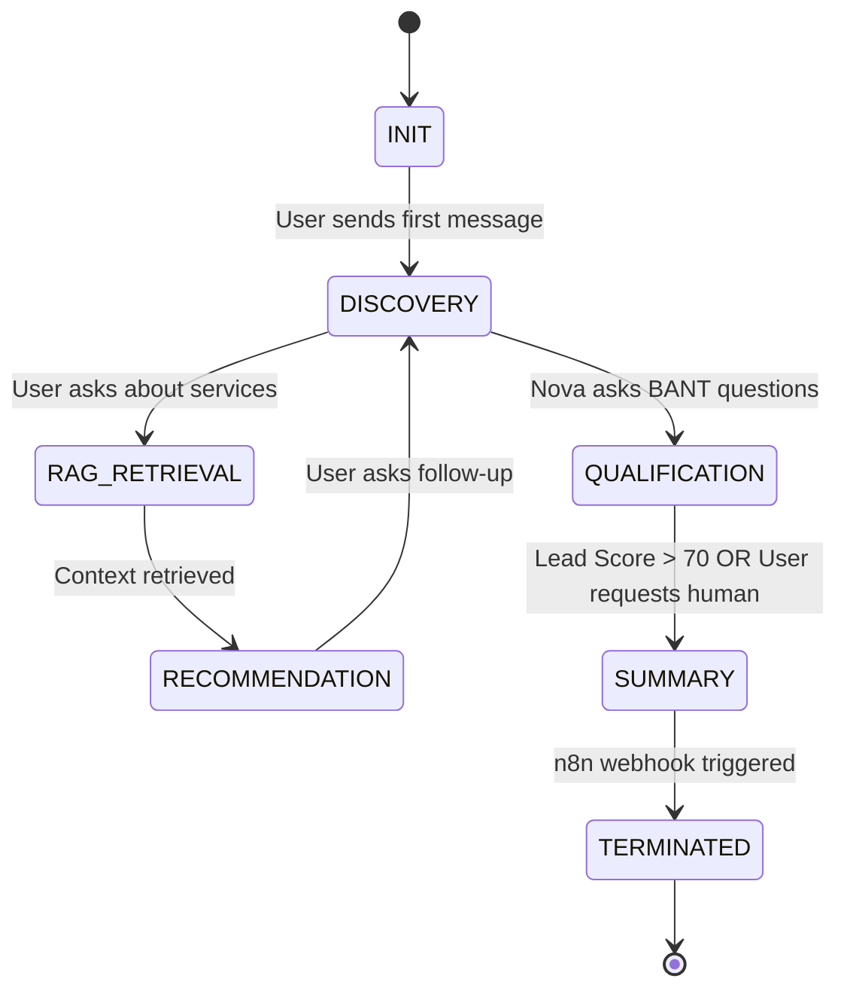

# Trizen AI Solutions Consultant (TASC) - Engineering Specification

## 1. Executive Summary

The Trizen AI Solutions Consultant (TASC) is an MVP AI-powered pre-sales consultant designed for Trizen Ventures. TASC features an AI agent named "Nova" that engages website visitors in natural conversation, understands their business requirements, retrieves relevant company knowledge via Retrieval-Augmented Generation (RAG), and recommends appropriate Trizen services. The system qualifies leads in real-time, generates structured sales summaries, and triggers downstream CRM and notification automations via n8n. This document provides a comprehensive, implementation-ready engineering specification detailing the product, architecture, and deployment strategies for a cross-functional engineering team.

## 2. Problem Statement

Trizen Ventures faces scalability challenges in pre-sales consultation. Human consultants spend excessive time answering repetitive initial queries, qualifying unfit leads, and manually transcribing discovery call notes into CRM systems. This creates a bottleneck, delaying responses to high-value prospects and resulting in lost opportunities. There is a need for an automated, intelligent front-line consultant that can maintain a high-quality conversational experience, accurately retrieve Trizen's service capabilities, and seamlessly structure lead data for the human sales team.

## 3. Business Context

Trizen Ventures provides AI automation and software engineering solutions. The sales cycle typically begins with a website visitor inquiring about services. Currently, this relies on static forms or direct human intervention. The business requires an automated technical assessment tool that operates 24/7, enforces a consistent qualification framework, and ensures no lead is dropped, while accurately reflecting Trizen's technical capabilities through a curated knowledge base.

## 4. Product Vision

To build a frictionless, intelligent pre-sales gateway where prospects feel heard and understood, while Trizen's sales team receives highly qualified, context-rich leads ready for immediate technical follow-up.

## 5. Project Scope

### In Scope
- Next.js 15 / React 19 web interface with split-pane chat and live analysis layout.
- FastAPI backend orchestrating AI logic, prompt management, and RAG retrieval.
- ChromaDB integration for Trizen's curated service knowledge.
- Real-time lead qualification and scoring engine.
- Structured JSON summary generation upon consultation completion.
- n8n workflow integration for triggering downstream actions (Google Sheets, Gmail, Telegram).

### Out of Scope
- User authentication and session persistence across devices.
- Direct calendar booking within the chat interface.
- Multi-language support (MVP is English only).
- Direct integration with CRM APIs (handled by n8n).
- Voice-based conversation capabilities.

## 6. Success Metrics

| Metric | Target | Measurement Method |
| :--- | :--- | :--- |
| Lead Qualification Rate | 40% of conversations | Backend Analytics |
| Conversation Engagement | > 5 messages per session | Frontend Telemetry |
| RAG Accuracy | < 5% hallucination rate on services | Manual Audit / Feedback |
| Automation Trigger Reliability | 99.9% webhook success rate | n8n Execution Logs |
| Response Latency | < 3 seconds per AI turn | FastAPI APM |

## 7. User Personas

**Persona 1: Prospective Client (Sarah)**
- *Role:* CTO of a mid-sized logistics company.
- *Goal:* Wants to know if Trizen can automate her dispatch system.
- *Pain Point:* Doesn't want to fill out a static form; wants immediate, technical feedback on feasibility.

**Persona 2: Trizen Sales Engineer (Marcus)**
- *Role:* Senior Sales Engineer at Trizen.
- *Goal:* Wants to spend time only on highly qualified leads.
- *Pain Point:* Currently sifts through unstructured form submissions and repetitive initial calls.

## 8. User Journey

1. **Arrival:** User lands on the Trizen website and opens the TASC chat widget.
2. **Greeting:** Nova introduces itself and asks an open-ended discovery question.
3. **Discovery & Retrieval:** User describes their problem. Nova queries the RAG database to find relevant Trizen case studies or services.
4. **Live Analysis:** As the user types, the right-hand panel updates with extracted industry, pain points, and a preliminary lead score.
5. **Recommendation:** Nova suggests specific Trizen services and asks clarifying questions about budget/timeline.
6. **Closure:** Upon gathering sufficient information, Nova signals the end of the consultation.
7. **Handoff:** FastAPI triggers n8n. Marcus receives a Telegram alert and an email with a structured summary; a row is added to Google Sheets.

## 9. Functional Requirements

- **FR1:** The system must support real-time, streaming text responses from the AI to the frontend.
- **FR2:** The backend must query ChromaDB for context on every user turn before prompting the LLM.
- **FR3:** The AI must output a hidden, structured JSON payload alongside user-facing text containing Lead Score, Industry, Pain Points, and Recommended Services.
- **FR4:** The frontend must parse this JSON and update the Live Analysis Panel dynamically.
- **FR5:** Upon reaching a terminal conversation state, FastAPI must compile a final executive summary and POST it to an n8n webhook.

## 10. Non-functional Requirements

- **NFR1 (Performance):** Time to First Token (TTFT) must be under 1.5 seconds.
- **NFR2 (Security):** n8n webhook endpoints must require header-based authentication tokens.
- **NFR3 (Modularity):** The LLM provider must be abstracted via an interface to allow swapping OpenAI with Anthropic or local models without altering core orchestration logic.
- **NFR4 (Availability):** The FastAPI backend must be stateless to allow horizontal scaling.
- **NFR5 (UX):** The UI must display contextual loading states (e.g., "Searching company knowledge...") without exposing raw LLM reasoning chains.

## 11. Product Features

1. **Conversational Interface:** Split-screen layout with chat on the left and dynamic analysis on the right.
2. **RAG-Powered Knowledge Base:** Deep integration with Trizen's internal documentation via ChromaDB.
3. **Real-time Lead Qualification:** Continuous background extraction and scoring of lead attributes.
4. **Service Recommendation Engine:** Contextual matching of user pain points to Trizen service offerings.
5. **Automated Handoff:** Structured JSON payload generation and n8n webhook triggering.

## 12. Detailed Conversation Flow

1. **Initiation:** Nova introduces itself: *"Hi, I'm Nova, AI Solutions Consultant for Trizen. What business challenge are you looking to solve today?"*
2. **User Input:** User describes their scenario.
3. **Internal Processing:** 
   - FastAPI receives text.
   - Generates embedding, queries ChromaDB.
   - Injects context into system prompt.
   - Instructs LLM to generate conversational reply + JSON analysis.
4. **Loading State:** Frontend displays "Understanding your business..." while waiting for the stream.
5. **Nova Reply:** Nova answers the user, referencing Trizen capabilities.
6. **Panel Update:** Frontend receives JSON chunk, updates Right Panel (e.g., Lead Score changes from 10 to 40).
7. **Qualification Loop:** Nova asks 2-3 targeted discovery questions (Budget, Authority, Need, Timeline).
8. **Termination:** User indicates they are ready to talk to a human, or Nova determines enough data is collected. Nova says: *"I've prepared a summary for our team. A human consultant will reach out shortly."*

## 13. AI Consultation Workflow

The AI workflow operates on a stateful conversational loop managed by FastAPI using session IDs.

1. **State Retrieval:** FastAPI retrieves conversation history using a session ID.
2. **Intent Routing:** The LLM classifies the user's latest message (e.g., `Question`, `Requirement`, `Greeting`).
3. **Retrieval:** If intent is `Question` or `Requirement`, FastAPI embeds the query and searches ChromaDB.
4. **Prompt Assembly:** FastAPI constructs a prompt containing:
   - System Persona (Nova)
   - RAG Context (from ChromaDB)
   - Conversation History
   - Output Instructions (Strict JSON schema + conversational text)
5. **LLM Invocation:** Call to GPT-4.1-mini.
6. **Response Parsing:** FastAPI splits the response. User-facing text is streamed to the frontend. The JSON block is validated and sent to a dedicated WebSocket or SSE endpoint for the Live Analysis Panel.

## 14. Lead Qualification Strategy

TASC uses an adapted BANT (Budget, Authority, Need, Timeline) framework combined with technical fit.

- **Lead Score (0-100):** Calculated based on keyword extraction and explicit answers.
  - *Need (40 pts):* Does the problem match Trizen's core services?
  - *Authority (20 pts):* Is the user a decision-maker?
  - *Budget (20 pts):* Is there an allocated budget?
  - *Timeline (20 pts):* Is the timeline within the next 6 months?
- **Status Progression:** `Cold` (0-30) -> `Warm` (31-70) -> `Qualified` (71-100).
- The backend dynamically adjusts this score after every user turn based on the LLM's JSON analysis output.

## 15. Recommendation Strategy

Recommendations are driven by semantic similarity between user pain points and Trizen service descriptions stored in ChromaDB.

- Trizen services are tagged with metadata (e.g., `service_type: automation`, `tech_stack: n8n`).
- When user pain points are detected, FastAPI queries ChromaDB with a filter.
- The LLM is instructed to format the retrieved service names into a `recommended_services` array in its JSON output.
- The LLM must only recommend services found in the RAG context; if no context is retrieved, it must return an empty array and offer a general consultation.

## 16. Live Analysis Panel Specification

The Right-Hand Panel updates in real-time. It requires the following data points from the backend's JSON payload:

| UI Element | Data Source | Update Frequency |
| :--- | :--- | :--- |
| Lead Status | `lead_status` (String) | Per User Turn |
| Lead Score | `lead_score` (Integer) | Per User Turn |
| Industry | `industry` (String) | Per User Turn |
| Business Size | `business_size` (String) | Per User Turn |
| Pain Points | `pain_points` (Array of Strings) | Per User Turn |
| Recommended Services | `recommended_services` (Array) | Per User Turn |
| Conversation Progress | `progress` (Percentage) | Per User Turn |
| Qualification Status | `qualification_status` (Enum) | Per User Turn |

*Note: The UI must use smooth transitions (e.g., Tailwind CSS animations) when values change to avoid jarring re-renders.*

## 17. Frontend User Experience

- **Framework:** Next.js 15 (App Router) with React 19.
- **Styling:** TailwindCSS integrated with shadcn/ui components.
- **Layout:** 
  - Left Pane (60% width): Chat interface with message bubbles, auto-scrolling, and a sticky input field.
  - Right Pane (40% width): Live Analysis Dashboard using shadcn Cards and Badges.
- **Loading States:** Instead of a standard spinner, the chat interface will display typographic loading messages mapped to backend stages (e.g., when FastAPI queries ChromaDB, the UI shows "Searching company knowledge...").
- **Accessibility:** ARIA labels for dynamic content, high contrast ratios, and keyboard-navigable input.

## 18. System Architecture

## 19. Component Architecture

**Frontend Components (Next.js):**
- `ChatContainer`: Manages message state and WebSocket/SSE connection.
- `MessageBubble`: Renders individual messages (Nova vs. User).
- `AnalysisPanel`: Container for the right-side dashboard.
- `AnalysisCard`: Reusable component for displaying score, industry, etc.
- `LoadingIndicator`: Contextual typographic loading state.

**Backend Components (FastAPI):**
- `ChatRouter`: Handles incoming HTTP requests and SSE streams.
- `SessionManager`: Manages conversation history (in-memory Redis for MVP).
- `RAGService`: Handles embedding generation and ChromaDB queries.
- `PromptOrchestrator`: Assembles system prompts, RAG context, and enforces JSON output schema.
- `LLMClient`: Abstracted OpenAI client interface.
- `WebhookDispatcher`: Sends final payload to n8n.

## 20. Sequence Diagrams

### Chat Interaction Sequence

### Automation Trigger Sequence

## 21. Data Flow

1. **Inbound:** User text -> JSON payload over HTTPS to FastAPI.
2. **Internal (FastAPI):** Text embedded -> Vector search -> Context injected -> LLM prompt constructed.
3. **Outbound (Real-time):** LLM response split into Text Stream and JSON Metadata. Both sent via Server-Sent Events (SSE) to the frontend.
4. **Outbound (Async):** Upon completion, a comprehensive JSON object containing the full conversation log, lead score, and summary is sent via HTTP POST to n8n.

## 22. State Diagram

## 23. Deployment Architecture

- **Frontend:** Deployed on Vercel. Next.js App Router optimized for Edge Network.
- **Backend (FastAPI):** Deployed on Render or AWS App Runner. Containerized (Docker) Python 3.12 environment.
- **Vector DB (ChromaDB):** Hosted persistently via Chroma Cloud or a managed Redis/Postgres with pgvector for MVP simplicity.
- **n8n:** Self-hosted n8n instance on a small EC2 instance or Render background worker, secured behind an Nginx reverse proxy with SSL.
- **Secrets Management:** Environment variables managed via Vercel and Render dashboards. OpenAI API keys stored securely in backend environment.

## 24. Risks

| Risk | Impact | Mitigation |
| :--- | :--- | :--- |
| LLM Hallucination on Pricing/Capabilities | High | Strict RAG grounding; prompt instructions to state "I don't know" if context is missing. |
| JSON Parse Failures from LLM | Medium | Use OpenAI Structured Outputs / Function Calling to guarantee JSON schema adherence. |
| High API Latency | Medium | Implement streaming; use `gpt-4.1-mini` for speed; keep prompt token size optimized. |
| n8n Webhook Timeout | Low | FastAPI executes webhook dispatch as a background task; does not block user session closure. |

## 25. Future Improvements

- **CRM Native Integration:** Direct API integration with HubSpot/Salesforce, bypassing n8n for real-time CRM updates.
- **Multi-agent Architecture:** Separation of "Discovery Agent" and "Technical Recommendation Agent" for deeper domain expertise.
- **Calendar Booking:** Inline calendar integration (e.g., Cal.com) when a lead reaches "Qualified" status.
- **Analytics Dashboard:** A separate Trizen admin portal to view conversation transcripts and lead conversion funnels.
- **Voice Interface:** Integration with OpenAI Realtime API for voice-based consultation.

## 26. Implementation Roadmap

| Phase | Duration | Focus Area | Deliverables |
| :--- | :--- | :--- | :--- |
| **Phase 1** | Week 1 | Backend & RAG | FastAPI setup, ChromaDB integration, Prompt design, OpenAI structured outputs. |
| **Phase 2** | Week 1-2 | Frontend UI | Next.js layout, Chat container, SSE integration, Live Analysis Panel components. |
| **Phase 3** | Week 2 | Lead Qualification | Implementation of scoring logic, dynamic JSON updates, UI state transitions. |
| **Phase 4** | Week 3 | n8n Automation | n8n workflow setup, Google Sheets/Gmail/Telegram nodes, Webhook authentication. |
| **Phase 5** | Week 3 | Testing & Deploy | E2E testing, prompt tuning, Vercel/Render deployment, n8n production handoff. |