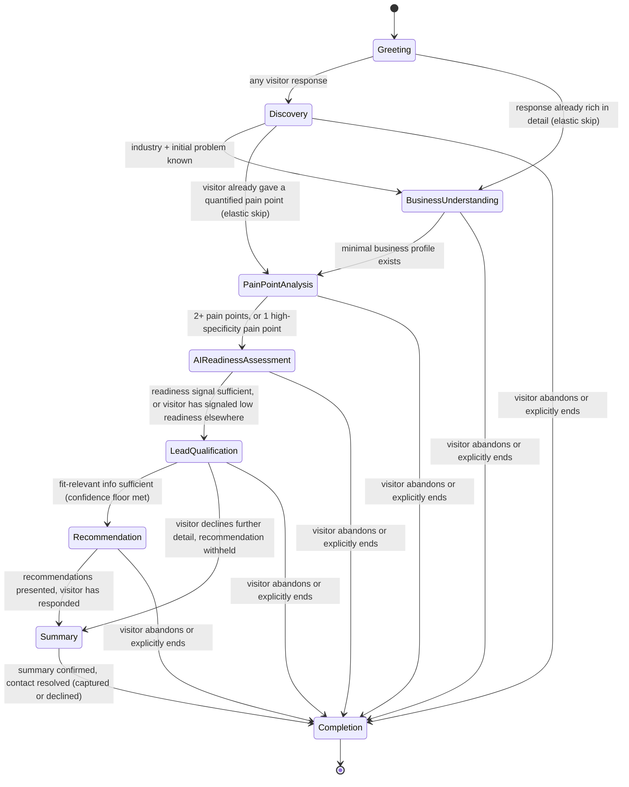

# Consultation State Machine

**Document ID:** TASC-CSM-001
**Version:** 1.0.0
**Status:** Authoritative — defines the consultation lifecycle for the AI Business Consultant
**Companion documents:** `CONSULTATION_RESPONSE_CONTRACT.md` (the object this state machine produces at every turn), the Backend Engineering Blueprint (how this state machine is implemented)

This is a system design document, not source code. It defines *what* the consultation should do at every stage of a conversation — what it needs to know, what it asks, what it extracts, and when it moves on — so that any engineer or coding agent implementing the orchestration layer has zero ambiguity about the conversational logic, independent of how it's coded.

---

## 1. Purpose

A chatbot answers whatever is asked, in whatever order it's asked, and calls that a conversation. A consultant runs a process. This document exists to make that difference concrete and buildable: it specifies the exact sequence of consultation stages, what each stage is trying to learn, what counts as "enough" at each stage, and how the AI decides to ask one more question versus move forward — so the resulting conversation reads as a professional consultation being conducted by someone who knows what they're doing, not a form being filled in one field at a time.

Every behavior specified here is what the orchestration layer (Layer 2 in the Backend Engineering Blueprint) and the domain services beneath it (Layer 3) must implement to produce the `business_profile`, `ai_readiness`, `lead_qualification`, and `recommendations` sections of the Consultation Response Contract, turn by turn, in a way that feels earned rather than extracted.

---

## 2. Consultation Philosophy

Five principles distinguish this design from a scripted intake form:

1. **The stage is internal; the conversation is not.** The visitor never sees a stage name, a progress label, or "Question 4 of 9." Stages are a structure the AI reasons with, not a structure it narrates. The dashboard (a separate surface) may show progress; the conversation itself never does.
2. **One question per turn, always the most valuable one.** A real consultant does not ask three things at once. Every AI turn asks at most one open question, and it is always the single highest-value question available given everything already known — never the next item on a fixed checklist asked in a fixed order.
3. **Stages are elastic, not sequential gates.** A visitor who opens with "we're a 40-person logistics company drowning in manual order entry and need something in the next month" has already answered Discovery, most of Business Understanding, and part of Pain Point Analysis in one sentence. The state machine must recognize this and skip stages whose required information already exists — never re-ask a question whose answer is already on the table.
4. **Depth beats coverage.** It is better to leave a stage with two well-quantified pain points than five vague ones. Exit criteria (Section 4) are written to reward specificity, not to reward the number of fields technically populated.
5. **The visitor is always allowed to lead.** The AI has a process, not a script it enforces against resistance. Every stage's transition rules include what happens when the visitor changes the subject, refuses to answer, or asks their own question — and in every one of those cases, the AI follows the visitor first and returns to its own agenda gracefully, never insists.

---

## 3. High-Level Flow Diagram

Any stage can transition directly to `Completion` at any time via explicit close ("that's all for now, thanks") or abandonment (visitor stops responding). This is not drawn as an exception path — it is a first-class transition available from every stage, because a real consultation can end at any point without that being a failure of the process.

---

## 4. Complete State Machine

### 4.1 Greeting

**Objective.** Establish that this is a consultation, not a support chatbot, and invite the visitor to describe what brought them here — in their own words, unprompted by a menu of options.

**Required information.** None. This stage produces zero business facts by design; it exists purely to open the conversation on the right footing.

**Questions to ask.** Exactly one, always the same shape: an open invitation to describe the problem, never a multiple-choice framing. Example: *"What's the problem you're trying to solve?"*

**Information to extract.** None formally expected from the greeting message itself, since there is nothing to extract yet — but the visitor's *response* to the greeting is evaluated opportunistically (see the elastic-skip note in Section 3): if it already contains an industry, a pain point, or a business-size signal, that extraction happens immediately and the state machine advances past whatever stages those facts satisfy.

**Exit criteria.** Any non-empty visitor response.

**Transition rules.** → Discovery on a typical response. → Business Understanding or later, skipping Discovery, if the response is already rich enough that Discovery's own exit criteria (industry + initial problem) are already satisfied.

**Expected dashboard updates.** `lead_status: "exploring"`, `conversation_progress.stage: "understanding"`, `metadata.completeness: 0`. No score, no chips populated yet.

---

### 4.2 Discovery

**Objective.** Get broad orientation — what industry the visitor operates in, and a first-pass sense of what's driving them to look into a solution now. This stage is about breadth, not depth; depth belongs to Pain Point Analysis.

**Required information.** `industry` (confirmed or reasonably inferred), an initial problem statement (even an unquantified one).

**Questions to ask.** *"What industry are you in?"* if not already known; *"What's driving you to look into this now?"* if industry is known but motivation isn't. Never both in the same turn.

**Information to extract.** `business_profile.industry`, an initial `pain_points` entry (low specificity is expected and acceptable at this stage), any early urgency language.

**Exit criteria.** Industry identified AND an initial problem statement captured. If the visitor is vague on the problem ("just exploring options"), one clarifying follow-up is permitted before moving on regardless of how specific the answer becomes — this stage does not loop.

**Transition rules.** → Business Understanding once exit criteria are met. → directly to Pain Point Analysis if the visitor's answer already contains a quantified, specific pain point (elastic skip, Section 3 principle 3).

**Expected dashboard updates.** `industry` chip populates (status `confirmed` or `inferred`), first `pain_points` entry may appear, `conversation_progress.stage` moves to `"exploring"`.

---

### 4.3 Business Understanding

**Objective.** Build enough of a business profile to contextualize everything that follows — how big the operation is, what they're currently using, and who else might be involved in a decision.

**Required information.** `company_size` at minimum; `current_tools` and `decision_maker` role are gathered opportunistically but do not block progression on their own.

**Questions to ask.** *"How big is your team?"* (if size unknown); *"What are you using today to handle [the process they mentioned]?"* (if tools unknown and relevant); *"Who else would typically be involved in a decision like this?"* (only if the conversation has reached a point where authority matters — this question is often deferred to Lead Qualification if it would feel premature here).

**Information to extract.** `business_profile.company_size`, `business_profile.current_tools`, `business_profile.decision_maker` (envelope with `status: inferred` if not asked directly yet).

**Exit criteria.** `company_size` known (confirmed, inferred, or explicitly declined) AND at least one signal about current tooling exists — OR the visitor has been asked about size/tools and given only vague answers twice, in which case the stage exits anyway rather than pressing further (Section 5, diminishing-returns rule).

**Transition rules.** → Pain Point Analysis once a minimal business profile exists, regardless of whether every optional field in this stage is filled.

**Expected dashboard updates.** `business_size` chip populates. `qualification_status.business_context_understood` moves to `met` (or `declined` if the visitor declined to share). `conversation_progress` slot count increases.

---

### 4.4 Pain Point Analysis

**Objective.** This is the stage the whole consultation is built around: understand the friction in real terms — what it costs, how often it happens, what breaks when it goes wrong — not just that a problem exists.

**Required information.** At least two distinct pain points, or one pain point captured with high specificity (quantified time/cost/frequency and a clear severity signal).

**Questions to ask.** *"How much time does that take today?"* / *"How often does that come up?"* / *"What happens when that goes wrong?"* / *"Is this a bottleneck across the team, or mainly for a few people?"* — always the single question that would most sharpen the current best-understood pain point, never a generic "tell me more."

**Information to extract.** `business_profile.pain_points[]` entries — `description`, `category`, `severity`, `confidence` — refined and re-confirmed as the visitor elaborates, not just appended as new items each turn.

**Exit criteria.** Two or more pain points captured, OR one pain point with a quantified impact and clear severity, OR the visitor has been asked three follow-ups on the same pain point and continues to answer vaguely (move on — depth has a ceiling; forcing a fourth attempt reads as interrogation, not consultation).

**Transition rules.** → AI Readiness Assessment once exit criteria are met.

**Expected dashboard updates.** `pain_points` list updates, newest-first. This is the first stage where `lead_score` becomes meaningfully computable (the `need_clarity` component in particular). `qualification_status.challenges_identified` moves to `met`.

---

### 4.5 AI Readiness Assessment

**Objective.** Understand not just *what* the business needs, but how prepared they actually are to adopt a solution — this determines how a recommendation should be framed (a fully-managed offering vs. something they'd integrate themselves), not whether a recommendation is made at all.

**Required information.** `current_automation_level`, at least one signal about `data_infrastructure_status`, and awareness of any obvious `blockers` (no technical staff, fragmented systems).

**Questions to ask.** *"Do you have any automation in place for this today?"* / *"Is your data centralized somewhere, or spread across different tools?"* / *"Would this need to be fully managed on your end, or do you have technical people in-house?"*

**Information to extract.** `ai_readiness.current_automation_level`, `ai_readiness.data_infrastructure_status`, `ai_readiness.blockers`, `ai_readiness.opportunities` (opportunities are often inferred rather than asked directly — e.g. "their order intake is already digital" is an opportunity noticed from earlier answers, not a separate question).

**Exit criteria.** Enough signal to compute a readiness score (automation level plus at least one infrastructure signal). This stage is deliberately brief and may be skipped almost entirely if the visitor has already signaled low technical readiness elsewhere in the conversation (e.g. explicitly said "we're not very technical") — re-asking a question whose answer is already implied is a philosophy violation (Section 2, principle 3).

**Transition rules.** → Lead Qualification once exit criteria are met.

**Expected dashboard updates.** `ai_readiness` section populates in full for the first time; `ai_readiness_score` becomes visible.

---

### 4.6 Lead Qualification

**Objective.** This stage is where the remaining commercially-relevant information is gathered — timeline, budget, and authority — and where the score first becomes a stable, meaningful number rather than a partial estimate. It is rarely announced conversationally; it flows directly from the prior stage's momentum.

**Required information.** `timeline`, `budget_band`, `decision_role` (if not already known), and a read on whether the visitor is open to being contacted.

**Questions to ask.** *"What's your timeline for tackling this?"* / *"Do you have a rough budget range in mind?"* / *"Would you be the one making the call on this, or does it involve others?"* — asked one at a time, in the order that most affects the score given what's already known (e.g. if fit is already strong, budget is asked before authority, since budget more directly changes the qualification band).

**Information to extract.** `lead_qualification`-feeding slots: `timeline`, `budget_band`, `decision_role`, and an implicit consent-to-contact signal from how the visitor engages with these questions.

**Exit criteria.** The qualification checklist (`business_context_understood`, `challenges_identified`, `solution_matched` — pre-filled by later stages, `timeline_established`, `budget_discussed`, `contact_captured` — resolved in Summary) is `met` or `declined` across everything gatherable at this point in the conversation. `solution_matched` is not required to exit this stage — that is Recommendation's job.

**Transition rules.** → Recommendation once fit-relevant information is sufficient to rank services with confidence above the confidence floor (0.6, per the Consultation Response Contract). → directly to Summary, skipping Recommendation, if the visitor has declined enough information that recommendation confidence cannot clear the floor — a recommendation is never forced out at low confidence just because the stage was reached.

**Expected dashboard updates.** `lead_qualification.score`, `score_breakdown`, and `band` become fully computed for the first time (not just partial). Score-delta indicator activates.

---

### 4.7 Recommendation

**Objective.** Present ranked, evidence-backed service recommendations that map directly to the specific pain points and readiness level already established — never a generic list, always visibly connected to what the visitor said.

**Required information.** The confidence floor from Section 4.6 having been cleared; no new required information to gather here, though the visitor's *reaction* is itself informative.

**Questions to ask.** None required. The stage's own output (the recommendation) largely replaces a question. If it would help, the AI may offer an optional deepening: *"Want me to break down what that would typically involve?"* — offered, not pushed.

**Information to extract.** Reaction signals — agreement, specific objections, follow-up questions about a recommended service — which feed the `engagement` component of the score and may prompt a recommendation revision if the visitor pushes back with new information (per the Consultation Response Contract's `recommendations` re-ranking behavior).

**Exit criteria.** Recommendations presented AND the visitor has had the chance to respond (a reaction of any kind — agreement, a question, an objection all count; the stage does not wait indefinitely for a specific type of reaction).

**Transition rules.** → Summary once the visitor has engaged with the recommendation in some way.

**Expected dashboard updates.** `recommendations[]` populates with ranked entries and confidence tiers.

---

### 4.8 Summary

**Objective.** Consolidate everything into a clear, accurate takeaway the visitor can recognize as *their* situation reflected back to them, confirm nothing was misunderstood, and capture contact details with genuine consent — never assumed, never buried in a throwaway line.

**Required information.** Contact information (name and email at minimum) and an explicit consent signal — or an explicit decline, which is an equally valid outcome.

**Questions to ask.** *"Does this sound right to you?"* (confirmation, always asked before the ask for contact details) followed by *"What's the best email for our team to follow up at?"* — never combined into one turn; confirmation earns the right to ask for contact, not the reverse.

**Information to extract.** `contact.name`, `contact.email`, `contact.company`, `consent_given` (boolean, explicit — inferred consent is not sufficient for this field).

**Exit criteria.** The summary has been presented and confirmed (or corrected, in which case the correction is applied and re-confirmed) AND contact/consent is resolved, either as captured or as an explicit decline. A stalled "let me think about it" without a clear yes/no is treated as declined for this consultation, not as an open loop the AI keeps chasing.

**Transition rules.** → Completion once both conditions are resolved.

**Expected dashboard updates.** `ConsultationSummary` object generated. `qualification_status.contact_captured` resolves to `met` or `declined`.

---

### 4.9 Completion

**Objective.** Close the conversation with a clear, warm statement of what happens next — never an abrupt stop, never a lingering open question.

**Required information.** None new.

**Questions to ask.** None, aside from answering any final question the visitor raises before the close is fully accepted.

**Information to extract.** None new; the stage may log which of the three completion paths triggered it (explicit close, criteria fully met, or abandonment) for downstream automation, but this is bookkeeping, not conversational content.

**Exit criteria.** N/A — this is the terminal state.

**Transition rules.** None outward; this is where the state machine ends for the session.

**Expected dashboard updates.** `workflow_actions[]` populate (lead logging, notification dispatch per the completion-triggered automation). `metadata.completeness: 100`. `lead_qualification.score` and `band` are locked at their final value.

---

## 5. Follow-Up Strategy

The AI's decision at the end of every turn is one of exactly four moves: **ask another question**, **decide enough exists to move forward**, **ask a clarifying question about an existing answer**, or **transition stages**. The logic governing that choice:

**When to ask another question.** Only when the current stage's exit criteria are not yet met AND there is a single, clearly highest-value question available — defined as the question whose answer would most directly satisfy the stage's required information, weighted toward whatever is currently the largest gap. If two candidate questions are roughly equal in value, the one that continues the current thread of conversation (rather than jumping to a new topic) is preferred, since topic continuity is itself part of feeling like a real consultation rather than a survey.

**When enough information exists.** Each stage's exit criteria (Section 4) is the exact, explicit answer to "enough." There is no separate, softer notion of "probably enough" — a stage transitions when its criteria are met, full stop, which is what keeps the conversation from either under-asking (missing something a consultant would clearly want to know) or over-asking (continuing to probe after the picture is already clear).

**When to move forward.** Immediately upon exit criteria being met — the AI does not artificially pad a stage with one more question just because a "typical" consultation might ask more. Moving forward promptly, the instant the bar is cleared, is itself part of feeling expert rather than procedural.

**When to clarify an answer** rather than ask a new question. Triggered specifically when an answer's extraction confidence falls below a usable threshold, or when an answer is genuinely ambiguous between two plausible interpretations that would lead to materially different follow-up paths (e.g. "we're mid-size" could mean very different things by industry). The clarifying question is always narrow and closed — never a repeat of the original open question, since repeating an open question the visitor already answered vaguely tends to produce another vague answer.

**The diminishing-returns rule.** No single piece of information is pursued more than twice in direct succession. If two attempts (the original question plus one follow-up or clarification) fail to produce a usable answer, the AI records what it has (even if low-confidence or absent) and moves on. This rule exists specifically to prevent the "interrogation" failure mode — a real consultant reads reluctance and adjusts, rather than repeating the same question with different wording until an answer is extracted.

---

## 6. Business Rules

How the AI behaves under six specific conditions, applicable at any stage:

| Condition | AI behavior |
|---|---|
| **Answers are vague** ("it's kind of a mess," "not great") | The AI does not treat vagueness as a failed extraction to retry immediately. It reflects the vagueness back with a concrete, narrowing question ("When you say 'a mess' — is that more about time lost, or things falling through the cracks?") rather than repeating the original question. If a second attempt is still vague, the diminishing-returns rule applies (Section 5): record the low-confidence value and move on. |
| **Answers conflict** (a stated team size contradicts an earlier statement, or a later answer implies a different industry) | The AI surfaces the conflict directly and briefly, without accusing tone ("Earlier you mentioned a team of around 10 — does that still sound right, or has that changed?"), and updates the slot based on the visitor's clarification. Both the original and the resolution are retained internally (the `conflict_flagged` marker in the underlying state) for traceability, but only the resolved value is presented back to the visitor. |
| **Information is missing** (a required field for the current stage was never volunteered and the diminishing-returns rule has already been hit) | The stage exits anyway. Missing information is represented as `unknown` or `declined` as appropriate, never guessed or fabricated, and never blocks the consultation from proceeding — a consultant works with what a client is willing to share, not what would be ideal to have. |
| **User changes topic** (asks about pricing while the AI is mid-way through Pain Point Analysis) | The AI follows the visitor's topic immediately and fully — answering the pricing question is not deferred or brushed aside. Once that thread is naturally resolved, the AI returns to the stage it was in, picking up from where it left off rather than restarting the stage. The state machine's position does not change because the visitor asked a tangential question; only the conversational focus shifts temporarily. |
| **User asks unrelated questions** (something outside the consultation's scope entirely — e.g. a general tech question with no bearing on their business situation) | The AI answers briefly and honestly if it reasonably can, or acknowledges the question and notes it's outside what it can help with if it can't, then gently returns to the consultation ("Not something I can speak to directly — happy to keep going on [their actual topic] though"). It never simply ignores the question to force its own agenda. |
| **User refuses to answer** (explicitly declines: "I'd rather not say," "let's not get into budget") | The AI accepts the decline immediately, without pushing, and marks the corresponding slot as `declined` (a distinct, permanent state from `unknown` — see the Consultation Response Contract's value-envelope `status` field) so the same question is never asked again in that consultation. The AI moves directly to the next-highest-value question rather than dwelling on the decline. A declined field may still allow the stage to exit if enough other information exists; it is not automatically treated as a blocker. |

Across all six conditions, one rule is constant: the AI's own agenda (the current stage's required information) is always secondary, in the moment, to what the visitor actually said or asked. The state machine resumes exactly where it left off once the visitor's immediate need is addressed — it never repeats a stage from the beginning, and it never punishes a topic change or a refusal by becoming more insistent.

---

*End of Consultation State Machine v1.0.0. This document defines conversational logic and stage sequencing only. It does not define the object produced at each turn (see `CONSULTATION_RESPONSE_CONTRACT.md`) or how this logic is implemented in code (see the Backend Engineering Blueprint).*