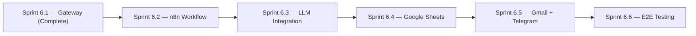

# Implementation Status

**Document ID:** TASC-STATUS-001
**Status:** Current as of Sprint 6 Architecture v1.1 (Approved)
**Audience:** Engineers, project stakeholders

This document tracks what has been built, what is currently planned, and how complete the system is against the Sprint 6 Architecture. It is a status record, not an architecture reference — see `SYSTEM_ARCHITECTURE.md` and the Sprint 6 Architecture document for how the completed components fit together.

---

## Table of Contents

1. [Current Repository Status](#1-current-repository-status)
2. [Completed](#2-completed)
3. [Planned](#3-planned)
4. [Current Architecture Status](#4-current-architecture-status)
5. [Current Feature Status](#5-current-feature-status)
6. [Current Infrastructure Status](#6-current-infrastructure-status)
7. [Testing Status](#7-testing-status)
8. [Known Future Work](#8-known-future-work)
9. [Roadmap](#9-roadmap)

---

## 1. Current Repository Status

The repository has completed **Sprint 6.1 — FastAPI → n8n Gateway**. The `AutomationGateway` Protocol, its `MockAutomationGateway` and `N8nAutomationGateway` implementations, HMAC-SHA256 signed payload dispatch, retry/backoff, the gateway error hierarchy, and 32 gateway tests are all complete. The deterministic consultation engine (`ConsultationOrchestrator` and its sub-components) was already in place prior to Sprint 6 and continues operating as the sole reasoning path. No sub-sprint from 6.2 onward has started.

**Overall completion against the Sprint 6 sub-sprint plan (6.1–6.6): ~17% (1 of 6 sub-sprints complete).**

## 2. Completed

| Component | Status | Notes |
|---|---|---|
| Enterprise Frontend (Next.js) | Complete | Conversation workspace, AI Thinking Panel, Business Intelligence Dashboard — unchanged by Sprint 6 |
| FastAPI API Layer | Complete | `POST /api/v1/chat/start`, `POST /api/v1/chat/message` |
| `ConsultationOrchestrator` (deterministic engine) | Complete | Pre-dates Sprint 6; remains the sole reasoning path through 6.1–6.2 |
| `IntentClassifier` | Complete | 12-class intent taxonomy |
| `SlotExtractor` / `Normaliser` / `SlotMerger` | Complete | Extraction, controlled-vocabulary normalisation, profile merging |
| `QualificationEngine` | Complete | 6-component scoring, 0–100 |
| `RecommendationEngine` | Complete | Pain-to-service matching, max 3 recommendations |
| `PhaseController` / `CompletionDetector` | Complete | Phase transitions and end-condition detection |
| `AutomationGateway` Protocol | Complete | Typed request/response contract (Sprint 6.1) |
| `MockAutomationGateway` | Complete | Wraps the local `ConsultationOrchestrator`, active when `N8N_ENABLED=false` |
| `N8nAutomationGateway` | Complete | Signed HTTP POST to n8n, active when `N8N_ENABLED=true` |
| HMAC-SHA256 payload signing | Complete | Constant-time verification |
| Retry strategy | Complete | Exponential backoff with jitter, configurable `max_retries`/timeout |
| Gateway error hierarchy | Complete | `GatewayConnectionError`, `GatewayTimeoutError`, `GatewayInvalidResponseError`, `GatewayRejectedError` |
| Dependency injection via `N8N_ENABLED` | Complete | Mock/n8n switch with zero code change |
| Config validation | Complete | `N8N_WEBHOOK_URL` required when `N8N_ENABLED=true` |
| Gateway test suite | Complete | 32 tests — protocol, mock, n8n, DI, signing, API integration |

## 3. Planned

| Sub-sprint | Scope | Status |
|---|---|---|
| **Sprint 6.1** — FastAPI → n8n Gateway | `AutomationGateway` abstraction, both implementations, signing, retry, error hierarchy, DI, tests | ✅ Complete |
| **Sprint 6.2** — n8n Workflow Definition | n8n webhook trigger with payload validation; idempotency and retry handling inside n8n; n8n Docker container wired into the existing `docker-compose.yml` | ⬜ Not started |
| **Sprint 6.3** — LLM Integration | OpenAI chat provider via provider protocol; OpenAI embedding provider for RAG; ChromaDB vector store integration; LLM-augmented consultation (natural conversation, enhanced extraction) | ⬜ Not started |
| **Sprint 6.4** — Google Sheets Automation | n8n Sheets node configured for lead logging; validated payload fields mapped to sheet columns | ⬜ Not started |
| **Sprint 6.5** — Gmail Notifications | n8n Gmail node for sales briefing email; n8n Gmail node for visitor confirmation email; Telegram team notification | ⬜ Not started |
| **Sprint 6.6** — End-to-End Testing | Full integration tests (FastAPI → n8n → Sheets → Gmail); contract tests (`ConsultationRequest` ↔ `ConsultationResult` fields); evaluation tests (lead scoring accuracy, recommendation relevance) | ⬜ Not started |

Per the Sprint 6 Architecture document: **no additional architectural changes should be introduced after Sprint 6 begins.** The sub-sprint scope above is fixed; this table should only be updated to change status (⬜ → ✅), never to add or redefine scope outside what's listed.

## 4. Current Architecture Status

| Architectural element | Status |
|---|---|
| Layered separation (Frontend / FastAPI / n8n) | Implemented, matches Sprint 6 Architecture |
| FastAPI as sole owner of AI orchestration and business logic | Implemented |
| n8n restricted to business automation only | Not yet exercised in practice — n8n workflow itself is Sprint 6.2 scope; the FastAPI-side dispatch contract is complete |
| `AutomationGateway` abstraction (Mock / N8n) | Implemented |
| LLM provider abstraction | Not yet implemented — Sprint 6.3 |
| RAG / ChromaDB integration | Not yet implemented — Sprint 6.3 |
| Google Sheets / Gmail / Telegram automation | Not yet implemented — Sprints 6.4–6.5 |
| Consultation Response Contract stability across reasoning backends | Contractually intended; not yet exercised, since only the deterministic engine exists — **see the field-naming discrepancy flagged in `SYSTEM_ARCHITECTURE.md` Section 7, to be resolved before Sprint 6.3 begins** |

## 5. Current Feature Status

| Feature | Status |
|---|---|
| Multi-turn consultation flow | Complete |
| Business profile extraction | Complete (deterministic) |
| Lead qualification scoring | Complete |
| Service recommendation | Complete |
| Automation dispatch — gateway/transport layer | Complete |
| Automation execution — actual Sheets/Gmail/Telegram actions | Not started (Sprints 6.2, 6.4, 6.5) |
| Natural-language generation via LLM | Not started — Sprint 6.3 |
| RAG-grounded responses | Not started — Sprint 6.3 |

## 6. Current Infrastructure Status

| Infrastructure element | Status |
|---|---|
| Frontend deployment | Operational |
| FastAPI backend deployment | Operational |
| n8n instance | Not yet wired into `docker-compose.yml` — Sprint 6.2 |
| Google Sheets integration | Not configured — Sprint 6.4 |
| Gmail integration | Not configured — Sprint 6.5 |
| Telegram integration | Not configured — Sprint 6.5 |
| LLM provider connectivity | Not configured — Sprint 6.3 |
| ChromaDB | Not deployed — Sprint 6.3 |

## 7. Testing Status

| Test category | Status |
|---|---|
| Gateway test suite (protocol, mock, n8n, DI, signing, API integration) | Complete — 32 tests |
| `ConsultationOrchestrator` / qualification / recommendation unit tests | Complete (pre-dates Sprint 6) |
| n8n workflow tests | Not started — Sprint 6.2/6.6 |
| LLM reasoning tests | Not applicable yet — no LLM path exists until Sprint 6.3 |
| Full integration tests (FastAPI → n8n → Sheets → Gmail) | Not started — Sprint 6.6 |
| Contract tests (`ConsultationRequest` ↔ `ConsultationResult`) | Not started — Sprint 6.6 |
| Evaluation tests (scoring accuracy, recommendation relevance) | Not started — Sprint 6.6 |

## 8. Known Future Work

- Build the n8n workflow itself (webhook trigger, validation, idempotency) — Sprint 6.2.
- Integrate the LLM provider and RAG stack — Sprint 6.3.
- Wire Google Sheets and Gmail/Telegram automations inside n8n — Sprints 6.4–6.5.
- Full end-to-end and contract testing — Sprint 6.6.
- Reconcile the `CONSULTATION_RESPONSE_CONTRACT.md` field shape against the Sprint 6 Architecture document's worked example before Sprint 6.3 begins, so the LLM provider is built against a single, agreed contract rather than two documents that currently disagree on field names.
- Everything under "Future Enhancements" in the Sprint 6 Architecture document (advanced RAG, streaming responses, Redis caching, auth, multi-user sessions, voice/WhatsApp/Slack, CRM integrations, additional LLM providers, advanced analytics) is explicitly **out of scope for Sprint 6** and not tracked in this table.

## 9. Roadmap

| Milestone | Completion |
|---|---|
| Sprint 6.1 | 100% |
| Sprint 6.2 | 0% |
| Sprint 6.3 | 0% |
| Sprint 6.4 | 0% |
| Sprint 6.5 | 0% |
| Sprint 6.6 | 0% |
| **Overall Sprint 6** | **~17%** |