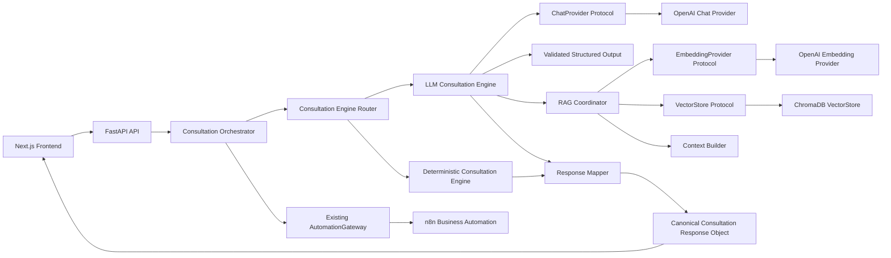
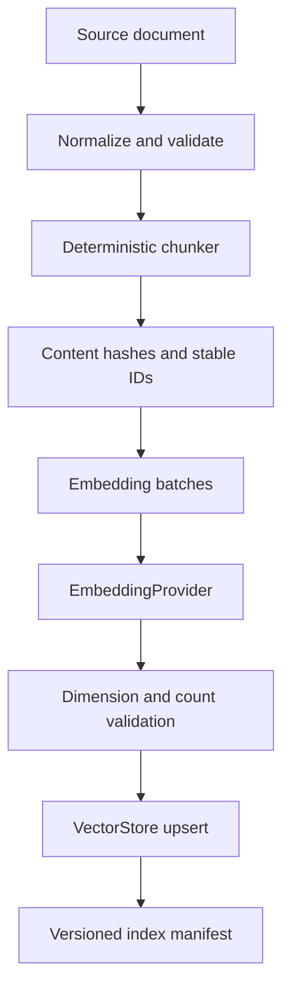
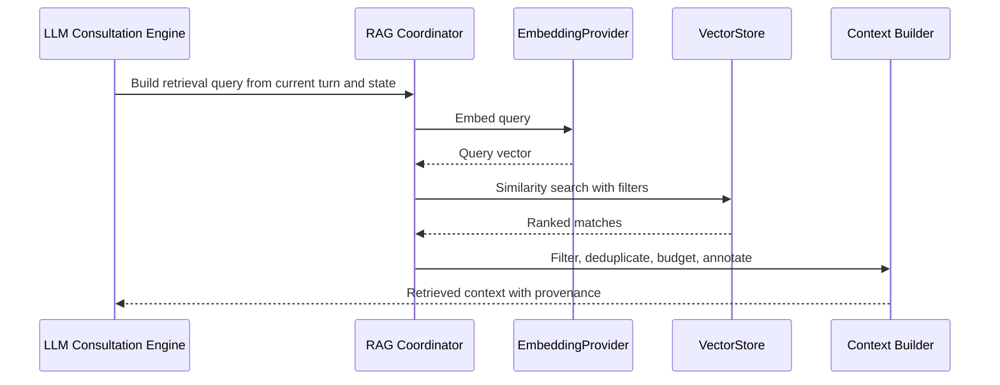
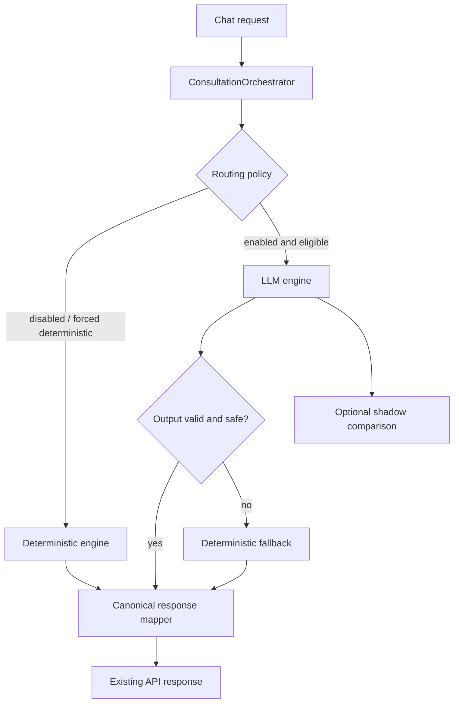

# SPRINT_6_3_IMPLEMENTATION_GUIDE.md

# SPRINT\_6\_3\_IMPLEMENTATION\_GUIDE.md
**Document ID:** TASC-IMPL-6.3-001
**Status:** Authoritative implementation blueprint for Sprint 6.3
**Audience:** Backend engineers, AI engineers, infrastructure engineers, test engineers, Claude Code
**Scope:** OpenAI chat and embedding providers, ChromaDB, RAG, LLM consultation engine, and hybrid consultation operation
**Precondition:** Sprint 6.1 gateway work is complete. Sprint 6.2 n8n workflow work may be complete or in progress.
> **Implementation authority.** This document specifies how Sprint 6.3 is to be implemented. It extends, but does not replace, the approved Sprint 6 architecture, system architecture, implementation status, consultation state machine, or consultation response contract. The implementation must preserve the approved dependency direction: Next.js frontend → FastAPI orchestration → n8n business automation → external business services. AI reasoning remains inside FastAPI. n8n must not receive prompts or make reasoning decisions.  
> **Contract authority.** This guide does not redefine the Consultation Response Object. The canonical response contract remains `CONSULTATION_RESPONSE_CONTRACT.md`. If the approved documents disagree on a field name, field shape, stage mapping, or example, do not silently reconcile them here. Verify the implemented FastAPI/Pydantic models and preserve the approved architectural principles. The codebase becomes the operational source of truth until an explicit contract update is approved.
* * *
## 1\. Sprint Goals
### 1.1 Objective
Sprint 6.3 introduces provider-backed language generation and retrieval capabilities inside the existing FastAPI AI orchestration layer without changing the external API, the AutomationGateway architecture, the frontend responsibility boundary, or the consultation lifecycle defined by `CONSULTATION_STATE_MACHINE.md`.

The sprint delivers:

1. A protocol-first provider boundary for chat completion and text embeddings.
2. An OpenAI chat provider implementation behind that boundary.
3. An OpenAI embedding provider implementation behind that boundary.
4. A VectorStore protocol and ChromaDB implementation.
5. A knowledge document and chunking/indexing pipeline.
6. Retrieval-augmented context construction for consultation reasoning.
7. A dedicated LLM Consultation Engine inside FastAPI.
8. A response mapper that converts validated LLM output into the existing canonical Consultation Response Object.
9. A hybrid runtime in which the deterministic `ConsultationOrchestrator` remains available as fallback, validator, audit reference, and comparison engine.
10. Dependency injection, configuration, observability, security controls, tests, and controlled rollout behavior.
### 1.2 What Sprint 6.3 must not change
The following remain immutable:

| Boundary | Required behavior |
| ---| --- |
| FastAPI | Owns orchestration, reasoning, phase management, scoring, recommendation generation, response construction, and provider calls. |
| Deterministic engine | `ConsultationOrchestrator` remains available and remains the production-safe fallback until the LLM path is validated. |
| n8n | Business automation only. It receives completed outcomes and executes configured workflows. It does not receive prompts, select models, retrieve knowledge, score leads, or generate recommendations. |
| Frontend | Renders responses from FastAPI. It never calls OpenAI, Gemini, ChromaDB, a vector database, or an embedding provider. |
| AutomationGateway | Existing interface, implementations, signing, retry behavior, and dependency injection remain unchanged. |
| Public API | Existing `/api/v1/chat/start` and `/api/v1/chat/message` contracts remain stable. |
| Consultation lifecycle | The nine internal stages, elastic transitions, one-question-per-turn rule, diminishing-returns behavior, explicit declines, and completion semantics remain governed by the state machine. |
| Response object | Mapping must produce the existing canonical object. This guide adds no fields to that contract. |

### 1.3 Intentionally excluded
Sprint 6.3 does not include agentic workflows, multi-agent orchestration, streaming responses, fine-tuning, voice, WhatsApp, Slack, multimodal input, CRM implementation, Google Sheets/Gmail/Telegram node configuration, advanced analytics dashboards, or a replacement of the deterministic engine. Those items remain governed by the roadmap and later sprint scopes.

* * *
## 2\. High-Level Architecture
### 2.1 Component placement
All Sprint 6.3 components live behind FastAPI. The frontend continues to call only the existing FastAPI endpoints. The LLM path may enrich reasoning and natural-language generation, but it must return the same response shape consumed by the frontend and downstream automation.



### 2.2 Dependency direction

```text
Frontend
   |
   v
FastAPI API
   |
   v
ConsultationOrchestrator
   |
   +--> EngineRouter --> DeterministicEngine
   |                 \-> LLMConsultationEngine
   |
   +--> Provider Protocols --> OpenAI implementations
   |
   +--> RAG Coordinator --> EmbeddingProvider --> VectorStore
   |
   +--> ResponseMapper --> canonical response model
   |
   +--> AutomationGateway --> n8n
```

Concrete providers, ChromaDB, and OpenAI SDK objects must not be imported by endpoint handlers or frontend code. They are constructed in the composition root and injected into application services.
### 2.3 Runtime request sequence
1. FastAPI validates the existing request model.
2. The orchestrator loads the session and current consultation state.
3. The engine router determines whether LLM mode is enabled and eligible.
4. The deterministic path remains available for disabled mode, failure, timeout, validation failure, or explicit rollout controls.
5. The LLM engine prepares stage state, business profile, conversation history, and optional retrieved context.
6. The engine calls the injected chat provider through the protocol.
7. The raw provider result is parsed and validated against an internal LLM output model.
8. Deterministic domain services validate and compute numeric/enumerated business fields where required by the response contract.
9. The response mapper produces the canonical Consultation Response Object.
10. The existing API returns that object to the frontend.
11. Completion handling continues through the unchanged AutomationGateway path.

The LLM engine must never bypass the orchestrator, response mapper, or gateway boundary.

* * *
## 3\. Provider Architecture
### 3.1 Protocol-first design
External AI services are represented by Python `Protocol` interfaces. Protocols are preferred because the application depends on behavior, not vendor inheritance hierarchies. They permit local fakes, test doubles, alternate vendors, and future hosted or self-hosted implementations without changing orchestration code.

The provider protocols must be small, typed, asynchronous where the existing backend is asynchronous, and free of vendor-specific types. Vendor SDK response objects must be translated at the provider boundary.

Illustrative interfaces:

```python
class ChatProvider(Protocol):
    async def complete(self, request: ChatCompletionRequest) -> ChatCompletionResponse: ...

class EmbeddingProvider(Protocol):
    async def embed(self, request: EmbeddingRequest) -> EmbeddingResponse: ...

class VectorStore(Protocol):
    async def upsert(self, records: Sequence[VectorRecord]) -> None: ...
    async def search(self, request: SimilaritySearchRequest) -> list[SimilarityMatch]: ...
    async def delete(self, request: DeleteRequest) -> None: ...
```

The exact package and module paths must follow the repository's existing structure. Do not create a parallel application architecture merely to satisfy these examples.
### 3.2 Chat provider request and response
The provider boundary should expose normalized internal types:

`ChatCompletionRequest` should contain:
*   ordered messages with role and content;
*   model identifier resolved by configuration;
*   temperature or equivalent sampling control, only if supported by the approved implementation;
*   maximum output token budget;
*   request timeout;
*   correlation ID;
*   optional structured-output/schema metadata;
*   optional provider-specific metadata held in an opaque extension field, not leaked into domain code.

`ChatCompletionResponse` should contain:
*   normalized text or structured content;
*   provider name;
*   model name;
*   finish reason;
*   input and output token counts when available;
*   provider request ID when available;
*   latency measurement;
*   raw provider payload only in protected diagnostic context, never in the public response.

The provider must not decide qualification, recommendations, or phase transitions. It only generates a constrained response from the request.
### 3.3 OpenAI chat provider
`OpenAIChatProvider` must:
*   use the configured OpenAI SDK client through a single adapter module;
*   receive an API key from configuration, never from request data;
*   apply a bounded timeout;
*   translate SDK exceptions into the internal provider error hierarchy;
*   request structured output when the selected model and SDK support it;
*   avoid exposing SDK response classes beyond the adapter;
*   attach correlation and model metadata to internal responses;
*   never log API keys, full prompts, full PII-bearing history, or raw provider payloads by default.

The implementation must tolerate provider response variations by validating the normalized result, not by assuming every optional field exists.
### 3.4 Embedding provider
The embedding boundary is separate from the chat boundary. Chat models and embedding models have different request shapes, latency patterns, dimensions, failure modes, and caching keys. Do not create one generic `AIProvider` interface with optional methods.

`OpenAIEmbeddingProvider` is described in Section 4.
### 3.5 Factory and dependency injection
A provider factory may select implementations from configuration, but selection must happen at composition time, not inside business logic.

```text
Settings
  -> ProviderFactory
       -> ChatProvider instance
       -> EmbeddingProvider instance
       -> VectorStore instance
  -> ConsultationOrchestrator dependencies
```

The factory must reject unsupported provider names during startup or dependency construction. It must not silently substitute a different vendor. In development, explicit fake providers may be selected. In production, missing credentials or invalid provider configuration must fail closed at startup or disable the LLM path according to the existing application startup policy.
### 3.6 Future providers
The protocol boundary must permit:
*   OpenAI
*   Gemini
*   Claude
*   Azure OpenAI
*   Ollama

Adding one of these providers should require a new adapter, configuration entry, and provider-specific tests. It must not require changes to `ConsultationStateMachine`, `QualificationEngine`, `RecommendationEngine`, response models, frontend code, or n8n workflows.

No future provider is implemented by Sprint 6.3 unless explicitly included in the repository's approved scope.

* * *
## 4\. Embedding Architecture
### 4.1 Internal types
`EmbeddingRequest` must include:
*   one or more input texts;
*   model name resolved from configuration;
*   optional dimensions if supported and explicitly configured;
*   correlation ID;
*   batch size metadata;
*   operation purpose such as `knowledge_indexing` or `query_retrieval`.

`EmbeddingResponse` must include:
*   embeddings in input order;
*   embedding dimension;
*   provider and model names;
*   input count;
*   token usage when available;
*   latency;
*   provider request ID where available.

The response must preserve input ordering. A mismatch between input count and vector count is an internal provider error.
### 4.2 `EmbeddingProvider`
The protocol must support batch requests because knowledge indexing should not make one network call per chunk. Batch size is controlled by configuration and bounded by provider limits.

```python
class EmbeddingProvider(Protocol):
    async def embed(self, request: EmbeddingRequest) -> EmbeddingResponse: ...
```

The protocol must not expose OpenAI request or response classes, SDK enums, or vendor-specific exception types.
### 4.3 OpenAI implementation
`OpenAIEmbeddingProvider` must:
*   use the configured embedding model;
*   batch inputs within a configured maximum;
*   preserve ordering;
*   validate vector dimensions;
*   translate rate-limit, timeout, authentication, malformed-response, and transport errors;
*   record usage and latency without logging source text by default;
*   support cancellation and bounded retries through the shared retry policy.
### 4.4 Error handling
Embedding errors are classified as:

| Error | Handling |
| ---| --- |
| Authentication/configuration | Fail indexing or disable provider; do not retry indefinitely. |
| Timeout/transport | Retry within bounded policy, then surface `EmbeddingUnavailable`. |
| Rate limit | Honor provider retry hints where safe, apply exponential backoff with jitter. |
| Invalid vector count/dimension | Do not write partial batch; surface `EmbeddingResponseInvalid`. |
| Empty input | Reject at validation boundary or return an explicit empty result according to repository conventions. |
| Oversized input | Chunk or reject before provider call; never rely on provider truncation. |

### 4.5 Caching
Embedding caching is an optimization, not a correctness dependency. A cache key should include normalized content hash, embedding provider, model, dimensions, and embedding pipeline version. Changing the model or chunking version must invalidate the relevant cache namespace.

Cache entries must not contain unprotected PII in shared infrastructure. If source text is sensitive, use a keyed digest and protected storage. Sprint 6.3 may implement an in-process or filesystem cache only if consistent with the repository's approved deployment model. A cache miss must always execute correctly.

* * *
## 5\. Vector Store Architecture
### 5.1 `VectorStore` protocol
The vector store boundary owns persistence and similarity retrieval, not chunking, prompt construction, or business reasoning.

Required operations:
*   create or verify a collection;
*   upsert records with stable IDs;
*   similarity search with optional metadata filters;
*   delete by document ID, chunk ID, or version namespace;
*   inspect collection/index metadata;
*   health check;
*   close or release resources if the client requires it.

Illustrative request types:

```python
@dataclass(frozen=True)
class VectorRecord:
    id: str
    vector: Sequence[float]
    text: str
    metadata: Mapping[str, str | int | float | bool]

@dataclass(frozen=True)
class SimilaritySearchRequest:
    query_vector: Sequence[float]
    top_k: int
    filters: Mapping[str, str | int | bool] | None
    collection: str
    min_score: float | None
```

The protocol must return normalized `SimilarityMatch` objects containing record ID, text, score, and metadata. Vendor distance semantics must be normalized so callers use one documented score interpretation.
### 5.2 ChromaDB implementation
`ChromaVectorStore` must:
*   create or open a configured collection deterministically;
*   verify collection metadata before use;
*   persist data using the repository's configured storage path or service connection;
*   keep collection naming and versioning explicit;
*   translate Chroma exceptions into internal vector-store errors;
*   support metadata filtering using only fields supported by the selected Chroma version;
*   validate vector dimensions before upsert;
*   avoid leaking database implementation types into the application layer.
### 5.3 Collection management
Collection metadata must identify:
*   collection logical name;
*   embedding provider and model;
*   embedding dimension;
*   chunking version;
*   knowledge-base version;
*   schema/index version;
*   creation timestamp;
*   environment.

On startup, the application must detect incompatible dimensions or schema versions. It must not silently write incompatible vectors into an existing collection.
### 5.4 Indexing and deletion
Upsert must be idempotent by stable chunk ID. Re-indexing the same document version must produce the same IDs for unchanged chunks. Document replacement must either delete the previous version namespace or mark it inactive before upserting the new version, according to the selected lifecycle policy.

Deletion must support:
*   delete one document version;
*   delete all versions of one logical document;
*   delete a collection only through an explicit administrative operation, never during normal request handling.
### 5.5 Search and filtering
Similarity search must enforce configured limits for `top_k`, query length, and result count. Metadata filters should constrain retrieval by knowledge domain, service, language, environment, document status, and version where those fields exist. Retrieval code must never treat metadata filters as security authorization. Authorization and tenancy controls remain outside the vector store if the repository supports them.
### 5.6 Collection versioning and future stores
Use an explicit collection/version namespace rather than assuming in-place mutation is safe. This permits blue/green knowledge-base replacement and rollback.

The same protocol must later support Pinecone or Qdrant adapters. Those adapters must implement the same normalized semantics, including score interpretation, filtering, deletion, and version checks. No Pinecone or Qdrant dependency is required for Sprint 6.3.

* * *
## 6\. Knowledge Base Architecture
### 6.1 Domain objects
`KnowledgeDocument` represents a source document and must include:
*   stable logical document ID;
*   title;
*   source type and source URI/reference;
*   raw or normalized content according to repository policy;
*   language;
*   domain/category;
*   services or topics;
*   version;
*   status such as active, superseded, or deleted;
*   created and updated timestamps;
*   provenance and access metadata.

`KnowledgeChunk` represents an indexed segment and must include:
*   stable chunk ID;
*   logical document ID and document version;
*   ordered chunk index;
*   text;
*   token/character count;
*   section heading or source location when available;
*   embedding model and dimension metadata;
*   content hash;
*   retrieval metadata;
*   chunking pipeline version.
### 6.2 Chunking strategy
Chunking must be deterministic, versioned, and performed before embedding. The implementation must preserve section boundaries where possible, avoid splitting inside structured examples or code blocks, and use bounded overlap only where it improves retrieval continuity.

The exact token thresholds must be configuration-driven and measured against the selected embedding model. Do not truncate source material silently. If a source cannot be chunked within limits, fail the document indexing operation with a diagnostic.

Every chunk must be traceable to its document and location. Chunk text must not contain hidden instructions inserted by the indexer.
### 6.3 Embedding pipeline



The indexer must be restartable. It must not leave a document marked active if required chunks failed to index. Partial indexing is either rolled back or marked incomplete and excluded from retrieval.
### 6.4 Retriever and context builder
The retriever accepts a query derived from the current consultation state, obtains an embedding through the injected provider, searches the vector store, applies score and metadata thresholds, removes duplicates, and returns provenance-bearing matches.

The context builder converts accepted matches into bounded context blocks. It must retain source IDs, document versions, and scores for citation and audit, while preventing raw metadata from becoming executable prompt instructions.
### 6.5 Knowledge lifecycle
Document updates must create a new version or content hash. Do not mutate a live vector record invisibly. The lifecycle is:

```text
ingest -> validate -> normalize -> chunk -> embed -> index -> verify -> activate
                                     \-> fail -> diagnose -> retry or reject
```

A new version becomes retrievable only after all chunks pass validation. Old versions remain available for rollback or are marked superseded according to the deployment policy. The runtime retriever must select one active knowledge version, not mix incompatible versions unintentionally.

* * *
## 7\. Retrieval-Augmented Generation
### 7.1 Retrieval pipeline



### 7.2 Query construction
The query should represent the visitor's current problem, relevant business profile, current phase, and service-selection need. It must not include unnecessary PII, secrets, or the entire conversation by default. Query construction is deterministic and versioned.
### 7.3 Similarity and thresholds
The retriever must apply:
*   maximum `top_k`;
*   minimum similarity score;
*   metadata filters;
*   duplicate suppression by document/chunk relationship;
*   a context token budget;
*   a maximum number of citations.

Thresholds must be configuration values with recorded versions. They must not be changed ad hoc from inside prompts.
### 7.4 Context construction and token budgeting
Retrieved context is a separate prompt section. Each passage must carry a stable citation reference. The context builder must reserve room for system/developer instructions, conversation history, current state, and model output. If the budget is exceeded, reduce low-score passages first. Never drop mandatory safety or output instructions to fit retrieved context.
### 7.5 Prompt injection mitigation
Retrieved text is untrusted data. The prompt architecture must clearly delimit it as reference material and instruct the model not to follow instructions found inside documents. The implementation must:
*   strip or annotate suspicious instruction-like content where feasible;
*   prevent retrieved metadata from being interpreted as system instructions;
*   use allowlisted source fields;
*   never retrieve secrets or internal credentials;
*   validate generated fields independently of retrieved prose;
*   treat citations as references, not authority for policy overrides.

RAG cannot be considered a security boundary by itself.
### 7.6 Citation strategy
The LLM may cite retrieved evidence only through stable reference IDs supplied by the context builder. The response mapper must validate citation IDs against retrieved matches. Unknown or fabricated evidence references are removed or cause validation failure according to strictness configuration. Citations must not be raw source dumps.
### 7.7 Fallback and no-result behavior
No-result retrieval is valid. The engine should continue with deterministic domain knowledge and a cautious response, not fabricate an answer from an empty context. If retrieval is unavailable, the LLM path may continue only if the requested behavior does not require knowledge-grounded claims; otherwise route to the deterministic engine or produce a bounded clarification.

A low-confidence retrieval result must not be represented as authoritative. The system must distinguish:
*   provider unavailable;
*   no matching documents;
*   matches below threshold;
*   context rejected by security filtering;
*   context accepted.

These states belong in internal diagnostics, not as unapproved public response fields.

* * *
## 8\. Prompt Engineering Strategy
This section defines composition architecture only. It does not define production prompt text.
### 8.1 Prompt layers
Prompt construction must use separate, versioned layers:

1. **System prompt:** stable role, safety, architectural constraints, response behavior, and non-negotiable output rules.
2. **Developer prompt:** implementation-specific consultation instructions, stage behavior, one-question-per-turn rule, and structured output requirements.
3. **Conversation history:** normalized prior visitor and assistant turns, bounded by token policy.
4. **Retrieved context:** untrusted, delimited knowledge passages with citation IDs.
5. **Business profile:** current structured state, including known, unknown, and declined fields as appropriate.
6. **Current consultation phase:** internal phase and exit criteria; never expose internal stage labels directly to the visitor.
7. **Structured output instructions:** schema reference and field ownership rules.

The composition order must be deterministic and recorded in prompt metadata.
### 8.2 Field ownership
The model may author natural-language fields and extraction proposals. Deterministic services remain authoritative for scores, bands, enumerations, recommendation ordering, phase transitions, and workflow triggers. The LLM output must never directly control n8n actions.
### 8.3 Structured output
Use a dedicated internal model for the LLM engine output. It should contain only fields necessary to produce the canonical response and should distinguish:
*   proposed slot updates;
*   proposed assistant message;
*   one optional follow-up question;
*   proposed intent;
*   proposed evidence references;
*   optional natural-language rationale;
*   model diagnostics.

This internal model is not the public response contract. It must be mapped and validated before returning from FastAPI.
### 8.4 Validation and hallucination prevention
Validate:
*   required keys and types;
*   enum values;
*   one-question-per-turn constraint;
*   no unsupported recommendation IDs;
*   citation references;
*   no invented business facts presented as confirmed;
*   no model-supplied numeric score overriding deterministic computation;
*   no workflow action outside the existing domain rules;
*   message consistency with the structured state.

If validation fails, retry once only when the failure is plausibly recoverable through a constrained correction request. Otherwise use the deterministic engine.
### 8.5 Prompt versioning and testing
Prompt templates require explicit version identifiers. A prompt version must be recorded in internal metadata for every LLM-generated turn. Prompt changes require:
*   unit tests for composition;
*   schema validation tests;
*   representative consultation fixtures;
*   regression comparison against deterministic outputs;
*   prompt-injection cases;
*   token-budget tests.

Do not write production prompts into this guide. Store them in the repository location selected by the approved codebase conventions, with code loading them through a versioned prompt registry.

* * *
## 9\. LLM Consultation Engine
### 9.1 Responsibility
`LLMConsultationEngine` is a FastAPI domain service. It owns the LLM-backed reasoning path but does not own external automation. It must implement the consultation behavior specified by the state machine while delegating deterministic computation to existing services.

Responsibilities:
*   natural-language response generation;
*   business understanding and slot extraction proposals;
*   phase-aware follow-up questions;
*   conversation continuity;
*   retrieval coordination;
*   structured output generation;
*   invoking deterministic qualification and recommendation services;
*   producing mapper-ready internal results;
*   preserving traceability and model metadata.
### 9.2 Explicit non-responsibilities
It must not:
*   call n8n directly;
*   modify the frontend contract;
*   select or reorder recommendations independently of domain rules;
*   compute authoritative qualification scores in prose;
*   bypass `PhaseController` or `CompletionDetector`;
*   store provider credentials;
*   persist arbitrary model output as session state.
### 9.3 Turn processing

```text
load session state
  -> classify current user intent
  -> extract candidate slots
  -> normalize candidates
  -> merge through existing SlotMerger
  -> evaluate current state and phase
  -> retrieve context when eligible
  -> compose prompt
  -> call ChatProvider
  -> validate internal LLM output
  -> apply candidate facts through domain validators
  -> compute qualification/readiness/recommendations deterministically
  -> evaluate phase transition and completion
  -> generate or validate natural-language response
  -> map to canonical response object
  -> persist state through existing session mechanism
```

Candidate LLM facts must not overwrite confirmed values without the same conflict and confirmation rules already required by the state machine. Declined values remain declined. Unknown values remain unknown until evidence exists.
### 9.4 Natural conversation rules
The engine must preserve:
*   one open question at most per turn;
*   follow-the-user behavior for topic changes;
*   narrow clarification when extraction confidence is low;
*   no repeated pursuit after the diminishing-returns threshold;
*   immediate acceptance of explicit refusal;
*   elastic phase transitions when information is already present;
*   clear completion paths.

These are state-machine behaviors, not optional prompt style.

* * *
## 10\. Hybrid Consultation Architecture
### 10.1 Coexistence
The deterministic engine and LLM engine are peers behind the existing orchestration boundary. The deterministic engine remains available as:
*   fallback when LLM execution is unavailable;
*   validator for scores, bands, recommendations, transitions, and completion;
*   audit layer for comparing outputs;
*   comparison engine during rollout and evaluation;
*   safe mode for development, testing, and incident response.



### 10.2 Routing policy
Routing must be explicit and injectable. At minimum, support:
*   deterministic-only mode;
*   LLM-enabled mode;
*   LLM shadow mode, where deterministic output is returned and LLM output is logged for comparison without user impact;
*   percentage or allowlisted rollout only if the repository has a safe configuration mechanism;
*   forced fallback mode for incidents.

Routing must be based on configuration and session policy, not on arbitrary model self-selection. A request must not switch engines mid-turn after partial state mutation. State changes are committed only after the selected engine produces a validated mapper-ready result.
### 10.3 Comparison and audit
Shadow comparison should compare normalized fields, not only text. Useful comparison dimensions include slot deltas, phase decision, score inputs, recommendation candidates, question count, citations, validation failures, latency, and token usage. Comparison output is internal telemetry and must not alter the canonical response.

* * *
## 11\. Response Mapping
### 11.1 Contract preservation
The response mapper converts validated internal engine output into the existing Consultation Response Object defined by `CONSULTATION_RESPONSE_CONTRACT.md`. It must not redefine, rename, remove, or add public fields based on this guide.

The mapper is the final boundary before the API response. Both deterministic and LLM engines should converge on the same mapper or on equivalent canonical response construction logic already present in the repository.
### 11.2 Mapping rules
*   Preserve all required top-level fields defined by the canonical implementation.
*   Preserve null versus empty-array semantics.
*   Preserve monotonic turn indexing.
*   Preserve progressive, non-regressive structured state.
*   Use deterministic domain outputs for scores, bands, status checklists, recommendation ranking, and workflow actions.
*   Use LLM output only for fields explicitly assigned to natural-language generation or proposed extraction, after validation.
*   Populate provider and prompt metadata according to the canonical model implementation.
*   Do not expose raw prompts, retrieved passages, API errors, or provider diagnostics.
*   Create completion workflow actions only through the existing completion and AutomationGateway rules.
### 11.3 Contract ambiguity handling
The approved documents contain known discrepancies between a worked Sprint 6 example and the canonical response contract, including envelope shape, stage naming, qualification field naming, recommendation shape, workflow action shape, and metadata naming. This guide does not choose between them. The implementation must inspect the actual Pydantic response models and existing endpoint tests, then preserve those models while documenting any mismatch for explicit later reconciliation.

* * *
## 12\. Error Handling
### 12.1 Error hierarchy
Use an internal hierarchy that distinguishes provider, retrieval, validation, and orchestration failures. Do not leak vendor exception types to API callers.

Recommended categories:
*   `ProviderConfigurationError`
*   `ProviderAuthenticationError`
*   `ProviderRateLimitError`
*   `ProviderTimeoutError`
*   `ProviderTransportError`
*   `ProviderResponseInvalidError`
*   `EmbeddingUnavailableError`
*   `VectorStoreUnavailableError`
*   `RetrievalInvalidError`
*   `StructuredOutputInvalidError`
*   `ConsultationEngineUnavailableError`

Exact names should follow existing repository conventions.
### 12.2 Retry policy
Retries must be bounded, selective, and idempotent. Retry transient transport failures, timeouts, and rate limits when the provider permits it. Do not retry invalid credentials, malformed requests, policy rejection, or deterministic validation failures. Use exponential backoff with jitter and respect request deadlines.

A retry must not duplicate a completion side effect. Provider calls occur before AutomationGateway dispatch. Completion dispatch continues to use the existing idempotency and gateway behavior.
### 12.3 Circuit breaker
A circuit breaker may be implemented around external LLM and embedding calls if compatible with the existing deployment model. It should track consecutive eligible failures, open after a configured threshold, use a cooldown, and permit controlled half-open probes. When open, route consultation requests to the deterministic engine and route indexing failures to a queued or failed state.

Circuit state must be observable and must not be stored in a way that creates cross-environment contamination.
### 12.4 Graceful degradation
Fallback order:

1. Use the LLM engine with full RAG when all dependencies are healthy.
2. Use the LLM engine without RAG when retrieval is unavailable and the request is safe without knowledge grounding.
3. Use the deterministic engine when chat generation, structured validation, or required retrieval fails.
4. Return the existing API-safe error response only when neither engine can produce a valid response.

The user-facing message must remain safe and useful. Do not claim that an external provider failed, expose internal stack traces, or invent facts to conceal missing context.

* * *
## 13\. Security
### 13.1 Secrets
API keys and provider credentials must be supplied through the existing configuration and secret-management mechanism. They must not be committed, placed in prompts, returned in responses, or logged. Startup validation should detect missing production secrets before traffic is accepted.
### 13.2 Prompt injection
Treat visitor input, retrieved documents, metadata, and conversation history as untrusted. Use layered instructions, clear delimiters, source allowlists, output validation, and deterministic domain enforcement. No text generated by a visitor or retrieved document can change routing, scoring rules, workflow actions, or system policy.
### 13.3 PII protection
Minimize PII sent to providers. Include only what is necessary for the turn. Redact or pseudonymize logs. Do not place contact data into retrieval queries unless required and explicitly approved. Do not index sensitive visitor data into the shared knowledge base.
### 13.4 Input and output validation
Validate message length, encoding, content type, session identifiers, and request shape before orchestration. Validate provider output against strict internal schemas. Reject unknown recommendation IDs, unsupported enums, fabricated citations, malformed structured fields, and unsafe workflow proposals.
### 13.5 Audit logging
Record correlation ID, engine mode, provider/model, prompt version, retrieval status, validation outcome, fallback reason, latency, and token usage where available. Avoid full prompt and full response logging by default. If debugging requires payload capture, use protected, time-limited, access-controlled diagnostics.

* * *
## 14\. Configuration
Configuration names must follow existing repository conventions. The following inventory is the minimum configuration surface Sprint 6.3 must document and validate.
### 14.1 Required when LLM mode is enabled

| Variable | Purpose |
| ---| --- |
| `LLM_ENABLED` | Enables the LLM path; default must remain safe for existing deployments. |
| `LLM_PROVIDER` | Provider selector, initially `openai`. |
| `OPENAI_API_KEY` | OpenAI credential, required for OpenAI chat or embeddings. |
| `OPENAI_CHAT_MODEL` | Chat model identifier. |
| `OPENAI_EMBEDDING_MODEL` | Embedding model identifier. |
| `LLM_REQUEST_TIMEOUT_SECONDS` | Per-request deadline. |
| `LLM_MAX_OUTPUT_TOKENS` | Output budget. |
| `VECTOR_STORE_PROVIDER` | Initially `chroma`. |
| `CHROMA_COLLECTION_NAME` | Logical collection name. |
| `CHROMA_PERSIST_DIRECTORY` or approved Chroma connection settings | Storage configuration. |
| `KNOWLEDGE_BASE_VERSION` | Active knowledge version. |
| `PROMPT_VERSION` | Prompt registry version. |

### 14.2 Optional

| Variable | Purpose |
| ---| --- |
| `LLM_TEMPERATURE` | Sampling configuration if permitted by the implementation. |
| `LLM_MAX_RETRIES` | Bounded provider retry count. |
| `LLM_CIRCUIT_BREAKER_THRESHOLD` | Eligible failure threshold. |
| `LLM_CIRCUIT_BREAKER_COOLDOWN_SECONDS` | Cooldown interval. |
| `EMBEDDING_BATCH_SIZE` | Indexing batch size. |
| `RAG_TOP_K` | Maximum retrieved matches. |
| `RAG_MIN_SCORE` | Minimum accepted similarity score. |
| `RAG_CONTEXT_TOKEN_BUDGET` | Context budget. |
| `RAG_CACHE_ENABLED` | Embedding cache toggle. |
| `LLM_SHADOW_MODE` | Compare LLM output without returning it. |
| `LLM_FORCE_DETERMINISTIC` | Operational kill switch. |
| `KNOWLEDGE_CHUNK_SIZE` / `KNOWLEDGE_CHUNK_OVERLAP` | Chunking parameters. |

### 14.3 Development
Development may use fake chat and embedding providers, an ephemeral Chroma collection, deterministic-only mode, fixture knowledge documents, and verbose validation diagnostics. Development secrets must still be handled as secrets.
### 14.4 Production
Production must use secret injection, explicit provider/model configuration, persistent or managed vector storage, bounded timeouts, monitoring, forced-deterministic kill switch, restricted diagnostic logging, and a validated active knowledge-base manifest. Missing required production configuration must not silently activate a partially configured LLM path.

* * *
## 15\. Testing Strategy
### 15.1 Unit tests
Test protocol adapters, request normalization, response normalization, configuration validation, chunking, stable IDs, metadata filters, score normalization, context budgeting, prompt composition, output validation, response mapping, routing policy, and fallback decisions.
### 15.2 Provider tests
Use mocked SDK clients. Verify successful calls, timeouts, rate limits, authentication failures, malformed provider responses, token usage extraction, model metadata, retries, and cancellation. No unit test should make a live external API call.
### 15.3 Embedding tests
Verify batch ordering, vector count, dimension validation, empty input behavior, cache keys, model/version invalidation, retry behavior, and partial-batch failure handling.
### 15.4 Vector store tests
Use an isolated Chroma test collection. Verify create/open behavior, metadata validation, idempotent upsert, similarity ordering, minimum-score filtering, metadata filters, deletion, version isolation, dimension mismatch handling, and restart behavior.
### 15.5 Prompt and schema tests
Test every prompt layer independently and as a composed request. Assert that internal phase labels are not exposed in user-facing output, retrieved content is delimited, output schema instructions are present, and token budgets are enforced. Include malicious retrieved instructions and visitor attempts to alter system behavior.
### 15.6 RAG evaluation
Create fixtures for known-answer retrieval, no-result queries, conflicting documents, stale versions, irrelevant results, injection-bearing documents, and citation validation. Measure retrieval precision/recall against a small curated evaluation set, but do not create an evaluation dashboard in this sprint.
### 15.7 Hybrid and fallback tests
Verify deterministic-only, LLM-enabled, shadow, forced fallback, provider timeout, invalid JSON, invalid citation, invalid recommendation, circuit-open, and RAG-unavailable paths. Assert that all successful paths return the same canonical response model and that AutomationGateway behavior is unchanged.
### 15.8 Performance benchmarks
Measure deterministic latency, LLM latency, embedding latency, retrieval latency, end-to-end latency, token usage, and fallback latency. Include cold and warm vector-store conditions. Establish baseline thresholds in the repository's test configuration; do not optimize by changing approved architecture.
### 15.9 Acceptance test scenarios
At minimum, test:
*   greeting with no structured facts;
*   rich first visitor message and elastic stage skipping;
*   vague answer and narrow clarification;
*   explicit refusal and permanent declined status;
*   topic change to pricing;
*   quantified pain point and recommendation eligibility;
*   low-confidence retrieval with no-result fallback;
*   provider timeout during a non-completion turn;
*   provider failure during completion;
*   duplicate completion and unchanged gateway idempotency;
*   confirmed value protected from regressive LLM extraction;
*   response contract shape against existing endpoint tests.

* * *
## 16\. Sprint Deliverables and Implementation Phases
The phases are sequential in dependency, but each must leave the repository runnable and testable.
### Phase 0: Repository and contract inspection
**Objective:** Confirm current code locations, Pydantic models, dependency injection, API tests, deterministic engine seams, and existing configuration before adding code.

**Files:** Existing API, orchestration, configuration, models, and test modules identified by repository inspection. No new architecture files are assumed.

**Expected outputs:** Implementation map, confirmed composition root, confirmed canonical response model, list of contract discrepancies requiring codebase verification.

**Acceptance criteria:** No implementation begins against guessed module paths or guessed response fields. Existing tests pass unchanged.

**Testing:** Baseline test suite and endpoint contract snapshots.
### Phase 1: Provider protocols and configuration
**Objective:** Add protocol types, normalized requests/responses, provider error hierarchy, settings, and factory seams.

**Files:** New provider protocol/DTO modules in the repository's approved backend package; configuration and dependency modules; unit tests.

**Expected outputs:** `ChatProvider`, `EmbeddingProvider`, normalized DTOs, factory selection, fake providers, validated settings.

**Acceptance criteria:** Application can construct fake providers and deterministic mode without OpenAI installed or configured. No endpoint imports vendor SDKs.

**Testing:** Protocol conformance, configuration validation, fake provider tests, import-boundary checks.
### Phase 2: OpenAI adapters
**Objective:** Implement chat and embedding adapters behind protocols.

**Files:** OpenAI chat adapter, OpenAI embedding adapter, SDK adapter utilities, provider tests.

**Expected outputs:** Normalized successful responses and translated errors.

**Acceptance criteria:** SDK types do not escape adapter modules; timeouts, retries, rate limits, malformed responses, and usage metadata are tested.

**Testing:** Fully mocked SDK tests; no live calls in CI.
### Phase 3: ChromaDB and knowledge pipeline
**Objective:** Implement vector-store protocol, Chroma adapter, knowledge models, deterministic chunker, embedding indexer, manifest/version checks, and retriever.

**Files:** Vector-store protocol and adapter, knowledge domain modules, indexer, retriever, Chroma tests, fixture documents.

**Expected outputs:** A versioned fixture knowledge base can be indexed, searched, updated, and deleted.

**Acceptance criteria:** Idempotent indexing, dimension checks, metadata filtering, version isolation, no partial active index, and restart-safe behavior.

**Testing:** Isolated Chroma integration tests, chunking fixtures, embedding mock tests, deletion/version tests.
### Phase 4: RAG coordinator and context builder
**Objective:** Add query construction, retrieval thresholds, filtering, deduplication, citation references, and token budgeting.

**Files:** RAG coordinator, query builder, context builder, prompt-context tests.

**Expected outputs:** Bounded, provenance-bearing context object or explicit no-result state.

**Acceptance criteria:** Retrieved text is delimited and untrusted; no-result and unavailable states are distinguishable; context never consumes reserved output/safety budget.

**Testing:** Retrieval evaluation fixtures, injection tests, budget tests, citation validation.
### Phase 5: LLM Consultation Engine and mapper
**Objective:** Implement the engine inside FastAPI and converge its output with the existing deterministic response construction.

**Files:** LLM engine, internal structured output models, prompt registry/composer, response mapper, engine tests.

**Expected outputs:** Validated LLM turn results mapped to the canonical response object.

**Acceptance criteria:** State-machine behavior is preserved; deterministic services remain authoritative for structured business decisions; existing endpoint response shape remains stable.

**Testing:** Consultation fixtures across all stages, invalid-output tests, field ownership tests, contract tests.
### Phase 6: Hybrid routing and rollout controls
**Objective:** Add explicit routing, shadow mode, forced deterministic mode, fallback handling, circuit breaker if approved, and operational telemetry.

**Files:** Router/policy module, dependency wiring, settings, observability hooks, hybrid tests.

**Expected outputs:** Deterministic-only, LLM, shadow, and fallback modes.

**Acceptance criteria:** A provider failure cannot make the existing consultation unavailable when deterministic fallback is healthy. No partial state is committed before validation.

**Testing:** Failure matrix, race/cancellation tests where applicable, response equivalence tests, gateway regression tests.
### Phase 7: Hardening and documentation
**Objective:** Complete security review, configuration documentation, performance baselines, test coverage, and implementation status update.

**Files:** Security/config documentation, test fixtures, benchmark configuration, status record updates only when work is actually complete.

**Expected outputs:** CI-ready Sprint 6.3 implementation with rollback switch and operational checklist.

**Acceptance criteria:** All required tests pass, deterministic mode remains operational, provider secrets are protected, and no out-of-scope architecture has been introduced.

**Testing:** Full suite, integration suite, benchmark suite, static analysis, dependency audit.

* * *
## 17\. Out of Scope
The following are explicitly excluded from Sprint 6.3 unless separately approved:
*   agentic workflows;
*   multi-agent orchestration;
*   autonomous tool execution by the LLM;
*   streaming responses;
*   fine-tuning or model training;
*   voice and telephony;
*   WhatsApp, Slack, or additional channels;
*   multimodal image/audio/document understanding;
*   advanced RAG such as graph retrieval, reranking models, query planning, or autonomous retrieval loops;
*   production Pinecone or Qdrant adapters;
*   evaluation dashboards;
*   CRM integration;
*   Google Sheets, Gmail, or Telegram node implementation;
*   changes to n8n business logic boundaries;
*   frontend direct provider access;
*   replacement of the AutomationGateway;
*   redesign of the consultation state machine;
*   reconciliation of conflicting response contract documents without implementation verification and explicit approval;
*   Redis caching, multi-user session redesign, authentication redesign, or analytics architecture;
*   adding providers beyond the OpenAI implementations required by Sprint 6.3.

* * *
## 18\. Implementation Principles
1. **Single Responsibility:** Providers call providers; vector stores store vectors; retrievers retrieve; context builders build context; engines orchestrate reasoning; mappers construct canonical responses.
2. **Protocol-first design:** Depend on behavioral interfaces, not vendor SDK classes.
3. **Dependency Injection:** Construct providers, stores, retrievers, engines, and routing policy at the composition boundary.
4. **SOLID:** Keep modules cohesive, dependencies inverted, and extension points explicit.
5. **Open/Closed Principle:** Add a new provider or vector store adapter without modifying consultation business rules.
6. **Replaceability:** OpenAI, ChromaDB, and future vendors are replaceable behind protocols.
7. **Deterministic fallbacks:** The deterministic consultation engine remains available, testable, and operational.
8. **Stable API contracts:** The canonical Consultation Response Object and existing API endpoints remain unchanged.
9. **Backward compatibility:** Sprint 6.1 gateway behavior and Sprint 6.2 integration assumptions must continue to work.
10. **Incremental delivery:** Each phase must leave the system runnable and testable.
11. **Explicit ownership:** The LLM may generate language and propose extraction; deterministic domain services own authoritative business decisions.
12. **Untrusted context:** Visitor text, retrieved documents, and model output are data requiring validation, not executable policy.
13. **No hidden reconciliation:** Documentation inconsistencies are recorded and deferred to implementation verification; this guide does not silently choose a conflicting contract shape.
14. **No breaking architectural changes:** FastAPI remains the orchestration layer, n8n remains business automation, the frontend remains a rendering surface, and the AutomationGateway remains unchanged.
15. **Operational control:** LLM mode can be disabled or rolled back without code changes elsewhere.

**End of Sprint 6.3 Implementation Guide.**