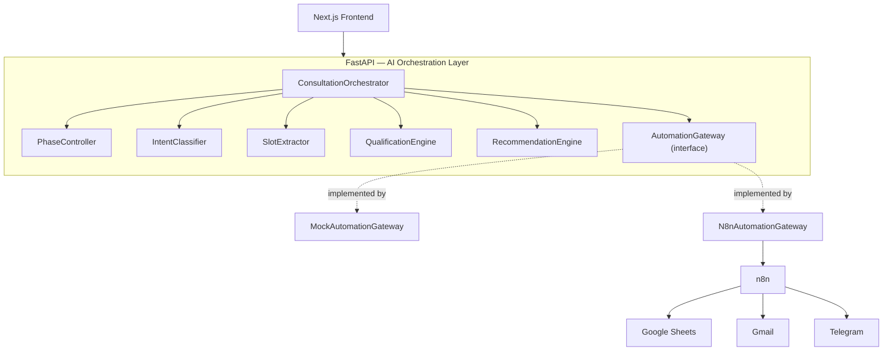
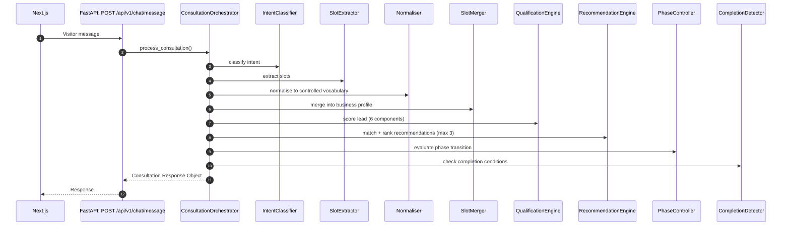
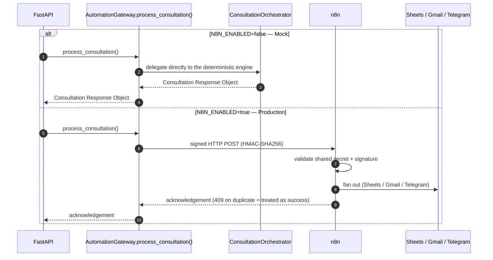
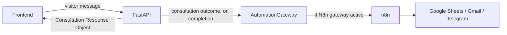
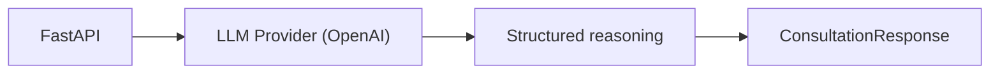

# System Architecture

**Document ID:** TASC-ARCH-001
**Status:** Authoritative entry point — Sprint 6
**Audience:** Engineers, AI coding agents, technical stakeholders

This document is the highest-level architecture reference for the repository. It orients a reader to the system as a whole and points to the documents that define each part in detail. It does not restate implementation specifications already defined elsewhere — see [Document Relationships](#document-relationships) for what lives where.

---

## Table of Contents

1. [Vision](#1-vision)
2. [System Goals](#2-system-goals)
3. [Architecture Philosophy](#3-architecture-philosophy)
4. [Design Principles](#4-design-principles)
5. [High-Level Component Diagram](#5-high-level-component-diagram)
6. [Layered Architecture](#6-layered-architecture)
7. [Component Responsibilities](#7-component-responsibilities)
8. [Runtime Request Lifecycle](#8-runtime-request-lifecycle)
9. [Consultation Lifecycle](#9-consultation-lifecycle)
10. [Automation Lifecycle](#10-automation-lifecycle)
11. [Session Lifecycle](#11-session-lifecycle)
12. [Data Flow](#12-data-flow)
13. [AI Reasoning Flow](#13-ai-reasoning-flow)
14. [Business Automation Flow](#14-business-automation-flow)
15. [External Integrations](#15-external-integrations)
16. [Deployment Overview](#16-deployment-overview)
17. [Future Roadmap](#17-future-roadmap)
18. [Document Relationships](#18-document-relationships)

---

## 1. Vision

The system exists to run a real business consultation — not a support chat, not a lead-capture form — entirely through a conversational interface, and to hand off qualified opportunities to the sales workflow automatically and reliably. Sprint 6 establishes the architecture that makes this possible with a deterministic reasoning engine today, and defines the exact seam through which an LLM provider will take over natural-language generation in Sprint 6.3 without changing anything a consumer of the system depends on.

## 2. System Goals

- Conduct a structured, multi-turn business consultation over a conversational interface.
- Build a business profile, assess automation readiness, and qualify the lead as the conversation progresses.
- Recommend the right services once genuinely earned by the conversation, never generically.
- Hand off completed consultations to business automation (CRM logging, notification, alerting) reliably and exactly once.
- Keep the contract between the frontend and the backend, and between the backend and automation, stable regardless of whether the reasoning behind a response is deterministic logic or an LLM.

## 3. Architecture Philosophy

FastAPI is the AI Orchestration Layer. It owns every reasoning and business-logic responsibility in the system: consultation orchestration, phase management, qualification scoring, recommendation generation, and response construction. n8n is a business-automation executor and nothing more — it performs no AI reasoning, no prompt engineering, and no consultation orchestration of any kind. This division is the single architectural invariant Sprint 6 fixes as permanent: it does not shift with future sprints, including the introduction of an LLM provider in Sprint 6.3, which extends FastAPI's reasoning capability without moving any responsibility to n8n or to the frontend.

## 4. Design Principles

- **One direction of dependency.** Frontend → FastAPI → n8n → external services. Nothing depends upward, and n8n never calls back into FastAPI's reasoning components directly.
- **The frontend is a rendering surface, never a reasoning participant.** It never communicates directly with an LLM provider or with Google services (Sheets, Gmail) — every interaction passes through FastAPI.
- **Automation is swappable, reasoning is not.** The Automation Gateway abstraction (Section 7) lets the system run identically against a mock gateway or the real n8n gateway; there is no equivalent swap point for *where* reasoning happens — it is always FastAPI, whether deterministic today or LLM-backed from Sprint 6.3 onward.
- **The contract is the stability boundary.** The Consultation Response Contract is what every consumer of a consultation turn actually depends on. It does not change shape depending on whether the response was produced by the deterministic engine or, from Sprint 6.3, an LLM provider — this is what allows the reasoning implementation to evolve without a corresponding change to the frontend or to n8n.

## 5. High-Level Component Diagram

Future Sprint 6.3 extends the backend with an LLM provider seam (Section 13); it is not shown here because it does not change this diagram's shape — it changes what happens *inside* the reasoning components, not which components exist or how they're wired to the frontend and to automation.

## 6. Layered Architecture

| Layer | Owns | Does not own |
|---|---|---|
| Frontend (Next.js) | Rendering the conversation and the consultation dashboard | Any reasoning, scoring, recommendation logic, or direct calls to the LLM provider or Google services |
| FastAPI — Orchestration | Turn sequencing via `ConsultationOrchestrator` and `PhaseController` | Business automation execution |
| FastAPI — Understanding | `IntentClassifier`, `SlotExtractor` | Scoring, recommendation, automation |
| FastAPI — Business Logic | `QualificationEngine`, `RecommendationEngine` | Automation dispatch, orchestration sequencing |
| FastAPI — Automation Gateway | The `AutomationGateway` interface and its two implementations | Any AI reasoning — the gateway only dispatches an already-finished consultation outcome |
| n8n | Executing business automation: writing to Google Sheets, sending Gmail, alerting via Telegram | Any reasoning, scoring, or orchestration decision |

## 7. Component Responsibilities

Full internal behavior of each component is defined in the Sprint 6 Architecture specification, the Master System Prompt, and the Consultation State Machine — this table cross-references those documents rather than restating their content.

| Component | Responsibility (per Sprint 6 Architecture) | Defined in detail in |
|---|---|---|
| `ConsultationOrchestrator` | Sequences a consultation turn end to end; the deterministic engine that owns the current reasoning path | Sprint 6 Architecture |
| `PhaseController` | Evaluates stage/phase transitions within a consultation | Consultation State Machine |
| `IntentClassifier` | Classifies visitor intent per turn (12-class taxonomy) | Sprint 6 Architecture, Master System Prompt (questioning strategy) |
| `SlotExtractor` | Extracts business facts from visitor messages | Master System Prompt (business information extraction) |
| `Normaliser` | Maps free-text extraction output to controlled vocabularies | Sprint 6 Architecture |
| `SlotMerger` | Merges newly normalised slots into the existing business profile without regressing confirmed values | Sprint 6 Architecture |
| `QualificationEngine` | Computes lead qualification score (6 components, 0–100) | Consultation Response Contract (`lead_qualification` section) |
| `RecommendationEngine` | Matches pain points to services, ranks (max 3) | Master System Prompt (recommendation strategy), Consultation Response Contract (`recommendations` section) |
| `CompletionDetector` | Checks consultation end conditions | Consultation State Machine |
| `AutomationGateway` | Protocol/interface for dispatching a completed consultation to business automation | Sprint 6 Architecture |
| `MockAutomationGateway` | Local implementation — wraps `ConsultationOrchestrator` directly, active when `N8N_ENABLED=false` | Sprint 6 Architecture |
| `N8nAutomationGateway` | Production implementation — signed HTTP POST to n8n, active when `N8N_ENABLED=true` | Sprint 6 Architecture |

> **Note on the Consultation Response Contract:** the Sprint 6 Architecture document's own worked example uses field names (`conversation.stage`, `lead_qualification.level`/`confidence`, `workflow_actions.save_to_google_sheets` as booleans) that differ from the `CONSULTATION_RESPONSE_CONTRACT.md` schema (`response_type`, `lead_qualification.band`, `workflow_actions[].action_type` as an array of trigger records) referenced elsewhere in this document set. This document treats the Sprint 6 Architecture example as the shape currently implemented in the deterministic engine. The two should be reconciled in a single follow-up pass on the contract document — flagged here rather than silently resolved, since picking one without review risks misrepresenting whichever document is actually correct.

## 8. Runtime Request Lifecycle

A session is first created via `POST /api/v1/chat/start`, which returns the greeting; every subsequent turn goes through `POST /api/v1/chat/message` as shown above. This is the shape of every turn today, and remains the shape of every turn after Sprint 6.3 — only what happens inside the classification/extraction/response-construction steps changes (Section 13).

## 9. Consultation Lifecycle

The consultation moves through nine stages (Greeting through Completion), each with its own objective, exit criteria, and transition rules. This lifecycle is fully specified in the **Consultation State Machine** document and is not restated here — `PhaseController` (Section 7) is the component responsible for implementing it.

## 10. Automation Lifecycle

The gateway is selected entirely by the `N8N_ENABLED` configuration flag, with zero code change required elsewhere. Per the Sprint 6 Architecture document: the consultation response itself (assistant message, lead score, recommendations) is built by FastAPI's domain layer in both paths — n8n handles only downstream business automation, never the reasoning or response content.

## 11. Session Lifecycle

A session is created on first visitor contact, persists across the consultation's turns, and ends through one of the completion paths defined in the Consultation State Machine (explicit close, criteria met, or abandonment). Session state is owned entirely by `ConsultationOrchestrator` and `PhaseController`; the frontend holds no independent session state beyond what it receives from FastAPI each turn.

## 12. Data Flow

The Consultation Response Object (defined fully in the Consultation Response Contract) is the single data shape crossing the FastAPI/frontend boundary. Nothing about its shape depends on which automation gateway is active or, from Sprint 6.3, which reasoning path produced it.

## 13. AI Reasoning Flow

**Today (Sprint 6):** `IntentClassifier`, `SlotExtractor`, `QualificationEngine`, and `RecommendationEngine` implement deterministic business logic — there is no LLM call anywhere in the current reasoning path.

**Sprint 6.3 (planned):**

LLM integration is introduced through FastAPI's provider abstraction — it does not change which component is responsible for reasoning (FastAPI, always), and it does not change the Consultation Response Contract's shape. The frontend and n8n are unaffected by this transition; from their perspective, nothing observably changes.

## 14. Business Automation Flow

On consultation completion, `ConsultationOrchestrator` hands the finished outcome to `AutomationGateway`. If the active implementation is `N8nAutomationGateway`, the outcome is dispatched to n8n, which performs the actual business actions: logging the lead to Google Sheets, sending a notification via Gmail, and alerting via Telegram as appropriate. n8n makes no decision about *whether* or *how* to qualify or recommend — those decisions are already finalized in the outcome it receives.

## 15. External Integrations

| Integration | Reached via | Purpose |
|---|---|---|
| Google Sheets | n8n only | Lead logging |
| Gmail | n8n only | Notification email to the sales team |
| Telegram | n8n only | Operational alerting |
| LLM Provider (OpenAI) | FastAPI only, from Sprint 6.3 | Structured reasoning within the orchestration layer |

No external integration is ever reached directly by the frontend.

## 16. Deployment Overview

Deployment procedure, environment variables, and operational checklists are defined in full in **DEPLOYMENT_GUIDE.md**. At a high level: the frontend (Next.js) and backend (FastAPI) are deployed as separate services; n8n is deployed and configured independently and reached by the backend only through the `N8nAutomationGateway`; a mock mode exists for running the full consultation flow without an n8n instance present.

## 17. Future Roadmap

Sprint-by-sprint scope and completion status are tracked in **IMPLEMENTATION_STATUS.md**, not here. This document's only forward-looking commitment is architectural: Sprint 6.3 introduces the LLM provider seam described in Section 13, without altering any of the layering, component responsibilities, or lifecycles described in this document.

## 18. Document Relationships

| Document | Defines |
|---|---|
| **Sprint 6 Architecture** | The authoritative component list, responsibilities, and architecture decisions this document is built on top of |
| **This document (SYSTEM_ARCHITECTURE.md)** | The system-level entry point: how components fit together, the request/consultation/automation/session lifecycles, and where every other document fits |
| **Master System Prompt** | The exact reasoning behavior of the LLM-facing components (from Sprint 6.3) and the natural-language rules governing the consultation |
| **Consultation State Machine** | The nine-stage consultation lifecycle referenced in Section 9 |
| **Consultation Response Contract** | The exact JSON shape referenced throughout this document as "the Consultation Response Object" |
| **IMPLEMENTATION_STATUS.md** | What is built, what is planned, and current completion status |
| **DEPLOYMENT_GUIDE.md** | How to run and deploy every component described here |

---

This document is the architectural entry point for the project. Detailed implementation specifications are contained in the Sprint 6 Architecture document.